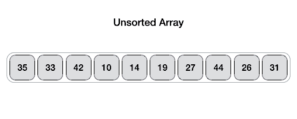
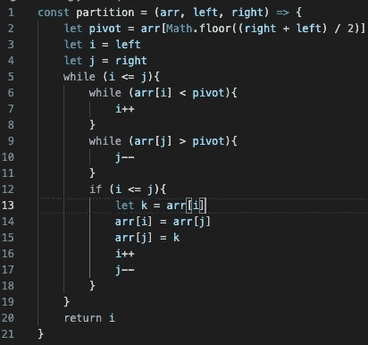
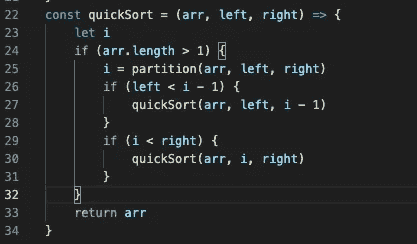
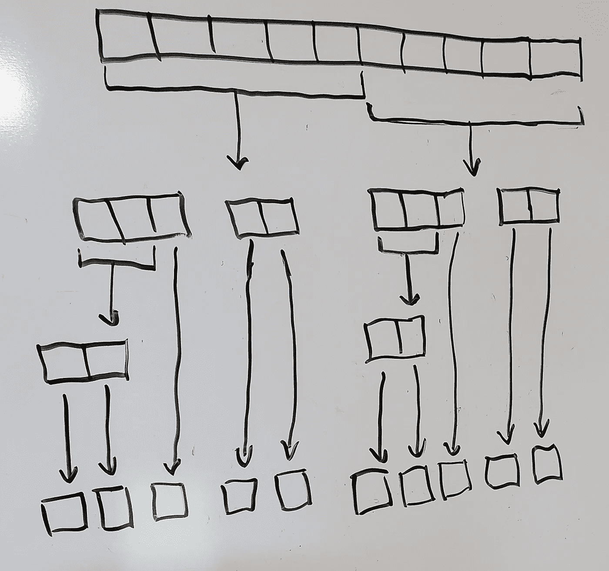

# 在 JavaScript 中实现快速排序

> 原文：<https://medium.com/nerd-for-tech/implementing-quicksort-in-javascript-1df1d044c744?source=collection_archive---------2----------------------->

在这篇博客中，我们用 JavaScript 实现了一个[快速排序](https://en.wikipedia.org/wiki/Quicksort)。快速排序是一种算法，用于使用分治技术对数组进行排序。首先，我们选择数组的一个枢纽元素，在本例中是中间的元素。接下来，我们交换大于或小于轴心的元素，并生成 2 个子数组。成功时，右边的子数组只包含大于主元的元素，左边的子数组只包含小于主元的元素。在这一步之后，我们知道 pivot 元素已经在排序后的数组中找到了它的最终位置。我们递归地重复这个划分过程，直到达到基本情况，其中产生的子数组只包含 1 个元素，产生一个排序的数组。

可视化快速排序

让我们进入一些代码，首先我们需要写一个分区函数。这个函数将接受数组以及一个左右元素。在这种情况下，Left 和 right 告诉函数关注数组的哪一部分进行排序。函数如下:

让我们一起浏览这段代码。首先，我们选择枢轴元素作为左右的中点。然后我们指定 I 和 j 代表左和右。接下来我们设置一个条件，当下一个代码运行时，I 小于或等于 j。这确保了当我们增加 I 时，它总是指示枢轴元素左侧的位置。接下来，我们向上增加 I，直到它指向数组中小于轴心的一个元素。之后，我们递减 j，直到它找到一个大于主元的元素。然后，我们检查以确保 I 仍然大于或等于 j。如果为真，我们交换由 I 和 j 指向的元素，并继续在循环中移动，直到满足第 5 行指定的条件。我们现在已经成功地排列了元素，使得 pivot 左边的所有元素都小于 pivot，而右边的所有元素都大于 pivot。

我们为什么返回 I？I 的最终值表示递归快速排序技术所必需的下一次排序的起点。让我们来看看:

现在我们有了一个工作的分区函数，我们可以递归地调用它，直到我们完成数组排序。这种情况的基本情况是一个长度为 1 个元素的数组，如第 24 行所述。第一步是通过调用 partition 方法获取第一个 I，方法是将参数传递给 quickSort 函数，如第 25 行所示。然后，我们调用在 I 的帮助下产生的子数组。因此，在第 26 行的 if 语句中，我们对原始 pivot 右侧的子数组运行 quickSort。在第 29 行的下一个 if 语句中，我们对原始 pivot 右侧的子数组运行 quickSort。这样，在每次迭代中，我们将每个子数组分成两半，最终得到一个完全排序的数组。

这有助于我们将代码运行时发生的流程形象化。这里我们从一个包含 10 个元素的数组开始，展示了 quickSort 中的代码如何将数组分割成越来越小的部分，直到数组长度为 1。另外，请注意，我们实际上并没有拆分数组本身，我们只是在数组的每个对应部分上运行 partition 方法。

当第一次看到不同的算法时，尝试自己编码解决方案会有所帮助。一旦你这样做了，它有助于巩固你头脑中的逻辑，以备将来使用。甚至当你完成了这些，写一篇博客，用你自己的话来解释它，进一步把这个概念带回家！