# 实现跳跃动画

> 原文：<https://medium.com/nerd-for-tech/implementing-the-jumping-animation-194f4df643be?source=collection_archive---------15----------------------->

今天的挑战是让跳跃动画进入玩家对象。如果你需要更详细的教程，请阅读之前的 sprite prep 文章。我只是简单地分享一下步骤:就像上次一样，我们选择播放器精灵，点击下拉动画，然后选择“创建新剪辑”。然后在适当的目录下保存为 Player_Jump，将帧拖入时间轴，设置速度。

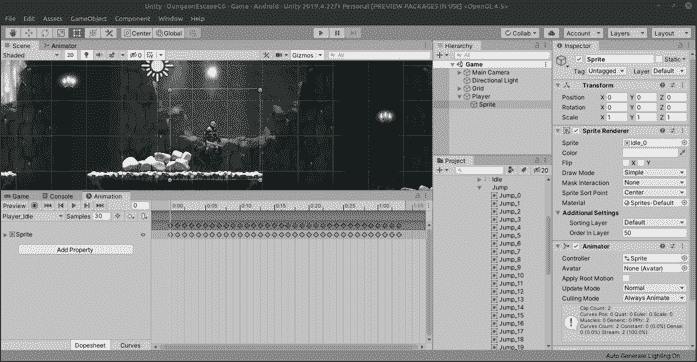

新动画将出现在 Animator 窗口中:

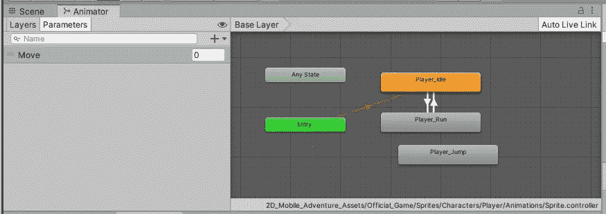

双击玩家跳跃，关闭循环时间。

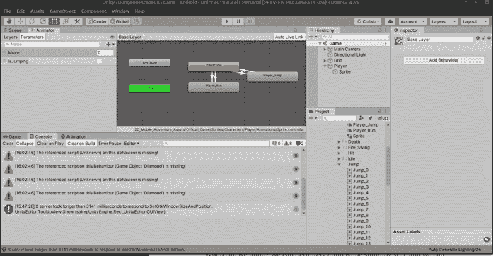

为了设置转换，我们将创建一个名为 isJumping 的布尔参数。

我们什么时候能跳？我们肯定可以在静止时跳跃，也可以在奔跑时跳跃，这样我们就可以在两者之间建立联系，但我们将从 Player_Idle 开始。

从 Player_Idle 到 Player Jump，将参数 isJumping 设置为 True。我们还将关闭退出时间，并将过渡时间设置为 0，因为我们再次处理精灵，而不是受益于插值的骨骼。从 Player_Jump 到 Player_Idle，我们将有一个退出时间，所以只需选中它。

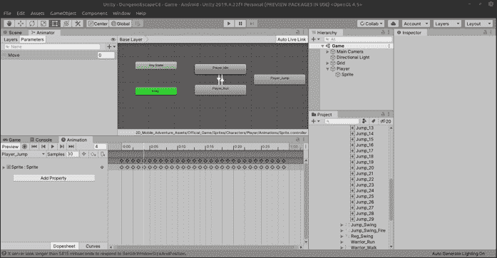

现在，为了在我们的 Player 脚本中实现这一点，让我们调用 PlayerAnimation 脚本并创建一个带有 bool 参数的 Jump()函数。为了好玩和可能的混乱，我们调用参数来传递，isJumping。

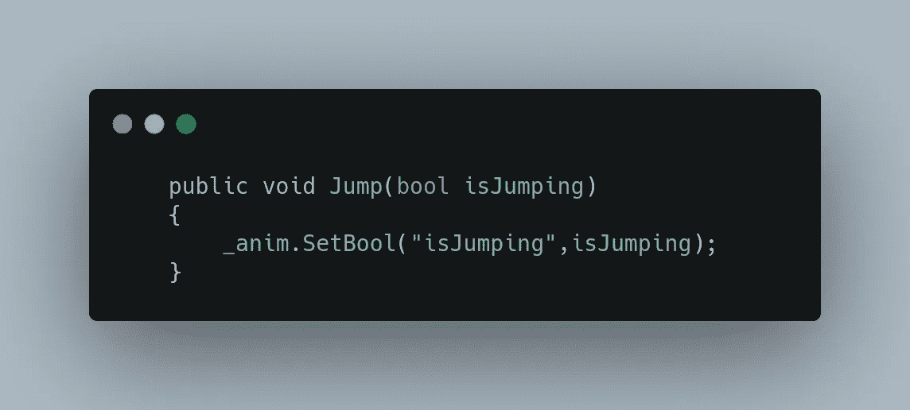

现在我们将能够从我们的玩家脚本中调用它们，在 CheckMovement 中:

当玩家接触地面时，我们需要将跳转设置为 false，因此 IsGrounded bool 看起来是个不错的地方:

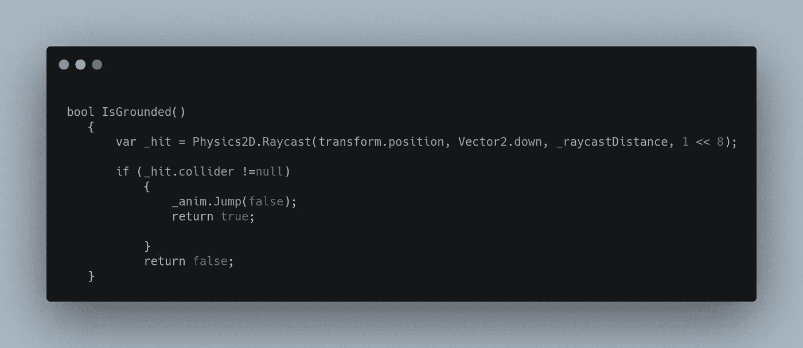

你可能已经猜到这里有问题。这是一个布尔值，只有在按空格键时才会被检查。我们可以通过创建一个不断被调用的布尔保持器来解决这个问题:

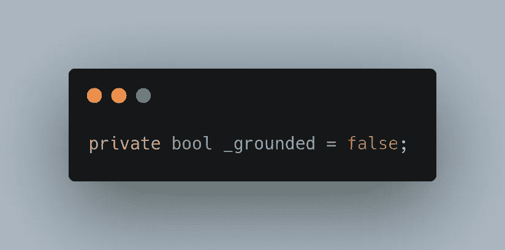

显然这只是第一步。现在我们需要分配它，我们将把它放在我们的 CheckMovement 函数中，以防止它更新。

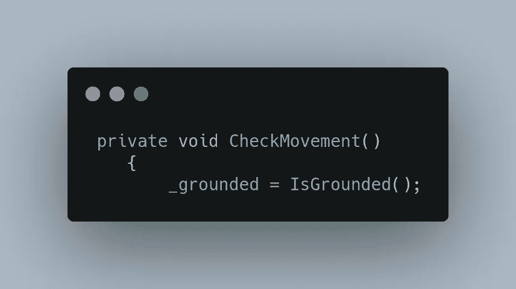

这应该可以实现空转跳跃:

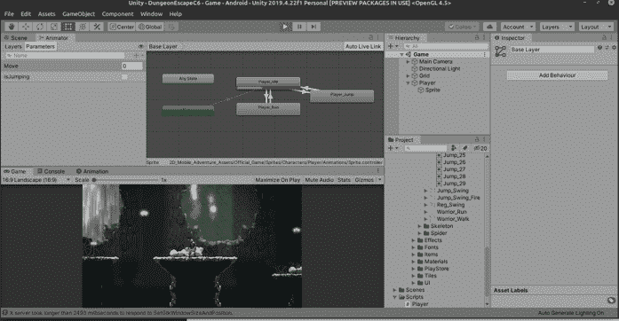

空转跳跃工作正常，连接跑步跳跃也是类似的过程:

从运行到跳转，关闭具有退出时间，0 过渡时间，并且条件:isJumping = true。

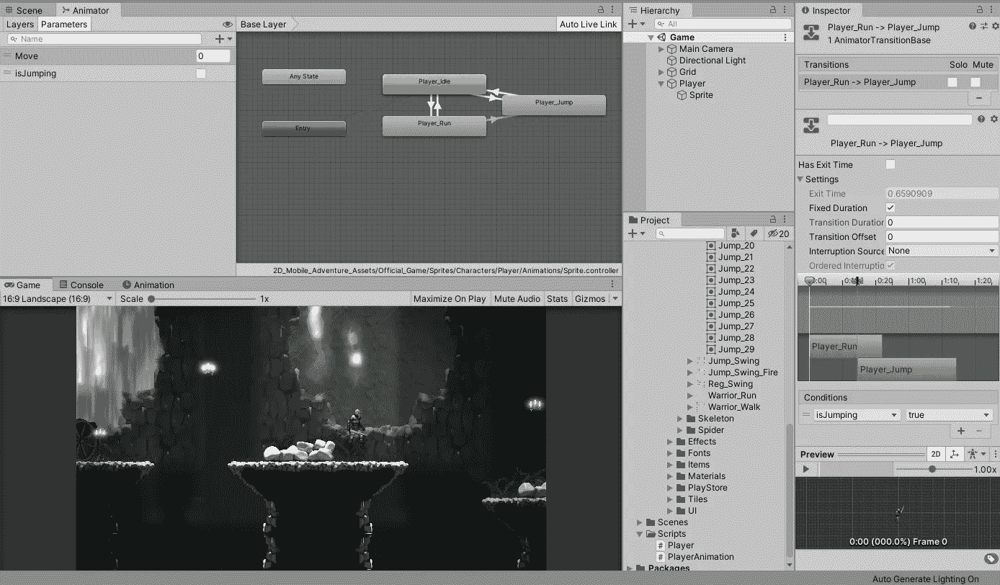

从跳跃返回到运行，leave 标记了退出时间，并使用两个条件:isRunning 为假，speed > 0 以让 Unity 知道它需要转到运行动画而不是空闲:

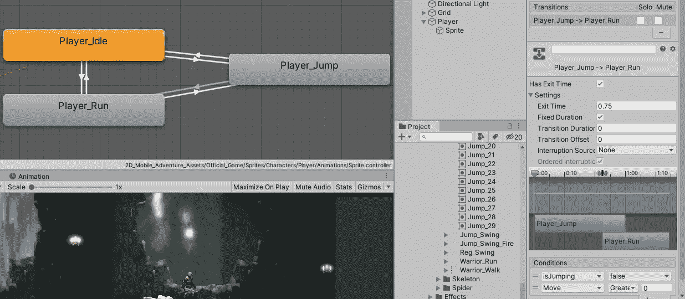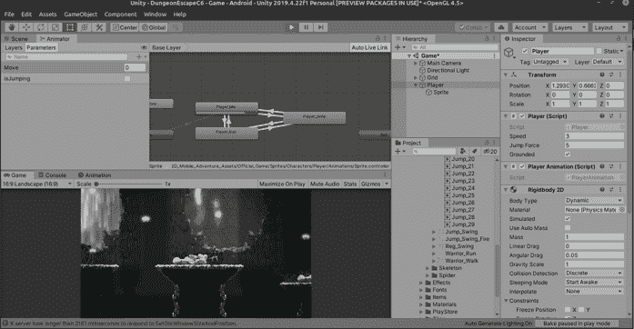

跳跃现在正在转换到正确的状态！

后来，我们调整了跳跃动画，只使用第 6–15 帧，不包括第 7 帧和第 11 帧，我们将最后一个关键帧延长到大约 2 秒

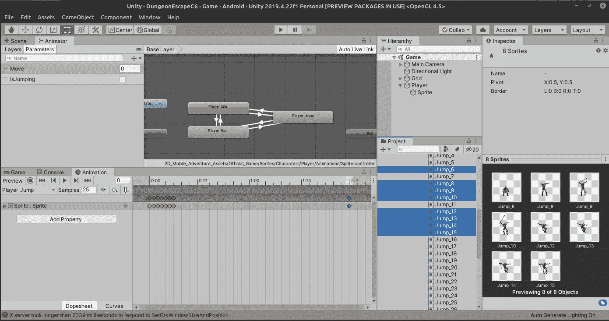

为了更好地工作，我必须对返回到空闲和运行状态的转换进行一些调整:首先必须打开退出时间，我将其更改为 0.5 秒，并将转换时间更改为 0.05 秒:

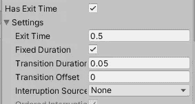

这带来了更加流畅的跳跃体验:

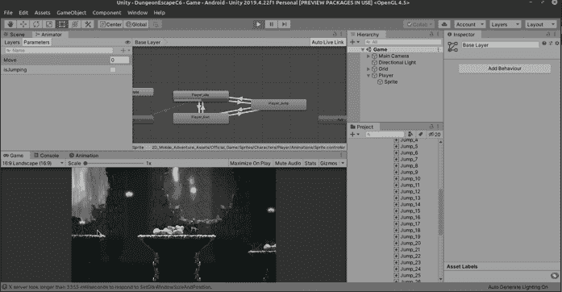

今天到此为止！下次见！