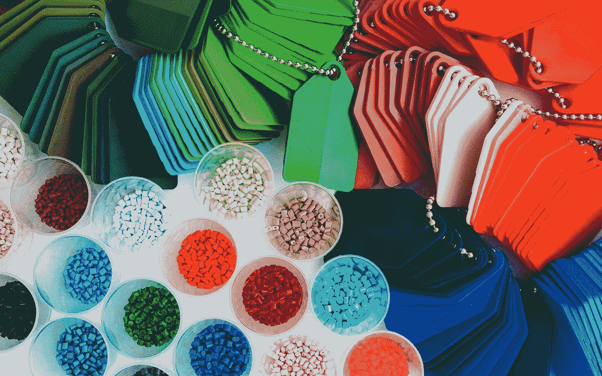

# 线性低密度聚乙烯的重要性(LLDPE)

> 原文：<https://medium.com/nerd-for-tech/importance-of-linear-low-density-polyethylene-lldpe-6d7f69db53ad?source=collection_archive---------5----------------------->

## 介绍

线性低密度聚乙烯的重要性。它是由乙烯和长链烯烃共聚而成的。LLDPE 是在较低的温度和压力下大量生产的。生产过程采用乙烯和丁烯、己烯或辛烯的共聚反应。它非常灵活，可以用来制作比 HDPE 或 LDPE 更薄的薄膜。

LLDPE 的特性是薄而硬，长而软。它可能被回收到其他产品中，包括垃圾桶内衬、地砖、堆肥箱和运输信封。LLDPE 主要用于塑料购物袋&床单，塑料包装，拉伸包装。

## 描述

由于缺少长链支化，LLDPE 与传统的[低密度聚乙烯](https://www.technologiesinindustry4.com/industry-4-0-deep-sea-optic-fiber-cables/) (LDPE)基本不同。这是最常见的一种塑料薄膜。它是非常柔韧的，在柔韧的薄片形式中最大厚度通常为 0.5 密耳至约 40 密耳。由于其灵活性，它适合各种表面。

科学家们通过改变催化剂和聚合方法，相继生产出多种性能和结构的聚醚砜。例如，LLDPE 是由菲利普斯石油公司在 1968 年宣布的。

LDPE 是在非常高的压力下由气态乙烯制成的。压力高达 350 兆帕或每平方英寸 50，000 磅。在过氧化物发明者的存在下，还保持高达 350°C 或 660°F 的高温。这些过程返回一种聚合物排列，具有长的和短的分支。因此，低密度聚乙烯是部分结晶的，是一种高弹性的材料。

LLDPE 在操作上与低密度聚乙烯相同。它是通过乙烯与 1-丁烯共聚制备的。它也是用少量的 1-己烯和 1-辛烯制成的。所用的催化剂是齐格勒-纳塔或茂金属。后续结构具有线性骨架。但它有短而不变的分支。这种分支像 LDPE 的长分支一样，阻止聚合物链紧密堆积在一起。LLDPE 的核心优势是:

*   聚合条件耗能较少
*   通过改变共聚单体的类型和数量，可以改变聚合物的性质。

总的来说，LLDPE 与低密度聚乙烯有相似的特性，并争夺相似的市场。

## 生产

LLDPE 的生产始于过渡金属催化剂。这主要是齐格勒或飞利浦类型的催化剂。此外，真正的聚合过程可以在溶液相或气相反应器中完成。通常，辛烯是溶液相中的共聚单体。在气相反应器中，丁烯和己烯与乙烯共聚。LLDPE 是聚合物类型的热塑性塑料。

## 利益

*   LLDPE 比低密度聚乙烯具有更大的拉伸强度。
*   它比 LDPE 具有更高的抗冲击性和抗穿刺性。
*   它非常柔韧，在压力下可以伸展。
*   它可以用来制造更薄的薄膜。
*   它具有与 LDPE 相关的增强的耐环境应力开裂性。
*   它有很好的耐化学性。
*   LLDPE 具有良好的电性能。

## 不足之处

*   它的亮度比 LDPE 低。
*   热封温度范围更窄。
*   它不像 LDPE 那样容易加工。

## 加工

LLDPE 具有独特的流变或熔体流动特性。由于其较窄的分子量分布，它对剪切不太敏感。由于较短的支链，它对剪切不太敏感。例如挤出，LLDPE 在剪切过程中保持更大的粘性。因此，它比熔融指数相当的 LDPE 更难加工。LLDPE 较低的剪切敏感性使得聚合物链的应力松弛更快。挤压过程中会发生什么。因此，物理性质很容易受到吹胀比的影响。

LLDPE 在熔体延伸的所有应变速率下都具有较小的粘度。这意味着它在拉伸时不会像 LDPE 那样应变硬化。由于链缠结，LDPE 的粘度增加，例如聚乙烯的变形率增加。在 LLDPE 没有发现这种情况，因为在 LLDPE 没有长链分支。这允许链在伸长时彼此滑动，而不会缠结。

这对于薄膜应用非常重要。因为 LLDPE 膜可以在保持高强度和韧性的同时简单地降低规格。然而，LLDPE 可以被回收用于其他东西。比如说；

*   垃圾桶衬里
*   木材
*   景观纽带
*   地砖
*   堆肥箱，和
*   运输信封

## 重要属性

密度(g/cm2) 0.92
抗拉强度(MPa) 20
断裂伸长率(%) 500
最高工作温度(0c) 50
表面硬度 SD48
吸水率(%) 0.01
熔化温度范围(0C)220–260
模具收缩率(%) 3

## 用途和市场数据

*   全球范围内，约 80%的 LLDPE 用于电影应用。例如食品和非食品包装、收缩或拉伸薄膜和非包装用途。
*   食品包装薄膜的发展趋势是向高性能膜结构方向发展。那些对延长货架期和改善风味没有渗透性。发展正在发生，从在不弯曲的容器中包装的物品过渡到高质量的柔性包装。
*   LLDPE 用于挤出涂布应用。在那里，它支持保护液体容器的内容。主要用于纸和纸板包装。
*   非食品包装应用需要重型薄膜。例如消费者、制造业和农业用途。
*   注塑行业约占 LLDPE 需求的 5%。例如草坪和花园产品、厨房设备、行李和家具部件、娱乐产品和玩具。
*   它同样适用于塑料袋和塑料薄膜。
*   它还用于塑料包装、拉伸包装、小袋、玩具、覆盖物、盖子、管道、桩和容器、电缆包装、土工膜和大多数挠性管。

LLDPE 的大量发展一直在等待低密度聚乙烯。就市场规模而言，它现已超过低密度聚乙烯，成为仅次于高密度聚乙烯的第二大聚乙烯。低密度聚乙烯占低密度聚乙烯-LLDPE 联合市场的 52-53%。尽管其对 LDPE 市场的渗透似乎是在成熟市场完成的。例如，在北美、西欧和日本，容易加工 LLDPE 的轮廓可能导致额外的替换。在中国等发展中市场，LLDPE 在低密度聚乙烯应用中的渗透预计将会继续。

欲了解更多详情，请访问:[https://www . technologiesinindustry 4 . com/importance-of-linear-low-density-polyethylene-LLDPE/](https://www.technologiesinindustry4.com/importance-of-linear-low-density-polyethylene-lldpe/)