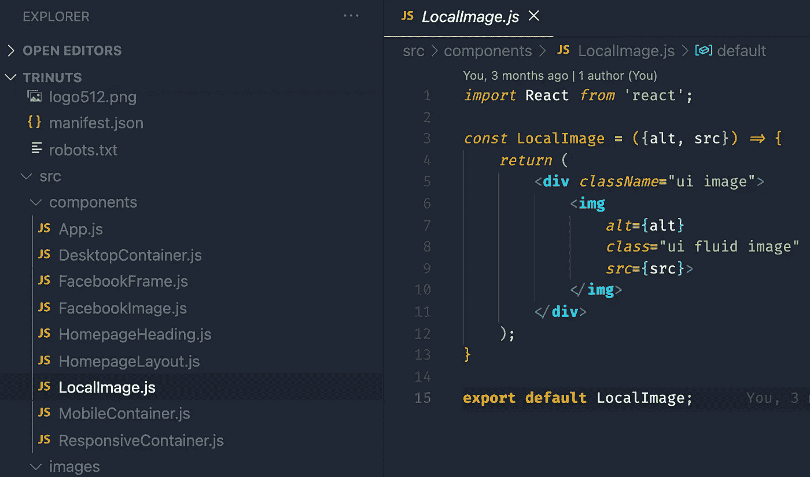
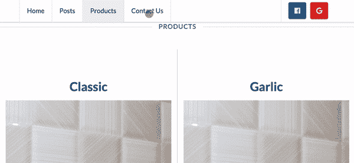
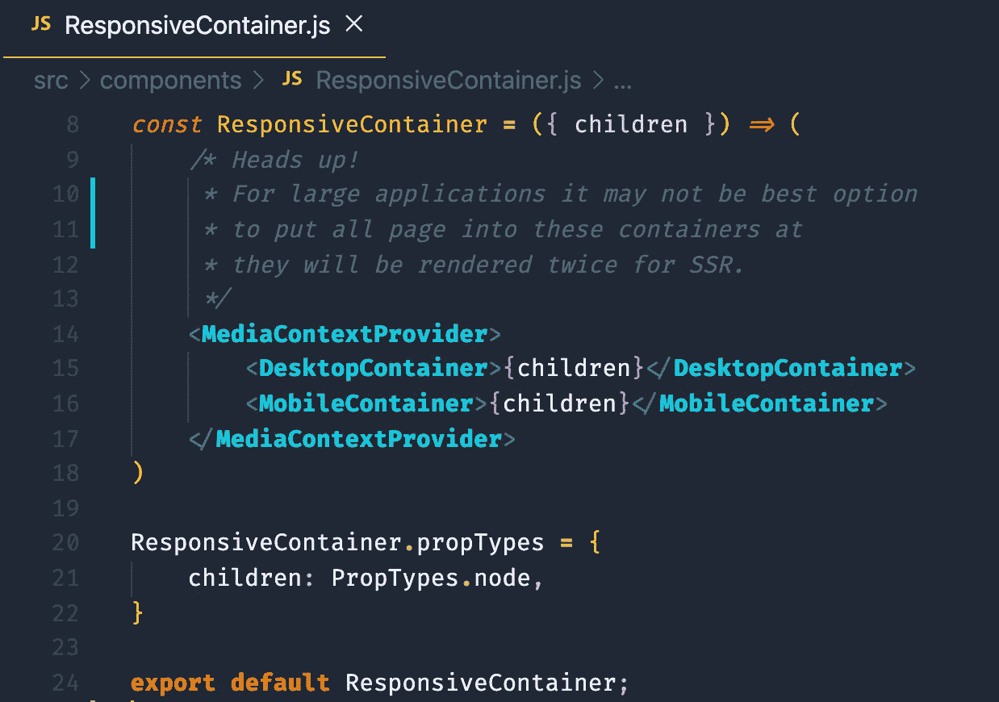
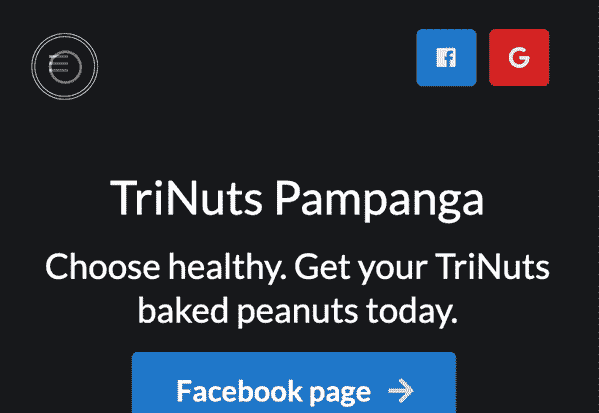
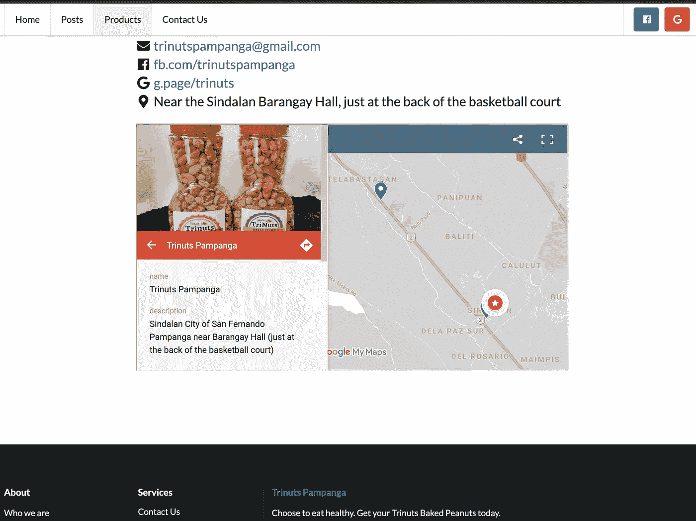

# 使用语义 UI 模板提高您的 React 技能(并创建一个响应性的目标站点)

> 原文：<https://medium.com/nerd-for-tech/improve-your-react-skills-and-create-a-responsive-destination-site-using-the-semantic-ui-template-51651e81e636?source=collection_archive---------16----------------------->

重用和重构 React 语义 UI 主页布局模板

Maksym Kaharlytskyi 在 [Unsplash](https://unsplash.com/s/photos/sort-drawer?utm_source=unsplash&utm_medium=referral&utm_content=creditCopyText) 上的照片

你最终决定尝试学习 ReactJS，并希望看到一条能让你立刻构建自己的 react 应用的途径。你的学习反应之旅有不同的方法和水平，但我确实注意到与通常推荐的有差距。本文将通过提供一个“非结构化模板”示例来帮助您快速从头开始构建易于维护的 React 应用程序，从而帮助解决这个缺失的环节。

作者图表

对于初学者来说，参加一个向你介绍基础知识的短期课程将是一个良好的开端。我推荐[斯蒂芬·格里德的 Modern React with Redux](https://www.udemy.com/course/react-redux/) ，它通过简短的项目实例介绍概念。在这之后，你可能想升级，看看有指导的教程。我推荐的一个例子可能是 [covid 应用跟踪器](https://www.youtube.com/watch?v=khJlrj3Y6Ls&t=1s)。

 [## 现代反应与 Redux 培训课程

### 课程上次更新为 React v16.6.3 和 Redux v4.0.1！所有内容都是全新的！更新包括以下方面的详细视频…

www.udemy.com](https://www.udemy.com/course/react-redux/) 

示例操作指南

现在你真的渴望创建自己的 React 应用程序。快速跟踪的方法是使用现有的结构化文件夹模板，并可能修改一些文本或图像，你就可以走了。好吧，你已经做了，但是你能不能说:`酷，我现在要从头开始做我的`？仅仅为了验证从 sratch 构建，它仍然意味着我们使用“create-react-app”模板，但是具有将组件重构和组织到您想要的文件夹中的能力。

当我在完成一些操作指南和结构化模板的阶段，我会想要一个以某种方式指导的活动，但同时，让我尝试重新组织文件和添加组件，就像它几乎是从零开始构建一样。

 [## 主页-语义

### 我们不再专注于内容创作和努力工作，而是学会了如何通过…

semantic-ui.com](https://semantic-ui.com/examples/homepage.html) 

然后我偶然发现了一个[示例布局语义 UI 模板](https://semantic-ui.com/examples/homepage.html)，作为创建一个目的地网站的指南。这似乎符合我的用例，更重要的是，他们基本上有一个[单文件](https://github.com/Semantic-Org/Semantic-UI-React/blob/master/docs/src/layouts/HomepageLayout.js)为他们的反应建立这个主页。这个虚拟模板被有意地制作成一个文件。它没有链接到任何外部网站，只有部分编码的链接和按钮。这似乎是一个好的实践，因为对我来说，我需要重构代码，并将它们放在行业推荐的 React 文件夹中，并对组件的大部分进行编码。这似乎是我从以前的 React 课程和教程中学到的一个很好的实践，应该是从头开始创建自己的 React 应用程序的基础。一个

 [## 语义-组织/语义-用户界面-反应

### 346 行(319 sloc) 10.4 KB 入门我们帮助公司和伙伴我们可以给你的公司超能力去做…

github.com](https://github.com/Semantic-Org/Semantic-UI-React/blob/master/docs/src/layouts/HomepageLayout.js) 

另一方面，这也将帮助我创建一个示例目的地网站。正如您所看到的，模板的布局几乎与我创建的示例站点相似。我已经在 https://trinuts.vercel.app 上发布了这篇文章，其中包含了 [github repo](https://github.com/williaminfante/trinuts) 。

 [## TriNuts 邦板牙

### 使用 create-react-app 创建的网站

trinuts.vercel.app](https://trinuts.vercel.app/) 

# 移动文件夹

从一个单一的主页布局文件，我把它分成多个组件，并在以后添加更多的组件。可能会有更多的分组，比如将所有的容器组件放在`container`文件夹中，但是这在将来很容易实现。

# 添加组件

给定这种分组和移动组件的自由有助于你从其他库中添加更多的组件，比如从`react-scroll`的`Link`中添加更多的组件，以获得更可控的滚动特性。

在开发过程中，移动版本和 web 版本也有不同的容器，所以在两个容器中重用组件也是一个好的做法。还需要对两个版本进行健全性检查。我确实从这些检查中发现了最初的错误。

作者图片

作者图片

我们可以进一步添加组件，如`LocalImage`组件或其他框架组件。作为地图框架上的一个旁注，我可能会使用谷歌地图 API 来创建一个更加定制化的设计，但对于这个目的地网站来说，只需从[谷歌我的地图](https://www.google.com.au/maps/d/viewer?mid=1MhLN0LkrNFyE6WQuQiMvvtNYQ0LZ-n37&ll=15.094426690650831%2C120.6284449&z=15)创建 iframe 就可以了。

作者图片

# 最后的想法

尝试修改单文件模板，并将其转换为更易于管理和维护的系统，这可能就是您现在可以从头开始构建 react 应用程序的原因。

移动文件夹的活动本身可以快速且容易地实现。我并不是说在我的库中找到的代码是重构或重用这个模板的最佳方式，但这只是为了演示这如何成为您练习的一部分。

作者图片

`Practice, practice, practice`这绝对是从头开始构建 react 应用程序的关键，但可能有更聪明的方法来完成这一实践。如果你已经尝试过课程、操作指南和结构化模板，为什么不尝试一下非结构化模板呢？