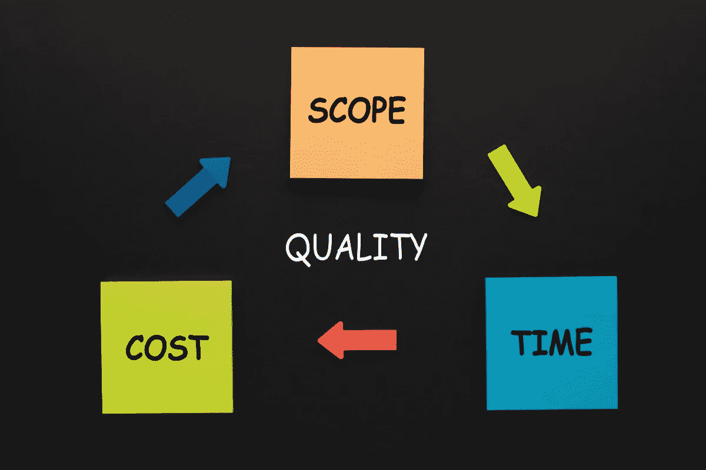

# 项目管理——项目管理三角的概述分析:范围、时间和成本

> 原文：<https://medium.com/nerd-for-tech/in-depth-analysis-of-the-project-management-triangle-scope-time-and-cost-3a2f7568d37c?source=collection_archive---------1----------------------->

项目管理是管理所有资源和人员以满足项目要求的过程。为了成功地管理一个项目，范围、时间和预算是项目管理中需要考虑的三个重要方面。所以在这篇文章中，让我们和我一起深入探讨一下。

# 为什么它们最重要

项目管理是 IT 行业薪酬最高的工作之一，有些人认为这是一份简单的工作。项目经理每天只是召开会议，告诉团队中的每个人做他们想做的事情。多么有力。但这是事实吗？

项目经理的角色经常被误解。事实上，项目经理通常是那些必须处理最多压力和工作的人。他们负责项目管理，这可能是困难和耗时的。他们必须确保所有期限都得到满足，协调资源和人员，处理出现的问题，与利益相关者和客户沟通，管理项目预算，等等。

项目经理经常面临的问题根源于项目管理三角形的元素。理解这些因素的含义将有助于项目经理更好地理解他们在项目中的角色和职责。了解自己需要关心什么，做什么，有助于项目经理减轻工作压力。所以希望这篇文章能帮到你。

# 这些因素如何相互影响

时间、成本和范围这三个因素密不可分。让我们看看下面的一些场景。

如果实施时间表延长，原材料价格将上涨，增加一些材料项目的成本。另一方面，由于工人疲劳、等待时间和增加的停工时间等原因，延长的时间导致低效的工作条件，从而导致诸如解决问题、麻烦等成本项目。各种成本称为直接成本。

项目实施时间延长，银行贷款的利息支出、部门成本(项目办公室运营成本)随着时间的推移而增加，在许多情况下，由于未能按时完成合同，罚款也会增加。各种成本称为直接成本。

另一种情况是，如果项目完成期限必须缩短，项目实施成本就会上升。这是因为在更短的时间内完成同样的工作量需要更多的资源。

如果在上面的场景中不可能为项目增加更多的资金，我们需要接受通过削减一些工作项或接受较低的输出质量来缩小项目的范围。我们可以通过使用低质量的材料或改变另一种施工方法来做到这一点，这需要更低的成本和更低的质量。

这些例子只是少数，但是你可以看到它们是如何相互影响的，更重要的是，它们是如何影响项目的质量的。事实上，根据每个项目的具体情况，有许多不同的情况，但是它们都有上述相同的概念。

# 我们应该如何看待和处理这个问题

每个因素的重要性因项目而异，甚至在同一个项目中(从一个时期到另一个时期)也是如此，但一般来说，这个因素的好结果往往是在一两个剩余因素之间进行权衡的结果。

在项目管理的过程中，经常会有目标的取舍。项目目标的权衡是为了在时间和空间方面更好地执行另一个目标而牺牲一个目标，以便根据项目的长期愿景找到保持所有目标之间平衡的最佳方式。

在一个完美的世界里，项目工作会完全按照计划进行，我们不需要在任何目标上妥协。坏消息是宇宙并不存在。由于各种客观和主观因素，项目执行计划经常发生变化，因此权衡是不可避免的。目标权衡发生在管理过程的开始到结束。

要素权衡应始终基于特定的条件或约束。通常，有两种选择:一次固定一个或两个目标，而另一个会改变。在另一种情况下，所有三个目标将同时改变。

# 结论

所以，就这样了。这篇文章概述了项目管理三角中的三个因素，以及我们如何在项目管理过程中考虑它们。在接下来的文章中，我将详细分析每个因素，解释那些因素发生变化的原因，并试图找到尽可能避免变化的解决方案。希望你喜欢这个，并随时与你的朋友分享。