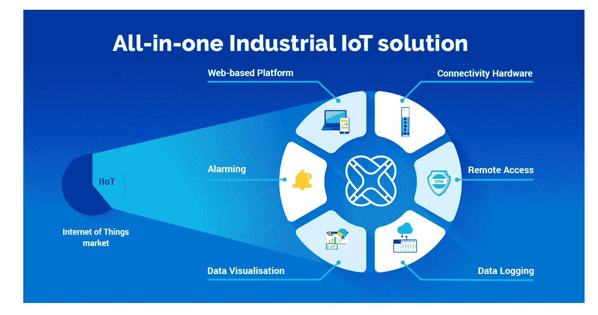
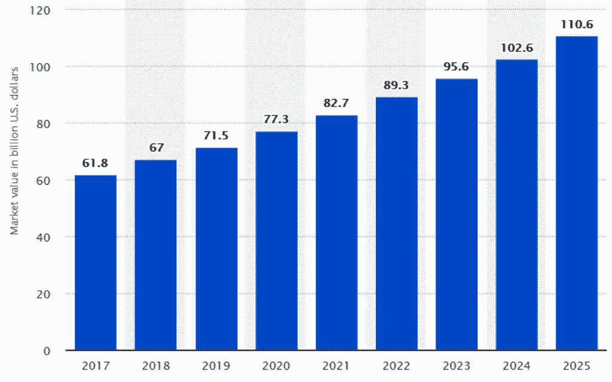
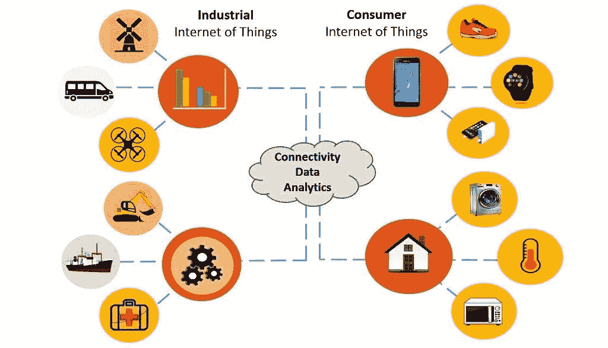
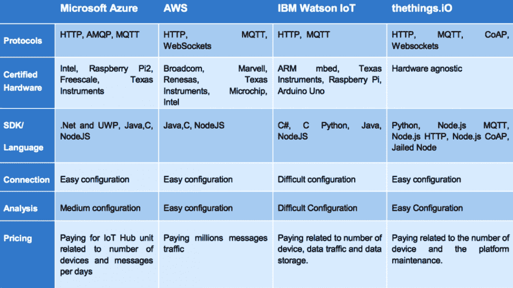

# 工业物联网解决方案:十大物联网应用

> 原文：<https://medium.com/nerd-for-tech/industrial-iot-solutions-top-10-iiot-applications-52df2c431331?source=collection_archive---------19----------------------->

[来源](https://www.ixon.cloud/all-in-one-industrial-iot-solution)

有如此多的东西连接到互联网上，如果没有专门的知识和基础设施，我们很快就无法使用它们。新技术革命不仅影响我们的生活和思维方式。它从根本上改变了结构、我们做生意的方式以及我们做生意的方式。

为了快速收回投资，大多数主要原始设备制造商都在采用工业物联网解决方案(或 IIoT 解决方案)。当然，一些企业领导人充分评估了实现的复杂性和可能的技术问题。他们中的一些人承认技术工人短缺。但总的来说，这是未来几十年的稳定趋势。[统计数据显示](https://www.statista.com/statistics/611004/global-industrial-internet-of-things-market-size/)到 2025 年，IIoT 市场规模将超过 1100 亿美元！

在 [7Devs](https://7devs.co) 上，我们在这一领域拥有丰富的经验，并准备好分享我们对前景的愿景，讲述家庭和工业物联网之间的差异，并帮助您选择最佳解决方案。

[来源](https://www.statista.com/statistics/611004/global-industrial-internet-of-things-market-size/)

# 物联网与物联网:主要区别

传统物联网和 IIoT 解决方案都基于互联设备的概念，这些设备通过集中式网络相互通信和交换数据。

不同之处在于，物联网关注的是最终用户的利益，他们是普通的大众消费者。它本身是一个完整的产品，内置于我们的日常生活和环境中，不会创造任何额外的东西。我们用它来改善我们的环境，从而提高我们的生活质量。

反过来，IIoT 专注于制造，提高效率和灵活性以降低成本、减少停机时间、促进经济增长和提高生产率。它有助于管理生产流程，控制供应链，并创建一个透明的管理系统。它涉及工业应用，如制造、包装、新能源或机器人。

这两个概念具有相同的性质，即可访问性、智能和互联设备。两者的根本区别在于使用领域。

# 发展重点

物联网平台建立在使用智能设备来提高寻求某些生活福利的消费者的便利性的概念之上。例如，通过自动调节减少电费或取暖费。通常这些都是即插即用设备。

IIoT 涉及更复杂的设备，以提供更广泛、更详细的工作流程可见性、自动化控制和丰富的分析。

# 应用范围

由于物联网工业旨在控制任务关键型机器，因此它使用了更灵敏、更精确的传感器。它包括利用复杂、先进的管理和分析工具来考虑供应链上的位置的技术。物联网使用更简单的应用程序。

# 感兴趣的领域

IIoT 用于航空航天、国防、医疗保健和能源等重要行业。在这些系统中，故障通常会导致紧急情况。

物联网通常是关于低风险的消费级设备。它们很重要，也很方便，但是故障不会立即出现，也不总是造成紧急情况。

[来源](https://www.computradetech.com/blog/iot-vs-iiot)

# IIoT 平台应该是什么样的

工业物联网本身并不是目标。它的实施是为了实现特定的目标。其中包括提高运营效率、优化供应链或更准确地跟踪产品和/或制造资产。

为此，工业物联网平台必须允许人们:

*   使用与数千个物理传感器、工业机器和数字系统通信的软件来管理整个企业的流程和公司系统。
*   分析和管理来自互联设备、企业和第三方的数据，以识别模式并优化资产。
*   启用和管理应用程序以简化资产的设置和操作，并创建数字双胞胎。
*   通过安全连接、控制和查看任何设备上的 HMI 面板(VNC)或 PLC web 服务器(HTTP ),从 IP 摄像机进行直播，远程连接到工业设备(PLC、HMI、机器人)。
*   使用支持安全审计和合规性的软件，包括数据丢失预防、违规检测和纠正措施。
*   获得对 OPC(开放平台通信)等工业协议的支持。
*   使用 PLC 可视化、通知和数据记录。
*   获得一个记录完善的 API，用于集成原生分析、商业智能工具、SAP 和其他机器学习平台。
*   授予工程级可靠性。
*   通过无代码界面实现灵活性，允许个人用户针对特定任务访问应用程序。
*   结合云计算、边缘计算和内部部署。

# 十大 IIoT 平台

考虑到拥挤的市场以及 IIoT 不断增长的能力，寻求最佳物联网平台的组织需要时间来学习。下面我们列出了一些迄今为止最好的解决方案。

# [阿尔蒂松·达托尼斯](https://altizon.com/datonis-iiot-platform/)

Altizon 提供实时分析、设备管理和机器学习功能。该平台可以部署在任何云环境中，也可以作为多租户服务在本地部署。该平台由 Datonis Manufacturing Intelligence 补充，Datonis Manufacturing Intelligence 是一个具有性能分析和数字双胞胎的数据管理器。

# [Braincube](https://braincube.com/)

该平台结合了机器学习的能力、复杂生产环境中的时间压缩信息以及创新、直观的数据清理工具。它可以方便地将原始数据导出到标准应用程序(如 Excel)。部署很复杂，需要增加维护人员。

# [亚马逊网络服务](https://aws.amazon.com/ru/iot/)

AWS 提供一系列物联网服务，涵盖从小工具连接和控制到分析和计算的所有内容。它支持面向微控制器的 FreeRTOS 实时操作系统，进一步在边缘提供 Greengrass 计算、分析、管理和存储功能，以实现近乎实时的本地处理。

# [蔚蓝物联网](https://azure.microsoft.com/en-in/overview/iot/)

微软使制造部门能够毫不费力地积累大量的工业机器数据，在边缘实时处理这些数据，并将其传输到云端，以便在 PowerBI 中进行分析。其中一个独特的功能是快速实施。

# [大脑沟](https://www.flutura.com/cerebra)

该平台提供长时间的资源正常运行时间和高运营效率。它具有狭窄的行业焦点，并且针对石油和天然气、化学工业、机械工程等。

# [PTC ThingWorx](https://www.ptc.com/en/resources/iiot/product-brief/thingworx-platform)

这一平台因其一致的配置和与连接设备的通信而在其他工业平台中脱颖而出。公司可以通过简单地断开以前使用的机器/传感器来增加连接到工业设备的机器/传感器的数量。它具有一个吸引人的/适应性强的界面，可以加速扩展和定制。

# [日立万塔拉卢马达](https://www.hitachivantara.com/en-in/products/iot-software-solutions.html)

该平台专注于能源、公用事业、运输和装配行业。主要功能包括安全的街道连接、IT 系统和业务应用、自动化的边缘到云数据管理、归档、高级分析、特定于用例的人工智能功能以及数字孪生模拟。

# [甲骨文物联网云](https://www.oracle.com/in/internet-of-things/)

该平台的突出特点是技术含量高，能够监控来自生产传感器的信息，并与生产管理系统完美集成。与此同时，它还根据客户的意愿不断进行现代化改造。

# [IBM 沃森物联网](https://internetofthings.ibmcloud.com/)

全面管理的云服务，具有连接、设备注册和管理、快速可视化和数据存储功能。该平台强调分析和 API，允许您实时分析信息，无论是文本或语音、社会情绪还是视频。安全和管理功能包括基于应用程序和设备的使用和性能特征的管理，以及异常检测。

# [编程 AG 积算速度](https://www.softwareag.cloud/site/product/cumulocity-iot.html#/)

该平台提供了可视化、连接性、边缘处理、设备管理、产品开发和应用集成的能力。您可以使用不同的方法来连接设备和资产。它包括云现场总线，用于通过 Modbus 和 OPC UA 等协议连接和控制工业资源，以及监控资产健康和收集历史信息。

在评估工业物联网公司时，您需要从生产的任务、规模和特征考虑特定的行业目标。你可能需要独特的解决方案。

[来源](https://blog.thethings.io/benchmark-iot-platforms-sigfox-products/)

# 我们的经历

7Devs 作为开发者和创业伙伴参与了许多项目。其中最有趣的一个是为家庭、学校和医院服务的锅炉房和泵站创建本地工业物联网解决方案。我们已经成功集成了各种传感器，用于温度、供水、电力、泄漏和二氧化碳水平检测器。

另一个项目专注于电信运营商市场，我们设法将其实施周期缩短了近一年。我们已经开发了一个带有 sim 卡和移动应用程序的钥匙链，可以放在汽车、包里、挂在自行车上等等。该设备有几种使用场景，可以以不同的品牌出售，例如，在运营商提供的包装中。

这两个项目都使用 AWS 物联网来减少开发时间，有效地解决存储问题(坐标历史、温度值等。)和数据安全。我们的解决方案提供了使用由服务本身生成的证书的范例。

我们在安装期间(捆绑阶段)将证书上传到设备，AWS 会分别检查每个设备。因此，没有人可以取代该设备。同时，该平台提供了所有必要的交互。

我们工作的主要焦点是功能性，而不是从零开始开发系统。这确保了快速上市，并免除了数据安全和存储的责任。

# 结论

为了在所有可用的 IIoT 公司中做出正确的选择，再看一下理想平台的标准，确定其基本部分和第三方功能。不要被漂亮的广告所迷惑，表现出健康的怀疑态度和全面的方法。

考虑平台使用的安全协议、其可扩展性、带宽、边缘智能、定价、监控和集成工具、数据恢复和通信透明性。

一个由 7Devs 专业人员组成的团队以最高水平提供这一切。[联系我们](https://7devs.co/contact/)，我们将提供并迅速创建符合您需求的 IIoT 应用。