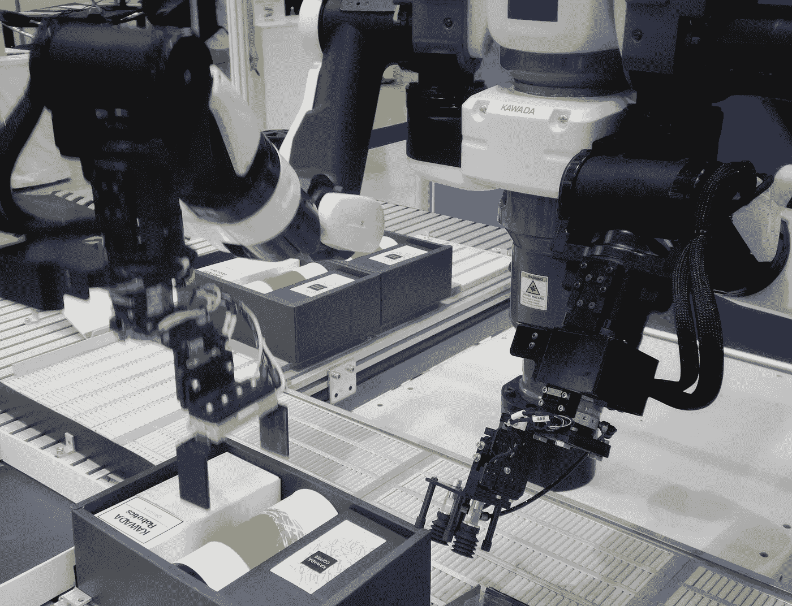

# 2022 年工业机器人趋势

> 原文：<https://medium.com/nerd-for-tech/industrial-robotics-trends-for-2022-af7660bc9258?source=collection_archive---------1----------------------->

在过去的几十年里，机器人已经从昂贵的工业展览转变为日常工作的主力。从生命科学到电子产品，从食品到消费品制造，我们已经看到越来越多的行业采用机器人。这在很大程度上归功于新的灵活性、更好的机器视觉和机器人的更广泛应用。

与此同时，正在进行的开发，如人工智能集成和敏捷设计，在过去两年中加快了速度。不断变化的工人可用性、供应链中断和持续的疫情问题带来的新压力对我们的机器人提出了更高的要求。

以下是工业机器人的一些前景，并显示它们将在今年影响工业部门。

## 维修机器人的兴起

维护是任何工业现场最重要的任务之一，为我们提供了预测和预防故障的机会。

由于维护任务本质上是重复性的，因此由机器人来完成这些任务再合适不过了。此外，这些先进机器中的人工智能工具可以帮助将维护提升到更高的水平，从以人为中心的活动转向更加高度自主的活动。随着时间的推移，人工智能和机器人技术可能会将维护从“最佳实践”预防性清单转变为基于定期数据分析的更主动的预测，以识别潜在问题——更多地是“在问题发生前解决问题”。

## 机器人即服务

在过去，小公司在制造车间增加机器人是一个限制因素。但是现在随着一切即服务的蓬勃发展，这个问题已经得到解决。

不是每个公司都有能力雇佣支持工业机器人所需的工人，尤其是在制造业面临几十年来最大危机的时候。然而，现在公司可以通过 RaaS 享受机器人流程自动化，而不用担心所有权问题。

机器人设备不是直接购买，而是租赁。租赁服务通常包括监控、分析和预防性维护。这带来了许多好处，包括减少前期资本和根据需求变化进行重新设计的能力。

## 协作机器人取代了人类工人

随着经济复苏，一些工作将被机器人永久取代。这些新的机器人工人通常比人类更快、更有效率。

这些趋势值得我们关注吗？有些人会这么想。但是，当可用劳动力的数量无法满足需求时，机器人不太可能消除对人类的需求。相反，人们的期望仍然是，机器人将接管乏味而危险的工作，而它们的人类同事将承担价值更高的任务。

世界经济论坛的研究表明，到 2025 年，机器将比人类完成更多的工作。然而，这场机器人革命也将为全球经济创造 5800 万个新的就业机会。随着 UR 机器人在速度、准确性和协作方面的改进，它们将成为未来任何行业的首选。事实上，它们也可以安全地与人类并肩工作。它们将成为行业的主流机器人。

## 需要更多的标记数据

目前，各行业对最优质的 AI 训练数据需求迫切。AI 在各个领域都有实现，比如教育、法律、智能驾驶、银行、金融等。每个领域都有细分和专业化的要求。

从人工智能技术的研究方向来看，无论是在传统的机器学习领域还是深度学习领域，基于训练数据的监督学习仍然是一种主要的模型训练方法。尤其是在深度学习领域，需要更多的标记数据来提高模型的有效性。

## 结束

将你的数据标注任务外包给 [ByteBridge](https://tinyurl.com/2jtnnvmm) ，你可以更便宜更快的获得高质量的 ML 训练数据集！

*   无需信用卡的免费试用:您可以快速获得样品结果，检查输出，并直接向我们的项目经理反馈。
*   100%人工验证
*   透明标准定价:[有明确的定价](https://www.bytebridge.io/#/?module=price)(含人工成本)

## 为什么不试一试？

来源:https://www . robot-China . com/news/202201/28/69578 . html