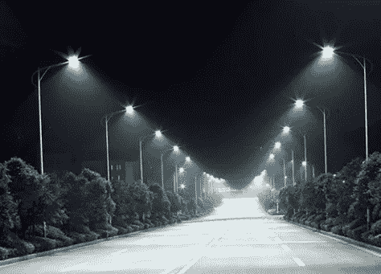

# 工业 4.0 —飞利浦 LED 灯技术

> 原文：<https://medium.com/nerd-for-tech/industry-4-0-philips-led-lights-technology-c5a55a976c43?source=collection_archive---------6----------------------->

# 介绍

飞利浦是一家荷兰跨国集团公司。它建立在埃因霍温。自 1997 年以来，它的总部一直设在阿姆斯特丹。飞利浦是世界上最早的电子公司之一。目前，它吸收了卫生技术领域，其他部门被剥离。飞利浦计划分为三个主要部门:

个人健康:相关护理、诊断和治疗。

*   照明部门开始是一个明确的公司，表示 N.V
*   该公司于 1939 年开始生产电动剃须刀。

飞利浦主要在阿姆斯特丹泛欧证券交易所上市。这通常是欧洲斯托克 50 指数的成份股。这是纽约股票市场的二次上市。收购包括 Signetics 和 Magnavox。他们甚至从 1913 年起就有了一个名为 PSV Eindhoven 的体育俱乐部。

# 描述

要了解 LED 的去向，先了解它的来源会有所帮助。LED 不是灯泡；真的——它是一个轻量级的光源，很小，比一个铅笔点大不了多少，深藏在一个更大的塑料、金属和玻璃包装中，这个包装被构造成类似于一个轻量级灯泡，主要是因为消费者仍然喜欢一个众所周知的、经过时间考验的形状。如果我们打开玻璃笔芯 Hue 灯泡或任何飞利浦 LED 灯泡，你会看到 6 到 26 个小型 LED 嵌在机箱内。这些发光二极管中的每一个都是半导体材料的微小夹层，当连接到一个影响源时，就会发出一束阳光。如果没有玻璃罩来融化和分散它们的辐射，led 就太刺眼了。柔和白色灯泡的 led 通常呈现出刺鼻的蓝色，或异常刺目的白色。这些灯以各种方式组合在一起，形成了许多颜色。

如果 LED 在上世纪 90 年代初还算不上创新，那么是什么让它在十年后成为潜在的革命性产品呢？早期，像任何羽翼未丰的创新一样，T2 led 面临的挑战很简单:它必须做一些比它试图取代的主流产品更好或更便宜的东西。要确定 1990 年代中期较长日照时间内的 m，就要看 LED 两者都没有。

飞利浦首先开始将这项技术成功应用于汽车，尤其是刹车灯，以及交通灯。产品的耐用性和效率是卖点；事实上，维修人员不需要经常更换交通灯是一个额外的好处。与此同时，对于消费者来说，2008 年 LED 灯可能取代标准 60 瓦白炽灯泡的想法似乎仍然不太可能。也就是说，除非你认为花 50 美元买一个普通的灯泡是划算的。

价格下降反映了飞利浦以更低的成本制造更好的 LED 组件的能力，也反映了它在每盏灯中使用更少的高功率 LED(或者在某些情况下，更多的低功率 LED)的能力。目前，飞利浦估计 led 在日照输出方面每年提高 15%,而成本每年降低约 10%。现在最大的问题是消费者是否会拒绝这样的交易:一盏灯在几年的节能时间里就可以收回成本，并在收回成本后持续 15 年。

# 看起来像幻想

## 工业 4.0 与飞利浦 LED 灯技术

找到 YouTube 视频的链接:【https://youtu.be/xRdsCu5CcQ8 这个视频展示了美国、英国和德国是如何进行研究的，他们试图在城市里用多层建筑种植农产品，而不是用柴油卡车从 200-300 公里外运来水果&蔬菜。这种垂直农场不使用土壤。这些农场使用“水培法”和可编程 LED 灯来模拟阳光，种植食物。

更多详情请访问:[https://www . technologiesinindustry 4 . com/2021/05/industry-4-0-Philips-led-lights-technology . html](https://www.technologiesinindustry4.com/2021/05/industry-4-0-philips-led-lights-technology.html)