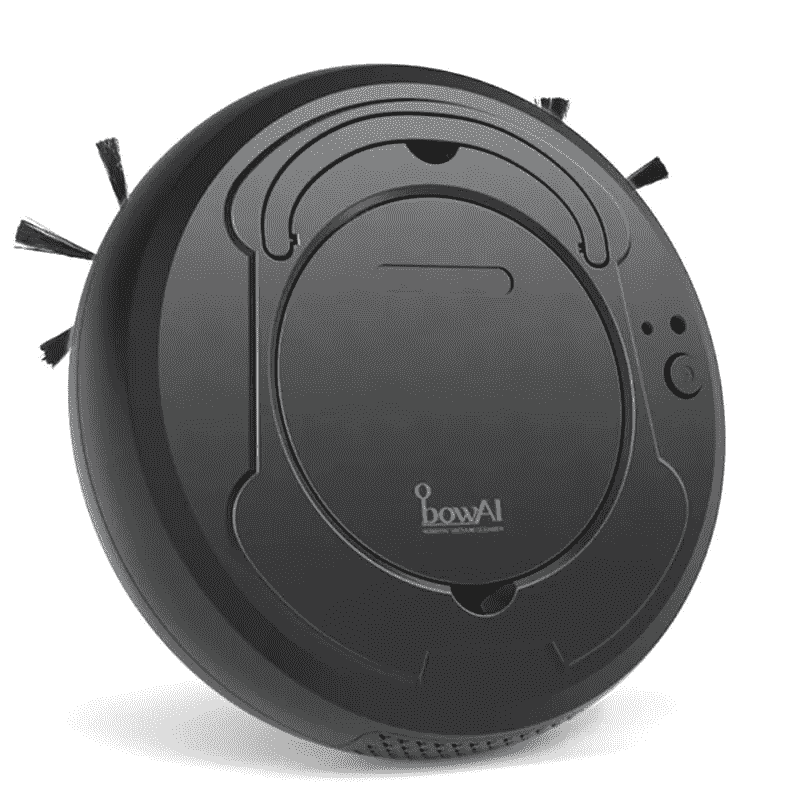

# 工业 4.0:机器人吸尘器

> 原文：<https://medium.com/nerd-for-tech/industry-4-0-robotic-vacuum-cleaner-aa48eb898dfe?source=collection_archive---------4----------------------->

# 工业物联网(IIoT)

工业物联网(IIoT)是指相互连接的仪器、传感器和其他与计算机工业应用(包括制造和能源管理)交互的设备。这种互连允许交换、数据收集和分析，可能有利于生产力和效率的发展以及其他经济利益。

# IIoT 支持的技术

IIoT 赋能技术包括:信息物理系统、云计算、[边缘计算、机器对机器](https://www.technologiesinindustry4.com/)、3D 打印、机器人、大数据、人工智能和机器学习。

# 分层模块化体系结构

IIoT 系统通常被认为是数字技术的分层模块化架构。内容层包括用户界面设备，例如屏幕、平板电脑、智能眼镜。服务层描述了分析数据并将其转换为信息的应用程序和软件。网络层依赖于通信协议、WiFi 和云计算。最后一层称为设备层，由硬件组成:CPU、机器和传感器。

# 框架和标准

物联网框架有利于提供对象之间的通信，并同意更复杂的结构，如分布式计算和分布式应用程序的开发。

**MQTT**

MQTT 可能是一种特别适合物联网应用的发布/订阅协议，因为它占地面积小，实时保证，并且适合在高延迟、[低吞吐量和不可靠的网络中使用。](https://www.technologiesinindustry4.com/)它是专为“小代码占用”受限或网络带宽受限的远程位置的连接而设计和开发的。发布-订阅消息传递模式需要一个消息代理。

**卡夫卡**

Kafka 基于发布/订阅模型，是最广泛使用的处理和分发实时数据流的平台之一。它用于制作实时数据管道和流媒体应用程序。它具有容错性、可伸缩性、速度极快，并在成千上万家公司中运行。

**IBM**

IBM 描述了认知物联网，它将传统物联网与机器智能和学习、上下文信息、行业特定模型和自然语言处理结合在一起。

**红色节点**

Node-RED 是 IBM 设计的开源软件，用于连接 API、硬件和在线服务。

**OPC**

这是由 OPC 基金会设计的一系列标准，用于将计算机系统连接到自动化设备。

# IIoT 的优势

*   高效且经济的生产。
*   预计到 2030 年，通过实施 IIoT 实现的增长将产生 15 万亿美元的全球 GDP。
*   技术优化
*   减少浪费
*   更好的商业决策

# 应用程序

**汽车制造:**

汽车工业表明所有生产要素的数字化，以使用 IIoT。此外，由于这项技术的模块化和连接性，[还支持 IIoT](https://www.technologiesinindustry4.com/) 定制汽车。IIoT 为汽车制造公司准备了可以想象的连接生产工厂的方法。

**石油天然气行业**

钻井设备和研究站可能会存储和发送大量原始数据，以便在 IIoT 的关注下进行云存储和分析。石油和天然气行业有能力通过互联来连接机器、设备、传感器和其他人，这可以帮助公司更好地应对网络安全、需求和定价方面的波动，并在 IIoT 技术的帮助下最大限度地减少环境影响。IIoT 可以改善维护流程、整体安全性和连接性。无人机可以用来检测石油和天然气泄漏，并通过内置热成像系统识别复杂的管道网络中的薄弱环节。

**农业**

IIoT 有利于农民决定何时收割。传感器收集关于土壤和天气状况的数据，并提出施肥和灌溉计划。一些畜牧场正在将微型芯片植入动物体内，以追踪他们的动物并获取关于血统、体重或健康的信息。

# 采用 IIOT 和人工智能技术的机器人吸尘器

机器人真空吸尘器具有很好的编程和有限的真空地板清洁系统。出色的设计依赖于通过远程控制和“自驱动”模式进行的手动操作，这种模式适用于机器在没有人工控制的情况下自由清洁。很少有设计使用旋转刷在狭窄的角落取得成功，也很少有设计除了吸尘功能之外还包括各种清洁功能。机器人真空吸尘器更有用，更适合使用，因为与普通真空吸尘器相比，它们可以自己吸尘。它们的搬运和维护也非常容易，因为它们可以放在床下、桌子下或储藏室里。

# 机器人真空吸尘器的主要特点

*   全自主机器人真空吸尘器可以使用 IIOT 传感器和人工智能技术在任何建筑物内导航。
*   使用平板电脑可以配置机器人。
*   戴森和 iRobot 在 2015 年共同熟悉了基于相机的地图绘制。
*   美国 iRobot 公司首席执行官声称，2016 年全球吸尘器销量的 20%是机器人。

**清洁模式**

机器人真空吸尘器通常具有以下不同类型的清洁模式:

**自动:**此模式有助于一般清洁。该模式通常会清洁一个区域，直到电池耗尽。

**亮点:**吸尘器在这款的辅助下专门针对特定的脏区。

**涡轮:**这种模式用于清洗和吞噬最前面的污垢和泥浆，但它会产生噪音。

**边缘:**边缘模式帮助清洁边缘&角落。

**安静:**此模式有助于降低清洁时的噪音水平。在家的时候很有帮助。

**遥控**:允许用户调节真空的方向。

## 水选

少数型号还可以一次完成湿式清洁、自动吸尘和湿式拖地(清扫和拖地组合)。机器人抹布可以处理多种表面，并带有各种清洁模式，让您可以选择[扫地、吸尘和拖地](https://www.technologiesinindustry4.com/)潮湿或湿润的地板。机器人拖把在硬地板表面上具有良好的划痕，且理想地适用于硬木地板、层压地板和瓷砖地板类型。

## 绘图

改进的模型包括映射能力。该单元可以提供陀螺仪、摄像机、雷达和激光(激光距离传感器或 LDS)制导系统来创建平面图，该平面图可以永久存储以提高效率，并配备有关于已清洁(或未清洁)区域的信息。因此，清洁效率大大提高，重复率显著降低。具有多平面图功能的模型可以存储许多平面图。

更多详情请访问:[https://www . technologiesinindustry 4 . com/2020/11/industry-4-0-robotic-vacuum-cleaner . html](https://www.technologiesinindustry4.com/2020/11/industry-4-0-robotic-vacuum-cleaner.html)