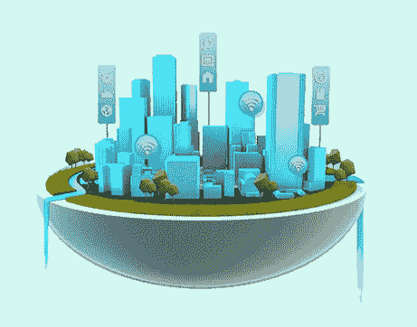
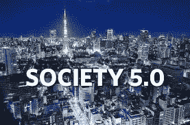
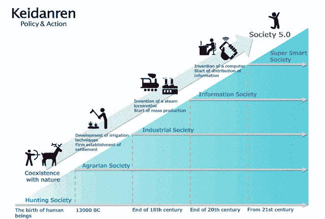
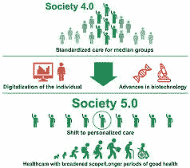

# 工业 4.0 到社会 5.0

> 原文：<https://medium.com/nerd-for-tech/industry-4-0-to-society-5-0-f8965b4166b?source=collection_archive---------1----------------------->

# 介绍

[工业 4.0](https://www.technologiesinindustry4.com/2021/12/data-storage-capacity.html) 到社会 5.0 的旅程相当惊艳。《社会 5.0》中的社会改革将实现一个进步的社会，它将停止盛行的无为感。每个人都可以在社会 5.0 中过着充满活力和愉快的生活。

就像第四次工业革命中的[工业 4.0](https://www.technologiesinindustry4.com/2021/12/data-storage-capacity.html) 一样，社会 5.0 也被描述为五个社会阶段的进化。日本政府推动的社会 5.0 计划建立在以下循环的基础上:

*   [物联网](https://www.technologiesinindustry4.com/2021/12/how-iot-is-changing-our-lives.html)从社会各个部分收集数据
*   大数据的创建
*   通过 [AI](https://www.technologiesinindustry4.com/2021/11/ai-in-the-digital-factories.html) 进行数据分析
*   将数据研究的结果反馈给社会

在这篇文章中，我们将了解社会 5.0 的概念。

# 描述

社会 5.0 实现了网络空间和物理空间的高度融合。总的排练是通过网络收集信息，并在过去的信息社会中由人类检查。

社会 5.0 中的人、物、系统都是链接在一起的。人工智能在人类能力之外获得的网络空间和最佳结果被反馈到物理空间。

这个过程以前所未有的方式为工业和社会带来了新的价值。虽然，认为只要技术创新进步，社会 5.0 的出现自然会被理解为不需要任何努力，这是不准确的。

# 通往社会之路 5.0

日本商业联合会(经济团体联合会)在立场文件中被描述为五个社会阶段的演变。

*   1.0 狩猎采集社会
*   2.0 农业社会
*   3.0 工业社会
*   4.0 信息社会
*   5.0 超级智能社会

物联网收集的大数据会被 [AI](https://www.technologiesinindustry4.com/2021/11/ai-in-the-digital-factories.html) 转换成新型智能。那会蔓延到社会的每一个角落。所有人的存在将是额外的自在和可维护的，因为人们只被提供所需数量和时间的产品和服务。

# 社会的组成部分 5.0

“社会 5.0”讨论了许多主要支柱:

*   基础设施，
*   金融科技，
*   医疗保健，
*   物流
*   人工智能

日本市场的成熟令人瞩目。他们预测机器人领域的投资将达到 870 亿美元。同样，2019 年，[物联网](https://www.technologiesinindustry4.com/2021/12/how-iot-is-changing-our-lives.html)市场的规模将达到 60 亿美元。以下是社会 5.0 可以带来很多变化的四个重要领域。技术专家和企业家可能会强调和不安，展示日本的社会 5.0 思想和方法。

# 医疗保健问题

日本比其他国家更早进入老龄化社会。这个国家正为日益增长的医疗和社会保障支出以及照顾老年人的负担而苦恼。

**解决方案**

*   除了治疗和护理记录之外，在医疗数据用户之间附加和共享带有医疗检查记录的信息。
*   实施远程医疗服务。
*   在护理服务中实践人工智能和机器人，以改善人们的自由。

通过连接和分配现在许多医院中分散的医疗数据，将提供基于数据的真正医疗。远程医疗可能会使老年人不再需要定期给医院打电话。此外，我们可以在家测量和获得健康数据，例如心率。因此，它将有可能成为人们健康生活的希望。

# 流动性问题

人口减少导致人口稀少的农村地区需要公共交通。迅速崛起的电子商务领域缺乏驱动力。

**解决方案**

*   Patron 使用独立驾驶的出租车和公交车作为公共交通工具，使农村交通更愉快地存在。
*   通过领先的创新发展分销和物流能力。
*   例如，一组中的单个驾驶员货运卡车使用无人跟随车辆系统并借助于无人机。

那些居住在人口稀少地区的人发现，由于缺乏公共交通，购物和去医院看病很成问题。虽然自动驾驶汽车将允许他们进行额外的旅行，但简单的送货无人机将使人们有可能满足所有人的要求。分娩劳动力的缺乏不会是一个问题。

# 基础设施问题

在日本经济快速发展的时代，公共基础设施的弱化已经造成了熟练劳动力的短缺，以及审查和维护的财政负担的激增。

**解决方案**

*   传感器、人工智能和机器人将被用来检查和维护道路、桥梁、隧道和大坝。

可以在初始阶段通过利用信息和通信技术(ICT)的新技术来检测需要修复的地方。通过这样做，意外事故将会减少，建筑工程中消耗的时间将会减少，尽管同时安全性和生产率将会提高。

# 金融科技问题

大量的日本现金交易仍然是以现金和银行方式进行的。信息技术在公司中的实践不完整，无现金支付和适当的金融服务的安装也很缓慢。

**解决方案**

*   实践现金转移的区块链技术
*   向金融科技公司和银行开放应用编程接口(API)。
*   推广无现金支付。

外部支付是沉重的，因为我们必须花费时间和支付银行费用。区块链技术将减少时间和成本，同时保证全球商业交易的安全。

# 结论

*   数据只是对用户没有意义的代码。
*   然而，当技术专家和企业家将[人工智能](https://www.technologiesinindustry4.com/2021/11/ai-in-the-digital-factories.html)应用到其最大潜力时，将会看到一个事实上的变化。
*   在社会 5.0 中，人和机器将为 21 世纪社会面临的最大问题提供解决方案。
*   我们必须抓住日本在社会 5.0 中所做的事情。
*   我们将成为技术时代的标志。

更多详情请访问:[https://www . technologiesinindustry 4 . com/2022/01/industry-4-0-to-society-5-0 . html](https://www.technologiesinindustry4.com/2022/01/industry-4-0-to-society-5-0.html)