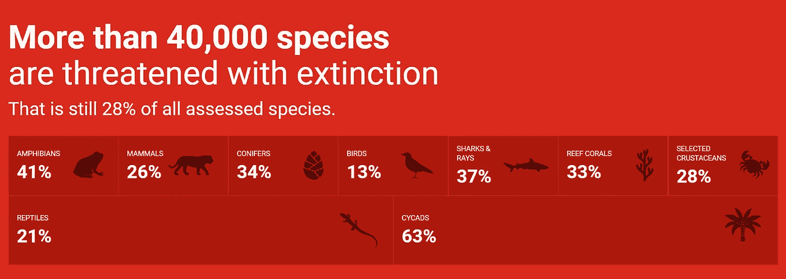

# 利用数据创新野生动物保护:拯救地球！

> 原文：<https://medium.com/nerd-for-tech/innovating-wildlife-conservation-using-data-saving-the-planet-cf9d0f93de7c?source=collection_archive---------0----------------------->

图片作者:[www.iucnredlist.org](http://www.iucnredlist.org)

# 1.介绍

这个地球是数万亿不同生命形式的家园，包括植物和动物。它们随处可见，无论是在湖泊、河流、海洋，还是在陆地和空气中。众所周知，我们需要与自然和谐相处，以维持生态系统的平衡。但是，由于最近的人类活动和其他自然力量，我们已经看到了对野生动物生存的重大威胁。由于许多物种已经灭绝，超过 40，000 个物种面临灭绝的威胁(IUCNRedList，2021)。许多组织如世界野生动物基金会(WWF)、国际自然保护联盟(IUCN)、国际鸟盟、大自然保护协会等。正在夜以继日地保护这些动物。世界野生动物基金会成立于 1961 年，仅在全球就有超过 6000 名员工，并在 21 财年从私人和公共捐助者那里筹集了 3.77 亿美元(WorldWildLife，2021)。数百万志愿者和非政府组织也支持这些组织。所有这些组织也在尽可能地采取新举措和实施新想法。

即使有这么多人参与，这些组织也面临着复杂的挑战，使得整个保护系统无法支持充分的野生动物保护(Ronald R. Swaisgood et al .，2020)。在这里，我们将详细讨论其中的三个挑战。随着新技术的出现，世界变化越来越快，随着数据时代的到来，我们希望借助数据科学和创新来解决这些问题。

# 这些组织面临的挑战和数据科学创新的机遇

# 2.1a 偷猎:非法野生动物贸易

狩猎和偷猎是这些组织试图拯救这些濒临灭绝的动物所面临的最大挑战之一。这也是生物多样性丧失的主要因素之一。这里最大的威胁是哺乳动物、鸟类和其他一些物种。例如，由于狩猎，鲸鱼、犀牛和大象的数量在 20 世纪急剧下降:臭名昭著的蓝鲸和北方白犀牛物种濒临灭绝，数量减少了 99%，许多其他物种也面临着同样的命运。狩猎的风险还因市场对野生动物贸易的需求不断增长而加剧，如毛皮和角、奢侈食品、宠物和药物(Hannah Ritchie 等人，2021 年)。根据一项包括发表在《科学》杂志上的 176 项研究的荟萃分析，与未狩猎区相比，狩猎区的鸟类和哺乳动物数量分别下降了 58%和 83%。在猎人进入点 7 至 40 公里范围内，鸟类和哺乳动物数量减少(Benitez-lópez 等人，2017 年)。因此，跟踪这些动物，他们的行为，条件等。，具有挑战性。此外，偷猎者在护林员不在的时候或半夜偷偷溜进来，这造成了一个巨大的问题。

# 2.1b 机遇:如何有所作为！

这个关键挑战的答案很简单，相机陷阱和它们的数据。许多生态学家和研究人员也在实施这一想法。(大自然保护协会，2020 年)。目前部署在森林各处的远程相机拍摄的数千张照片可以用来追踪动物和偷猎者。这个问题来自成千上万的图片。用肉眼浏览所有图像并检测动物和人类几乎是不可能的。所以，艾来拯救这里；我们可以从图片中收集所有的运动数据，并训练一个模型在几秒钟内捕捉任何动物或人类的运动。然后，我们还可以确定偷猎者通常去打猎的各个地点，并告知护林员他们的模式和方法。我们还可以部署伪装成鸟类、昆虫或岩石的隐形无人机来收集数据。这将防止动物在他们的领地内发现任何不利的物体，同时欺骗偷猎者，使他们无法损坏任何设备。

# 2.2a 迁徙:从翅膀到陆地

由于鸟类会飞，它们大量迁徙，面临灭绝的威胁。根据剑桥出版的一份杂志，据估计，世界上现有的 9856 种鸟类中有 19%是候鸟，包括大约 1600 种陆地和水鸟。仅在 2008 年，11%的游牧陆地和水鸟在 IUCN 红色名录中被列为受威胁或接近受威胁(Jeff S. Kirby et al .，2008)。这些因素包括气候变化、不利的地貌、砍伐森林、农业造成的土地使用变化等。，包括其他严重威胁，如过度捕捞和虐待，特别是在重要的迁徙地点。风力涡轮机、供电电缆、电话塔和天线杆等高的基础设施建设也会造成威胁。保护这些鸟类需要多种方法。其中许多需要有效地管理它们的结合位点。重要鸟类区为这种行动提供了必要的基础；然而，为了有效运作，IBA 需要得到保护，网络的一致性需要有序的审查。它们在旅程开始时数量很多，但当它们到达最后的目的地时，却很少有人离开。这是季节性的，或者几乎每年它们迁徙的时候都会发生。许多原因仍然没有得到解决，因为没有办法跟踪迁徙物种采取的路径，以便我们可以找到种群数量下降的确切原因。

# 2.2b 机遇:如何有所作为！

在卫星成像或普通公众的帮助下，通过对迁徙物种，特别是鸟类的密切跟踪，可以解决这里的挑战。人们可以在网上数据库或网站上报告看到了一群鸟。该卫星还可以跟踪不同的鸟群，并在全球范围内发现特定区域。然后，专业人员可以使用这些数据来创建预测模型，预测鸟群的路径以及它们的停靠点、目的地、栖息模式等。这将为地形规划和管理提供更准确的情报，并为容易发生鸟类聚集的地区做必要的准备。只有一个在线数据库足够大，可以被认为是当前活跃的，并且只通过一个名为 eBird 的应用程序收集人们的数据(ebird.org，2022)。

# 2.3a 污染:对地球的威胁

污染的影响被列为对生物多样性，特别是对海洋生物的主要威胁之一。由于其在海洋环境中以惊人的速度增长、丰富、持久和持久，这是一个特别令人关切的原因。与国际自然及自然资源保护联盟的红色清单相比，有人强调，至少有 17%受缠绕和吞食影响的物种被列为受威胁或接近受威胁的物种(S.C.Gall 等人，2015 年)。所有的水生物种，包括不同的鱼类，甲壳类动物，珊瑚礁，都处于极大的危险之中。大约 80%的海洋垃圾来自陆地，包括河岸、海滩、垃圾场、渔业活动等产生的废物。(查西格内特等人，2021 年)。几乎没有办法通过追踪废物的来源或保存这些废物或碎片的充分记录来检查废物，以便海洋清洁或海滩清洁计划/组织能够清除它们。

# 2.3b 机遇:如何有所作为！

这一挑战不仅是这些组织面临的，几乎所有行业都面临着。污染已经成为大自然的一个重要问题，尤其是由塑料制品造成的污染。它是最丰富的海洋废弃物，存在于世界所有水体中，甚至在远离人类活动的偏远地区。这是一个重大问题，因为塑料随着时间的推移分解非常缓慢，影响海洋生物，并在很大程度上威胁人类健康。因此，跟踪废物的移动至关重要；许多漂浮物离得太远，因此，来源也是不可知的。为了应对这个问题，我们需要部署无人机(空中和水下)，并从我们周围的人那里收集垃圾和废物数据，特别是那些去海滩、河岸或潜水的人。然后，我们可以使用这些数据绘制全球地图，并从源头上切断它们，这样它们甚至可以在进入海洋之前就被阻止。我们还可以跟踪废物的类型，例如，香烟盒、塑料袋、食品包装、瓶子、手套等。，直接关注产生大量废物的特定行业的计划，培养减少废物的意识。很少有早期采用者以某种方式使用数据来应对浪费问题。几个例子是东南大西洋海洋废弃物倡议(国家地理，2021 年)的“海洋废弃物追踪器”或一个名为“Tangaroa Blue Foundation”的环境组织推出的“澳大利亚海洋废弃物倡议应用程序”(Kate Stephens，2018 年)。

# 3.实施注意事项

这些都是数据科学为野生动物保护领域带来革命性变化的大好机会。但是，在大规模实施这些想法的过程中，也存在许多问题。例如，安装大量高质量的野生动物摄像机会给组织带来财政负担。更糟糕的是，许多相机都被野生动物毁坏了，因此需要经常更换。此外，我们将不得不手动训练模型，以检测动物和人类的运动，并过滤掉由风或其他任何东西引起的不必要的树叶运动。至于跟踪候鸟，卫星成像将是一项巨大的初始投资，专门用于特定卫星的目的。人们也不太了解不同的鸟类物种，而且全球很少有鸟类观察者能够获得那么多数据来预测鸟群的路径或它们的栖息模式。因此，观测数据很少，难以分析和预测。这种数据的缺乏也伴随着那些试图面对污染问题的组织。这个星球上的水体如此之大，几乎不可能追踪到所有的污染物，也不可能忘记偏远地区。此外，我们需要更多的意识和志愿者，他们愿意贡献自己的时间来报告不同的废物位置和数据。对于试图面对野生动物濒临灭绝的困境的数据驱动型组织来说，所有这些问题都造成了相当大的缺陷。

# 4.结论

失去如此重要的有助于维持全球生态系统的野生动物物种的影响是严重的。正如在这里讨论的三个挑战中所描述的，可以预见，野生动物保护将继续需要更多跨学科的解决方案来应对它所面临的大量挑战。这将需要我们所有人多方面的广泛努力，以及研究人员、专家和志愿者团体的具体投入。为了便于保护，必须进行研究来克服障碍。我们必须跨越障碍，投入更多的精力来测试节能应用。其中一些会失败，但是随着我们的适应，新的想法会被测试，结果会被评估，新的知识会被应用来减少不确定性。虽然这里讨论的数据科学创新为支持野生动物保护提供了令人鼓舞的机会，但要实现拯救濒危物种免于灭绝的远征，还有很长的路要走。

# 5.参考

国际自然保护联盟。(未注明)。IUCN 濒危物种红色名录。检索到 2022，来自'[https://www.iucnredlist.org/【T1]'](https://www.iucnredlist.org/)

斯瓦古德 RR (2020)。动物保护的巨大挑战。前面。康瑟夫。Sci。1:602856.doi:[10.3389/fco sc . 2020.602856](https://www.frontiersin.org/articles/10.3389/fcosc.2020.602856/full)

汉娜·里奇和马克斯·罗瑟(2021)。偷猎和野生动物贸易“生物多样性”。在 OurWorldInData.org 在线出版。检索自:【https://ourworldindata.org/poaching-and-wildlife-trade[【在线资源】](https://ourworldindata.org/poaching-and-wildlife-trade)

贝尼特斯-洛佩斯，a .，阿尔克马德，r .，席佩尔，A. M .，英格拉姆，D. J .，维尔韦杰，P. A .，艾克尔博姆，J. A. J .，& Huijbregts，M. A. J. (2017)。狩猎对热带哺乳动物和鸟类种群的影响。科学，356(6334)，180–183。doi:[10.1126/science . aaj 1891](https://www.science.org/doi/10.1126/science.aaj1891)

野生动物保护的数据科学。大自然保护协会。(2020).检索到 2022 年，来自"[https://www . nature . org/en-us/about-us/where-we-work/United States/Massachusetts/stories-in-Massachusetts/data-science-wildlife-photos/](https://www.nature.org/en-us/about-us/where-we-work/united-states/massachusetts/stories-in-massachusetts/data-science-wildlife-photos/)"

反思相机陷阱。大自然保护协会。(未注明)。检索到 2022，来自"[https://www . nature . org/en-us/about-us/where-we-work/United States/north-Carolina/stories-in-north-Carolina/refreshing-camera-traps/](https://www.nature.org/en-us/about-us/where-we-work/united-states/north-carolina/stories-in-north-carolina/rethinking-camera-traps/)"

柯比，j .，斯塔特菲尔德，a .，布查特，s .，埃文斯，m .，格里梅特，r .，琼斯，v .。。牛顿岛(2008 年)。世界主要迁徙路线上迁徙的陆地和水鸟物种的关键保护问题。鸟类保护国际，18(S1)，S49-S73。doi:[10.1017/s 0959270908000439](https://www.cambridge.org/core/journals/bird-conservation-international/article/key-conservation-issues-for-migratory-land-and-waterbird-species-on-the-worlds-major-flyways/B6AE87A5CB971E0B9690B625E3DD9436)

关于 Ebird。eBird。(未注明)。从“[https://ebird.org/about](https://ebird.org/about)”中检索到 2022

Gall，s .和 Thompson，r .，2015 年。碎片对海洋生物的影响。海洋污染通报，92(1-2)，第 170-179 页。doi:[10.1016/j . marpolbul . 2014 . 12 . 041](https://www.sciencedirect.com/science/article/abs/pii/S0025326X14008571?via%3Dihub)

Chassignet，e .，Xu，x .和 Zavala-Romero，o .，2021。用全球海洋模式跟踪海洋垃圾:它去哪里？它从哪里来？。海洋科学前沿，8。doi:[10.3389/fmars . 2021.667591](https://www.frontiersin.org/articles/10.3389/fmars.2021.667591/full)

社会，新名词。碎片追踪器。国家地理学会。检索 2022，来自“[https://www . national geographic . org/education/programs/debris-tracker/](https://www.nationalgeographic.org/education/programs/debris-tracker/)”

斯蒂芬斯，K. (2018 年 7 月 18 日)。清理人员追踪垃圾潮的源头。ABC 新闻。检索 2022，来自“[https://www . ABC . net . au/news/2018-07-19/app-helps-track-marine-pollution-across-Australia n-beaches/10009832](https://www.abc.net.au/news/2018-07-19/app-helps-track-marine-pollution-across-australian-beaches/10009832)”