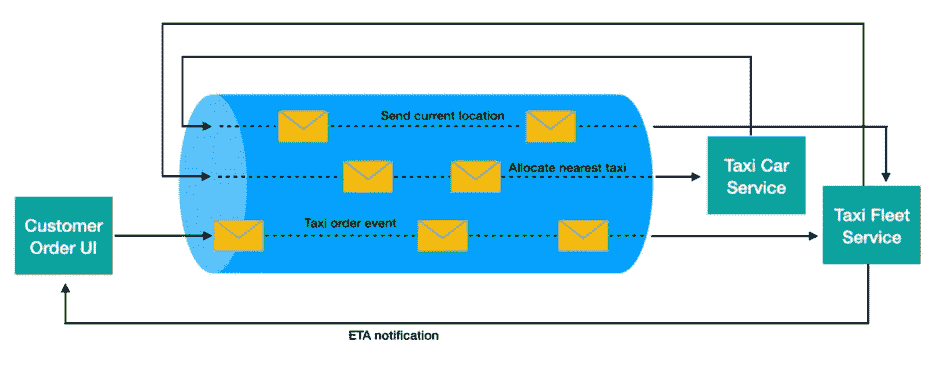
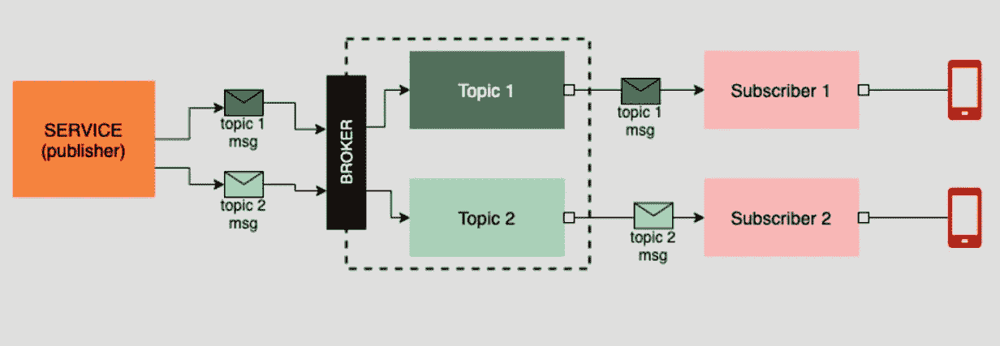
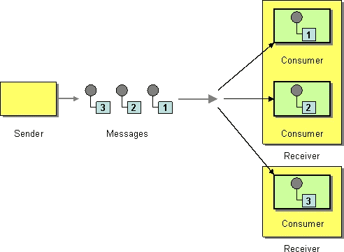

# 通过消息传递实现应用程序之间的集成

> 原文：<https://medium.com/nerd-for-tech/integration-between-applications-through-messaging-5f21eb450fac?source=collection_archive---------0----------------------->

在现代架构中，系统被分布为许多孤立的服务，因此它们必须彼此同步(集成)

但是集成解决方案必须应对一些基本挑战:

*   网络不可靠:为了在两个系统之间进行集成，我们必须通过网络将数据从一台计算机传输到另一台计算机。我们必须准备好处理更多可能出现的问题。要集成的两个系统相隔几大洲，它们之间的数据必须通过电话线、局域网段、路由器、交换机和公共网络传输。这些步骤中的每一步都可能导致延迟或中断。
*   **网速慢**。通过网络发送数据比进行本地方法调用慢几个数量级。像对待单个应用程序一样设计一个广泛分布的解决方案可能会带来灾难性的性能影响。
*   **任何两个系统都是不同的**。集成需要在使用其他编程语言、操作平台和数据格式的系统之间传输信息。集成解决方案需要能够与所有这些不同的技术接口。
*   **变化不可避免**。系统会随着时间而变化。集成解决方案必须随着它所连接的应用程序的变化而不断更新。它很容易受到变化的影响，如果一个系统发生变化，所有其他系统都可能受到影响。集成解决方案需要通过使用应用程序之间的松散耦合来最小化一个系统到另一个系统的依赖性。

我们有四种主要方法:

*   **文件传输**:一个系统写入一个文件，另一个系统稍后读取。
*   **共享数据库**:多个系统共享同一个数据库模式
*   **远程过程调用**:系统公开它的一些功能(例如 REST API)
*   **消息传递**:一个系统向一个公共消息通道发布消息。另一个系统可以在以后从该通道读取消息。

但是我们将在本文中讨论更多的**消息传递**。

# 什么是消息传递？

> 在软件架构中，消息传递模式是一种架构模式，描述了应用程序的两个不同部分或不同系统如何相互连接和通信。 **)**

理解消息传递的一个简单方法是考虑电话系统。通话是一种同步的交流方式。只有当我给他打电话的时候，他有空，我才能和他交流。另一方面，语音邮件允许异步通信。有了语音邮件，当接听者没有接听时，来电者可以给他留言；稍后，接收者可以收听在他的邮箱中排队的消息。语音邮件使打电话的人现在就可以留言，这样接电话的人以后就可以听到留言，这比试图让打电话的人和接电话的人同时通话要容易得多。

消息传递是一种技术，可以实现高速、异步、系统到系统的可靠通信。程序通过互相发送称为消息的数据包进行通信。通道也称为队列，是连接系统和传递消息的逻辑路径。信道的行为类似于消息的集合或数组，但是它可以在多台计算机之间神奇地共享，并且可以由多个应用程序并发使用。发送方或生成方是通过将消息写入通道来发送消息的程序。接收器或消费者是通过从通道读取(和删除)消息来接收消息的程序。

消息本身只是某种数据结构，比如字符串、字节数组、记录或对象。它可以简单地解释为数据，对接收方调用的命令的描述，或者对发送方发生的事件的描述。一条消息实际上包含两部分，一个头部和一个主体。报头包含了关于消息的元信息——谁发送了它，它要去哪里，等等。；该信息由消息传递系统使用

# 什么是消息传递系统？

消息传递功能通常由称为消息传递系统的独立软件系统提供。消息传递系统管理消息的方式类似于数据库系统管理数据持久性的方式。正如管理员必须用应用程序数据的模式填充数据库一样，管理员必须用定义应用程序之间通信路径的通道来配置消息传递系统。

然后，消息传递系统协调和管理消息的发送和接收。数据库的主要目的是确保每个数据记录安全持久，同样，消息传递系统的主要任务是以可靠的方式将消息从发送者的计算机移动到
接收者的计算机。需要消息传递系统将消息从一台计算机传送到另一台计算机的原因是，计算机和连接它们的网络本来就不可靠。一个应用程序准备好发送信息并不意味着另一个应用程序准备好接收信息。即使两个应用程序都准备好了，网络也可能无法正常工作或无法正常传输数据。

消息传递系统通过反复尝试
来传输消息直到成功，从而克服了这些限制。在理想的情况下，消息在第一次尝试时就成功地传输了，但是情况往往并不理想。从本质上来说，一条信息的传递分五步:
1。**创建**:发送者创建消息并用数据填充它。
2。发送:发送者将消息添加到频道。
3。 **Deliver** :消息传递系统将消息从发送者的计算机移动到接收者的计算机，使接收者可以使用它。
4。**接收**:接收器从通道中读取信息。
5。**流程**:接收方从报文中提取数据。

## 重要的消息传递概念

*   **送了又忘。**发送应用程序将消息发送到消息通道(队列)。一旦该步骤完成，当消息传递系统在后台传输消息时，发送者可以继续其他工作。发送者不必等待消费者接收和处理消息。
*   **存储并转发。**消息传递系统将消息存储在内存或磁盘中，并将消息传递给接收者的计算机。

# 为什么使用消息传递？

现在我们知道了什么是消息传递，我们应该问:为什么要使用消息传递？与任何复杂的解决方案一样，没有简单的答案。简单的回答是，消息传递比文件传输更直接，比共享数据库封装得更好，比
远程过程调用更可靠。然而，这仅仅是使用消息传递可以获得的优势的开始。

## 消息传递的好处包括:

*   **远程通信:**消息传递使不同的应用程序能够通信和传输数据。将数据发送到另一台计算机要复杂得多，并且需要将数据从一台计算机复制到另一台计算机。这意味着对象必须是“可序列化的”，也就是说，它们可以被转换成可以通过网络发送的简单字节流。如果不需要远程通信，则不需要消息传递。
*   **异步通信:**消息传递支持一种“发送并忘记”的通信方式。发送方不必等待接收方接收和处理消息；它甚至不需要等待消息传递系统来传递消息。发送方只需等待消息发送，例如，消息系统将发送给
    的消息成功存储在通道中。一旦消息被存储，当消息在后台传输时，发送者就可以自由地执行其他工作。接收方可能希望将确认或结果发送回发送方，这需要另一条消息，这条消息的传递需要由发送方的回调机制来检测。
*   **节流**。远程过程调用的一个问题是，在一个接收器上同时进行太多的远程过程调用会使接收器过载。这可能导致性能下降，甚至导致接收器崩溃。异步通信使接收方能够控制它消耗请求的速率，从而不会因为太多的同时请求而过载。由于通信是异步的，所以这种限制对调用方造成的负面影响被最小化，因此调用方不会被阻止等待接收方。
*   **可靠的通信**。消息传递提供了远程过程调用(RPC)所不能提供的可靠传递。消息传递比 RPC 更可靠的原因是消息传递使用存储转发的方法来传输消息。数据被打包成消息，消息是原子的、独立的单元。当发送者发送消息时，消息传递系统存储该消息。然后，它通过将消息转发到接收方的计算机来传递消息，并再次存储在那里。将消息存储在发送者的计算机和接收者的计算机上被认为是可靠的。不可靠的是将消息从发送方的计算机转发(移动)到接收方的计算机，因为接收方或网络可能运行不正常。消息传递系统通过重新发送消息直到成功来克服这个问题。这种自动重试使消息传递系统能够克服网络问题，这样发送方和接收方就不必担心这些细节。
*   **离线运行:**一些应用程序被专门设计为在不连接网络的情况下运行，但在网络连接可用时仍与服务器同步。此类应用程序部署在膝上型计算机、PDA 和汽车仪表板等平台上。消息传递是使这些应用程序同步的理想方法。要同步的数据可以在创建时排队，等待应用程序重新连接到网络。

因此，系统可以从
消息传递中受益的原因有很多。其中一些是应用程序开发人员最容易联系到的技术细节，而另一些是最能引起企业架构师共鸣的战略决策。这些原因中哪一个最重要取决于您特定应用程序的当前需求。
这些都是使用信息传递的好理由，所以要充分利用那些对你最有利的理由。

# 信息传递的挑战

异步消息传递不是集成的灵丹妙药。它解决了以优雅的方式集成不同系统的许多挑战，但也引入了新的挑战。其中一些挑战是异步模型固有的，而另一些挑战随着消息传递系统的
的具体实现而变化。

*   **复杂的编程模型:**异步消息传递要求开发人员使用事件驱动的编程模型。应用程序逻辑不能再编码在调用其他方法的单个方法中，但是逻辑不会分解成许多响应传入消息的
    事件处理程序。这样的系统更复杂，更难开发和调试。
*   **顺序问题:**消息通道保证消息传递，但不保证消息何时传递。这可能会导致按顺序发送的邮件顺序混乱。在消息相互依赖的情况下，需要特别注意
    重新建立消息序列。
*   **同步场景:**并不是所有的应用程序都可以运行在“发送并忘记”的模式下。如果用户正在寻找机票，他或她会想马上看到票价，而不是在某个不确定的时间之后。因此，许多消息传递系统需要在同步和异步解决方案之间架起一座桥梁。
*   **性能:**消息传递系统确实会增加一些通信开销。将数据转换成信息并发送出去，以及接收信息并处理它都需要努力。如果你必须传输一大块数据，把它分成无数小块可能不是一个明智的想法。

所以异步消息传递并不能解决所有问题，甚至会产生一些新的问题。在决定使用消息传递解决哪些问题时，请记住这些后果。

# 结论

有许多消息传递系统可以帮助您理解不同的方法:

*   [**Apache Kafka**](https://kafka.apache.org/)**:**是一个分布式事件流平台
*   ****:**是一个消息代理**
*   **[**Axon Server**](https://developer.axoniq.io/axon-server/overview)**:**是消息路由器和事件存储**