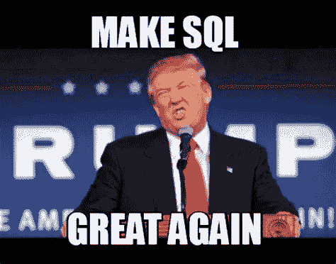

# 有趣的 SQL 函数值得了解

> 原文：<https://medium.com/nerd-for-tech/interesting-sql-functions-worth-knowing-982def8878fd?source=collection_archive---------16----------------------->

**COALESCE()，存储过程，SELECT INTO，CASE**



# 联合()

COALESCE 接受任意数量的参数，并返回第一个不为 null 的值。

```
COALESCE(x,y,z) = x if x is not NULL
  COALESCE(x,y,z) = y if x is NULL and y is not NULL
  COALESCE(x,y,z) = z if x and y are NULL but z is not NULL
  COALESCE(x,y,z) = NULL if x and y and z are all NULL
```

当您想要用其他值替换空值时，COALESCE 会很有用。在本例中，您显示了每个有聚会的 MSP 的聚会名称。对于没有交易方的 MSP(如卡纳万、丹尼斯)，显示字符串 None。

```
SELECT name, party
      ,COALESCE(party,'None') AS aff
  FROM msp WHERE name LIKE 'C%'
```

# **存储过程**

存储过程是一个准备好的 SQL 代码，您可以保存它，这样代码就可以重复使用。

因此，如果您有一个反复编写的 SQL 查询，请将其保存为存储过程，然后调用它来执行它。

还可以将参数传递给存储过程，以便存储过程可以根据传递的参数值进行操作。

```
CREATE PROCEDURE *procedure_name* AS *sql_statement* GO;EXEC *procedure_name*;
```

## 例子

```
CREATE PROCEDURE SelectAllCustomers AS SELECT * FROM Customers GO;
```

执行上面的存储过程，如下所示

```
EXEC SelectAllCustomers;
```

# 带参数的存储过程

列出每个参数和数据类型，用逗号分隔，如下所示。

以下 SQL 语句创建了一个存储过程，该过程从“Customers”表中选择具有特定邮政编码的特定城市的客户:

```
CREATE PROCEDURE SelectAllCustomers @City nvarchar(30), @PostalCode nvarchar(10)
AS
SELECT * FROM Customers WHERE City = @City AND PostalCode = @PostalCode
GO;EXEC SelectAllCustomers @City = ‘London’, @PostalCode = ‘WA1 1DP’;
```

# 选择进入

`SELECT INTO`语句将数据从一个表复制到一个新表中。

```
SELECT *
INTO *newtable* [IN *externaldb*]
FROM *oldtable* WHERE *condition*;
```

仅将一些列复制到新表中

```
SELECT *column1*, *column2*, *column3*, ...
INTO *newtable* [IN *externaldb*]
FROM *oldtable* WHERE *condition;*
```

## **例题**

```
SELECT * INTO CustomersBackup2017
FROM Customers;SELECT  CustomerName, ContactName INTO CustomersBackup2017 IN 'Backup.mdb'
FROM Customers;SELECT Customers.CustomerName, Orders.OrderID
INTO CustomersOrderBackup2017
FROM Customers
LEFT JOIN Orders ON Customers.CustomerID = Orders.CustomerID;
```

# **案例**

`CASE`语句遍历条件，并在满足第一个条件时返回值(类似于 if-then-else 语句)。所以，一旦条件为真，它将停止读取并返回结果。如果没有条件为真，则返回`ELSE`子句中的值。

如果没有`ELSE`部分并且没有条件为真，则返回 NULL。

```
CASE
    WHEN *condition1* THEN *result1*
    WHEN *condition2* THEN *result2*
    WHEN *conditionN* THEN *resultN*
    ELSE *result*
END;
```

## 例子

```
SELECT OrderID, Quantity,
CASE
    WHEN Quantity > 30 THEN 'The quantity is greater than 30'
    WHEN Quantity = 30 THEN 'The quantity is 30'
    ELSE 'The quantity is under 30'
END AS QuantityText
FROM OrderDetails;SELECT CustomerName, City, Country
FROM Customers
ORDER BY
(CASE
    WHEN City IS NULL THEN Country
    ELSE City
END);
```

# 这就是所有的人…

如果你们有兴趣并想学习 SQL，[https://sqlzoo.net/wiki/SQL_Tutorial](https://sqlzoo.net/wiki/SQL_Tutorial)，我推荐你们去看看这个神奇的教程

和往常一样，如果你已经读到这里..

