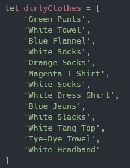
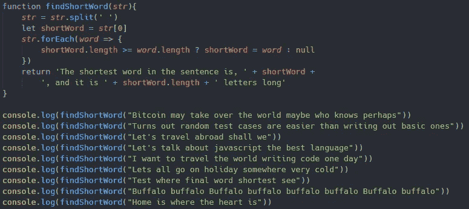

# 算法简介

> 原文：<https://medium.com/nerd-for-tech/intro-to-algorithms-80676e18d23d?source=collection_archive---------18----------------------->

## JavaScript 算法初学者指南

虽然这个词可能看起来有点陌生，甚至对一些刚刚涉足的人来说有点吓人。但是不要担心，我们使用算法来帮助自己，甚至在日常生活中使用它们，而自己却不知道。我指的不是你日常使用的设备或应用程序，而是你这个人。让我们直接开始吧。

**什么是算法？**

我被教导如何更好地理解算法的方法是把它们想象成制作烤奶酪，这与事实相差不远。根据韦氏词典的广义定义，算法是“解决问题或实现某些目标的一步一步的过程”。也许像制作烤奶酪的食谱，这样你就可以享受那种黏糊糊的美味了。你甚至在不知道的情况下，在遵循食谱、整理衣物、甚至穿衣服时，都在使用一种算法。

在开发领域，算法是完全一样的。我们创建一个函数或方法，它将遵循必要的步骤来实现我们的目标。这些算法可以是在数据集中找到最小的单词，按字母或数字对数据集排序，去除奇数/偶数，字符串是否包含有效的括号，字符串是否提供了有效的电话号码；任何事都可以。让我们来看一些不同算法的例子，同时对它们进行分解。

**整理衣物**

让我们再来看一下必须对衣物进行分类的例子。当我自己洗衣服的时候，我通常会分成两堆。一个是彩色的，一个是白色的，因为我以前在混合洗涤时不幸地将颜色渗进了我的白色衣物中。首先，我们要准备好我们所有的脏衣服。

然后我们需要声明我们的函数，恰当地命名为 sort laundry，它接受一个数组作为参数。因为我们知道我们要做两堆或者有两个载荷，我们将为彩色载荷创建一个空数组，为白色载荷创建一个空数组，如下所示。

我们的分类洗衣功能，首先需要检查我们脏衣服堆中的每一件衣服。当它查看每一件衣物时，我们可以确定它将与哪一件衣物放在一起。我会选择这样写我的函数。

对于每一件衣服，我们将首先把字符串小写，如果我们在制作列表时偷懒或遗漏了一个大写字母。然后，如果我们的衣物名称中包含白色，我们会将该衣物放入白色的衣物堆中。如果我们的服装项目不包括白色，它将被推到颜色堆。然后，我们可以按照您的意愿返回，为此，我决定返回一条消息，其中包含每一堆的长度和项目。

*回报*

虽然这看起来像是一个简单的分类衣物的功能，但我们仍然创建了一个算法。在这种情况下，它只是根据字符串包含白色的条件对项目进行排序。同时，应该包含在白色负载中的一些米色或其他米色将被放置在颜色负载中。这需要你改变算法的条件。我已经帮助你走到这一步，并挑战你作出必要的改变和/或补充，以完成这样的任务。

**找出最短的单词及其长度**

现在让我们来看一个例子，这是我在一次技术面试中收到的一个例子。这个问题看起来并不太难，但是它展示了您可以在必要时转换数据以及处理不同数据类型的能力。对于这个例子，我们将得到一个字符串，我们需要从中提取最短的单词并提供它的长度。让我们从声明我们的函数开始，寻找短词。我们还需要将这个字符串转换成一个数组。

通过在每个空格处分割字符串，我们现在已经将 string 重新分配为所有已提供单词的数组。既然我们的数据类型已经从一个字符串变成了一个字符串数组，我们现在可以遍历每个单词了。但是在我们开始循环之前，让我们先将最短的单词设置为数组中的第一个单词。

然后我们将创建一个循环来比较最短单词的长度和循环中当前单词的长度。如果最短的单词比循环中的当前单词大，那么我们将把最短的单词重新分配给那个单词。否则，我们将无所作为。这将继续下去，直到每个单词都与最短的单词进行了比较。这是我个人编写这个函数的方式。

然后，我们还可以自定义我们的回报，但应该确保包括最短的单词以及它的长度。

*回报*

同样，这看起来像是一个简单的函数执行一个简单的任务，但是我们又创造了一个算法。在这种情况下，测试字符串是短句，人们可以通过阅读它们来完成。但是想象一下，得到的字符串有几个段落甚至几页长，并且必须一整天都这样做。手动操作会花费很多时间，而且会让你精疲力尽。

计算机不仅可以在几分之一的时间内完成这些计算，而且不会疲劳或精疲力竭，理论上可以永远运行下去。虽然我并不想将任何人的脑力与计算能力进行比较，但我们创造算法来帮助我们实现目标。虽然单独一个算法似乎没有多大意义，但多个算法和谐地一起运行有助于创建您最喜爱的应用程序及其功能。

我要感谢你的阅读，并希望你学到了新的东西！请关注未来的更多文章！

如果你想查看这些例子的副本，或者只是作为参考，你可以在这里找到 GitHub Repo [的链接。](https://github.com/TheRealKevBot/Intro2Algos)