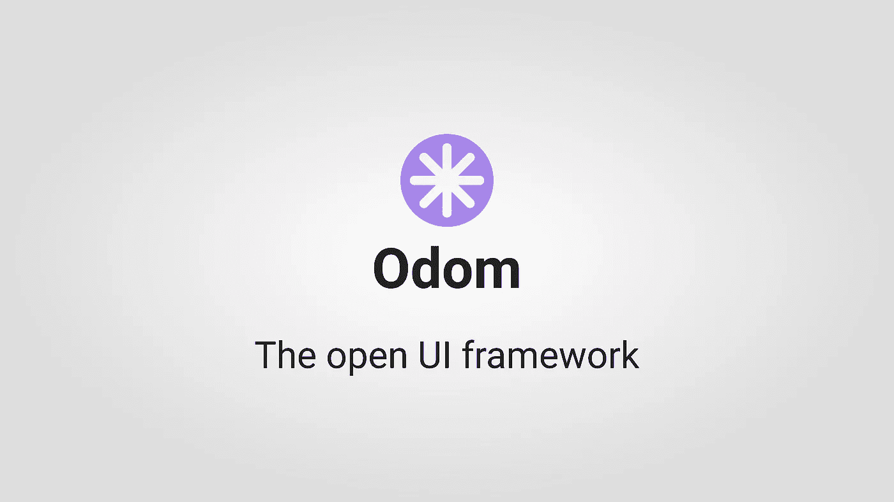

# Odom 简介:开放式 UI 框架

> 原文：<https://medium.com/nerd-for-tech/introducing-odom-the-open-ui-framework-ed29572a46bb?source=collection_archive---------1----------------------->

# 介绍

任何时候都不是垄断网络的时候。一个好的网络技术必须尽可能的包容。

有数不清的网络技术，而且数量每天都在显著增加。当开发人员想要使用一项新技术时，他们通常不得不扔掉他们使用的工具来为它腾出空间。如此频繁和剧烈地改变工具阻碍了开发人员的成长。UI 组件、主题和插件的发布者通常不得不重写代码来创建与新技术兼容的新产品。

此外，web 标准正在指数级地赶上库和框架。所以，一项技术，如果不给自己留下很大的进化空间，就注定寿命很短。当 web 标准赶上特定技术时，开发人员只剩下过时的技能。这迫使开发人员为了在行业中生存而学习新的技能。

[Odom](https://github.com/riu-web/odom) ，一个用于构建用户界面的 JavaScript 框架，目的不是取代任何技术，而是与每一种技术协同工作。它本身提供了很多很棒的特性。但是，让我们现实一点。没有一种工具是适合所有任务的。奥多姆给其他技术留下了很大的空间。它也可以很容易地集成到现有的项目中。它提供了覆盖和补充它所执行的默认过程的方法。

我是框架的作者。我开始这个系列是为了展示奥多姆是如何工作的。在本系列的这一部分中，我将介绍框架的基本特性。我们也会看看奥多姆的未来。

# 特征

## 和睦相处

奥多姆可以[向 dom 呈现](https://github.com/riu-web/odom/blob/master/docs/api/render.md)四种类型的[资产](https://github.com/riu-web/odom/blob/master/docs/assets.md)；[组件](https://github.com/riu-web/odom/blob/master/docs/assets.md#components)、[节点](https://github.com/riu-web/odom/blob/master/docs/assets.md#nodes)、[标记](https://github.com/riu-web/odom/blob/master/docs/assets.md#markup)和[文本](https://github.com/riu-web/odom/blob/master/docs/assets.md#text)。将 Odom 集成到现有的项目中就像将任何这样的资产插入到现有的 dom 中一样容易。下面的代码片段展示了将 DOM 节点插入 DOM 的一种方法。

在`/components/header.js`节点从 ES 模块导出。不带任何参数调用方法`[render](https://github.com/riu-web/odom/blob/master/docs/api/render.md)`(Odom 的导出之一)将节点插入 dom。可以使用任何方法创建 DOM 节点。

## 灵活性

除了 HTML，Odom 还允许使用 XML。你有两种将 XML 转换成 HTML 的方法。一种方法是在 XML 标记中使用属性。在 XML 元素上，将属性`html`的值设置为相应的 HTML 元素。另一种方式是通过提供一个中间件[将每个 XML 元素转换成相应的 HTML 元素。下面的代码片段显示了使用属性转换后的 XML 标记和相应的 HTML 标记。](https://github.com/riu-web/odom/blob/master/docs/api/create-component/middleware.md#markup)

Odom supports 支持[元素级](https://github.com/riu-web/odom/blob/master/docs/api/create-component/create-component.md#inlinestyles)、[组件级](https://github.com/riu-web/odom/blob/master/docs/api/create-component/create-component.md#styles)和全局级的编写风格。在组件级别，全局 CSS 可以从任何文件导入。

在 Odom 中创建[组件](https://github.com/riu-web/odom/blob/master/docs/components.md)有多种方式。组件可以是脚本或模块的本地组件。[单文件组件](https://github.com/riu-web/odom/blob/master/docs/components.md#single-file-components)可使用 [ES 模块](https://github.com/riu-web/odom/blob/master/docs/components.md#js-components)或 [HTML 文件](https://github.com/riu-web/odom/blob/master/docs/components.md#html-components)创建。它还支持[多文件组件](https://github.com/riu-web/odom/blob/master/docs/components.md#multiple-file-components)。

## 表演

奥多姆的初始渲染速度非常快。使用并发性/并行性一次创建任何组件的所有子组件。我们想要渲染的组件层次结构中的每个组件都是在渲染之前构建的。此时，您可能会惊讶地想到，如果任何组件的构建时间过长，会发生什么情况。Odom 为您提供了一种[方式](https://github.com/riu-web/odom/blob/master/docs/api/asset-manager.md#limitawait)来指定组件应该等待的最长时间。如果组件的构建超过了时间限制，那么在 DOM 中使用一个占位符。当组件准备好时，占位符将被实际组件替换。如果没有指定时间，将立即使用占位符。

Odom 允许你一次[预取](https://github.com/riu-web/odom/blob/master/docs/api/asset-manager.md#prefetch)组件、文本、blobs 和 JSON 等资产。这些资产在全球范围内提供，可以在需要时使用。

任何 DOM 元素都可以在 Odom 中延迟加载。这确保了仅在需要时才加载内容。下面的代码片段展示了如何将[延迟加载](https://github.com/riu-web/odom/blob/master/docs/conditionals.md#lazy)应用到一个元素中。

随着越来越多的内容被添加到 DOM 中，Odom 想尽一切办法通过减少额外内容的数量来保持性能。当您在组件上显式设置 ID 时，该组件的样式将被缓存。再次创建该组件时，将重用这些样式。Odom 还使用事件委托来减少添加到 dom 中的[事件监听器](https://github.com/riu-web/odom/blob/master/docs/api/create-component/create-component.md#eventlisteners)的数量。当组件的所有实例都从 DOM 中删除后，该组件的样式就会被丢弃。

Odom 为构建组件提供了一个[类](https://github.com/riu-web/odom/blob/master/docs/api/component/component.md)。该类包含用于创建和操作 DOM 节点的实用程序。这些实用程序也用于为 DOM 节点添加样式和行为。仔细选择何时使用该类以及如何使用它可以显著提高性能。

之前，我们看了奥多姆可以插入 dom 的不同种类的资产。如果在呈现节点后不需要使用该类，保留它将是低效的。您可以显式提供一个用于呈现的节点，而不是一个组件。但是，即使你不这样做，奥多姆只会提取节点，而忘记组件。在这两种情况下，组件都将被垃圾收集器回收。如果您所需要做的就是从标记创建一个 DOM 节点，那么使用该类将是多余的。Odom 允许您为呈现提供标记。标记将被转换成 DOM 元素并呈现。

在奥多姆，DOM [突变](https://github.com/riu-web/odom/blob/master/docs/api/component/apply.md#mutations)可以以一种对性能友好的方式应用。无论你想应用大的或小的突变，奥多姆提供了一种方法来尽量减少对性能的影响。

## 维护

奥多姆鼓励关注点的分离。内容、表现和行为是分离的。甚至[内联样式](https://github.com/riu-web/odom/blob/master/docs/api/create-component/create-component.md#inlinestyles)也是使用 JavaScript 对象以声明的方式应用的。当使用像 [Bootstrap](https://getbootstrap.com/) 和 [Tailwind](https://tailwindcss.com/) 这样的框架时，标记会被冗长的类名和/或大量的属性弄脏。这使得标记很难阅读。对于相似的元素，有些属性是重复的。这使得代码很难维护。Odom 提供了一种通过 JavaScript 以声明方式向元素添加属性的方法。下面的片段展示了如何使用 Odom 重写[引导下拉菜单](https://getbootstrap.com/docs/5.0/components/dropdowns/#single-button)。您不必熟悉 Bootstrap 就能理解发生了什么。

**原始 HTML 代码:**

**重写的 HTML 代码:**

只留下了识别元素所需的类。通过查看这些类，我们可以对下拉菜单的表示和行为有一个大致的了解。

**JavaScript 代码:**

没有放在标记中的所有其他属性名称和值都是使用 JavaScript 应用的。CSS 选择器用于选择元素。注意，每个 `.dropdown-item`的属性`href` 只在一个地方设置。这使得维护代码更加容易。

## 异步编程

前端的很多流程都是异步执行的。很多次，我绞尽脑汁试图找出如何在同步代码中加入异步代码。如果我正在编写一个依赖于异步函数的函数，我要么必须使用回调，要么使用`Promise.then`，它最终会使用回调。这意味着我必须将一些代码转移到回调中。这改变了代码的流程。

如果我的代码所依赖的函数可能是异步的，也可能不是，我必须创建两个分支。一个分支将处理同步情况。另一个将处理异步情况。这使得代码流变得复杂。如果另一个函数需要我正在编写的函数在继续执行之前完成每一步，那么我必须有条件地返回一个承诺或其他值。这会使函数的签名变得复杂。

使用异步函数使事情变得不那么复杂。如果我编写的函数依赖于异步函数，我所要做的就是使用`await`关键字。如果外部函数可以是异步的，我还是使用了`await`关键字。这使我的代码流保持完整。函数的签名也很简单，因为在任何情况下都只返回一个承诺。

异步编程使我们能够对并发性和并行性做出承诺。Odom 使用并发性和并行性来执行一些任务。这提高了性能。

# 下一步是什么？

## 开发工具

目前，我正在构建开发工具来执行以下任务:

*   **将 HTML 文件转换为 es 模块:**此时， [HTML 单文件组件](https://github.com/riu-web/odom/blob/master/docs/components.md#html-components)在运行时被转换为 ES 模块。如果在构建时这样做，性能会得到提高。HTML 组件的另一个问题是，并非所有的[相对 URL](https://github.com/riu-web/odom/blob/master/docs/components.md#html-component-module-urls)都在`script`元素提供的模块中工作。在构建时将 HTML 文件转换成 es 模块可以解决这个问题。
*   **将 XML 转换成 HTML:** 使用属性和中间件将 XML 转换成 HTML。
*   **CSS 预处理:**将 [Sass](https://sass-lang.com/) (或者类似的东西)转换成 CSS。
*   **界定 CSS 的范围:**界定[组件级 CSS 的范围](https://github.com/riu-web/odom/blob/master/docs/api/create-component/create-component.md#styles)。Odom 支持在组件级 CSS 中导入 CSS。但是，导入的样式没有限定范围，并且不是所有的相对 URL 在`@import`规则中都有效。这些问题可以通过工具来解决。
*   **缩小:**HTML、CSS、JavaScript 的缩小。
*   **模板文字处理:**模板文字提供了一种用 JavaScript 编写标记和样式的简单方法。可用的构建工具没有提供处理模板文本中的代码的方法。这意味着所有类型的处理都必须在运行时完成。这对性能有负面影响。构建工具将提供一种方法，在构建时在模板文字中应用上述类型的处理。

我希望其他开发人员能和我一起开发这些工具。

## 属国

奥多姆目前没有依赖。我不想添加任何依赖，除非我确定这样做更好。我希望社区能帮我决定哪些依赖项最适合这个框架。以下是我正在考虑的一些依赖因素:

*   快速 xml 解析器:一个 XML 解析器。这可以用来在转换成 HTML 之前解析 XML。它比普通的 JS 方法更快更简单。
*   parawait:我创作的一个库。它用于实现并发性和并行性。它比普通的 JavaScript 方法更节省内存。
*   CSS 供应商修复程序:我还没有为这个决定任何库。Odom 目前只给[内嵌样式](https://github.com/riu-web/odom/blob/master/docs/api/create-component/create-component.md#inlinestyles)添加厂商前缀。

# 结论

奥多姆发表在 [GitHub](https://github.com/riu-web/odom) 和 [NPM](https://www.npmjs.com/package/odom) 上。要开始，请参考[快速入门指南](https://github.com/riu-web/odom/blob/master/docs/quick-start.md)或[文档](https://github.com/riu-web/odom/blob/master/docs/home.md)。我们已经看到了奥多姆如何很好地配合 Bootstrap 和 Tailwind。但是，这只是冰山一角。在接下来的几集里，我不仅会深入研究奥多姆的特性，还会尽可能多地介绍一些技术。如果其他人能像我一样看到奥多姆的价值，我会很高兴。感谢你读到这一部分。