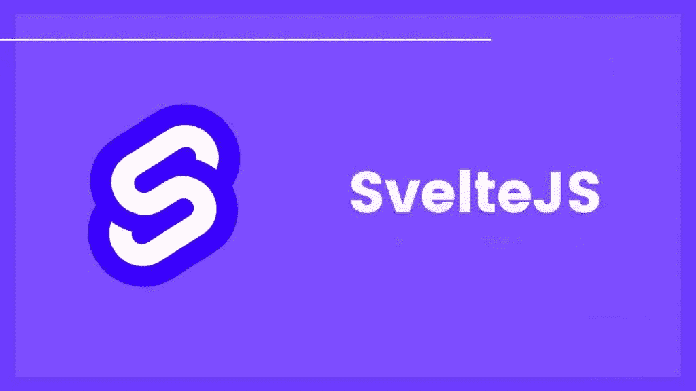
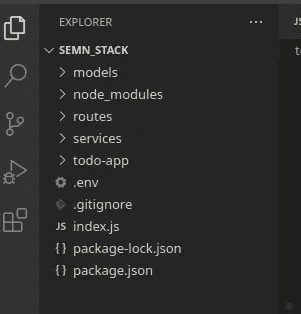
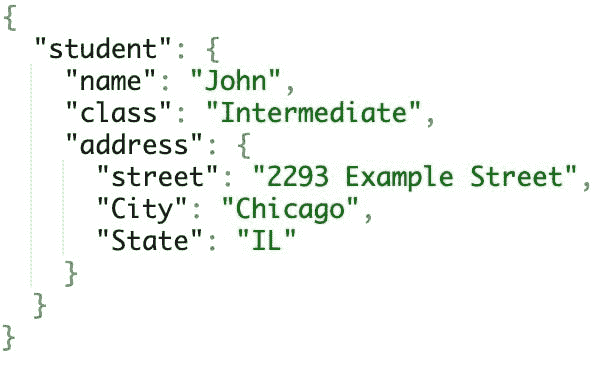
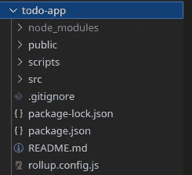

# 通过构建 todo-app 引入 SEMN 堆栈

> 原文：<https://medium.com/nerd-for-tech/introducing-the-semn-stack-by-building-a-todo-app-a7c825b31b0d?source=collection_archive---------1----------------------->

所以我一直在学习和尝试苗条。JS 是一个非常简单的前端 Javascript 框架，我决定既然每个人都可以提出新的技术栈，为什么不提出我的呢😅

**SEMN 栈**

是的，到现在为止，我认为这个堆栈是关于什么的已经很明显了，所以让我们简单地看看我们今天学到了什么

**S 代表苗条身材**

快速浏览他们的网站，你会发现苗条身材实际上是

> Svelte 是构建用户界面的一种全新方法。尽管 React 和 Vue 等传统框架在*浏览器*中完成了大部分工作，但 Svelte 将这些工作转变为*编译步骤*，这发生在你构建应用的时候。

几个月后，当我用 ReactJS 尝试这个框架时，事情就神奇地“点击”了一下，如果我回头看 React 只有一个原因，那就是巨大的生态系统和无数的包和插件等等

这个框架对于单页应用程序来说是非常简单和完美的，用它开始一个项目就像`npx degit sveltejs/template [NAME]`一样简单，然后你就可以开始了！

但是这个框架可以扩展得更远，使用`npm`可以简单地添加更多的功能和特性，所以我的观点是，苗条可以变得简单和最小化，但是它可以极大地扩展

**E 为 EXPRESSJS**

NodeJS 之上的后端开发之王，我以前写过一个博客，在那里我讨论了我所看到的在我的💀死亡的💀去年的 here 斯塔克系列，你可以在这里找到确切的博客所以我现在简单介绍一下

ExpressJS 是一个后端框架，帮助我们编写服务器非常简单！

它帮助我们构建端点、处理请求、发送适当的响应等等，此外，它现在是设置任何后端服务的行业标准

**M 代表 MONGODB**

mongodb 是一个灵活且易于使用的基于文档的数据库，它允许开发人员将数据存储在类似 JSON 的结构中，其中每个键都映射到一个值，这为开发人员提供了一种以灵活的方式存储动态数据的好方法，在这种方式下，您可以随时修改文档并添加新的键，而不会破坏之前的条目

Mongodb 是一个无 SQL 数据库，这就是字面意思，不需要再次编写烦人的 SQL，它支持对存储数据的各种操作

**N 代表节点 j**

NodeJS 是……你知道 javascript 是如何在浏览器也就是客户端上运行的吗？一些书呆子写了一个 c++程序，现在我们可以在服务器上运行 javascript 了😂

**建立我们的开发环境**

好的，让我们从安装需要的东西开始，这一点也不困难，所以有一个快速的清单😋

*   此处的[中的 NodeJS 和 npm](https://nodejs.org/en/)
*   Mongodb atlas 帐户，这样我们就可以在云上访问我们的数据库，点击[此处](https://www.mongodb.com/atlas/database)设置一个帐户，点击[此处](https://docs.atlas.mongodb.com/tutorial/create-new-cluster/)了解如何创建和连接到您的集群

是的，现在就这样，所以让我们简单地-我最近一直在说这个很多次，我不知道为什么 smh-过一遍这个应用程序将如何构造，以及我们需要安装的软件包

首先为应用程序的服务器端创建并移动到一个新目录

`mkdir semn_stack && cd semn_stack`

然后我们通过`npm init -y`初始化一个新项目

安装软件包`npm i express cors mongoose` ，然后安装`npm i nodemon --save-dev`

*   `express`将帮助我们建立服务器，处理请求和东西
*   `mongoose`是一个包，它帮助我们连接到我们的集群并构建一个模式来存储我们的数据，稍后会详细介绍
*   `cors`帮助我们解决我们的前端和后端之间的跨源策略问题，因为它们运行在不同的端口上，可以在[这里](https://developer.mozilla.org/en-US/docs/Web/HTTP/CORS)找到关于该安全策略的更多信息
*   `nodemon`代表节点监视器，每次我们做出更改时都会刷新我们的节点服务器，这样可以节省我们一些时间

**后端文件结构**

现在，我们将开始以一种非常冷静和有组织的方式来安排我们的文件，这样就可以很容易地维护代码，并在出现错误时指出错误

现在忽略“todo-app”目录

好的，我们这里只有一些有趣的作品

1.  `models`将保存我们的数据库模型，将模型视为我们将保存的文档的蓝图，因此在我们的待办事项列表中，可能会有标题、描述和其他字段
2.  将包含到我们的 Express 后端的路由，路由帮助我们组织请求去哪里以及我们应该如何对它们做出反应
3.  `services`将包含我们路线的逻辑和功能，目前将只具有与我们数据库交互的功能
4.  `index.js`是我们的切入点

**是时候看看这些目录了**

现在是时候打开这些目录，看看里面的代码了，我们也来看看吧:))

*   **型号**

在`models`目录中，我们将有我们的 todo 模型，看起来像这样

所以，你现在可能会问自己到底是什么

让我先向您展示一下 mongodb 文档的样子

OMG JSON 是你吗😲是的，它看起来像 JSON，工作起来也像 JSON

`mongoose`帮助我们“塑造”文档，这种“塑造”称为模式，然后该模式可用于生成模型，这就是我们用来将数据存储到文档的标准

简单回顾一下，数据库和 ofc 中的模式>模型>数据，我们需要导出这个模型，这样我们就可以导入它并在任何其他地方使用它

*   **路线**

这就是我们的路线，但是到底什么是路线呢？想象一个巨大的网络应用程序，比如电子商务，有很多链接指向产品页面、公司、退款、登录、注册、重置密码等

我们需要决定当终端用户请求这些“端点”时，我们的后端应该如何反应，这就是 Express 的魅力所在😍

让我们看看我们的路线文件`routes.js`

我们可以很容易地区分上例中的端点，所以让我们列出它们以及它们的作用

`GET /`这代表检索所有存储的待办事项的端点

`POST /` 这是用来存储新的待办事宜的

`DELETE /` 这将删除**所有**待办事项

`DELETE /:id`这将通过 id 删除一个**单个**待办事项

正如你所看到的，我们使用快速路由器来促进这一切，而不是仅仅把它扔在一个巨大丑陋的文件中，所以是的，这种结构更有组织性

但是这个“api”是从哪里来的？？？？？？接下来就是这个了！

*   **服务业**

这个目录将包含每个端点背后的逻辑，以及服务器应该向最终用户返回什么数据

里面只有一个文件来处理所有这些，所以让我们来看看

正如你所看到的，我们导出了四个函数来匹配我们在`routes.js`中的端点，它们非常简单

**现在到我们的主入口**

我们的`index.js`非常简单，因为所有的逻辑都是在前面提到的目录中单独完成的，我们只需要再安装一个名为 dotenv 的包，它可以帮助我们与环境变量进行交互，以保护重要的代码片段，如 API 密钥等，所以让我们`npm i dotenv`这个坏男孩

我们只需初始化一个 express 应用程序并启用 cors，然后我们使用 express 提供的 JSON 中间件来处理传入的 JSON 数据并发出 JSON 响应，然后在第 9 行中，我们告诉 express，无论何时有请求传入/然后使用我们在`routes.js`中定义的路由，我们将这些路由作为路由导入

**瘦身时间**

剧透:你会喜欢苗条身材的😉

正如我前面说过的，一旦你有了`nodejs`和`npm`，开始一个新的瘦项目是非常简单的，所以我们只需要做一点点`npx degit sveltejs/template todo-app`，然后进入目录并运行`npm install`来安装依赖项，然后运行`npm run dev`来运行本地开发服务器，你可以在 localhost:8080 找到它

**一些苗条的基础知识**

让我们先来看一看应用程序的文件结构，这样我就可以告诉你要忽略什么，魔法会发生在哪里

是的，所以我们只关心`src`目录，因为它将保存我们实际的组件，所以让我们进入它，看看如何创建和渲染它们

默认情况下，你不会找到`components`目录，所以我们创建它

Svelte 中的工作流很简单，类似于任何 JS 前端框架，你在你的组件目录中创建`.svelte`文件，然后将它们导入到`App.svelte`中，因为它代表了我们的 Svelte 项目的“根”

**创建组件和我们的应用。细长文件**

首先，让我们把注意力集中在框架上，我们可以用它做什么，所以让我们从最基本的开始，比如组件看起来像什么，如何嵌套它们，如何传递道具等等

因此，每个苗条的组件由这三个部分组成，一个脚本标签保存应用程序的这个特定组件的 JS，html 部分，在这种情况下是这个`<main>`标签，最后是样式部分来设置组件的样式

**注意事项**

*   为了将一个功能“挂钩”到一个组件，例如上面例子中的一个按钮，我们使用了`on:click`,这是一个非常简单的特性
*   这些部分应该出现在每个组件中，但是它们中的任何一个都可以是空的

**苗条的绑定**

为了将输入字段的值绑定到一个变量，我们需要使用`bind:value`指令，这是 Svelte 中许多可用的绑定之一，所以让我们看看它是如何工作的

很酷吧？让我们更详细地看看这个绑定特性是如何工作的

当你通常在 JS 中创建一个表单并想要得到输入字段值时，你应该做一些类似于`let username = document.querySelector("#user");`的事情，尽管这是完全有效的 JS 代码，**仍然有一个问题，**在组件做 之前，我们在轻量级加载 ***中为组件构造的 JS***

这意味着不会出现像`querySelector("#user")`这样的东西，所以我们通过将输入字段绑定到我们初始化的变量来解决这个问题，在这种情况下这个变量是`username`，然后我们使用花括号在任何我们想要的地方引用这个变量

**使用道具保持苗条**

Props 是指我们传递给一个组件的数据，以便我们能够访问该组件中其他地方的数据

举个例子:假设你正在制作一个 web 应用程序来呈现最新的电影以及与之相关的数据，比如分级、导演姓名等，你想以一种更时尚的方式来呈现这些数据

因此，您在顶层/根组件中检索数据，在本例中是`App.svelte`，然后将它作为道具传递给`movieCard.svelte`组件

现在让我们创建一个虚拟的对象数组来代表一些电影，看看道具是如何工作的

哇哦，你得到了一个额外的功能，这里也解释了😃所以让我们来谈谈苗条中的逻辑

在 svelte 中有许多逻辑块，如`#each`和`#if`，它们应该总是像这样结束`/each`、`/if`

所以在我们的例子中，我们简单地使用`#each`指令遍历数组中的对象，并为每个对象分配变量名‘movie ’,只是为了在循环时引用

然后我们渲染我们的`movieCard`组件，将数组中的单个对象作为道具传递给它，但是这个组件看起来像什么呢？我们如何处理传过来的道具？

**渲染我们组件中的道具**

在我们包装这一部分并转到真正的 todo 应用程序 smh 之前，让我们快速浏览一下`movieCard`组件

乍一看，你会认为 wtf 是在那里做的`export`,这也是我的确切反应，所以让我们看看发生了什么

所以本质上这个`export`关键字的作用就好像组件是“期待”数据，所以在我们的例子中是道具**，注意`App.svelte`中用来传递道具的名字**应该是你要传递道具给 So 的组件中的`export`中的确切变量名

我决定为类名添加一些条件，这样我们就可以动态地改变卡片的样式，因为它看起来很酷😎

因为我们基本上是将一个对象作为一个道具来传递的，所以我们使用点符号来访问它的属性，就像任何普通的 JS 对象一样

**为我们的 TODO 应用构建前端**

*剧透提示:抱歉，我没有做任何造型:(但我为这个项目设置了 tailwindcss，所以你可能会想用它和泰·♥️*

现在，您是希望它位于确切的目录中还是完全独立的目录中，这取决于您，因为最终我们只是将端点连接到我们的前端

让我们看看所有这些函数都做了什么

1.  `onMount()`是 svelte 中的一个生命周期函数，如果你熟悉的话，它类似于 Reactjs 中的`useEffect()`钩子，基本上是一种我们每次‘挂载’或加载组件时运行代码的方式，在这种情况下，我们只是调用我们的 API 来检索所有存储的 todos
2.  `addTodo()`基本上发送一个对应于我们的`POST`端点的 post 请求，通过绑定标题和描述字段的值，然后使用请求中的变量来存储一个新的 todo
3.  `wipeTodos()`向我们的后端发送一个`DELETE`请求，一次性删除所有待办事项

**构建 TODO 组件**

现在是时候抛出一个组件来保存待办事项数据，并添加一个按钮来删除该待办事项了

根据我们的后端代码，我们分配了一个端点来接收带有 id 参数的`DELETE`请求，在本例中，我们从 todo 对象本身获得了 ID 参数，**每个 MONGODB 文档都有一个 ID 属性**，这就是我们如何设法获得它的

非常感谢你能走到这一步，♥️

完整的代码可以在我的 [github repo](https://github.com/ilovebewbs/todo_app) 上找到

当心😃