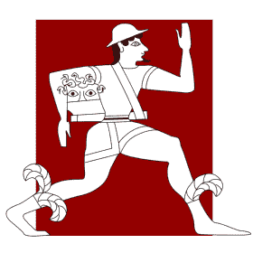
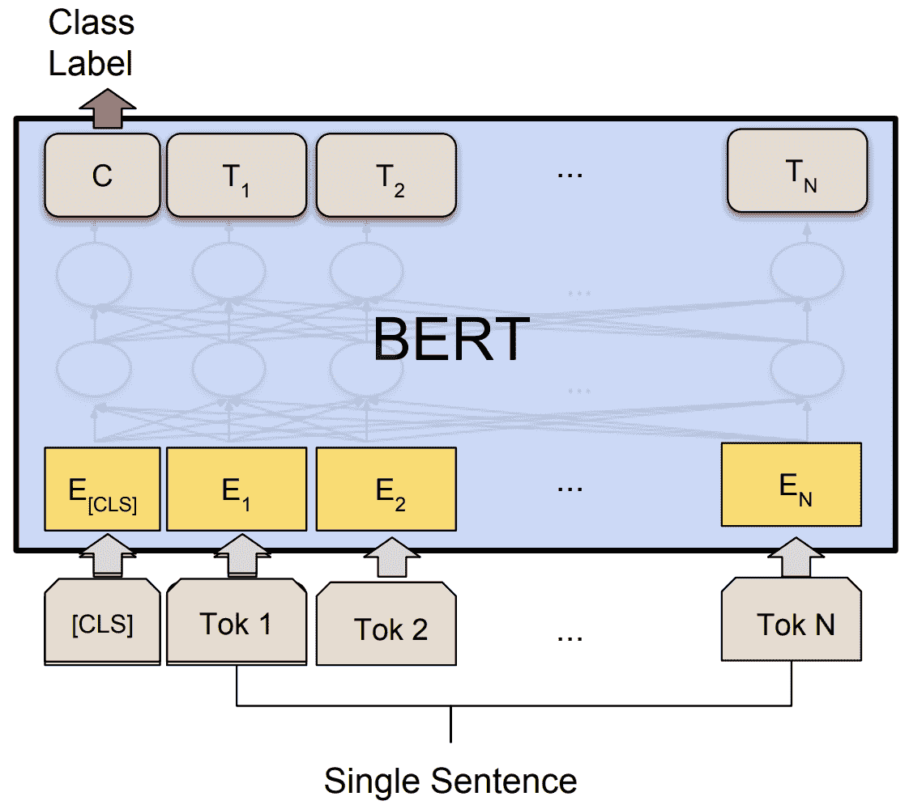
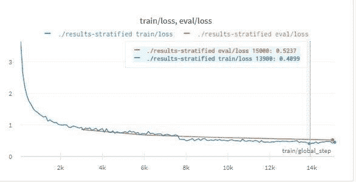
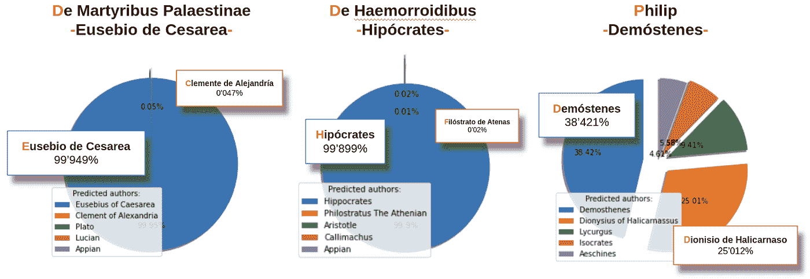
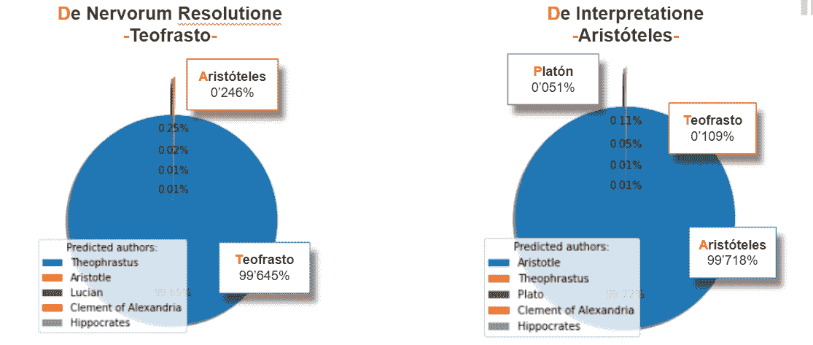
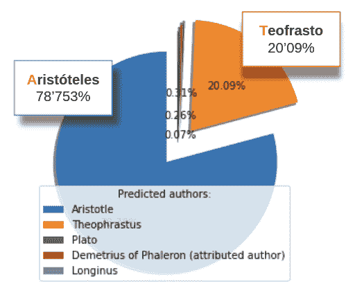
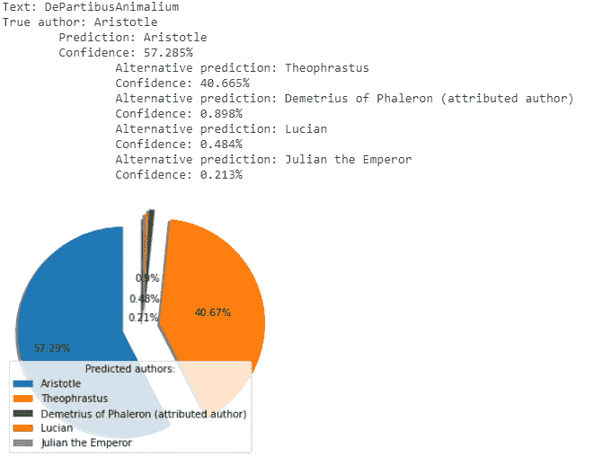
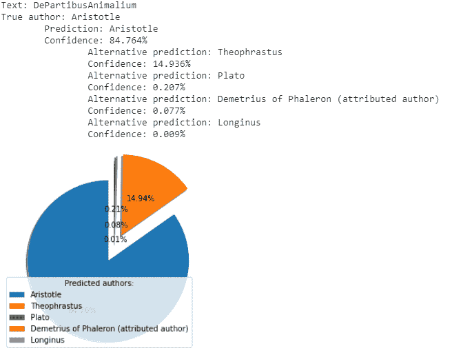

# KalokagathIA

> 原文：<https://medium.com/nerd-for-tech/introduction-14385d022ff5?source=collection_archive---------14----------------------->

这个项目的目标是开发一个根据作者对古希腊文本进行自动分类的工具的第一个版本，这是通过使用自然语言处理(NLP)技术实现的。

这一工具将有助于整个学术界，尤其是研究语言学和文献学的学者，为他们提供一个全新的视角来简化新发现文本的分类以及有争议作者的经典著作的修订过程。因此，它有望带来一种新的光，可以揭示几个世纪以来未被注意到的细节或模式。

这个项目完整发布在 [github](https://github.com/DavidLeirado/KalokagathIA) 上，可以随时查阅。

# **数据**

为了获得输入给人工智能的数据，珀尔修斯数字图书馆项目，一项对不同语言的经典文本进行数字化的国际倡议，已经成为一个巨大而有用的资源。

在 Python 中开发了两个刮刀，其中一个自动下载所有可用的文本，而另一个被设计为在手动提供一些指南后提取具体的文本。之所以需要后者，是因为第一个程序查找文本的 API 仍在开发中，没有提供足够的文本来训练所用的模型。

拥有 50 多位作者的数据集，相当于大约 110 篇堂吉诃德式的文本(大约 500 本书)。)，已经通过使用这种高效的策略获得。数据集的结构非常简单，只包含 4 个字段:(作者、作品、片段和文本)。它大约有 180，000 行。

根据这些数据，我们进行了初步清理。所采用的方法是临时性的，因为它只包括最基本的内容，如删除数字、拉丁字符、标题、页脚和诸如此类的元素。有必要执行一个接一个的文本清理，因为每个作者和每个文本都有自己的怪癖(角色名、对话符号、换行符，这可能会导致未来的偏见)。由于这项工作的复杂性，需要语言学家和/或语言学家的帮助才能完成手头的任务。

# **车型**

我们使用了一个 [BERT](https://arxiv.org/pdf/1810.04805.pdf) 算法和一个希腊预训练模型。这是连接到一个神经网络(神经网络)，作为一个分类器后，由开发人员训练。

使用的 BERT 模型可以在这里找到。它的培训包括维基百科的希腊语文本、[欧洲议会会议平行文集](https://www.statmt.org/europarl/)和 OSCAR。

一般来说，BERT 以记号的形式获取文本(一个[记号赋予器](https://huggingface.co/transformers/preprocessing.html)用于将文本片段转换成记号),并从记号中为 NN 获取信息。该信息可以用于训练另一个不同的神经网络来回答关于所述信息的问题，决定文本的情感是积极的还是消极的，等等。在这种情况下，训练的 NN 是作者分类器，因此获得的输出是属于训练数据集的大约 50 个作者中的一些的文本的一系列概率。

为了验证该模型，BERT 最多只能接受 512 个令牌的序列，这带来了一些麻烦。，因为绝大多数文本都远远超出了这一限制。为了解决这个问题，我们创建了一个脚本，将每个文本分割成对 BERT 友好的块:它将每个块交给模型，然后将所有结果转化为一个预测。

对于后一项任务，实施了三种不同的方法:

1.  第一种方法是对每个数据块进行绝对预测，然后对每个结果进行计数，将其转化为百分比。这是最直接的方法，但不是最现实的，因为低置信度预测与高置信度预测处于同一级别，而次要预测则完全被忽略。尽管如此，它在某些情况下还是很有用的，正如将要展示的那样。
2.  第二种方法获取每个输出节点的每个预测的平均值，然后将其转换为百分比。这种方法更适合模型，因为它考虑了所有数据，不像其他方法，这可能解释了为什么它也给出了三种方法中最好的结果。此时，我们的验证集有 80%的准确性，大多数正确的预测都有 97%以上的置信度。
3.  为了有第三种比较方法，为每个预测实现了一个简单的函数，惩罚低置信度节点，奖励高置信度节点。这种方法将精确的结果推得更高，超过 99%的置信度，但保持更模糊的结果几乎不变。

一旦预测完成，文本就被传递给一个[解释器](https://github.com/cdpierse/transformers-interpret)。这个解释器用绿色突出显示模型认为对其决策重要的单词，用红色突出显示作者不常用的单词。

这种解释和概率序列对于学者理解模型选择某些作者优于其他作者的原因，以及验证模型或分类器的正确操作可能非常有用。

# **结果**

正如前面提到的，模型的当前版本(实现了基本的清理)对于验证数据集中的 56 个作者有大约 80%的精确度，我们认为这是完全成功的。

已经为那些结果置信度超过 98%的作者检查了解释器，手动寻找偏差。有一些，比如柏拉图，如果苏格拉底被提到太多次。有人怀疑，其中一些，像希波克拉底的鉴定，可能是基于讨论的主题。幸运的是，除了这两个例子之外，我们在大多数最有把握的结果中都没有发现偏差。

# **亚里斯多德**

在所有这些取得的好结果中，亚里士多德是迄今为止最能体现这一工具潜力的人。

当结果第一次被检查时，模型区分亚里斯多德(大师)和提奥夫拉斯图斯(弟子)的能力是一个看起来很有趣的话题。两位作者都写了或多或少相同的主题，他们都采用了或多或少相同的方法，由于他们的关系，他们的风格可能受到了对方的影响。在验证数据集中，每个作者有多个文本。

如下图所示，该模型完全能够毫无问题地识别哪个文本属于哪个作者。当你看二次预测时，这就更有趣了。尽管它的可信度很低，但他的首选是相关的作者，如柏拉图和提奥夫拉斯图斯对于亚里士多德(大师和弟子)，亚里士多德对于提奥夫拉斯图斯。

但是当你看“动物的一部分”或“气象的”时，它给出了提奥夫拉斯图斯的一个重要贡献，尽管亚里斯多德是第一选择。

考虑到每一篇亚里士多德的文本都是在他死后 3 个世纪在他的办公室里发现的笔记的概要，这就很有道理了。从那以后，提奥夫拉斯图斯和每一位学院院长都使用过这个办公室。由于这种特殊性，以及语言学家、语言学家和哲学家在他的文本中发现的矛盾，他的大多数文本的一些章节的作者身份不断受到怀疑。由于提奥夫拉斯图斯与他关系密切，并紧接着占据了他的办公室，安德洛尼克斯(他在公元 1 年把亚里士多德的书整理在一起)可能把亚里士多德的笔记和提奥夫拉斯图斯的混在了一起。

以耶格尔为最大代表的现代作家以《动物的一部分》为例，用它作为论据来阐述他们关于亚里士多德哲学进化的论题。这些论点被其他作者讨论，有时被反驳，比如 Pierre Aubenque。这些结果可能有助于在这场争论中达成共识。

当然，这并不一定意味着文字碎片不属于亚里士多德。这也可能意味着它们属于他生命的最后阶段，这可能使他更接近他的徒弟，这也将是一个重要的特征。

这也可能意味着训练集中的一些文本不属于亚里士多德，从而导致这些验证文本中的这种混淆，但这种解释似乎不太合理，因为前面提到了“De interpretatione”的结果。

此外，当使用其他技术来评估结果时，可以看出，在“动物的一部分”的情况下，提奥夫拉斯图斯更有可能被预测，即使它这样做的置信度较低，并且即使当使用惩罚低置信度的算法时，提奥夫拉斯图斯也非常存在。

这不是结论性的，因为需要专家的帮助，但它仍然肯定是一个迹象，表明很大一部分文本片段应该进一步分析。

# **未来**

正在努力更好地清理文本，同时扩大新作者和现有作者缺失文本的数据库也是一个优先事项。这些行动应该会进一步改善结果。

该工具计划作为 web 应用程序提供，目前也正在开发中。webapp 正在使用 Django 框架进行编码，它将与 python 脚本结合，以便能够向最终用户提供功能，最终用户将能够对他们的文本进行分类，并向团队提供关于结果的反馈。该反馈将用于定期重新训练模型，并以这种方式改善结果。

团队:

*   阿奈萨·马德里·马丁
*   大卫·莱拉多·马罗托
*   曼努埃尔·詹布里纳

感谢:

*   pablo Talavante——指导整个过程
*   阿莱杭德娜·奥马尼亚·庞顿——修改了这篇文章
*   SaturdaysAI 团队——让这一切成为可能