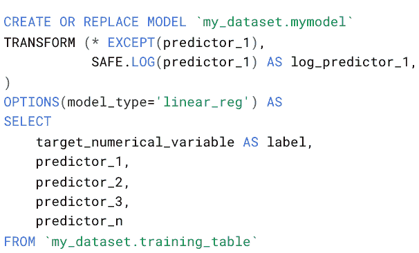
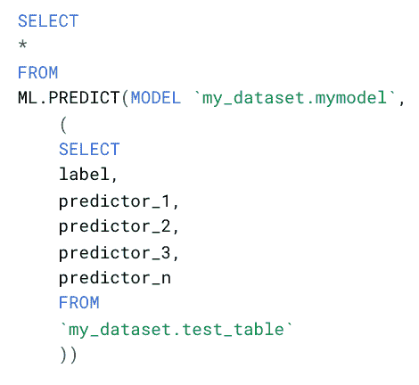
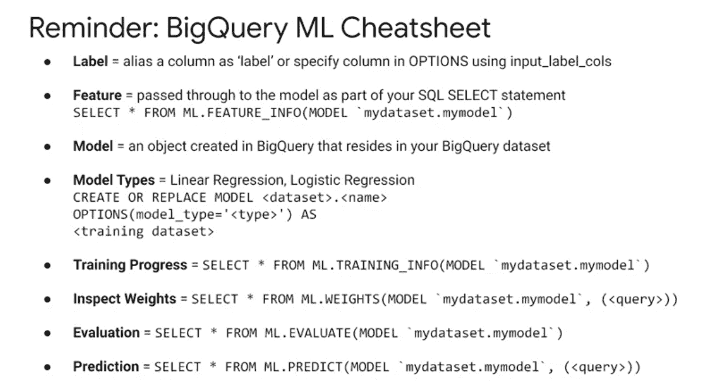

# BigQuery ML 简介

> 原文：<https://medium.com/nerd-for-tech/introduction-of-bigquery-ml-92ddff190cb0?source=collection_archive---------2----------------------->

## 快速介绍如何使用 BigQuery ML 快速测试和透视机器学习预测。艾伦·科勒

在 [Unsplash](https://unsplash.com/s/photos/machine-learning?utm_source=unsplash&utm_medium=referral&utm_content=creditCopyText) 上由[h·海尔林](https://unsplash.com/@heyerlein?utm_source=unsplash&utm_medium=referral&utm_content=creditCopyText)拍摄的照片

在这篇博文中，我将介绍 BigQuery ML。读者应该已经对机器学习有了基本的了解，才能完全理解所有的概念。需要的话可以在这个[链接](https://developers.google.com/machine-learning/crash-course)上找到不错的 ML 速成班。

BigQuery ML 是 BigQuery 中的一个内置工具，它允许数据分析师使用来自数据仓库中已有的任何结构化数据集的数据，并通过舒适地使用类似 SQL 的命令，快速测试和执行机器学习模型。该工具的最大优势在于，将数据集导出到不同的位置需要花费宝贵的时间，并且不需要了解更高级的编程语言(如 Python 或 Java)来设置模型。

目前支持的内置模型类型有线性和逻辑回归、用于数据分割的 k 均值聚类、用于开发推荐引擎的矩阵分解、时间序列和 XGBoost(一个开源的正则化梯度增强框架，有关它的更多信息，请查看此[链接](https://en.wikipedia.org/wiki/XGBoost))。此外，还可以使用顶点 AI AutoML 表工具的外部连接，并导入自定义张量流模型。

在这篇博文的下一部分，我将介绍建立模型、评估模型以及使用模型进行动态预测的过程。此外，我还将概述这个工具集的定价结构。

照片由 [Pietro Jeng](https://unsplash.com/photos/n6B49lTx7NM) 在 [Unsplash](https://unsplash.com/s/photos/machine-learning?utm_source=unsplash&utm_medium=referral&utm_content=creditCopyText) 上拍摄

# A 部分—创建一个大查询 ML 模型

要使用 BigQuery ML，您需要创建一个训练表，其中包含您打算用于目标和特性的所有列。之后，您可以使用“创建或替换模型”语句在目标数据集中创建模型。

通过“变换”语句，您可以使用标准变换(如“对数变换”、“绝对变换”或“AVG 变换”)手动预处理您的要素。可以应用“ML。QUANTILE_BUCKETIZE "将一个特征划分为多个区间，" ML。FEATURE_CROSS”来创建一个交互特征变量或“ML。多项式 _ 展开”来创建高阶多项式特征。您还可以使用“ML”来缩放您的要素。最小最大缩放器”或标准化版本“ML。标准 _ 缩放器”。手动预处理 ML 函数的完整指南可以在[这里](https://cloud.google.com/bigquery-ml/docs/reference/standard-sql/bigqueryml-preprocessing-functions#mlfeature_cross)找到。

使用“选项”语句，您必须指定要使用的模型类型，以及最终的其他设置，如要执行的迭代次数和一些超参数调整设置，如优化算法、学习率以及 L1 和 L2 正则化的值。在“选项”语句中可以使用的参数的完整列表可以在[这里](https://cloud.google.com/bigquery-ml/docs/reference/standard-sql/bigqueryml-syntax-create)找到。

然后，您需要用标准 SQL 指定您的训练数据集。需要注意的是，目标变量需要被命名为“AS label ”,以便 BigQuery ML 可以将它识别为目标列。

在下图中，您可以看到创建 ML 模型的 SQL 命令摘要。当您运行查询时，模型将被定型。根据数据集的大小，计算训练时间可能需要几分钟到几个小时。

# B 部分—评估 BigQuery ML 模型并将其用于预测

要获得关于训练的一些统计数据，可以使用语句“ML。培训 _ 信息”。特别是，它将检索一个表，其中包含迭代次数和损失函数的改进以及每一步的处理持续时间(以毫秒为单位)。你可以在这里找到关于这个声明[的更多信息。](https://cloud.google.com/bigquery-ml/docs/reference/standard-sql/bigqueryml-syntax-train)

带着“ML。FEATURE_INFO "语句可以查看数据集中要素的描述性静态数据。它包括每个特征的数据点计数、最小值、最大值、平均值和标准偏差。重量“ML。“权重”可用于在训练过程完成后评估每个特征的权重。

用“ML。评估“你可以评估你的模型。在线性回归的情况下，它将检索 MAE、MSE、RMSE、R 平方得分和解释方差。在逻辑回归或多类回归的情况下，它将检索精确度、准确度、F1 得分、对数损失和 ROC AUC 指标。点击此[链接](https://cloud.google.com/bigquery-ml/docs/reference/standard-sql/bigqueryml-syntax-evaluate)可了解评估模型的更多信息。

您不需要担心在单独的流程中部署您的模型，因为它可以通过使用“ML”直接在 BigQuery 中自动提供预测。预测”语句。下图总结了对测试数据集(具有与训练数据集中相同的要素列，但数据行不同)进行预测的查询语法。

# 定价

为训练和创建内置模型而处理的前 10 GB 查询是免费的。这一配额不适用于外部进口的型号。之后，您将为每 TB 数据支付 250 美元以创建内置模型，并为每 TB 数据支付 5 美元以评估、检查和预测结果。对于 Vertex AI 上外部生成的模型，您将为每 TB 支付 5 美元。高容量用户和大公司也可以选择每月固定费率的 BigQuery 订阅。你可以在这里找到更多关于 BigQuery ML 定价结构[的信息。](https://cloud.google.com/bigquery-ml/pricing)

# 结论

在这篇博文中，简单介绍了 BigQuery ML。为了在实践中使用它，你可以在下面截图中的备忘单上找到总结的步骤。

照片由 [Coursera](https://www.coursera.org/learn/smart-analytics-machine-learning-ai-gcp?specialization=gcp-data-engineering#syllabus) 拍摄

如前所述，BigQuery ML 是一个非常好的工具，可以从已经存储在 BigQuery 中的数据集中快速测试和分析 ML 方法。然而，通常很难获得非常准确的预测并适当地调整模型。如果需要更先进的 ML 解决方案，通常最好将工作分配给专业的机器学习工程师或着手开发定制模型，例如使用 Python 包，如 [Tensorflow](https://www.tensorflow.org/) 、 [ScikitLearn](https://scikit-learn.org/stable/) 或 [Pycaret](https://pycaret.org/) 。其他机器学习策略可能会在 datadice 的未来博客文章中发布。

# 更多链接

这篇文章是我们在 [datadice](https://www.datadice.io/) 的[数据学校](https://medium.com/data-school)的新谷歌云系列的一部分。我们将分享我们通过多年创建数据解决方案而获得的最佳见解。

如果你想了解更多关于如何使用 Google Data Studio 并结合 BigQuery 更上一层楼，请查看我们的 Udemy 课程[这里](https://www.udemy.com/course/bigquery-data-studio-grundlagen/?referralCode=49926397EAA98EEE3F48)。

如果您正在寻求帮助，以建立一个现代化的、经济高效的数据仓库或分析仪表板，请发送电子邮件至 hello@datadice.io，我们将安排一次通话。