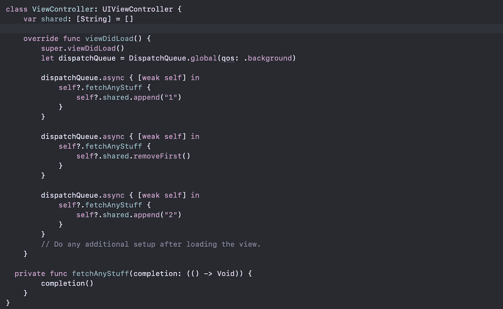
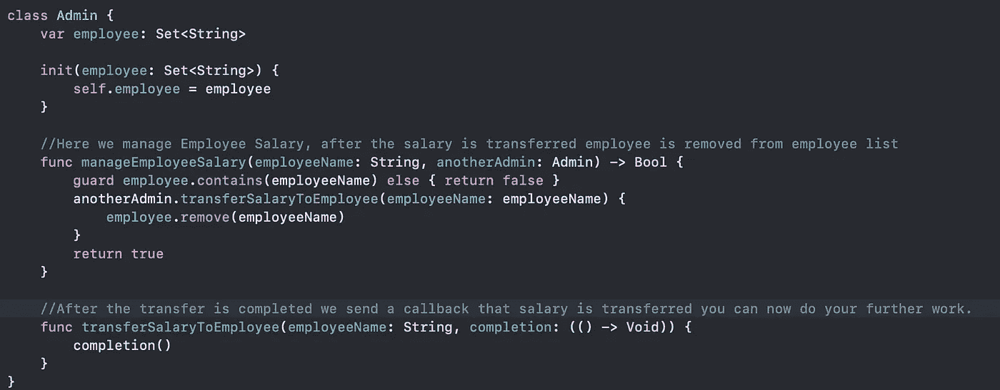
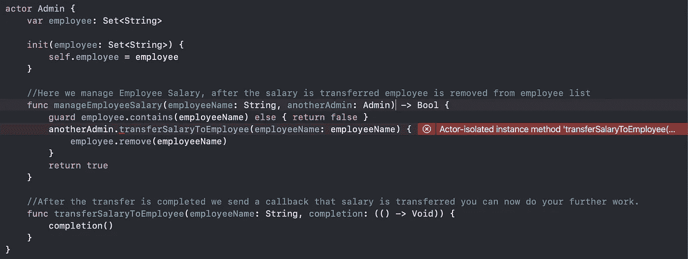
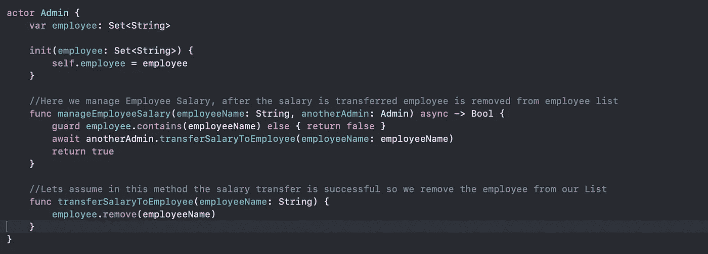

# Swift 中的演员简介。

> 原文：<https://medium.com/nerd-for-tech/introduction-to-actors-in-swift-93c7bb9ec1b7?source=collection_archive---------11----------------------->

在本文中，我们将讨论 swift 5.5 中新发布的 Actors。

并发是任何移动开发平台的主要部分，我们在应用程序生命周期的几乎每个阶段都使用并发任务。例如，在我们收到来自 API 的响应后更新 UI，或者在任何指定任务完成后更新模型，等等。

从开发人员的角度来谈并发性，必须提到队列。队列是闭包，根据它们的顺序在不同的合适的线程上工作。如果在并发后部署在多个线程上，队列遵循(FIFO)。

让我们来谈谈我们的队列类型。
队列可以分为两种基本类型。

**排队类型:**

1.  串行队列:串行队列按顺序工作。它从队列中取出第一个任务，开始处理它，对它进行操作，直到它完成执行，然后只选择新的任务。
2.  并发队列:像串行队列一样，它也从队列中取出第一个任务，并在任何可用的线程中启动它的执行。
    如果系统看到它可以访问更多的线程，它会从队列中取出其他任务，并在另一个线程上启动它们，而不等待第一个执行完成。类似地，它可以处理队列中任意数量的任务。

**并发方式:**

使用队列时，有两种类型的方法可用

1.  Sync:在阻塞整个队列的特定任务的整个执行完成后，将控制返回到当前队列。
2.  Async:在启动一个特定任务后，立即将控制返回到当前队列，而不等待它结束，因此它永远不会阻塞整个队列。

现在，我们已经大致讨论了并发性。假设我们有一个共享的引用在并发任务下工作，比如更新一个字符串数组。让我们来看一个用传统方法做这件事的例子。

在这个例子中，我们可以看到共享字符串数组被多个试图更新它的线程共享。
我们无法保证哪个线程将首先完成获取并落入完成块。
假设我们的第二个任务首先完成，在它完成后，我们试图从第一个位置删除一个元素，而目前我们在第一个位置没有元素，所以我们可以预期这里会崩溃。
或者，如果我们正在执行另一个任务，我们可以有一个竞争条件。

***数据竞争让并发变得困难。当我们有多个线程访问/修改相同的数据时，就会发生这种情况。***

例如，我们可以使用像结构这样的值类型来避免数据竞争

虽然现在我们的代码是安全的，但行为是不正确的。

这就是演员的用武之地。在运行代码示例之前，让我们讨论一下 Actors 的一些主要特性。

# **演员:**

概念上类似于类。在并发环境中使用是安全的，因为 Swift 确保了在任何给定的时间内，actor 中的可变状态只能被一个线程访问，这有助于消除编译器级别的各种严重错误。

1.  使用新的`**actor**`关键字创建演员。这是 Swift 中一个新的具体的名义类型，连接结构、类和枚举。
2.  参与者是引用类型。
3.  Actor 隔离数据。

让我们以一个执行并发代码的类为例。这段代码在单线程环境中运行完全没问题，但是如果这段代码在多线程环境中执行，我们将会遇到竞争情况。

让我们假设在多线程环境中，两个线程同时执行 **manageEmployeeSalary** 方法。我们两个线程都将把工资转给同一个雇员。

那肯定对员工有利，但对公司不利。

让我们通过演员来考虑这个问题。

这里所发生的是演员之外的另一个管理员试图在我们的第一个管理员的业务中做一些修改。我们的编译器立刻给出一个错误“嘿，你不能在 actor 之外做这个，除非你等待当前任务完成，然后你才能做。”
现在我们知道我们不能有竞争条件，因为我们的编译器不允许多个线程同时访问一个资源。
**多酷啊？**

那么如何才能解决这个问题呢？？

嗯，我们必须使用 await 关键字等待一个特定的工资转移完成，然后只有我们可以将工资转移给任何其他员工。
我们确保工资已转账，并根据结果从员工名单中删除该员工。
这样我们就不会把工资两次转给一个员工。

所以现在我们的共享资源*雇员*永远不能同时在不同的线程中被修改。

**演员确保一次只修改一次。**

*对不起员工没好日子过了。*

在这个例子中有几件事需要注意。

1.  演员是使用新的“演员”关键字创建的
2.  **manageEmployeeSalary** 方法被标记为 **async** ，因为它在等待传输完成时需要暂停工作。
3.  尽管**transfersalary to employee**方法是*而不是*标记的`**async**`，我们仍然需要称它为`**await**`，因为它将等待另一个管理角色能够处理该请求。

Actor 和 class 都是引用类型，但是 actor 是安全的共享状态，不像 class。除了类可以被继承之外，它们在每个方面都是相同的。

@MainActor 是确保您的代码在主线程上运行的新关键字。此外，如果我们想确保在主线程上保存数据，也可以这样做。

我想我们现在对演员如何工作以及何时可以使用他们有了一个基本的概念。这篇文章到此为止。如果您有任何问题，请告诉我！

编码快乐！
T2【Sheeraz Ahmed】