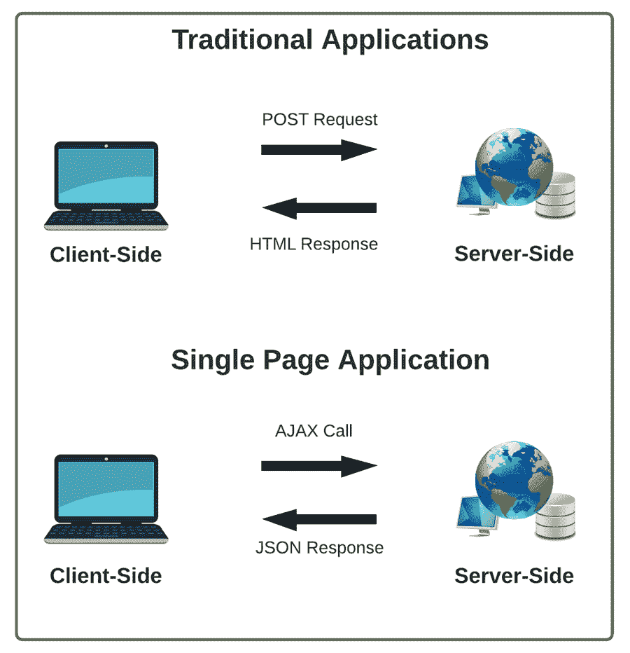
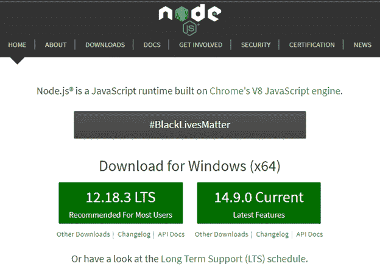

# 角度介绍

> 原文：<https://medium.com/nerd-for-tech/introduction-to-angular-64138b69c079?source=collection_archive---------20----------------------->


Web 开发是一个动态的领域，时不时地发布更新和更改是一种常见的现象。事实上，我们可以有把握地说，今天遵循的方法和框架与十年前完全不同。

现在让我们停下来想一想，为什么这个领域会发生如此巨大的变化？大多数专家也会说同样的话“为了迎合更好的用户体验”。为了实现这一点，他们声称应用程序必须是轻量级的，并且应该能够轻松地处理大量数据。不仅如此，对于开发者来说，它必须易于开发和维护。

在这篇博客中，我们将详细讨论 web 开发领域中的一个变化——一个叫做 Angular 的现代 web 开发框架。我们还将看到如何使用它创建一个示例项目。

**目录**

1.  **棱角分明的简介**
2.  什么是单页应用程序？
3.  角度特征
4.  使用 Angular 创建一个示例应用程序
5.  包扎

# 角度介绍

Angular 是一个基于 JavaScript 的开源框架，用于构建客户端动态 web 应用程序。它是由谷歌在 2012 年推出的。

angular 框架可用于开发单页面应用程序。Angular 代码是结构化的，有助于开发人员/用户轻松理解应用程序。此外，它支持各种平台，如移动、web 和桌面本地平台。

# 什么是单页应用程序(SPA)？

顾名思义，它只有一个页面来运行整个应用程序。它不需要重新加载整个浏览器内容，因为它在浏览器中工作。

考虑网站 [https://angular.io](https://angular.io) ，开始点击页面上可用的选项，在页面上导航，你会注意到点击选项时整个页面不会重新加载。当您在应用程序中导航时，只传递检索数据的请求。

一般来说，SPA 不完全依赖于服务器。它可以完全在客户端维护状态。此外，在传统的应用程序中，一旦用户访问页面并执行一些操作，整个页面就会根据服务器端的响应重新加载。



对于 SPA，在页面上执行任何类型的操作时，代码都会发出一个 AJAX 调用，响应以 JSON 数据的形式出现。需要在页面上显示的 UI 内容已经存在于客户端，而需要在页面上显示的数据将从服务器端检索。

# 角度特征

这里有一些棱角分明的关键特征

## 角度 CLI

angular 附带的命令行界面使得创建应用程序、创建/添加新组件变得更加容易，并且可以用来调试和部署它们。

在传统的应用程序中，在执行文档对象模型(DOM)操作时，需要更多的代码行来设计应用程序。但是在 Angular 的情况下，非常小的代码更改就足以操作 DOM。

## 单元测试

测试 angular 应用程序有助于检查应用程序的状态，并减少执行单元测试的时间。测试框架——Karma 由 Google 团队开发，用于测试 Angular 应用程序。

## 服务器端连接

Angular 可以与 node.js、.NET，PHP。这使得 angular 成为一个通用的客户端应用程序。

## MVC 架构

MVC 代表模型视图控制器。这是一种用于开发应用程序的架构模式。通常，开发人员可以按照 MVC 模式分割代码，并被要求连接相同的代码。但是在 Angular 中，如果开发人员分离应用程序，它会自己连接应用程序，这样可以节省大量时间。一般来说，应用程序所需的数据由模型管理，视图用于显示数据，控制器充当视图层和模型层之间的连接器。

## 数据绑定

在 Angular 中，视图层和数据层完全同步。视图层准确显示数据层。这有助于开发人员节省大量时间。

## 速度和性能

速度和性能是使 Angular 成为我们首选前端框架的另一个重要方面。Angular 应用程序的加载时间比许多其他前端框架快得多。此外，代码会根据用户的加载和呈现需求自动分离。

# 使用 Angular 创建示例应用程序

在这一节中，让我们看看如何使用 Angular 创建一个示例应用程序。

## 第一步

第一步是安装 Node.js，这将在您的计算机中启用 NPM(节点包管理器)。NPM 帮助安装和设置运行 Angular 项目所需的库。要安装 Node.js，请转到[https://nodejs.org/en/](https://nodejs.org/en/)，然后在本地机器上下载并安装 Node.js 的最新 LTS 版本。



## 第二步

一旦 Node.js 的设置完成，下一步就是安装 Angular CLI(命令行界面),我们将通过它创建应用程序、组件等。，为了我们的项目。要安装 Angular CLI，请打开命令提示符，并运行以下命令。

```
npm install -g @angular/cli
```


## 第三步

下一步是创建我们的应用程序。为此，请从命令提示符窗口运行下面的命令。在运行该命令之前，更改您选择的目录，然后运行它。将在触发该命令的目录中创建应用程序。

```
ng new my-application-name
```


我的应用程序名称可以替换为您的应用程序的名称。执行该命令后，将提示用户选择是否需要角度路由，选择后，将要求用户选择样式表的类型。请参考上图。

## 第四步

现在，应用程序被创建并存储在本地机器中。要进行角度应用，需要 ide。市场上有很多 ide 可以用来开发基于角度的应用。在本文中，我们使用的是 MS Visual Studio 代码。在 Visual studio 代码中，打开包含 angular 应用程序的文件夹。


# 包扎

angular 框架是一个强大且用户友好的框架，用于构建响应式 web 应用程序。Angular 的内置特性是这个框架成功的主要原因之一。

*原载于*[*https://www . partech . nl*](https://www.partech.nl/nl/publicaties/2020/09/introduction-to-angular)*。*