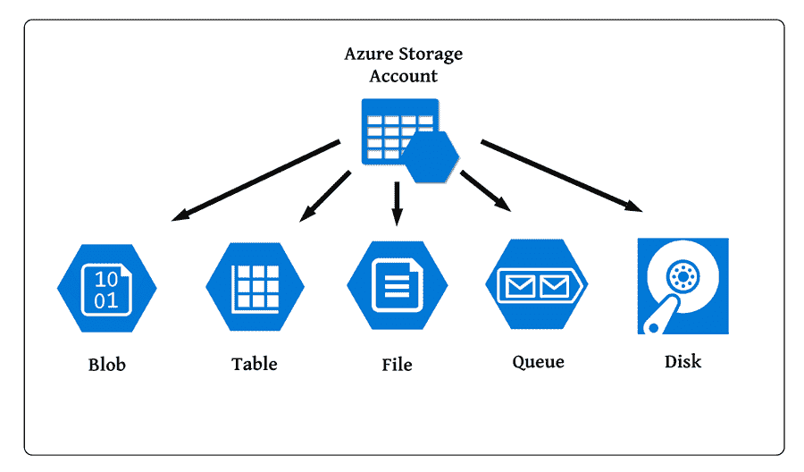

# Azure 存储帐户简介

> 原文：<https://medium.com/nerd-for-tech/introduction-to-azure-storage-account-8f94b99ee1ea?source=collection_archive---------18----------------------->

我们生活在数字化时代，企业正在寻找新的方法来降低成本，同时提高效率。像微软 Azure 这样的云服务就是这个概念的真实证明。

通用电气(General Electric)前首席执行官杰克韦尔奇(Jack Welch)曾引用“大公司最大的机遇来自内部流程的数字化”

我们将要讨论的是数字化商业保护伞下的东西——云存储。准确的说，我们要详细讨论的是微软的 Azure 存储账户。Azure Storage Account 是一款可扩展、经济高效且安全的云存储，适用于各种规模的组织。除了这些好处，我们还将在这篇文章中详细了解什么是 Azure 存储帐户及其类型。

**目录**

1.  **什么是 Azure 存储帐户？**
2.  Azure 存储相对于传统存储的优势
3.  存储帐户的类型
4.  总结

# 什么是 Azure 存储？

Azure Storage 是微软 Azure 提供的一种现收现付的存储服务。像任何其他基于云的存储服务一样，这项来自 Azure 之家的服务可以让你租用基于云的存储空间，而不需要任何 IT 基础设施。

微软 Azure 存储支持多种语言，例如。NET、Ruby、Java 等，允许开发人员使用它来满足他们的数据管理需求。Azure 存储帐户将被赋予一个唯一的名称空间，允许你在世界上的任何地方通过 HTTP 或 HTTPS 访问它。

# Azure 存储相对于传统存储的优势

以下是 Azure 存储的 4 大优势

## 数据安全

在我们生活的世界中，数据被视为组织最有价值的资产。因此，您必须将数据安全视为组织中的重中之重。这就是 Azure 存储的成功之处，因为所有数据在存储时都是加密的。Microsoft Azure Storage 还使用自动流量监控和分析，防止对其数据点的未经授权的访问。

## 用于存储大量数据

Microsoft Azure 存储可用于存储来自图像、视频、日志和配置文件的各种数据。它还可以存储整个组织中物联网设备的复杂数据。

这让你可以将 Azure 存储用于不止一个定义的目的。此外，所有存储的数据也可以从他们的高速服务器快速访问。

## 数据持久性和可用性

Microsoft Azure 拥有遍布全球 25 个国家的数据点，让您可以在易于访问的数据点之间进行选择。您还可以选择复制数据并将副本存储在不同的位置，以确保在紧急情况下进行数据备份。

Azure 的服务器非常高效，停机时间最小，为您提供高可用性和高效的数据可访问性。

## 高效的可扩展性

如前所述，Azure 存储采用按需付费模式。您可以根据工作负载或网络流量升级或降级您的计划。Azure storage 也是真正的自动扩展服务提供商之一，可以根据组织的需求自动增加或减少资源。

# 存储帐户的类型

从广义上来说，Azure 存储帐户低于两美元-

1.  一个是用文件存储开发的，考虑到通信，因为它可以被 REST API 访问。
2.  第二个是设计，牢记虚拟机(VM)。

通常有五种不同类型的存储，即队列、表、Blob、文件和磁盘。Azure 存储允许用户在相同的数据中心或位于另一个区域的数据中心内复制数据。这就转化为四级数据冗余。

1.  本地冗余存储:这是默认的复制选项，数据在单个数据中心内复制三次。
2.  区域冗余存储:这是本地冗余存储的增强版本。不同之处在于，数据在多个区域的数据中心之间复制。
3.  地理冗余存储:这存储两个不同的数据集。一组在同一区域复制，而第二组在相邻区域复制。
4.  读取访问地理冗余存储:它类似于地理冗余存储。然而，其中存储了 2 个不同的数据集，并且第二组副本是可读的。

Microsoft Azure 还提供了三层存储，允许您选择成本和需求之间的平衡。这三种类型是热、冷和存档。

现在，我们来详细了解一下每种存储类型。

## Blob 类型存储

二进制大对象(Blob)存储通常用于图像、视频和文本等非结构化形式的数据。这里存储的数据不需要满足任何特定的标准。它进一步分为 3 种类型

Block blob:这是在 blob 存储中存储数据的最便宜和最简单的方法。当你存储一个文件时，它把它存储在一起。这种模式的缺点是，如果需要任何更改，它需要完全重新上传。

页面 blob:页面 blob 是微软 Azure 虚拟机产品的基础架构。页面 blobs 主要用于存储虚拟机磁盘的映像。

追加 blob:追加 blob 用于存储需要频繁更新的日志。

## 表型存储

表存储可用于在 Azure 存储网络中存储结构化和非关系数据。这比其他类型的存储更便宜，可以被视为 Microsoft Azure SQL 的替代方案。简而言之，表存储用于在微软 Azure 的云中存储结构和 NoSQL 数据。

Azure 的表存储帐户包含所有的表，每个表包含称为实体的数据点。实体由属性组成，每个实体都类似于数据库中的行。每个实体可以大到 1 MB，在单个系统中有多达 252 个属性

Azure Table Storage 对开发人员很有帮助，因为它允许他们以相对较低的存储成本存储万亿字节的数据。但是从表存储中访问文件的开销很大，这对于具有逻辑或服务器端连接的数据来说是一个糟糕的选择。

## 天蓝色储物盒

存储队列用于您的服务需要相互通信的情况。这种存储类型充当两个服务之间的中介或缓冲。

简而言之，Azure 存储队列提供了一种容错机制，在这种机制下，由于长时间的处理会导致数据丢失。如果其中一个服务器出现故障，另一个服务可以将该数据插入到存储队列中，直到它恢复在线。

## Azure 磁盘存储

本质上，Azure 磁盘存储类似于你个人电脑上的磁盘存储。它允许您为虚拟机创建磁盘，并且只允许来自该虚拟机的访问。Microsoft Azure 存储允许两种不同类型的磁盘和磁盘存储管理模式-

*   便宜但速度慢的硬盘
*   SDD 的车很快，但是很贵

## Azure 文件系统存储

Microsoft Azure 文件存储用于支持 Microsoft Azure 虚拟机。文件存储类型允许您存储和访问来自不同虚拟机的文件。这是 Microsoft Azure 中文件存储类型的主要用途之一。

# 总结

微软 Azure Storage 是一项强大的服务，可用于多种用途。如果您希望选择基于云的存储平台来满足您未来的 IT 需求，Microsoft Azure 存储会是一个很好的选择，因为它有许多好处。

*原载于*[*https://www . partech . nl*](https://www.partech.nl/nl/publicaties/2020/10/introduction-to-azure-storage-account)*。*