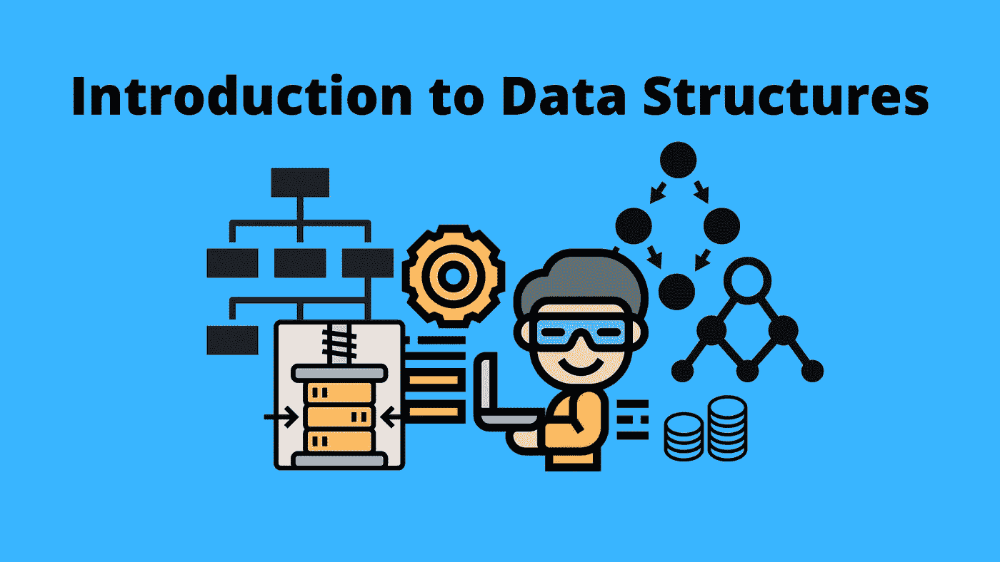
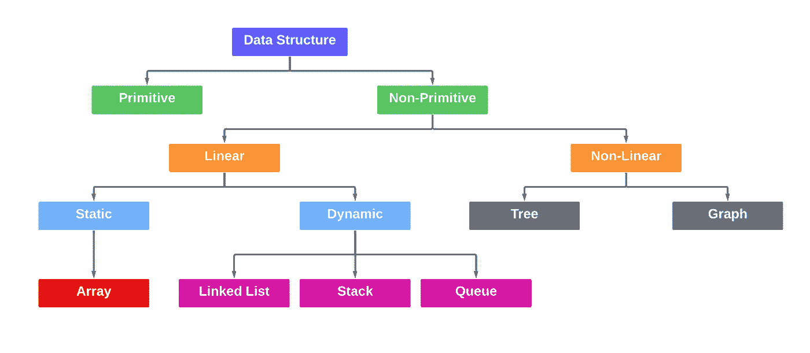

# 数据结构介绍

> 原文：<https://medium.com/nerd-for-tech/introduction-to-data-structures-dc3f38c276ca?source=collection_archive---------0----------------------->

作者照片

读者你好！

这是数据结构文章系列的第一篇文章。通过这篇文章，我希望为你作为初学者必须要知道的数据结构这个话题打下基础。我们开始吧！

**什么是数据结构？**

简单地说，数据结构是一种组织数据的方式，以便可以有效地使用它。通过以某种方式组织数据，以后可以快速方便地访问、查询甚至更新数据。

据此，在内存中有许多组织数据的方法。这些是数组、链表、栈、队列、树和图等。我稍后会解释所有这些事情。

另一件重要的事情是，数据结构不是一种编程语言，它是一套算法，我们可以在任何编程语言中使用，以结构化内存中的数据。

**什么是抽象数据类型，它和数据结构有什么不同？**

抽象数据类型是数据结构的抽象，它只提供数据结构必须遵循的接口。该接口没有给出具体数据结构应该如何实现或者用什么编程语言实现的任何具体细节。

**举例**:假设你的*抽象数据类型*是针对从 A 点到 b 点的一种交通方式，从一个地方到另一个地方有很多交通方式。一些特定的交通方式可能是步行、骑自行车，甚至可能是坐火车，等等，这些特定的交通方式类似于*数据结构*本身。我们想通过某种运输方式从一个地方到另一个地方，这是我们的抽象数据类型。我们是怎么做到的？这就是数据结构。

**为什么是数据结构？**

*   数据结构是创建快速而强大的算法的基本要素。
*   它们帮助我们以一种非常自然的方式管理和组织我们的数据，并允许有效地存储数据，从而节省磁盘空间。
*   数据结构允许多个数据处理请求。这意味着它们允许多个用户同时处理、访问和修改数据。
*   它们使代码更干净，更容易理解。

**数据结构的优势是什么？**

**数据组织—** 我们需要一种适当安排数据的技术，以便在需要时可以快速访问。DS 提供了多种数据组织选项，允许我们根据需要以多种数据结构存储数据。

**效率—** 数据组织的主要目的是提高效率。即使我们可以将数据存储在数组中，为什么我们还需要链表和其他数据结构？因为当我们需要对数组执行多个操作时，比如添加、删除、更新和搜索，数组比其他数据结构花费的时间要长得多。因此，我们对各种数据结构感兴趣是因为它们的效率。

**可重用性—** 可以重用一个数据结构。数据结构一旦实现，就可以在以后重用。

**抽象—** 数据结构对用户隐藏(抽象)了实现细节。用户通过界面与数据交互，并受益于数据结构；然而，用户不知道重要的实现细节。

**数据结构分类**

数据结构的分类

数据结构可以分为两大类。

*   原始数据结构
*   非原始数据结构

原始数据结构是原始数据类型。例如，int、float、char、double 和 pointer 是基本的数据结构。它们只有一个值。根据数据的排列，非原语数据结构分为两种类型。

*   线性数据结构
*   非线性数据结构

当一个数据结构的所有元素按顺序排列(线性)时，我们称之为线性数据结构。线性数据结构的元素以非分层的方式存储，除了第一个和最后一个元素之外，每个元素都有后继元素和前趋元素。非线性数据结构没有序列。每个元素都与两个或更多其他项目相关联。

线性数据结构可以分为两种类型。

*   静态数据结构
*   动态数据结构

在静态数据结构中，大小在编译时分配，而在动态数据结构中，大小在运行时分配。因此，静态数据结构中的最大大小是固定的，而动态数据结构中的最大大小是灵活的。

静态数据结构的类型:

*   数组

**数组** —数组是相似类型的数据元素的集合，每个数据元素被称为数组的一个元素。元素的数据类型可以是任何有效的数据类型，如 char、int、float 或 double。数组的所有元素都有相同的变量名，但是每个元素都有不同的下标数字(索引)。一维、二维或多维数组都是可能的。

动态数据结构可以分为三种类型。

*   链接列表
*   大量
*   行列

**链表** —链表是一种线性数据结构，用于跟踪内存中的列表。它是存储在非连续内存位置的节点集合。列表中的每个节点都有一个指向其旁边节点的指针。

**堆栈** —堆栈是一个只有一端的线性列表，称为顶部，允许插入和删除。堆栈是一种抽象数据类型(ADT ),可以在各种编程语言中使用。堆栈遵循后进先出(LIFO)方法来存储数据项。它的行为类似于真实世界的堆栈。例子:一堆书或盘子。

**队列** —队列是一个线性列表，其中的元素只能在一端插入，称为后端，在另一端删除，称为前端。这是一种类似于堆栈的数据结构。因为队列两端都是开放的，所以数据项使用先入先出(FIFO)方法存储。

非线性数据结构分为两种类型。

*   树
*   图表

**树** —树是包含节点的多级数据结构，节点之间具有层次关系。叶节点位于分层树的底部，而根节点位于顶部。每个节点都有指向其他节点的指针。节点之间的父子关系是树形数据结构的基础。除了叶节点，树中的每个节点都可以有几个子节点，尽管除了根节点，每个节点只能有一个父节点。

**图形** —图形可以定义为由边连接的元素集合的图形表示。图不同于树，因为图可以有圈，而树没有圈。

没错。

我们已经到了文章的结尾，这只是对数据结构的介绍。我将在数据结构文章系列的后续文章中讨论我上面提到的所有数据结构类型。希望你有重要的东西！让我们下一篇文章早日见面，保持联系！

