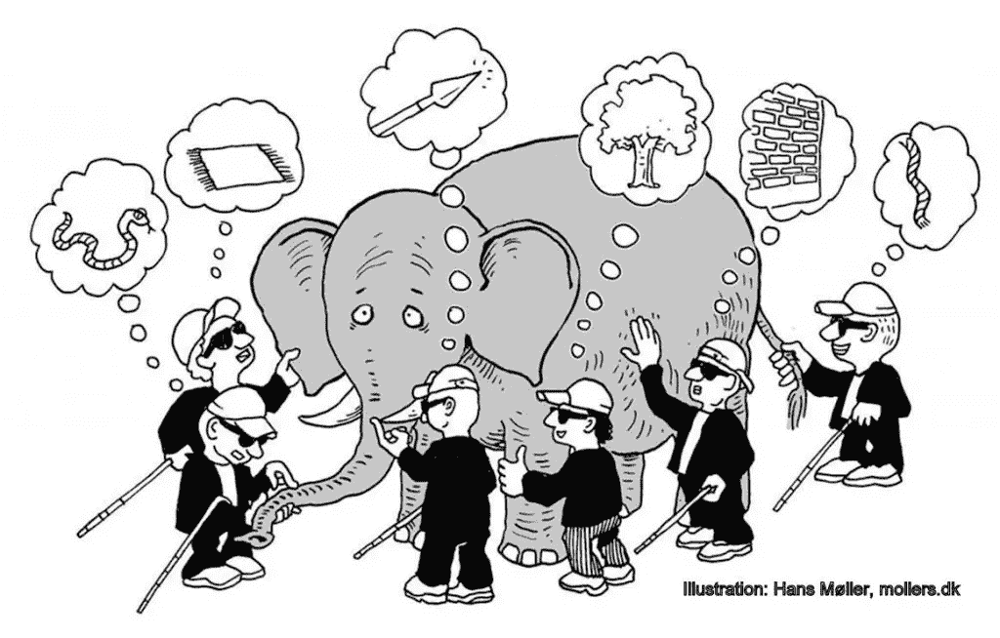
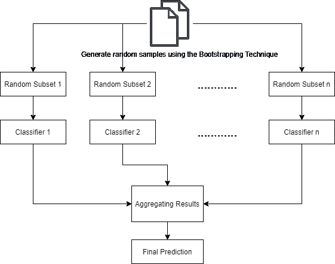
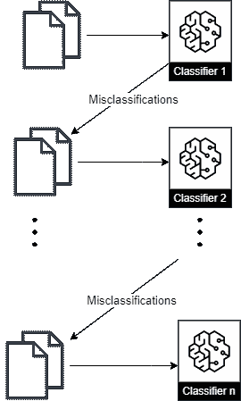
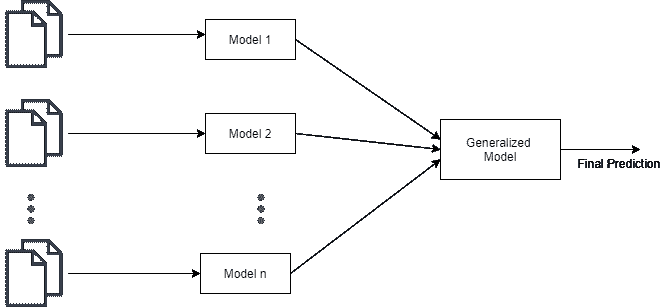

# 集合方法介绍

> 原文：<https://medium.com/nerd-for-tech/introduction-to-ensemble-methods-e81fd6f8180b?source=collection_archive---------19----------------------->

来源:[盲人摸象](https://enfocussolutions.com/the-six-blind-men-and-the-requirements-part-one/)

如果你已经在数据科学领域呆了相当长的时间，你应该已经意识到集合技术是赢得 Kaggle 竞赛的核心策略之一。

2006 年网飞奖的故事是人工智能民间传说中改变游戏规则的故事之一。获胜的参赛作品使用合奏技术赢得了百万美元的奖金。

在我们继续探讨合奏技巧之前，让我们先来看看“群体智慧”这个概念。

群体的智慧是詹姆斯·苏洛维耶茨基在他的书《群体的智慧》中推广的集体智慧思想。

这个概念是这样运作的:
来自一个大的多样化群体的个人的平均猜测可能比来自专家的猜测更准确。很难相信，但结果相当有希望。群体行为的确是一种迷人的现象。

人群的主要属性包括:
1。群众意见不一。
2。每个人都有自己独立的观点，不受任何外部影响。人群中的每个人都根据他们个人的知识发表自己的意见。
4。个人意见可以合并成一个集体判断

这个概念的一些应用包括:
*1。预测市场*
在世界上最大的预测交易市场——都柏林的 Paddy Power Betfair 内，事件的结果是根据人们认为事件发生的概率进行交易的！

*2。德尔菲预测法:*
最初问题是分配给一群专家的。这是一个迭代过程，每个专家返回他们最初的预测和推理，这些预测和推理被汇编成一个汇总反馈。这个过程一直持续到获得令人满意的估计水平。通过汇总专家的预测来估计最终预测。

*3。人类群集*
实时系统考虑到群体行为，使用反馈循环从较小的人群中获得更准确的结果

生活就是我们做出的一系列决定。当我们试图在不熟悉的领域做出决定时，我们很自然会寻求建议。在我们做出最终决定之前，我们会询问我们信任的人的意见，并获得他们的集体意见。回到机器学习领域，我们可以应用相同的概念。让我们看看 ML 模型如何利用同样的想法来做出更好的预测。

让我们来看看一些简单的集成技术:
假设你开发了一个新产品，想了解它在市场上的表现如何。最直观的方法是在目标客户群中分发产品，并获得客户评级。

类似地，对于 ML 问题，我们生成多个预测模型。它们可以是同一数据上的不同模型，也可以是数据集的不同子样本上的相同模型。

1.**平均**:我们将所有客户的评分进行平均，以了解产品在市场上的表现。

同样，我们创建多个机器学习模型，并对所有模型的预测进行平均，然后做出最终预测。我们可以在回归的情况下计算平均值，在分类问题的情况下计算概率。

2.**加权平均** :
我们根据年龄、性别或需求等各种因素对目标客户进行分组，每个组的意见根据其重要性被赋予不同的权重。

类似地，基于每个模型对于预测的重要性，所有机器学习模型被分配不同的权重。

3.**最大投票** :
我们简单考虑频率最高的收视率，即收视率的模式。

它主要用于分类问题。来自每个模型的预测被认为是投票，并且由大多数模型投票的预测被认为是最终预测。我们可以根据问题使用不同的投票方案(硬投票/软投票)。

并不是所有的问题都可以用上面的简单技巧解决。因此引入了先进的集成技术来解决这类问题。集成方法背后的主要思想是使用多个模型并结合它们的结果来提高模型的性能或至少降低风险。

**多样性的要求:**
为了让这种集体策略发挥作用，很明显，所有的模型在某些方面必须是不同的，这样各个模型就不会产生相同的错误。这可以通过多种方式实现。

1.  **Bagging**(Bootstrap Aggregating):
    Bootstrap 是一种随机样本生成过程，它对单个数据集进行重新采样，以创建许多模拟样本。其思想是使用这些由自举技术产生的随机样本来构造不同的分类器。我们可以使用相同数据的不同样本或数据集的不同属性来生成不同的分类器。
    步骤:
    1。使用自举技术创建数据集的多个随机子集
    2。并行地为每个随机子集独立构建基础模型
    3。来自所有模型的预测被组合起来给出最终结果

Bagging 集成技术

*直觉:*
假设你要做一个巨大的决策，请来了一群领域专家给个建议。
每位专家都被给予同样的问题，并被要求独立解决问题。随后，所有专家召开会议，讨论各自的解决方案，并提出最终的最佳解决方案。

装袋算法的一个例子是[随机森林](https://scikit-learn.org/stable/modules/generated/sklearn.ensemble.RandomForestClassifier.html)。

2.**提升**
这是一个连续的迭代过程，其中下一个分类器从上一个分类器所犯的错误/误分类中学习。它使被当前模型错误分类的数据样本变得更加重要，以便下一个模型试图找出它们被错误分类的原因，并使模型更加高效。
步骤:
1。创建整个数据集的子集
2。基本模型建立在子集
3 的基础上。基础模型用于对整个数据集进行预测
4。错误分类的预测被赋予更高的权重
5。构建下一个模型，纠正上一个模型的错误

助推集成技术

*直觉:*
继续前面的用例，
第一个专家开发出一个解决方案，并将其传递给下一个专家。下一位专家查看解决方案，进行必要的修改和更正，并将其传递给下一位专家。这一过程一直持续到更新的解决方案到达最终专家处，并呈现出最终的解决方案。

增强算法的例子是 [AdaBoost](https://scikit-learn.org/stable/modules/generated/sklearn.ensemble.AdaBoostClassifier.html) 。

**3。堆叠**
堆叠使用来自多个模型的预测来构建新模型。
步骤:
1 .不同的基础模型并行独立地建立在同一个数据集上
2。基于基本级别模型的输出预测训练元模型作为特征
3。这个元模型用于进行最终预测

堆积系综技术

*直觉:*
继续同一个用例，每个专家开发他们自己的解决方案。完成所有解决方案后，将它们收集起来并发送给主管/首席专家进行审查。领导/负责人做出最终决定。

堆叠算法的例子是 [StackingClassifier](https://scikit-learn.org/stable/modules/generated/sklearn.ensemble.StackingClassifier.html) 。

集成方法是提高机器学习模型预测性能的一些强大方法。所以下次你尝试一个问题时，不要忘记利用这些集成技术来成倍地提高你的模型性能。

快乐学习！！