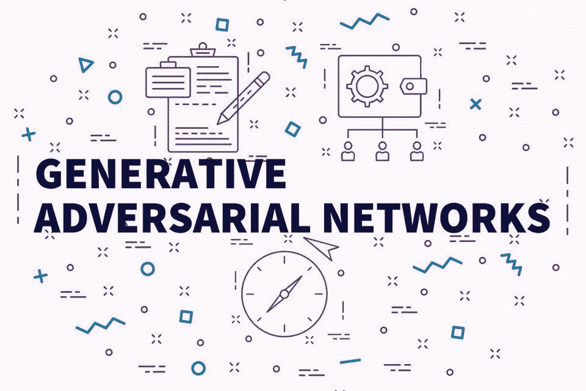
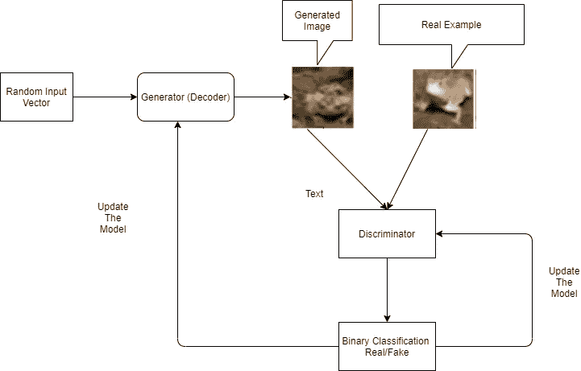
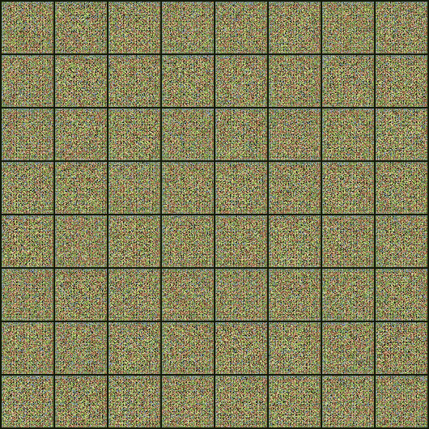

# 使用 Pytorch 的生成对抗网络简介:BollyGAN

> 原文：<https://medium.com/nerd-for-tech/introduction-to-generative-adversarial-networks-using-pytorch-bollygan-31554ead4653?source=collection_archive---------11----------------------->

来源:[https://www . Forbes . com/sites/Bernard marr/2019/06/12/artificial-intelligence-explained-what-are-generative-adversarial-networks-gans/？sh=75e189467e00](https://www.forbes.com/sites/bernardmarr/2019/06/12/artificial-intelligence-explained-what-are-generative-adversarial-networks-gans/?sh=75e189467e00)

> *“生成对抗网络是过去 10 年机器学习中最有趣的想法。”*——**脸书人工智能研究中心主任扬·勒村**

# 介绍

听说过****假戏真做！！!"*** ？*

*生成式深度学习模型正是这样做的，但需要数学、统计和数据的帮助。它通过学习潜在变量来工作，潜在变量是负责生成输入数据的变量，然后使用该潜在空间来生成合成数据。*

*基本上，生成建模是深度学习中的一项无监督学习任务，涉及到对给定的输入，模型学习组成该输入的变量的概率分布，并生成新的东西——类似于输入或新的合成输出。*

*生成式深度学习模型已经被广泛应用于各种应用中，从 LSTM 的语言合成到谷歌的 DeepDream 算法，再到执行神经类型转移，再到生成 DeepFakes 和新的数据集管理。*

## *生成对抗网络*

*GANs 是生成式深度学习模型的一个子集，由 [Goodfellow 等人](https://arxiv.org/abs/1406.2661)于 2014 年推出，作为 VAEs ( [变分自动编码器](https://arxiv.org/abs/1906.02691))的替代方案，用于学习图像的潜在空间，通过强制生成的图像在统计上几乎无法与实际图像区分开来，从而可以构建相当真实的合成图像。*

## *生成性对抗性网络采取以下方法*

**

*生成器从随机潜在向量生成图像，而鉴别器试图区分真实图像和生成的图像。发电机已经被编程来欺骗鉴别器。*

*GAN 由两个神经网络组成，我喜欢称之为 Faker 和 Expert。造假者试图愚弄专家，而专家则努力报告骗局。*

*它们是:*

1.  ***生成器(Faker)** :使用给定的随机向量/矩阵作为输入，创建一个“假”或合成样本。*
2.  ***鉴别器(专家):**努力确定给定样本是“真的”(从训练数据中抽取)还是“假的”(由生成器生成)。*

*训练是并行进行的:我们训练鉴别器几个时期，然后训练生成器几个时期，等等。结果，生成器和鉴别器都提高了它们的性能。*

*然而，GANs 难以训练，并且对超参数、激活函数和正则化高度敏感。*

*在本教程中，我们将训练一个 GAN 来制作宝莱坞名人的面部图像。*

# ***博利根***

*我们将使用 [DC-GAN](https://pytorch.org/tutorials/beginner/dcgan_faces_tutorial.html) ，它是上述 GAN 的直接扩展，除了卷积和卷积转置层分别在鉴别器和生成器中明确使用。拉德福德等人在他们的研究[中首次定义了深度卷积生成对抗网络的无监督表示学习。](https://arxiv.org/abs/1511.06434)*

***数据集探索***

*我们将使用[宝莱坞名人面孔数据集](https://jovian.ai/outlink?url=https%3A%2F%2Fwww.kaggle.com%2Fsushilyadav1998%2Fbollywood-celeb-localized-face-dataset)，它由超过 8664 张裁剪后的宝莱坞名人面孔组成。请注意，生成式建模是一项无监督的学习任务，因此图像不需要任何标签。*

*我从 Kaggle [ [链接](/analytics-vidhya/how-to-fetch-kaggle-datasets-into-google-colab-ea682569851a) ]获取数据到 Google collab*

*为了将这个数据集加载到 PyTorch，我使用了来自`torchvision`的`ImageFolder`类。我还调整了图像的大小，将其裁剪为 64x64 像素，并用每个通道 0.5 的平均&标准偏差来归一化像素值。这样可以保证像素值在范围内，更便于训练鉴别器。我们还将创建一个数据加载器来批量加载数据。*

# *鉴别网络(识别假货)*

*使用卷积神经网络(CNN)为每个图像输出一个单一的数字输出。使用步幅 2 逐渐减小输出要素地图的大小。*

# *发电机网络(制造假货)*

*生成器的输入通常是向量或随机数矩阵(称为潜在张量)，用作生成图像的种子。生成器会将形状为`(64, 1, 1)`的潜在张量转换为形状为`3 x 28 x 28`的图像张量。为了实现这一点，我使用 PyTorch 的`ConvTranspose2d`层，它执行*转置卷积*(也称为*反卷积*)。*

*生成器的输出基本上是随机噪声，因为我们还没有训练它。*

# *甄别训练*

*由于鉴别器是二进制分类模型，我们可以使用二进制交叉熵损失函数来量化它能够区分真实图像和生成图像的程度。*

*训练鉴别者的步骤。*

*   *我们预计，如果图像是从真实数据集选择的，鉴别器将返回 1，如果是使用生成器网络生成的，鉴别器将返回 0。*
*   *我们首先传递一批真实图像，并计算损失，将目标标签设置为 1。*
*   *然后，我们将一批伪造照片(由生成器生成)输入到鉴别器中，并计算损失，目标标签设置为 0。*
*   *最后，我们组合两个损失，并利用总损失对鉴别器的权重执行梯度下降。*

*重要的是要注意，在训练鉴别器时，生成器模型的权重不会改变(opt d 只影响鉴别器)。参数())*

# *发电机培训*

*由于生成器的输出是图像，所以不清楚我们如何训练生成器。这就是我们应用一个非常聪明的技巧的地方:我们使用鉴别器作为损失函数的一部分。它是这样工作的:*

*   *我们使用生成器生成一批照片，然后将这些照片输入鉴别器。*
*   *我们通过将目标标签设置为 1 来计算损失，表示它们是真实的。我们这样做是因为生成器的目标是“欺骗”鉴别器。*
*   *我们使用损失来执行梯度下降，这包括改变生成器的权重，使其更好地生成逼真的图像，以便“欺骗”鉴别器。*

*为每批训练数据定义一个拟合函数，以一前一后地训练鉴别器和发生器。我们将利用 Adam 优化器以及一些额外的参数(测试版),这些参数已被证明在 GANs 中运行良好。我们还将保留一些样本生成的照片，以便定期检查。*

*训练 60 个时代，学习率 0.005*

# *结果*

**

*制作图像的模型训练*

*有时，尽管获得了高分图片，但是获得对应于噪声图像的干净图像变得困难。*

*为了减少这种情况，我们将采取以下措施:*

1.  *使用包含大量高质量图像的数据集。*
2.  *尝试使用超参数，如时期、学习率或批量大小。*

# *结论*

*最后，我想说 GAN 在机器/深度学习领域有巨大的潜力，我非常喜欢学习和执行 BollyGAN 的过程。*

*感谢平台[威风凛凛](http://jovian.ai/)。*

# *参考*

1.  *完整笔记本:【https://jovian.ai/rupshakr/bollywoodcelebfacegenrator-dcgan】T4*
2.  *dataset:[https://www . ka ggle . com/sushilyadav 1998/Bollywood-celebre-localized-face-dataset](https://www.kaggle.com/sushilyadav1998/bollywood-celeb-localized-face-dataset)*
3.  *DCGAN PyTorch 教程:[https://py torch . org/tutorials/初学者/dcgan_faces_tutorial.html](https://pytorch.org/tutorials/beginner/dcgan_faces_tutorial.html)*
4.  *用 PyTorch 深度学习:Zero to GANs by jovian . ai:[https://jovian . ai/learn/deep-Learning-with-py torch-Zero to GANs](https://jovian.ai/learn/deep-learning-with-pytorch-zero-to-gans)*