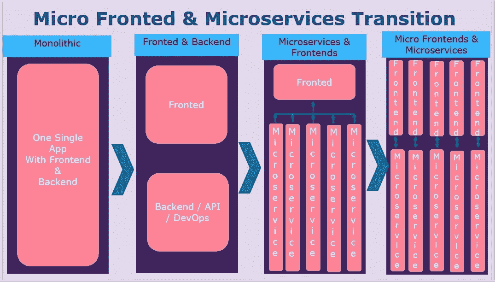

# 微前端架构简介

> 原文：<https://medium.com/nerd-for-tech/introduction-to-micro-frontend-architecture-13f71f8333b?source=collection_archive---------5----------------------->

在转型过程中的最近一段时间，趋势是构建由微服务架构支持的强大、丰富和强大的单页面应用程序。但是，如果我们考虑端到端客户旅程、后端基础架构、服务支持、开发运维、可重用性、松散耦合组件的整体视图，那么微前端架构与微服务架构结合起来可能是至关重要的一部分。

在讨论微前端之前，我们先了解一下什么是前端单片。多年来，前端层是由不同的团队开发的，这导致了很难维护的大型用户界面层。从产品团队的思维角度来看，如果同一个团队拥有前端和后端总是最理想的，这有助于整体更好的支持和可维护性。但是，如果我们考虑单片前端，那么单个团队只能拥有一部分功能，否则，他们可能会过度忙于工作。

下图显示了从单片到前端和微服务架构的历程:

微前端可以成为解决上述挑战的解决方案。微前端背后的整个想法是将网站或 web 应用程序视为独立团队拥有的功能的组合。每个团队都有自己关心和擅长的独特的业务或任务领域。一个团队是跨职能的，从数据库到用户界面，端到端地开发其功能。

随着 Angular、React、sales force Lightning Web Components 等侧重于模块化开发的语言的引入，微前端变得更加流行。单个组件负责前端和后端，其自身的包装应该是可重用的和可独立部署的，这提供了很大的灵活性并缩短了上市时间。

微前端提供了一个选项，可以使用微服务架构服务网格将复杂的整体应用程序分解为逻辑功能组。但是，团队需要以长远的眼光考虑依赖、所有权和 DevOps 方面，否则也很难维护“n”个组件。