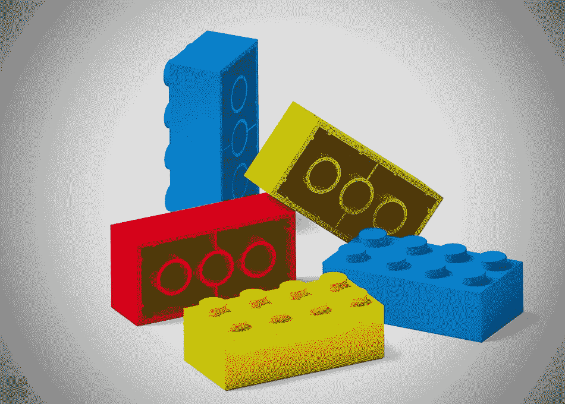
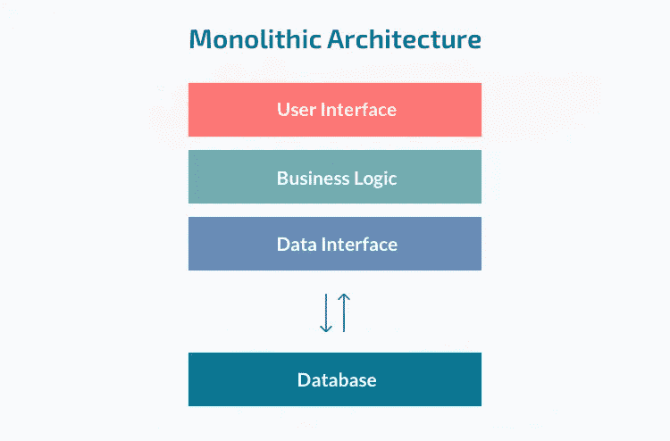
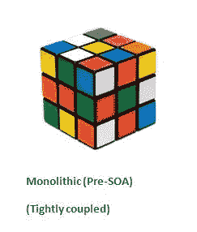
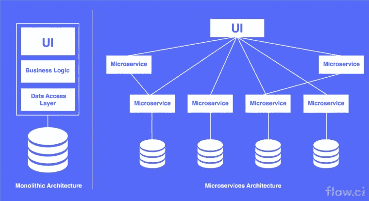
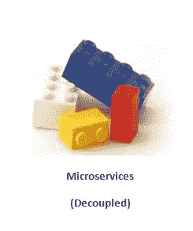
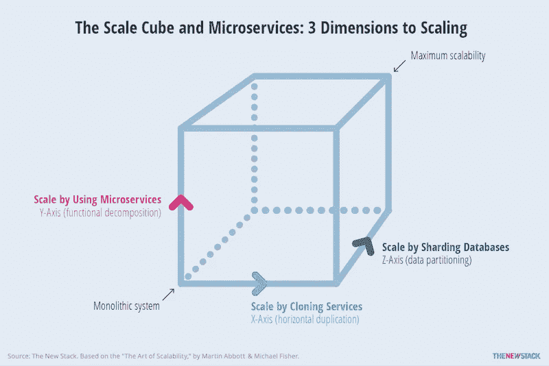
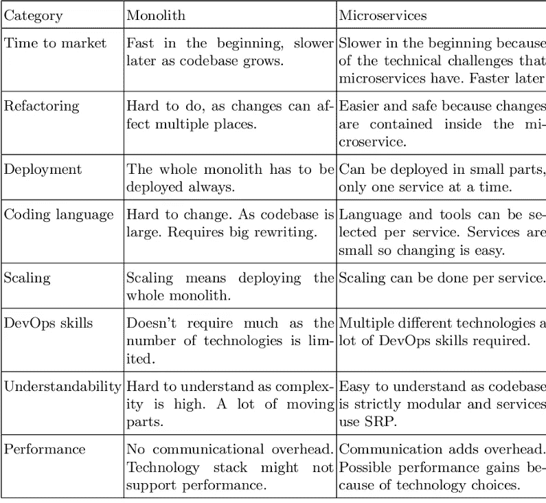

# 微服务简介

> 原文：<https://medium.com/nerd-for-tech/introduction-to-microservices-bd8e8d0c58d5?source=collection_archive---------15----------------------->

在过去的几十年中，软件体系结构一直在快速变化。如果你还记得，几天前我发表了一篇关于软件架构进化的文章。在那篇文章中，我解释了如何从独立系统到微服务进行评估。所以如果你愿意的话，你可以参考那篇文章来了解软件架构评估是如何发生的。2013 年，在 Martin Fowler 的书发布和几次讨论之后，人们开始思考 web 应用程序的新架构视图。现在大多数人都在考虑我们是否应该这样做。因此，要了解我们是否应该去，我们需要了解整体架构和微服务及其后果。在本文中，我将向您简要介绍单片架构和微服务。还有那些有什么优缺点。所以让我们开始旅程吧。

# 单片应用

单一应用程序是在一个代码库中包含项目所有功能的应用程序。单片应用程序有一个单一的可执行文件为您的整个应用程序。这可能不是一个可执行文件，但可能是一个 var 文件或 arc 文件，如 wise。因此，你的整个应用程序被打包到一个文件中。我们都在开发一个单一的应用程序，我们得到一个问题描述，并被指示开发一个具有多种功能的系统。我们分层构建软件，然后将代码库部署为单个 jar、war 或 arc 文件。

在单片架构中，假设我们想要添加新功能，那么我们需要重新配置和更新应用程序中从流程和通信到安全性的所有内容。因此，传统的单片应用程序具有很长的生命周期，很少更新，并且更改通常会影响整个应用程序。

假设您有一个银行应用程序。所以你有客户注册，开设新账户，账户处理，信用卡和借记卡的发行。所有这些放在一起，作为一个文件运送。假设几个月后，银行要求您更改用户界面的颜色和字体大小，或者要求您更改一些业务逻辑。修改后，你需要发送整个文件。是的，即使你做了简单的修改，你也需要发送整个文件。因为您需要测试应用程序。

## 优势

1.  更快更容易开发。
2.  因为它是一个单独的单元，所以易于测试和监控。
3.  更容易部署，因为只部署了一个 jar/war 文件。

## 不足之处

1.  应用一项新技术是很成问题的。
2.  因为紧密耦合，所以维护不容易。进行单一更改可能会引发一些问题。
3.  我们需要重新部署整个应用程序，即使是很小的改变。
4.  一个组件出现故障会引发整个应用程序的许多问题。

# 微服务

**微服务是自包含的独立部署模块**。这是一种架构开发风格，应用程序将它分解成更小的独立单元的集合。这些单元(模块化)是松散耦合的组件，它们将每个应用程序流程作为单独的服务来执行。因此，所有服务都有自己的逻辑和数据库，并执行特定的功能。这些较小的服务使用轻量级协议(如 HTTP)直接相互通信。

当涉及到微服务时，这些服务是单独创建的，并且彼此独立部署。微服务是一种使用容器构建分布式应用程序的架构设计。因此服务可以快速改变，而不会影响应用程序的其他部分。持续交付是微服务的诸多优势之一。亚马逊、网飞、优步和 Etsy 是世界上一些最具创新性和盈利性的微服务公司。

> **“简而言之，微服务架构风格是一种将单个应用程序开发为一套小型服务的方法，每个服务运行在自己的进程中，并与轻量级机制(通常是 HTTP 资源 API)进行通信。”
> —马丁·福勒**

# 微服务的特征

## 1.领域驱动

微服务是领域驱动的开发，换句话说，微服务有专门的生存目的。它必须有精确定义范围。所以每个服务都有自己的范围。

## **2。独立组件**

它应该运行自己的进程。不取决于别人。所有服务都可以独立部署和更新，具有更大的灵活性。此外，单个微服务中的错误只会影响该服务，不会影响整个应用程序。此外，向微服务应用添加新功能要比向整体应用添加新功能容易得多。

## 3.沟通

微服务通过它的轻量级机制进行通信。主要使用 HTTP 和 REST 架构在服务内部进行通信。

## **4。更好的可扩展性。**

在微服务中，每个元素都能够单独扩展。
因此，整个过程比 monoliths 更便宜和耗时，monoliths 即使不需要，也必须对整个程序进行缩放。
此外，每个 monolith 都有可扩展性限制，因此你获得的用户越多，monolith 的问题就越多。

**缩放立方体**

在一本名为**“可伸缩性的艺术”**的书中，可伸缩性被解释为“伸缩立方体”。scale cube 使用 3 轴解释了微服务的可扩展性。这些是 X，Y 和 z。

X 轴:它表示应用程序应该通过 X 轴向外扩展。如果一个实例是不够的，你应该能够产生其他实例，并继续下去。

**Y 轴:**应该是**功能分解**。功能分解意味着我们将系统分解成更小的服务。

Z 轴:服务应该能够分片。大多数时候，用户可能位于世界上的任何地方(不同的国家)。因此，应用程序应该通过利用独立的数据中心来处理来自不同地理位置的流量。所以我们可以根据地理位置来划分服务。例如，欧洲客户对欧洲服务器，亚洲客户对亚洲服务器。

## 5.较小的团队

不同的微服务可以用不同的语言开发，每个团队处理一个特定的服务。在这里，小团队仅仅意味着 8 到 10 个人。所有团队成员都有自己的职责，应该能够在任何给定的时间处理其他事情。这意味着如果前端开发人员完成了他/她的工作，他/她应该为后端做出贡献(全栈开发人员)。就像当 UI 设计师完成他们的工作时，他们应该为开发做出贡献。此外，当开发人员完成项目时，他们应该参与运营(如 DevOps)。

## 优势

1.  添加新功能只需要更新那些单独的微服务。
2.  每个微服务有单独的数据库是因为每个微服务可以使用最适合其需求的数据库类型。
3.  一个组件失败并不意味着所有其他组件都失败。

## 不足之处

1.  有时很难管理大量的服务。
2.  分布式环境中的复杂测试。
3.  微服务的独立部署很复杂。

# 整体服务与微服务

您已到达这篇文章的结尾。我希望你了解单片架构、微服务及其优缺点。所以是时候说再见了，让我们从另一篇文章中见面。

# 参考

 [## 微服务 vs Monolith:哪种架构最适合您的企业？

### 微服务在几年前刚刚出现，现在正呈加速趋势。的确，微服务…

www.n-ix.com](https://www.n-ix.com/microservices-vs-monolith-which-architecture-best-choice-your-business/)  [## 整体架构与微服务架构

### 为了理解微服务，我们需要了解什么是单片应用程序，以及是什么促使我们转向…

www.geeksforgeeks.org](https://www.geeksforgeeks.org/monolithic-vs-microservices-architecture/)