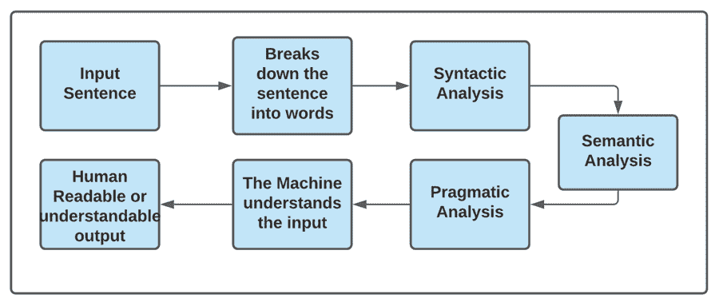

# 自然语言处理导论

> 原文：<https://medium.com/nerd-for-tech/introduction-to-natural-language-processing-2dc453274e4a?source=collection_archive---------27----------------------->

人类语言很复杂，机器很难理解。

NLP 是一个允许机器毫不费力地理解人类语言的概念。在这篇博文中，我们来详细了解一下 NLP 及其工作方法。我们还将详细了解 NLP 的用例。

**目录**

1.  什么是自然语言处理？
2.  自然语言处理示例
3.  NLP 是如何工作的？
4.  NLP 中使用的一些更常见的技术
5.  NLP 在现实生活中的使用案例
6.  裁决

# 什么是自然语言处理？

自然语言处理是人工智能和计算机科学的结合。它可以让你在计算机和人类语言之间创建流畅的交互。但这不是我们一直在做的事情吗？

现在，您正在使用人类语言与您的设备进行交流。无论你在键盘上输入什么，或者在屏幕上点击什么，都会被转换成一系列的 0 和 1。

但 NLP 专注于将自然人类语言转换成机器可读的形式。你说的自然人类语言是什么意思？自然的人类语言翻译从书面语到口语的一切。首先，智能手机上的语音识别应用程序是 NLP 的扩展。

您的智能手机使用 NLP 将您的语音转换为机器可读的形式。一旦机器理解了你的查询，它就进行处理并给出相应的输出。

# 自然语言处理示例

如果你刚刚开始学习 NLP，理解它可能会有点困难。所以我们举一个现实生活中的例子来详细了解 NLP。

# iPhone4S 上的语音控制功能

如果你有一部 iPhone，或者甚至知道有人有苹果的产品，你就知道 SIRI 是谁或者是什么。对其他人来说，SIRI 是苹果公司的智能大脑开发的语音助手。你可以使用 SIRI 进行一些活动，比如在互联网上进行搜索、识别歌曲、给某人打电话、设置提醒等等。你可以通过喊出“嘿 SIRI”或者轻按智能手机上的 home 键来使用 SIRI。SIRI 是自然语言处理的经典例子。

当你说“嘿，SIRI”时，你是在说你的自然语言——英语。理论上，这是机器无法理解的。这就是 NLP 算法通过识别我们语言中的自然模式发挥作用的地方。

“嘿 SIRI”是你自然语言中的一种模式。你的智能手机会识别它并激活记录器。现在你所说的一切都将被记录下来并由 NLP 算法处理。它能识别你声音的模式，并根据你刚才说的话造出一个句子。现在，这被翻译成 0 和 1，然后输入你智能手机的 CPU。CPU 处理这个请求，并指示您的智能手机执行所请求的任务。

最棒的是，SIRI 可以让你在几秒钟内完成所有这些工作。例如，设置提醒可以在短短几秒钟内完成。

# NLP 是如何工作的？

NLP 提出了某些算法来读取你的句子，并将其转换为机器可读的形式。但这并不简单，因为算法必须考虑句子的语气和意思。它不能把所有的单词单独转换成机器语言。在决定将这些单词转换成机器可读的形式之前，它需要考虑这些单词在特定句子中的上下文。

例如，看看圣经中的这句话——“精神是愿意的，但肉体是软弱的”

在 20 世纪 50 年代早期，一群科学家使用计算机将这个术语翻译成德语。他们成功地把它翻译成了德语。但是当他们试图把它从德语翻译回英语时，有趣的事情发生了。

这是计算机返回的结果

伏特加很好，但是肉已经腐烂了

电脑在某个位置不理解那个词的上下文。所以它用了一个类似的词。但这并不符合那句话的意思。为了确保你的 NLP 算法不会经历同样的混乱，你需要对它的工作有一个基本的了解。

以下是 NLP 流程中使用的两种常用技术或工作原理:

1.  语法分析
2.  语义分析

# 语法分析

句法分析帮助机器找出自然语言如何与语言中的语法规则保持一致。这种分析将应用一套语法规则来确保一组单词实际上一起给出一些意思。下面是句法分析中最常用的一些技术

*   词汇化
*   形态分割
*   分词
*   词性标注
*   从语法上分析
*   断句
*   堵塞物

# 语义分析

语义分析传达某个文本所传达的意思。也就是说，这是自然语言处理过程中最困难的分析形式。语义分析帮助你揭示自然语言中单个单词的含义和解释。

以下是语义分析中最常用的一些技术:

*   命名实体识别
*   词义消歧

# NLP 中使用的一些更常见的技术

# 从语法上分析

解析是一个简单的概念，计算机用它来把句子分解成它们的成分。这使得计算机能够理解句法形式中每个单词之间的关系。经过句法分析，计算机可以对句子的类型及其原意有一个坚实的理解。

# 堵塞物

词干化是将句子中的单词缩减为词干的另一个过程。词干是一个单词在去掉所有词缀后剩下的部分。例如，‘Run’是‘running’的词干。‘touch’是‘touching’的词干。用词干存储英语中的所有单词会变得很乏味。这就是为什么 NLP 算法执行词干分析，只是为了把原来的单词提取出来。

# 文本分割

最后，文本分割是另一个将所有内容组合在一起的过程。它将单个文本及其意图转换成有意义的句子。由于人类语言的复杂性，这个过程是存在的。例如，有些人按原样使用单词“lifesize ”,而另一些人喜欢用连字符连接“lifesize”。在这种时候，文本分割非常方便。

# 自然语言处理在现实生活中的用例

# 情感分析

许多组织使用 NLP 来识别他们的客户对他们的产品或服务的评价。他们扫描关键词，找出常见原因或客户投诉。有了这个，你就可以发现哪些因素影响了你的客户，并利用它来建立一个更好的业务。

# 垃圾邮件过滤

像雅虎和谷歌这样的组织在他们的产品中使用 NLP 来防止垃圾邮件。他们识别某些垃圾句子和单词，并把它们推进垃圾文件夹。如果你使用电子邮件提供商，去搜索一个名为“垃圾邮件”的文件夹，你会看到那里有大量的电子邮件。这些电子邮件已被您的电子邮件提供商的 NLP 过滤器标记为“垃圾邮件”。

# 招聘目的

表现出色的组织将 NLP 作为招聘流程的一部分。他们使用 ATS 在申请人的简历中寻找关键词。他们还使用 NLP 来识别就业市场中的潜在候选人。

# 裁决

不管你是否知道，NLP 已经成为你日常生活的一部分。从您使用的设备到雇用您的组织，NLP 无处不在。ML 和自动化的时代只会在未来以极快的速度推动 NLP 的使用！

*原载于*[*https://www . partech . nl*](https://www.partech.nl/nl/publicaties/2021/03/introduction-to-natural-language-processing)*。*