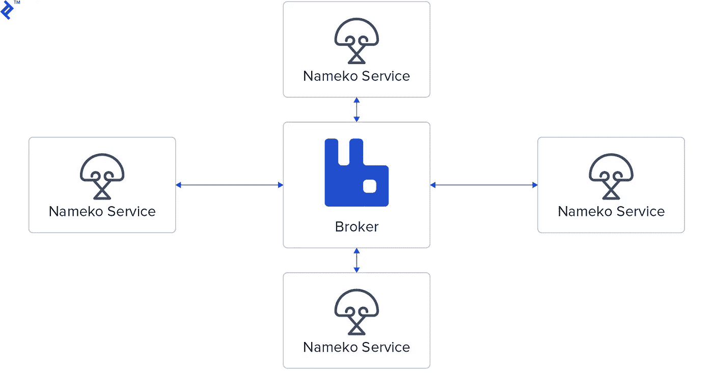
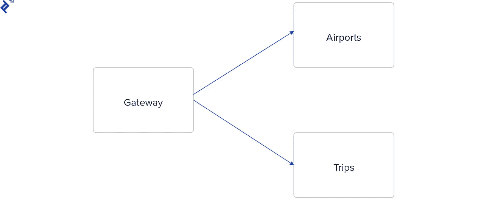

# Nameko Python 微服务简介

> 原文：<https://medium.com/nerd-for-tech/introduction-to-python-microservices-with-nameko-435efed35dd5?source=collection_archive---------2----------------------->

# 介绍

鉴于其灵活性和弹性，**微服务架构模式**是一种越来越受欢迎的架构风格。加上 Kubernetes 等技术，使用微服务架构引导应用程序变得前所未有的简单。

简而言之，微服务架构风格是一种将单个应用程序开发为一套小服务的方法，每个小服务都在自己的进程中运行，并通过轻量级机制(通常是 HTTP 资源 API)进行通信。这些服务是围绕业务功能构建的，可由全自动部署机器独立部署。如果你想深入了解 Python 微服务，请点击此链接 **Python 在线培训**

换句话说，遵循微服务架构的应用程序由几个独立的动态服务组成，这些服务使用通信协议相互通信。使用 HTTP(和 REST)是很常见的，但是正如我们将看到的，我们可以使用其他类型的通信协议，比如基于 AMQP(高级消息队列协议)的 RPC(远程过程调用)。

微服务模式可以被认为是 SOA(面向服务架构)的一个特例。然而，在 SOA 中，通常使用 ESB(企业服务总线)来管理服务之间的通信。ESB 通常非常复杂，包括复杂消息路由和业务规则应用程序的功能。在微服务中，更常见的是采用一种替代方法:“智能端点和哑管道”，这意味着服务本身应该包含所有的业务逻辑和复杂性(高内聚)，但服务之间的连接应该尽可能简单(高度解耦)，这意味着服务不一定需要知道其他哪些服务将与它通信。这是应用于架构级别的关注点分离。

微服务的另一个方面是，没有强制规定在每个服务中应该使用哪些技术。您应该能够使用任何能够与其他服务通信的软件栈来编写服务。每个服务也有自己的生命周期管理。所有这些都意味着，在一个公司中，有可能让团队使用不同的技术甚至管理方法从事不同的服务。每个团队都将关注业务能力，帮助建立一个更加敏捷的组织。

# Python 微服务

记住这些概念，在本文中，我们将重点关注使用 Python 构建一个概念验证微服务应用程序。为此，我们将使用 Nameko，这是一个 Python 微服务框架。它内置了 RPC over AMQP，允许您轻松地在服务之间进行通信。它还有一个简单的 HTTP 查询接口，我们将在本教程中使用。但是，对于编写公开 HTTP 端点的微服务，建议您使用另一个框架，比如 Flask。要使用 flask 通过 RPC 调用 nameko 方法，可以使用 flask_nameko，这是一个专门为 Flask 和 Nameko 的互操作而构建的包装器。

# 设置基本环境

让我们从运行一个最简单的例子开始，这个例子是从 Nameko 网站上提取的，并根据我们的目的扩展它。首先，你需要安装 Docker。我们将在示例中使用 Python 3，所以请确保您也安装了它。然后，创建一个 python virtualenv 并运行`$ pip install nameko`。

要运行 Nameko，我们需要 RabbitMQ 消息代理。它将负责我们 Nameko 服务之间的通信。不过，不要担心，因为您不需要在您的机器上再安装一个依赖项。有了 Docker，我们可以简单地下载一个预先配置的映像，运行它，当我们完成后，简单地停止容器。没有守护进程，`apt-get`或`dnf install`。



通过运行`$ docker run -p 5672:5672 --hostname nameko-rabbitmq rabbitmq:3`启动 RabbitMQ 容器(可能需要 sudo 来完成)。这将启动一个使用最新版本 3 RabbitMQ 的 Docker 容器，并通过默认端口 5672 公开它。

# 微服务的 Hello World

继续创建一个名为`hello.py`的文件，内容如下:

```
**from** nameko.rpc **import** rpc **class** **GreetingService**:
    name = "greeting_service" **@rpc**
    **def** **hello**(self, name):
        **return** "Hello, {}!".format(name)
```

Nameko 服务是类。这些类公开了入口点，这些入口点被实现为扩展。内置的扩展包括创建表示 RPC 方法、事件侦听器、HTTP 端点或计时器的入口点的能力。还有一些社区扩展可用于与 PostgreSQL 数据库、Redis 等交互。您可以编写自己的扩展。

让我们继续运行我们的示例。如果让 RabbitMQ 在默认端口上运行，只需运行`$ nameko run hello`。它会自动找到 RabbitMQ 并与之连接。然后，为了测试我们的服务，在另一个终端中运行`$ nameko shell`。这将创建一个交互式 shell，它将连接到同一个 RabbitMQ 实例。最棒的是，通过使用 RPC over AMQP，Nameko 实现了自动服务发现。当调用一个 RPC 方法时，nameko 会尝试查找相应的运行服务。


当运行 Nameko shell 时，您将获得一个名为`n`的特殊对象添加到名称空间中。该对象允许调度事件和进行 RPC 调用。要对我们的服务进行 RPC 调用，请运行:

```
> >> n.rpc.greetingservice.hello(name='world')
'Hello, world!'
Concurrent Calls
```

这些服务类在进行调用时被实例化，并在调用完成后被销毁。因此，它们本质上应该是无状态的，这意味着您不应该试图在调用之间保持对象或类中的任何状态。这意味着服务本身必须是无状态的。假设所有服务都是无状态的，Nameko 可以通过使用 eventlet greenthreads 来利用并发性。实例化的服务被称为“workers”，可以有一个配置的最大数量的 workers 同时运行。

为了在实践中验证 Nameko 并发性，在返回响应之前，通过向过程调用添加休眠来修改源代码:

```
**from** time **import** sleep

**from** nameko.rpc **import** rpc

**class** **GreetingService**:
    name = "greeting_service"

 **@rpc**
    **def** **hello**(self, name):
        sleep(5)
        **return** "Hello, {}!".format(name)
```

我们正在使用来自`time`模块的`sleep`，该模块不支持异步。然而，当使用`nameko run`运行我们的服务时，它会自动修补来自`sleep(5)`等阻塞调用的触发收益。

现在预计过程调用的响应时间应该在 5 秒左右。然而，当我们从 nameko shell 运行下面的代码片段时，它会有什么行为呢？

```
res = []
**for** i **in** range(5):
    hello_res = n.rpc.greeting_service.hello.call_async(name=str(i))
    res.append(hello_res)

**for** hello_res **in** res:
    print(hello_res.result())
```

Nameko 为每个 RPC 入口点提供了一个非阻塞的`call_async`方法，返回一个代理回复对象，然后可以查询它的结果。在回复代理上调用`result`方法时，该方法将被阻塞，直到返回响应。

正如所料，这个例子只运行了大约五秒钟。每个工作者将被阻塞等待`sleep`调用结束，但是这并不阻止另一个工作者开始。例如，用一个有用的阻塞 I/O 数据库调用替换这个`sleep`调用，您就得到一个非常快的并发服务。

如前所述，Nameko 在调用方法时创建 workers。工人的最大数量是可配置的。默认情况下，该数字设置为 10。例如，您可以测试将上面代码片段中的`range(5)`更改为 range(20)。这将调用`hello`方法 20 次，现在应该需要 10 秒钟来运行:

```
> >> res = []
> >> **for** i **in** range(20):
**... **    hello_res = n.rpc.greeting_service.hello.call_async(name=str(i))
**... **    res.append(hello_res)
> >> **for** hellores **in** res:
**... **    print(hello_res.result())
Hello, 0!
Hello, 1!
Hello, 2!
Hello, 3!
Hello, 4!
Hello, 5!
Hello, 6!
Hello, 7!
Hello, 8!
Hello, 9!
Hello, 10!
Hello, 11!
Hello, 12!
Hello, 13!
Hello, 14!
Hello, 15!
Hello, 16!
Hello, 17!
Hello, 18!
Hello, 19!
```

现在，假设有太多(超过 10 个)并发用户调用那个`hello`方法。有些用户等待响应的时间会超过预期的五秒钟。一种解决方案是通过覆盖默认设置来增加工作量，例如使用一个配置文件。但是，如果因为被调用的方法依赖于一些繁重的数据库查询，您的服务器已经达到了 10 个工作线程的极限，那么增加工作线程的数量可能会导致响应时间进一步增加。

# 扩展我们的服务

更好的解决方案是使用 Nameko 微服务功能。到目前为止，我们只使用了一台服务器(您的计算机)，运行一个 RabbitMQ 实例和一个服务实例。在生产环境中，您可能希望任意增加运行调用过多的服务的节点数量。如果希望消息代理更加可靠，还可以构建一个 RabbitMQ 集群。

为了模拟服务扩展，我们可以简单地打开另一个终端，像以前一样使用`$ nameko run hello`运行服务。这将启动另一个服务实例，可能会多运行十个工作线程。现在，尝试用`range(20)`再次运行这个片段。现在应该再花五秒钟来运行。当有多个服务实例运行时，Nameko 将在可用的实例中循环调用 RPC 请求。

Nameko 是为了在集群中健壮地处理这些方法调用而构建的。为了测试这一点，尝试运行 snipped，在它完成之前，转到运行 Nameko 服务的一个终端并按两次`Ctrl+C`。这将关闭主机，而不等待工人完成。Nameko 会将呼叫重新分配给另一个可用的服务实例。

在实践中，您将使用 Docker 来容器化您的服务，我们将在后面介绍，并使用一个编排工具(如 Kubernetes)来管理运行服务和其他依赖项(如消息代理)的节点。如果操作正确，使用 Kubernetes，您可以在一个健壮的分布式系统中有效地转换您的应用程序，不受意外峰值的影响。此外，Kubernetes 允许零停机部署。因此，部署服务的新版本不会影响系统的可用性。

在构建服务时一定要考虑到向后兼容性，这一点很重要，因为在生产环境中，同一服务的几个不同版本可能会同时运行，尤其是在部署期间。如果您使用 Kubernetes，在部署期间，只有当有足够多的新容器运行时，它才会终止所有旧版本的容器。

> 要成为一名 python 开发者，让我们从纳尔希 [**Python 在线培训**](https://nareshit.com/python-online-training/) 开始你的培训吧

对于 Nameko 来说，同时运行同一服务的多个不同版本不是问题。因为它以循环方式分配调用，所以调用可能会经过旧版本或新版本。为了测试这一点，保持一个运行旧版本服务的终端，并编辑服务模块，如下所示:

```
**from** time **import** sleep**from** nameko.rpc **import** rpc **class** **GreetingService**:
    name = "greeting_service" **@rpc**
    **def** **hello**(self, name):
        sleep(5)
        **return** "Hello, {}! (version 2)".format(name)
```

如果您从另一个终端运行该服务，您将同时运行两个版本。现在，再次运行我们的测试片段，您将看到两个版本都显示出来:

```
> >> res = []
> >> **for** i **in** range(5):
**... **    hello_res = n.rpc.greeting_service.hello.call_async(name=str(i))
**... **    res.append(hello_res)
> >> **for** hellores **in** res:
**... **    print(hello_res.result())
Hello, 0!
Hello, 1! (version 2)
Hello, 2!
Hello, 3! (version 2)
Hello, 4!
```

# 使用多个实例

现在我们知道了如何有效地使用 Nameko，以及伸缩是如何工作的。现在让我们更进一步，使用 Docker 生态系统中的更多工具:docker-compose。如果您部署到单个服务器，这将是可行的，这肯定不是理想的，因为您不会利用微服务架构的许多优势。同样，如果您希望有一个更合适的基础设施，您可以使用一个编排工具(比如 Kubernetes)来管理一个分布式容器系统。所以，继续安装 docker-compose。

同样，我们所要做的就是部署一个 RabbitMQ 实例，Nameko 会处理剩下的事情，因为所有的服务都可以访问这个 RabbitMQ 实例。这个例子的完整源代码可以在这个 GitHub 库中找到。

让我们构建一个简单的旅行应用程序来测试 Nameko 的功能。该应用程序允许注册机场和行程。每个机场都被简单地存储为机场的名称，旅程存储始发地和目的地机场的 id。我们系统的架构如下所示:



理想情况下，每个微服务都有自己的数据库实例。然而，为了简单起见，我为旅行和机场微服务创建了一个单独的 Redis 数据库来共享。网关微服务将通过一个简单的类似 REST 的 API 接收 HTTP 请求，并使用 RPC 与机场和行程进行通信。

让我们从网关微服务开始。它的结构很简单，对于来自 Flask 这样的框架的人来说应该非常熟悉。我们基本上定义了两个端点，每个端点都允许 GET 和 POST 方法:

```
**import** json**from** nameko.rpc **import** RpcProxy
**from** nameko.web.handlers **import** http **class** **GatewayService**:
    name = 'gateway' airports_rpc = RpcProxy('airports_service')
    trips_rpc = RpcProxy('trips_service') **@http('GET', '/airport/<string:airport_id>')**
    **def** **get_airport**(self, request, airport_id):
        airport = self.airports_rpc.get(airport_id)
        **return** json.dumps({'airport': airport}) **@http('POST', '/airport')**
    **def** **post_airport**(self, request):
        data = json.loads(request.get_data(as_text=True))
        airport_id = self.airports_rpc.create(data['airport']) **return** airport_id **@http('GET', '/trip/<string:trip_id>')**
    **def** **get_trip**(self, request, trip_id):
        trip = self.trips_rpc.get(trip_id)
        **return** json.dumps({'trip': trip}) **@http('POST', '/trip')**
    **def** **post_trip**(self, request):
        data = json.loads(request.get_data(as_text=True))
        trip_id = self.trips_rpc.create(data['airport_from'], data['airport_to']) **return** trip_id
```

现在让我们看看机场服务。正如所料，它公开了两个 RPC 方法。`get`方法将简单地查询 Redis 数据库并返回给定 id 的机场。`create`方法将生成一个随机 id，存储机场信息，并返回 id:

```
**import** uuid**from** nameko.rpc **import** rpc
**from** nameko_redis **import** Redis **class** **AirportsService**:
    name = "airports_service" redis = Redis('development') **@rpc**
    **def** **get**(self, airport_id):
        airport = self.redis.get(airport_id)
        **return** airport **@rpc**
    **def** **create**(self, airport):
        airport_id = uuid.uuid4().hex
        self.redis.set(airport_id, airport)
        **return** airport_id
```

注意我们是如何使用`nameko_redis`扩展的。看看社区扩展列表。扩展是以采用依赖注入的方式实现的。Nameko 负责初始化每个工人将使用的实际扩展对象。

机场和 Trips 微服务没有太大区别。以下是 Trips 微服务的外观:

```
**import** uuid**from** nameko.rpc **import** rpc
**from** nameko_redis **import** Redis **class** **AirportsService**:
    name = "trips_service" redis = Redis('development') **@rpc**
    **def** **get**(self, trip_id):
        trip = self.redis.get(trip_id)
        **return** trip **@rpc**
    **def** **create**(self, airport_from_id, airport_to_id):
        trip_id = uuid.uuid4().hex
        self.redis.set(trip_id, {
            "from": airport_from_id,
            "to": airport_to_id
        })
        **return** trip_id
```

每个微服务的`Dockerfile`也非常简单。唯一的依赖项是`nameko`，对于机场和旅行服务，也需要安装`nameko-redis`。这些依赖关系在每个服务的`requirements.txt`中给出。机场服务的 docker 文件如下所示:

```
**FROM** python:3**RUN** apt-get update && apt-get -y install netcat && apt-get clean**WORKDIR** /app**COPY** requirements.txt ./
**RUN** pip install --no-cache-dir -r requirements.txt**COPY** config.yml ./
**COPY** run.sh ./
**COPY** airports.py ./**RUN** chmod +x ./run.sh**CMD** ["./run.sh"]
```

这与其他服务的 Dockerfile 之间的唯一区别是源文件(在本例中是`airports.py`)，它应该相应地进行更改。

`run.sh`脚本负责等待 RabbitMQ，对于机场和 Trips 服务，Redis 数据库准备就绪。下面的代码片段显示了机场的`run.sh`的内容。同样，对于其他服务，只需相应地从`aiports`更改为`gateway`或`trips`:

```
**#!/bin/bash**until nc -z ${RABBIT_HOST} ${RABBIT_PORT}; **do**
    echo "$(date) - waiting for rabbitmq..."
    sleep 1
**done**until nc -z ${REDIS_HOST} ${REDIS_PORT}; **do**
    echo "$(date) - waiting for redis..."
    sleep 1
**done**nameko run --config config.yml airports
```

我们的服务现在可以运行了:

`$ docker-compose up`

让我们测试一下我们的系统。运行命令:

```
$ curl -i -d "{\"airport\": \"first_airport\"}" localhost:8000/airport
HTTP/1.1 200 OK
Content-Type: text/plain; charset=utf-8
Content-Length: 32
Date: Sun, 27 May 2018 05:05:53 GMTf2bddf0e506145f6ba0c28c247c54629
```

最后一行是为我们的机场生成的 id。要测试它是否工作，请运行:

```
$curl localhost:8000/airport/f2bddf0e506145f6ba0c28c247c54629
{"airport": "first_airport"}Great, now let’s add another airport:
$ curl -i -d "{\"airport\": \"second_airport\"}" localhost:8000/airport
HTTP/1.1 200 OK
Content-Type: text/plain; charset=utf-8
Content-Length: 32
Date: Sun, 27 May 2018 05:06:00 GMT565000adcc774cfda8ca3a806baec6b5
```

现在我们有两个机场，这足以组成一次旅行。现在让我们开始一次旅行:

```
$ curl -i -d "{\"airport_from\": \"f2bddf0e506145f6ba0c28c247c54629\", \"airport_to\": \"565000adcc774cfda8ca3a806baec6b5\"}" localhost:8000/trip
HTTP/1.1 200 OK
Content-Type: text/plain; charset=utf-8
Content-Length: 32
Date: Sun, 27 May 2018 05:09:10 GMT34ca60df07bc42e88501178c0b6b95e4
```

和以前一样，最后一行表示旅行 ID。让我们检查它是否正确插入:

```
$ curl localhost:8000/trip/34ca60df07bc42e88501178c0b6b95e4
{"trip": "{'from': 'f2bddf0e506145f6ba0c28c247c54629', 'to': '565000adcc774cfda8ca3a806baec6b5'}"}
```

# 摘要

我们已经看到了 Nameko 如何通过创建 RabbitMQ 的本地运行实例、连接到它并执行几个测试来工作。然后，我们应用学到的知识，使用微服务架构创建了一个简单的系统。