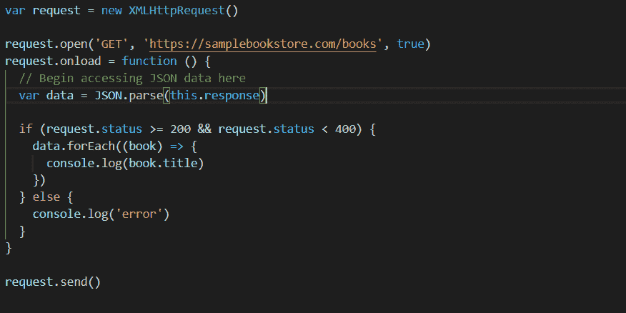

# Web APIs 简介

> 原文：<https://medium.com/nerd-for-tech/introduction-to-web-apis-5ca33eb14578?source=collection_archive---------16----------------------->

Web 应用程序在客户和企业之间的信息交换中扮演着重要的角色。如今，大多数企业都使用网络应用程序，因为这是一种经济高效的信息交换方式。它也是帮助全球市场业务增长的一种手段。

Web 应用程序也很受欢迎，因为使用 web 浏览器很容易访问它们，并且无论在什么位置，几乎可以从任何设备访问它们。这是因为网络浏览器预装在所有设备上，如手机、台式电脑、平板电脑等。

为了增强用户体验，开发人员使用 web APIs 为 Web 应用程序构建服务。在这篇文章中，让我们详细了解什么是 Web API 以及它们的用途和特性。

**目录:**

1.  什么是 API？
2.  **什么是 Web APIs？**
3.  Web API 的特性
4.  HTTP 方法
5.  连接到 Web API
6.  Web API 的使用
7.  包扎

# 什么是 API？

在进入 Web APIs 之前，让我们先了解什么是 API。API 代表应用程序编程接口。API 可以被认为是促进两个应用程序之间或者用户和应用程序之间通信的媒介或信使。API 接收一个请求并给出一个响应。例如，当用户浏览像脸书、YouTube 等网络应用时，API 接收来自用户的请求并执行所需的功能作为响应。

API 使开发人员能够毫不费力地构建复杂的功能，因为 API 允许功能被重用。这有助于开发人员，因为他们不必从头开始编写复杂的功能。API 定义了独立于其实现的功能。

# 什么是 Web APIs？

Web API 是一个开源框架，允许开发人员构建 Web 服务。这个框架实现了 HTTP 协议，因此它们也被称为 HTTP APIs。Web APIs 允许用户和设备之间或两个应用程序之间的交互或通信。使用 API 构建的 Web 服务有助于提高易用性。通常，用户通过 web 应用程序与 API 进行交互。开发人员可以使用不同的编程语言构建 Web APIs，如 Java、.网等。并且可以使用诸如 JavaScript 之类的语言连接到 Web APIs。

# Web API 的特性

*   它支持基本的 CRUD(创建、读取、更新和删除)操作。
*   它还支持多种文本格式，如 XML 和 JSON。
*   响应有 HTTP 状态代码，这有助于用户了解 API 请求是否成功，以及是否收到了响应。
*   一个流行的 Web API 是 ASP.NET Web API。
*   它是开源的。

# HTTP 方法

为了理解 Web APIs 及其使用，我们需要理解 HTTP 方法。HTTP 方法是帮助与 web 交互的 HTTP 协议的不同功能。不同的 HTTP 方法如下:

*   HTTP GET — GET 请求通常用于从 web 应用程序请求资源，而不是以任何方式修改它。GET 请求被认为是安全的方法，因为它们不允许对 Web 资源进行任何修改。
*   HTTP POST—POST 方法用于创建新资源。例如，可以使用 POST 方法将新数据插入数据库。
*   HTTP PUT—PUT 方法通常用于完全修改 web 应用程序上的现有资源。PUT 请求通常是在单个资源上发出的，而 POST 请求是在一组资源上发出的。
*   HTTP DELETE——顾名思义，删除请求用于从 web 应用程序中删除现有资源。
*   HTTP 修补程序—修补方法用于部分更新现有资源。例如，如果已经创建了一个用户登录，并且您想要更改密码，则使用 patch 方法，因为整行都没有被修改，而只有密码部分被修改。

# 连接到 Web API

在这一部分中，我们将学习如何连接到 Web API 来使用 JavaScript 访问和修改数据。例如，让我们假设我们的目标是连接到一个书店 web 应用程序，并从其 API 中检索图书细节。

为了连接到 Web API，我们需要 API 端点。假设 API 端点的 URL 是[https://samplebookstore.com/books.](https://samplebookstore.com/books.)点击这个链接会显示一个 JSON 格式的对象数组。

现在，我们将编写我们的 script.js 文件来连接到 API 端点并从中检索数据。

这是我们的 script.js 文件的外观。该文件有助于建立到 API 端点的连接，并检索书名。

最初，我们创建一个请求变量，并为它分配一个 XMLHttpRequest 对象。之后，我们用 open()方法打开一个到 API 端点的新连接，其中我们指定 URL API 端点的细节和请求类型为 GET。一旦请求完成，我们就使用 onload()函数访问数据。

我们通过使用 JSON.parse()方法解析收到的响应来检索数据，并使用数据变量将所有 JSON 数据存储为一个 JSON 对象数组。

现在使用 if 语句，我们检查我们的请求是否成功。如果我们的请求成功，我们使用一个“for 循环”来遍历 JSON 对象，检索书名并在控制台中显示出来。

最后，我们将请求发送到 web 应用程序。

# Web API 的使用

Web APIs 的一些重要用途如下:

*   Web APIs 用于从 Web 应用程序中检索数据资源，并允许添加新资源和修改现有资源。
*   Web APIs 用于构建轻量级、可维护性和易伸缩性的 Web 服务。
*   它甚至可以用来创建 RESTful web 服务。REST 代表代表性状态转移。
*   Web APIs 有助于设备和 Web 应用程序的轻松通信。
*   当开发人员想要创建面向资源的服务时，最好使用 Web APIs。
*   它有助于快速有效地开发 web 服务。

# 包扎

通过这篇文章，你会对 API 和 Web APIs 有一个基本的了解。我们还看到了如何连接到 API 端点以从 web 应用程序中检索数据资源。这将有助于您连接到所需的 API 并在将来检索数据。最好的部分是它是开源的，这意味着你不需要花费任何东西去探索它。

*原载于*[*https://www . partech . nl*](https://www.partech.nl/nl/publicaties/2020/11/introduction-to-web-apis)*。*