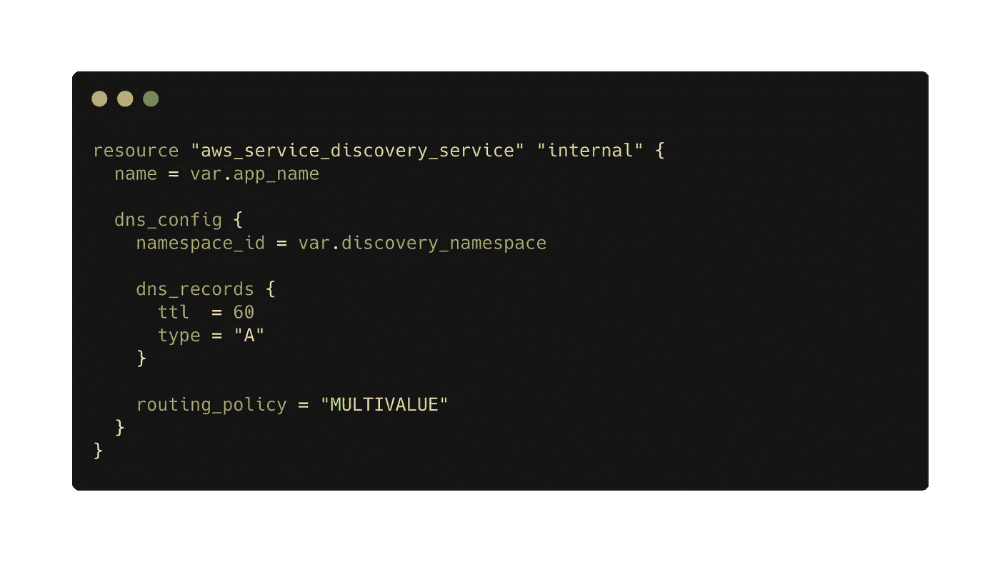
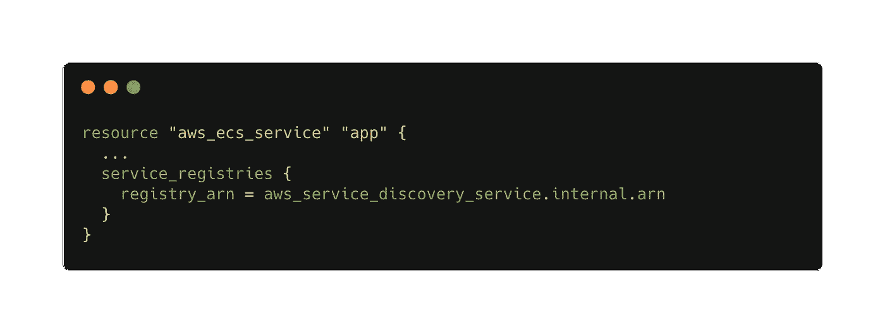

# AWS ECS Fargate 上的零信任简介

> 原文：<https://medium.com/nerd-for-tech/introduction-to-zero-trust-on-aws-ecs-fargate-68a0976eaac5?source=collection_archive---------5----------------------->


在对我知道我想要的解决方案的信息进行了长时间的研究后，很难弄清楚该选择什么，以及如何使用它。因此，这基本上是我希望拥有的*指南* : **我想要的**和**为什么**，解决方案本身，以及同样重要的是——**如何**实施一个设计良好但记录不良的解决方案…

# 什么

随着谷歌[超越公司](https://cloud.google.com/beyondcorp)方法的兴起，“零信任”的概念将身份感知代理带到了这个世界。简而言之，内部资源或工具位于私有的不可访问的云区域，而在它们之上的反向代理只向许可的用户提供访问。身份验证通常依赖于 OAuth2 提供者，但是任何类型的用户目录都可以做到这一点。

# 为什么

你很少会喜欢两个以上的组合:

1.  安全性
2.  优质用户体验
3.  易于管理/维护神奇之处在于利用同一个解决方案从上述所有方面获益。

## 安全性

身份感知代理的关键特性是 VPN 服务器的冗余。就其本质而言，VPN 提供了内部网络的单点访问。一旦通过认证，用户就拥有了王国的钥匙；所有内部系统都可以访问。在某些情况下，当 [RBAC](https://en.wikipedia.org/wiki/Role-based_access_control) 被正确实现时，认证仍然存在并保护用户访问。但是，该系统仍然可以通过网络访问，这使得它容易受到可能绕过标准接入点的扫描和攻击。

使用反向代理，在请求被授权之前，所有访问都被阻塞，因为路由没有发生。请求在被重新路由转发之前被阻止。

安全性的另一个方面来自于用户只需管理一个身份源这一事实。如果 [MFA / 2FA](https://en.wikipedia.org/wiki/Multi-factor_authentication) 已经启用([并且应该启用！！！](https://www.google.com/landing/2step/))，代表未来所有的用户认证方式。更多关于易访问性和易管理性的信息。

不过，在继续之前有一个澄清；这并不是说 VPN 已经成为过去，也不是说拥有 VPN 的概念已经过时了。正确部署的话，VPN 服务器做的事情是不可思议的。它们无处不在是有原因的。也就是说，大多数实现缺乏基本的访问控制，而那些有基本访问控制的实现，在用户通过身份验证后，通常不会监控内部查询。在某些情况下，通常没有太多的选择。但对于其他服务，例如后台 web 服务，我们可以做得更好。

## 易于访问

这是事情更直接的一面；拥有组织目录的用户只需管理一个身份。假设用户使用类似于 [1Password](https://1password.com/) 和强制 [2 步骤验证](https://www.google.com/landing/2step/)的东西来保护他们的密码安全，这会让每个人的生活更轻松。一次成功的身份验证生成的 cookie 可用于访问代理下的所有其他系统(假设用户被允许这样做)。

## 易于管理

当开发中涉及多个系统和工具时，工程/ IT /运营团队努力解决的一个关键难点是用户管理。 [SSO](https://en.wikipedia.org/wiki/Single_sign-on) 提供了单点认证，只允许管理一个目录，而不是管理越来越多的目录和用户集。剩下的工作就是将 SSO 与身份感知代理集成起来，以利用单一访问点和 cookie 的重用。

> SSO 前来救援！

虽然 Buzzfeed 的 SSO 在概念和实现方面非常棒，但由于缺乏更好的词，它的文档有些不理解。当尝试在 ECS Fargate 上部署时，该问题会放大。(考虑到 Buzzfeed 在 ECS 上的工作负载性质，这有些令人惊讶，但是🤷).

# 怎么做

记住这一点，下面是实现“在 ECS Fargate 上使用 SSO 和 cookie 重用的零信任代理”的指南/更好的文档

*可能是有史以来拥有最多流行语的单行标题的世界纪录* …

1.  Buzzfeed 的 SSO 是两个代理实体的实现，一个服务作为底层系统的代理，另一个作为身份验证提供者。本地身份验证提供者的原因是能够为所有系统提供一次登录，而不是必须向每个不同的上游重新进行身份验证。这是出于相同目的的 cookie 重用，是代表 Buzzfeed 的一个超级优雅的解决方案。[这是一个复杂而全面的系统示意图](https://github.com/buzzfeed/sso/blob/main/docs/diagrams/sso_request_flow.png)
2.  如前所述，该系统由一个代理和一个授权提供者组成，即`sso-proxy`和`sso-authenticator`(简称`sso-auth`)。两个系统都由一组环境变量配置，其中后端路由在一个[上游 Yaml 配置文件](https://github.com/buzzfeed/sso/blob/main/docs/sso_config.md)中描述。随着使用的增加，附加的特性、开关、参数和项目更新从基本的可理解的配置文档中发展出来。这就是我们今天在这里的原因。

## 代理人

这是充当传入请求的前门的实体。如果传入的请求被识别为有效，则该请求通过并基于`upstream_configs.yml`被路由。否则，请求将被重定向到验证器。

我选择用包装 Buzzfeed 图像的环境来构建容器图像。这只是为了方便，可以转换到任何其他方法。用`docker build --build-arg client_id=xxx client_secret=xxx ...`建立形象

```
FROM buzzfeed/ssoARG client_id \
    client_secret \
    session_cookie_secretENV UPSTREAM_CONFIGFILE="/sso/upstream_configs.yml" \
    UPSTREAM_CLUSTER="" \
    PROVIDER_URL_EXTERNAL="https://sso-auth.domain.co" \
    CLIENT_ID=$client_id \
    CLIENT_SECRET=$client_secret \
    SESSION_COOKIE_SECRET=$session_cookie_secret \
    SESSION_TTL_LIFETIME="1h" \
    UPSTREAM_SCHEME=httpCOPY ./upstream_config.yml /sso/upstream_configs.ymlENTRYPOINT ["/bin/sso-proxy"]
```

## 认证者

从代理接收未经身份验证的请求，身份验证者负责联系 OAuth2 提供者进行授权。根据配置，如果请求用户具有相关的权限，即授权域、正确的子组等，则设置一个 cookie 并将其重定向到代理，代理进而允许它通过。

authenticator 的内置方式与它的孪生兄弟相同，基于相同的映像，只是使用了不同的`ENTRYPOINT`和不同的配置变量集:

```
FROM buzzfeed/ssoARG client_id \
    client_secret \
    session_cookie_secret \
    session_keyENV AUTHORIZE_EMAIL_DOMAINS=domain.co \
    AUTHORIZE_PROXY_DOMAINS=domain.co \
    SERVER_HOST=sso-auth.domain.co \
    CLIENT_PROXY_ID=$client_id \
    CLIENT_PROXY_SECRET=$client_secret \
    SESSION_COOKIE_SECURE=true \
    SESSION_COOKIE_SECRET=$session_cookie_secret \
    SESSION_COOKIE_EXPIRE=1h \
    SESSION_KEY=$session_key \
    PROVIDER_X_CLIENT_ID=$client_id \
    PROVIDER_X_CLIENT_SECRET=$client_secret \
    PROVIDER_X_TYPE=google \
    PROVIDER_X_SLUG=google \
    PROVIDER_X_GOOGLE_IMPERSONATE=admin@domain.co \
    PROVIDER_X_GOOGLE_CREDENTIALS=/sso/credentials.json \
    PROVIDER_X_GROUPCACHE_INTERVAL_REFRESH=1m \
    PROVIDER_X_GROUPCACHE_INTERVAL_PROVIDER=1m \
    LOGGING_LEVEL=debugCOPY ./credentials.json /sso/credentials.jsonEXPOSE 4180ENTRYPOINT ["/bin/sso-auth"]
```

## OAuth2 首选提供商—谷歌

不多细说谷歌了。它的工作区目录提供了广泛的用户管理功能，被认为是一个标准的选择。具体来说，Buzzfeed 的 SSO 提供 Google 或 Okta 作为提供商。如果这不是你的组织管理用户的方式，这篇文章可能在很大程度上是不相关的。然而，您可以利用底层系统— [OAuth2-proxy](https://github.com/oauth2-proxy/oauth2-proxy) ，它将提供类似的体验，除了单一本地管理的认证机制的解决方案。代理不是有两个组件，而是一个与后端提供者相对的系统。

说明(虽然远非完美)可以在[这里](https://github.com/buzzfeed/sso/blob/main/docs/google_provider_setup.md)找到。重要注意事项:

*   请完成所有步骤，即使有些步骤看起来没有必要；比如，如果不需要分组隔离，就不要遵循第三步及以后的步骤。 [**做到一路过关斩将，确保你得到了。json 文件在最后。**](https://github.com/buzzfeed/sso/blob/main/docs/google_provider_setup.md#3-set-up-a-service-account-for-google-groups-based-authorization)
*   仔细阅读，确保如图所示[管理 SDK](https://github.com/buzzfeed/sso/blob/main/docs/google_provider_setup.md#authorizing-use-of-the-admin-sdk-api) 已启用
*   确保从 Google 的工作空间安全方面来看，API 控制
*   确保用管理员用户设置了`PROVIDER_X_GOOGLE_IMPERSONATE=admin@domain.co`

## 上游

上游是设置代理路由的配置文件。它们接受来自 web 的公共请求，如果满足某些条件，经过身份验证的请求将被路由到一个内部(或不内部)服务。

下面的配置描述了两个服务及其内部路由:

```
- service: vault
  default:
    from: vault.sso.domain.co
    to: vault.local:8200
    options:
      allowed_groups:
        - production@domain.co
- service: snappass
  default:
    from: secrets.sso.domain.co
    to: secrets.local:5000
    options:
      allowed_email_domains:
        - domain.co
```

注意事项:

*   每个条目**必须**有一个`default`设置，其他自定义设置可以遵循
*   `from` & `to`为基数，而`options`为可选**，前提是[前三](https://github.com/buzzfeed/sso/blob/main/docs/sso_proxy_config.md#upstream) `UPSTREAM_DEFAULT_`之一**设置。*这一点我是吃了苦头才知道的……*
*   注意`allowed_groups`或`allowed_email_domains`是如何设置的，它们本身就足够了。第一种是允许特定目录组的访问，而后者提供了使用
*   整套`options`可以在[这里](https://github.com/buzzfeed/sso/blob/main/docs/sso_config.md)找到

## 部署

上述两个服务应该像任何其他服务一样一起部署在内部网络中。这里的最佳实践是在顶层指定一个负载均衡器，将流量路由到代理/认证器。这里唯一要考虑的是上游服务的*可达性*；一个被认为是“内部的”并且将通过代理访问的系统必须能够从代理本身访问。在网络级别，这意味着它们要么必须位于同一个虚拟专用网络中，要么在网络之间进行[对等](https://docs.aws.amazon.com/vpc/latest/peering/what-is-vpc-peering.html)。从代理的角度来看，IP **和**端口应该是可及的和开放的。“开放”还意味着它们将是同一个安全组的一部分，或者在各自的组中开放一个规则，以便能够提供来回通信。

## ECS 和服务发现

一旦设置了代理，用户就获得了访问权，他们应该能够与只能在私有网络内部访问的端点进行通信，即 [VPC](https://aws.amazon.com/vpc/) 。虽然我们可以将请求重定向到一个 IP，但是这些 IP 往往会改变，然后连接就会丢失。改进可以是一个有弹性的 IP，它保证与它所附加的资源保持固定。这带来了一些新的问题；答:资源本身可以(也应该)在时间范围内循环使用——毕竟我们在处理容器。b .一旦弹性 IP 的底层资源不再存在，它们将[开始被收费](https://aws.amazon.com/premiumsupport/knowledge-center/elastic-ip-charges/)。另一个改进可能是人类可读的 DNS——指向同一个 IP 的记录。尽管可读，静态 IP 固有的问题依然存在。

解决方案— [AWS 服务发现](https://docs.aws.amazon.com/AmazonECS/latest/developerguide/service-discovery.html)。简而言之，服务发现服务将自己附加到 ECS 目标组，用 Route53 管理的内部端点更新底层的实时运行任务。也就是说，用户可以访问同一个端点，并信任它来解析连接到现有任务的动态 IP。

下面是一个使用 Terraform 代码的简单示例(仅为方便起见，这可以手动设置或使用任何其他语言设置):

在托管内部记录之前，必须首先创建专用 dns 命名空间的全局资源:


名称空间准备好之后，我们可以开始创建私有记录，注意`dns_config`中对名称空间的引用:



最后，将`aws_ecs_service`资源连接到[服务注册中心](https://registry.terraform.io/providers/hashicorp/aws/latest/docs/resources/ecs_service#service_registries):



# 替代品[永久链接](https://omerxx.com/identity-aware-proxy-ecs/#alternatives)

上面的解决方案不是零信任解决方案的唯一方案。那里有很多，包括[普通的](https://www.cloudflare.com/teams/)以及许多 OSS 替代品。Buzzfeed 的解决方案是这里的首选，因为它保持了一站式认证系统，建立在 Google 的 OAuth2 解决方案之上。任何一种解决方案通常都会做几乎相同的工作，只要保持安全性的概念，剩下的就是实现细节了。

# 扩展零信任的力量 [Permalink](https://omerxx.com/identity-aware-proxy-ecs/#extending-the-power-of-zero-trust)

部署该系统是一个很好的解决方案。但有时现实生活会戳破安全泡沫；在某些情况下，工程师需要通过 SSH 或其他协议访问私有资源(在 Redis 或 PostgreSQL 实例上工作)。虽然直接针对协议中的资源工作是不可行的，但是我们可以通过为类似于 [SSH](https://github.com/huashengdun/webssh) 、 [PGAdmin](https://www.pgadmin.org/) 的应用程序部署 web 接口来扩展范围。

我将首先讨论访问私有资源的工程文化，以及如何创建一个工作流来消除这种操作的必要性，但这是另一篇文章的内容。与此同时，让我们把尽可能避免它的想法放在一边。如果你是认真的，你可以考虑一起旋转那些被访问的实例，一旦它们被 SSH 进入，就将它们标记为*污染的*，并自动移除它们。思考的食粮…

我希望这篇文章有助于理解零信任的概念和现实世界的实现。当我试图将它整合到我们的工作流程中时，这是我一直在努力解决的问题，所以我很乐意分享我的经验和“如何做”。

如果您发现以上信息中有任何错误，有任何问题或意见请[联系](https://twitter.com/0merxx)！

感谢你阅读🖤