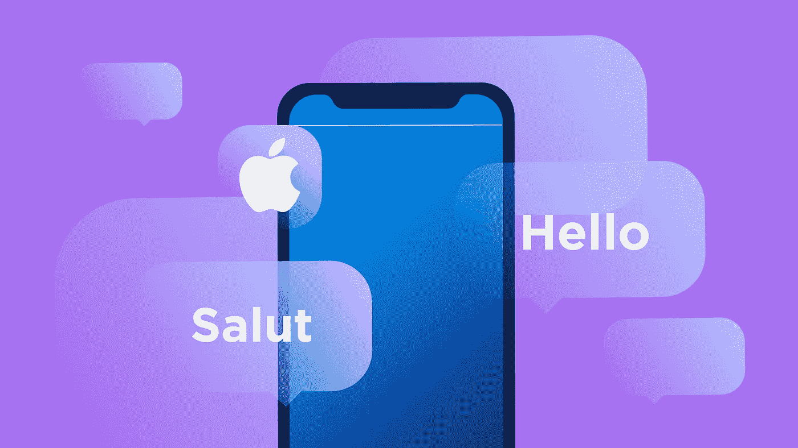

# iOS 本地化:Transifex Native 高级指南

> 原文：<https://medium.com/nerd-for-tech/ios-localization-an-advanced-guide-for-transifex-native-f56683620ed8?source=collection_archive---------3----------------------->



当谈到 iOS 和本地化时，苹果在 Xcode 中提供了集成的体验。添加新的区域设置并将可本地化的字符串从代码或 UI 中分离出来通常是一个自动且简单的过程。大多数问题出现在团队希望在产品的整个生命周期中翻译、更新和维护这些字符串的时候。

Xcode 允许开发人员将项目的所有可本地化字符串导出到. xliff 文件中，他们可以将该文件交给翻译团队或服务进行本地化。目标语言环境的本地化完成后，他们可以通过导入更新的将新的翻译添加到应用程序中。xliff 文件恢复到 Xcode。

iOS 本地化的现状留下了很大的改进空间:发布 App Store 应用程序更新只是为了修改一些翻译可能是一个相当漫长的过程。此外还要处理。手动创建 xliff 文件会带来一些问题，比如版本控制或缺少翻译。幸运的是，正如我们将在这篇文章中看到的， [Transifex Native SDK](https://docs.transifex.com/ios-sdk/quickstart-transifex-native-and-ios) 为这些问题提供了快速简单的解决方案。

这篇文章将回顾最重要的特性，强调你和你的团队可以改进你的应用程序的 iOS 本地化过程的方法。

# 空中翻译传送

空中翻译交付的本质是团队现在可以更新翻译的字符串，而无需发布新的应用程序更新。

当使用 Transifex Native SDK 时，作为开发人员，您可以在应用程序中捆绑翻译后的字符串，这样 SDK 在初始化时就可以使用它们。

您还可以控制 SDK 何时尝试使用异步 [fetchTranslations](https://transifex.github.io/transifex-swift/Classes/TXNative.html#/c:@M@Transifex@objc(cs)TXNative(cm)fetchTranslations:tags:completionHandler:) 方法从 Transifex 更新存储的翻译。尽管我们建议在应用程序启动时调用此方法，但这部分完全取决于您和您的应用程序的需求。您的应用程序可能希望在不同的环境下更新其翻译，例如当用户明确请求时，或者当只有 WiFi 连接活动时。

当 SDK 下载新字符串时，翻译缓存会更新，这些翻译在下次应用程序启动时可用。 [fetchTranslations](https://transifex.github.io/transifex-swift/Classes/TXNative.html#/c:@M@Transifex@objc(cs)TXNative(cm)fetchTranslations:tags:completionHandler:) 方法也将通过完成处理程序通知您它的完成，并且由您在您的应用程序中处理该事件，例如通知用户有更新可用。

# 现实生活中的例子

让我们看看这在实践中是如何工作的:

*   “Awesome”应用程序的开发人员通过 txios-cli 工具将字符串推送到 Transifex(下面将详细介绍)。
*   本地化团队翻译推送的字符串。
*   开发人员使用 txios-cli 的 pull 命令下载这些翻译并存储在一个文件(txstrings.json)中。
*   开发人员将该文件与应用程序捆绑在一起，这样一旦 SDK 初始化，它就会尝试从该文件加载存储的翻译。
*   开发团队在应用程序启动时添加了对 [fetchTranslations](https://transifex.github.io/transifex-swift/Classes/TXNative.html#/c:@M@Transifex@objc(cs)TXNative(cm)fetchTranslations:tags:completionHandler:) 方法的调用，这样应用程序就可以在有新版本可用时更新缓存的翻译。
*   该团队在 App Store 上发布了一个新版本，但不久之后，支持团队发现了一些缺失的字符串和不正确的翻译。
*   团队无需重新捆绑这些翻译并发布新的更新，只需从 Transifex web 界面添加缺失的翻译并修复不正确的翻译即可。该应用程序将自动下载和更新上述翻译，并在下次应用程序启动时提供服务！🍾

# 将源字符串推送到 Transifex 并从 transi fex 中拉出翻译

除了 Transifex 原生 SDK，Transifex 还提供了一个新的[命令行工具](https://github.com/transifex/transifex-swift-cli)，这样 iOS 开发者就可以直接与 [Transifex CDS](https://www.transifex.com/blog/2020/cds/) 交互，而不需要处理中间文件(。xliff)和容器(。xcloc)。

# 推送源字符串

使用命令行工具的 push 命令，您可以指向应用程序的 Xcode 项目，让工具将应用程序的所有源字符串导出、打包并发送到 Transifex。

要实现这一点，只需按照存储库上的说明安装 txios-cli [，并执行类似下面的命令:](https://github.com/transifex/transifex-swift-cli#installation)

```
txios-cli push --token <your_transifex_token> --secret <your_transifex_secret> --project <Awesome.xcodeproj>
```

push 命令行为可以通过许多不同的参数来控制。您可以在此处或通过执行以下命令了解关于参数[的更多信息:tx IOs-CLI push–help](https://github.com/transifex/transifex-swift-cli#pushing)

# 拉翻译

如上所述，开发人员还可以使用命令行工具从 Transifex 下载(或提取)翻译到一个文件中，该文件稍后可以捆绑到应用程序中。就像 push 命令一样，pull 命令也是一行程序:

```
txios-cli pull --token <your_transifex_token> --translated-locales <comma_separated_list_of_locale_codes> --output <output_directory>
```

要获得 pull 命令的完整参数列表，可以执行以下命令:

```
txios-cli pull –help
```

pull 命令需要一个将从 Transifex 下载的已翻译语言环境的列表，以及一个将存放生成的 txstrings.json 文件的输出目录。

下载 txstrings.json 文件后，您可以将它拖放到应用程序的 Xcode 项目中，确保主应用程序目标的“复制捆绑资源”构建阶段包含它。

# 能够在应用程序中更改本地化语言环境

从 iOS 13 开始，用户可以通过设置应用程序中每个应用程序设置下的设置为每个应用程序指定不同的本地化。

Transifex Native SDK 通过其默认的[TXPreferredLocaleProvider](https://transifex.github.io/transifex-swift/Classes/TXPreferredLocaleProvider.html)支持上述行为，但开发人员可以更进一步:SDK 提供了提供您自己的应用内区域设置选择器的选项，或者如果要使用另一个源(例如来自远程服务器)，则覆盖区域设置首选项。[txcurrentlocalprovider](https://transifex.github.io/transifex-swift/Protocols/TXCurrentLocaleProvider.html)是用于覆盖 SDK 使用的当前区域设置的协议。

# 在 Transifex UI 中处理多元化

iOS 版 Transifex Native SDK 也支持开箱即用的多元化。命令行工具将检测、解析并推送在源语言环境中找到的任何现有的多元化规则。同时，SDK 将在 iOS 应用程序中正确呈现翻译后的多元化字符串。

此功能最大限度地降低了由于多元化文件的困难结构而导致的不正确翻译的风险。stringdict)，因为该团队将在用户友好的 Transifex web 界面中直接处理所有的多元化翻译。

上述 iOS 本地化指南涵盖了 Transifex 原生 iOS SDK 提供的最具影响力的功能。为您的团队利用这些特性将极大地改进本地化过程，并消除您当前可能面临的任何上述限制。

# 相关内容

如果您想了解更多关于 iOS 本地化和 Transifex Native 国际化的信息，请查看相关的:

*   [Transifex 文件](https://docs.transifex.com/ios-sdk/quickstart-transifex-native-and-ios)
*   [YouTube 教程](https://www.youtube.com/watch?v=7tGwU-om-Es&list=PLzM9i6S16f2QtAqbNKQvCszr5ji4iCkEp)
*   [更多 Transifex 原生博客](https://www.transifex.com/blog/category/tx-native/)