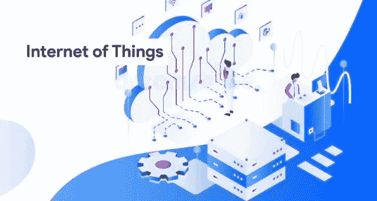

# 作为下一代智能家居的物联网用例

> 原文：<https://medium.com/nerd-for-tech/iot-use-case-as-the-next-generation-smart-home-f8bfc4fa615f?source=collection_archive---------10----------------------->

## 介绍

作为下一代智能家居的物联网用例。物联网不再只是一句口号。它应用于传感器、家庭通信、工厂、汽车和当地农场。一些市场敏锐地发现了使用物联网设备带来的好处。结果，接受度继续增长。因此，市场专家认为物联网将走向何方。在本帖中，我们将发现智能家居在今天和未来都将受到物联网的影响。

技术只是存在的说法推动了特定实现的方向。而不是专注于新兴技术来满足真实而重要的人类需求。在自动化和智能化的许多阶段，智能家居经常出现这种情况。

## 描述

智能家居的意义在于连接。每个房间一个 pod 的网络确保了可靠的连接，因此每个设备在一周内每天都可以工作。这些网状网络使用算法不间断地自我修复。他们使用算法来提高性能。最终使得消费者几乎看不到网络。类似于 5G 的新通信标准和技术正在填补通信空白。这有助于保护消费者，一切都正常。

[人工智能](https://www.technologiesinindustry4.com/) (AI)正在将这种即插即用的变化推向看不见的网络。AI 是机器建立的智能。没有什么比人类和动物表现出的包括意识和情感在内的自然智能更好的了。人工智能使用计算机系统来执行任务。这些任务通常需要人类智能，例如，视觉感知、语音识别、决策和语言翻译。

我们的声音和日常行为将激活物联网设备来代表我们采取行动。我们只需要一些东西，它就会井然有序地被提供。当我们从冰箱里拿出一个牛奶盒时，牛奶将自动出现在我们的购物清单上，并被送到我们的智能家居中。随着人工智能变得更加智能，我们的家庭网络将消失在背景中。我们现在看到我们的设备变得更小，更光滑，更美观。

随着人工智能等新技术的进步，这些设备将更多地融入我们的家居装饰。我们甚至不会注意到他们的存在。

更多的处理将在网络边缘的设备中进行，作为下一代智能家居中云或网络网关的替代方案。边缘计算将发展规范，确保更高的表现、可靠性和安全性。

## 重要的社会、经济和环境需求

看一下智能家居的定义是势在必行的。例如，一个地方是空的，或者肯定比现在多得多。在被定义为荣誉之地之后，是时候离开了。同样，用一个方便和选择来代替它。或多或少的重要趋势和想法会影响技术行业人士对智能家居的思考方式，包括:

*   对我们传统就业方式的干扰影响了我们的居住和家居使用方式。
*   住房市场围绕支付能力和准备程度的变化，完成了人们可能居住的地方和他们工作的地方。
*   对当前医疗保健系统的担忧伴随着对更好的自我监控和数字健康解决方案的兴趣和需求。
*   能源生态系统控制着随后的气候变化和一个更加电气化的世界。

每个人对家应该意味着什么都没有相同的概念。不同的人有不同的能力、灵活性或机会来定义这一点。以下是我们引入的家居和技术目前应该涉及的一些主要应用领域:

*   日常任务的重要性:生产力自动化之路。
*   除了个人健康和精神幸福之外，生活改善自我改善。
*   同时解决个人层面和系统层面的问题:增加家庭内部和社区的共同选择。
*   假设这些大趋势和不同的观点来定义家。

## 智能家居系统中的基本价值驱动因素

在智能家居系统中，大约有三层价值:第一层是随时随地可访问和控制的适用性。此时，消费者可以改变他们设备的状态，例如锁门、关灯等。

第二层允许消费者监控和管理基于他们产生的数据的这些系统的表示。因为消费者可以根据智能仪表数据成功控制他们的能源消耗，或者使用智能恒温器进行精细的基于区域的温度控制来控制成本。

最后一层是自动化。这是一个逻辑层，允许用户根据个人需求和喜好对整个系统进行微调和自动化。

在创造智能家居未来的过程中，三组重要的技术紧密结合在一起。因为每一个都与一种重要的社会倾向有关。

## 连通性

连接是智能家居的简单结构模块。这就是让家变得看不见的原因。此外，不断适应计算机与越来越多的有价值的数据。然而，到目前为止，并不是所有的社区都被合理地保留在连通性故事中。或多或少的裂缝是由基础设施不完善造成的。那可能是新技术在讲，比如 5G。

5G 可能是一项变革性的技术，将智能家居与快速带宽联系起来。它通过更好的能效和安装经济性，缩短了无线环境中的延迟。无线电源是 5G 的一项重要平衡技术，因为它消除了有线方法的时间、成本和位置障碍。

## 越来越无形和智能的技术

通过人工智能、语音和其他识别方法进行智能联系和互动:我们可以迅速从一个主要是交易性的智能家居环境时代转向一个由满足人类关于幸福、意义和意义的更深层需求驱动的时代。大量的这将被允许

*   语音和人工智能的进步联姻。
*   半导体硬件的发展使得语音处理更加精确。
*   生物识别技术有助于跨越人类感知和识别的自动边界。

赋予这些逐渐智能化和隐形的设备权力将变得比现在更具挑战性。他们需要位于非传统的地点。因此，住宅可以真正了解其居民，最终甚至提前了解他们的需求。

智能设备有两个共同的要求，即连接性和功耗。如今，对于需要可靠电源的设备和允许在几乎任何地方使用的一次性电池，有两种预防性解决方案。则需要可靠但限制沉降的正常检查和更换。一个更环保的家庭的实际解决方案是无线供电。

## 能量接触和生产率

如果设备所需的能源不可信，智能家庭和群体的价值和相关性就会降低。如果它们的生产导致电力改变化石燃料成为新的全球污染源，它们的价值就会下降。危险的天气、更常见的紧急情况以及温度过高时可疑的峰值需求可靠性，促使个人和社区对电力接入和恢复能力承担越来越多的责任。

更多详情请访问:[https://www.technologiesinindustry4.com](https://www.technologiesinindustry4.com/2021/08/iot-use-case-as-the-next-generation-smart-home.html)