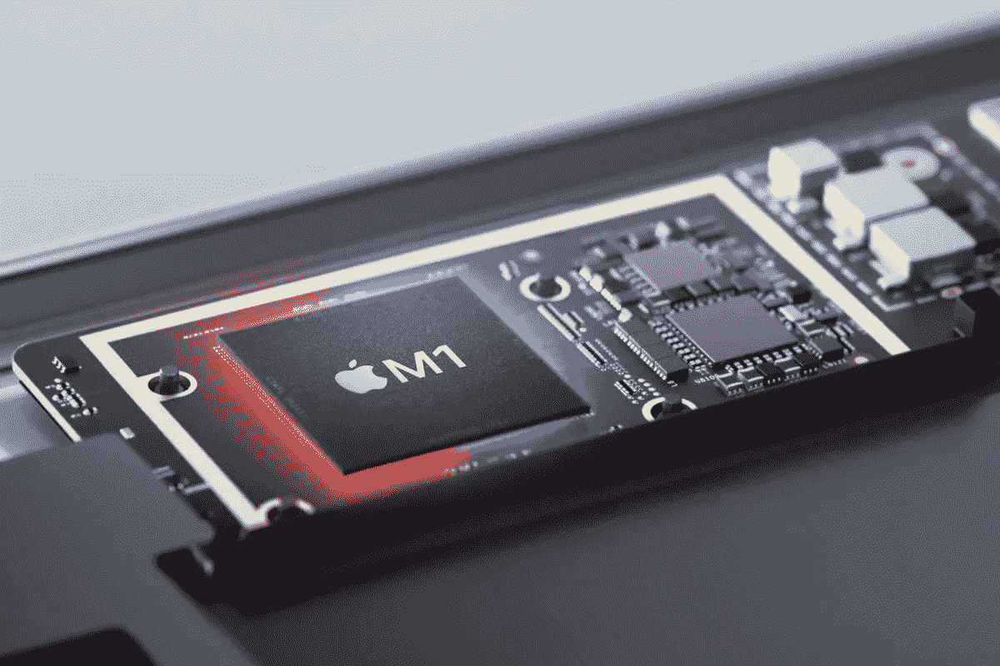
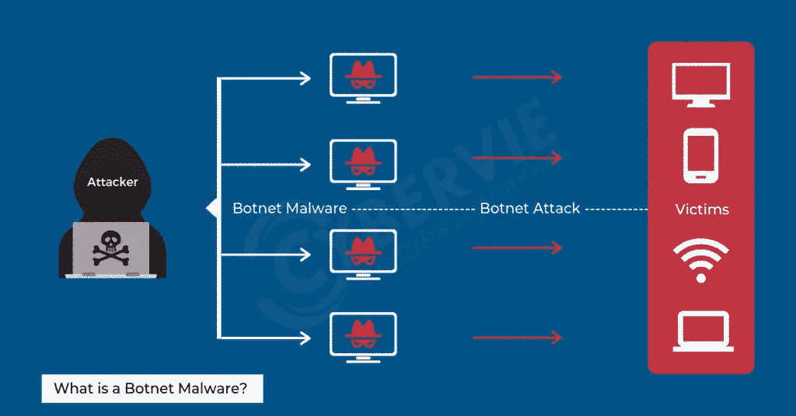

# 物联网漏洞:IP 摄像头是最不安全的物联网设备

> 原文：<https://medium.com/nerd-for-tech/iot-vulnerabilities-ip-cameras-the-of-most-insecure-iot-device-b1dcf73d8b03?source=collection_archive---------2----------------------->

互联世界！

通过技术，世界比以往任何时候都更加紧密地联系在一起，不管是好是坏。Nikita Duggal 在她的文章“什么是物联网设备”中指出，“物联网是一个总括术语，指的是连接到互联网的数十亿个物理对象或“东西”，它们都通过互联网收集数据并与其他设备和系统交换数据。”物联网设备提供了连接、收集数据、分析数据、监控等手段。到 2030 年，预计全球将使用 500 亿台物联网设备。(Vailshery)目前感兴趣的领域包括家用设备、物联网基础设施、安全和监控、运输、制造、农业和通信。(提瓦西亚)

本文重点关注与 IP 或智能摄像机相关的安全影响和研究。互联网上物联网设备的安全性备受关注。咨询通过分布式拒绝服务攻击(DDoS)淹没服务并导致它们崩溃，从而将物联网设备武器化。DDoS 通常是更大规模网络攻击的前兆和干扰。(Hussein)本文将首先讨论物联网设备的威胁和漏洞，以及海康威视和 Reolink 制造的特定 IP 摄像机的安全漏洞。最后，它将概述创建更安全、更具弹性的物联网设备的潜在解决方案。

物联网(IoT)是一项革命性的技术，通过一系列传感器和软件，使曾经由人工完成的任务实现自动化。在过去十年中，处理能力呈指数级增长。根据摩尔定律，密集集成电路中的晶体管数量每两年翻一番，这与处理速度直接相关。随着速度的快速提高和成本的持续下降，它能够快速高效地生产处理芯片。(摩尔定律)由于能够生产具有成本效益和功能强大的电路，它使硬件如片上系统(SoC)成为可能。SoC 是一个一体化组件，包含随机存取存储器(RAM)、中央处理器(CPU)和图形处理器(GPU)。这使得能够创建高效且强大的复杂小型计算机模型。将 SoC 嵌入到物联网设备中可以保证快速的处理速度，从而更好地收集和分析数据，同时比以往任何时候都更加互联。

计算的未来是 SoC 架构

每天都有新的设备连接到互联网，据估计，到 2030 年，将有大约 500 亿台物联网设备联网。随着越来越多的设备上线，产生的数据也越来越多。到 2025 年，总容量将达到 79.4 兆字节(ZBs)，即大约 722 亿兆兆字节的数据。(convert)这是一个很大的数据量，数据生成可能被恶意用来攻击现代互联网的关键组件，从而对 web 服务器、DNS 服务器、防火墙和应用程序造成损害。最近的一个例子发生在 2020 年，亚马逊网络服务(AWS)遭遇了分布式拒绝服务(DDoS)攻击。在攻击的高峰期，它达到了每秒 2.3 万亿字节以上，导致服务无法访问。(cioandleader)

僵尸网络的命令和控制

**物联网威胁**

物联网设备面临众多威胁，可能会影响组织和用户的安全性和隐私。我将重点介绍我认为与当今威胁形势最相关的 5 种威胁。随着越来越多的设备联网，威胁的数量将会增加，不安全的物联网的后果将会对组织、用户和社会造成不利影响。需要持续努力来发现、修补和缓解物联网设备和软件的漏洞。

1.**僵尸网络**——如前所述，迄今为止，DDoS 攻击甚至可以瘫痪最大组织的 IT 系统。DDoS 攻击通常是通过大型僵尸网络进行的。恶意行为者或网络犯罪集团在设备上安装恶意软件，使他们能够从指挥中心远程控制设备。他们可以利用数十万甚至数百万台物联网设备的集体处理计算机能力，发起巨大的 DDoS 攻击。如果成功，这可能会破坏 IT 系统的保密性、完整性和可用性。(Lakhani)这些被入侵的设备可能会导致未来的事件，并通过语音和视频记录为个人和组织提供间谍手段。

2.**OT 和物联网的融合** —物联网设备在运营技术(OT)中的使用正在快速扩展。设备用于收集各种数据，包括温度、颗粒计数、设备和位置。这些数据用于自动化重复的任务，如开灯和关灯。在过去，生产运营技术系统和信息技术网络是空气间隙的，这意味着它们是独立的，没有通过互联网连接。OT 和 IoT 设备的融合允许从企业网络和安全外部访问这些设备。新的连接能力使 OT 和 IT 网络容易受到物联网威胁。这阻碍了正确保护网络和设备的能力，需要更全面的安全方法。(拉哈尼)

3.**勒索软件** —勒索软件是一种特定类型的恶意软件，它允许犯罪分子锁定文件和设备，并以此勒索赎金。该恶意软件使用非常强的加密技术来删除对存储在网络上的计算机、数据和文件的访问。这种恶意软件变得越来越复杂，可以找到并删除备份，使其更难恢复。从 2019 年到 2020 年，勒索软件攻击增加了惊人的 485%。物联网设备的使用和缺乏实施的安全性为网络提供了一个简单的接入点，也为实施勒索软件等网络攻击提供了一种手段。

4.**基于人工智能的攻击** —人工智能或基于人工智能的攻击允许威胁行为者通过操纵人类情绪来创建复杂的社会工程攻击。最常见的发送方式是网络钓鱼邮件。随着人工智能的能力变得更像人类，它的使用越来越多。基于人工智能的工具可以模拟正常的用户流量。人工智能系统可以执行重复的任务，并且很容易扩展。不安全的物联网设备是将攻击引入网络的手段，并且由于人工智能的能力，这些设备很容易发生变化。

5.**物联网设备检测和可见性** —物联网设备可以有各种形状、大小和功能。如果没有识别出所有的已知设备，就很难保证网络的安全。一个主要困难是物联网设备不容易被网络安全检测到。如果这些设备无法识别，就无法评估这些设备会带来什么威胁。缺乏设备可见性和对物联网设备的检测，使得流氓设备被利用，并成为进一步安全事件的先兆。在网络安全方面，监控设备并使用必要的补丁和更新不断更新至关重要。

**IP 摄像头漏洞**

互联网协议摄像机或简称 IP 摄像机，设计用于通过局域网或互联网发送和接收数据。支持互联网的摄像机提供了从连接到互联网的任何地方访问现场直播的能力。IP 摄像头是一种物联网设备，可以像其他物联网设备一样轻松利用。下面，我将重点介绍 IP 摄像机的常见漏洞，并进一步详细介绍 Reolink 和海康威视制造的特定类型的 IP 摄像机。(霍诺维奇)

**常见漏洞**

1.**中间人攻击** —这些类型的攻击会带来严重的隐私和安全问题。中间人(MitM)攻击非常有效且易于实施。MitM 使攻击者能够窃取信息并中断对网络服务的访问。(Doughty)2019 年的一项最新研究，*使用 ARP Poising 对 IP 摄像头的漏洞分析，*说明了 MitM 攻击如何秘密地拦截来自源的流量，并将其转发到新的目的地。这是通过地址解析协议(ARP)中毒实现的。设备将 MAC 地址和 IP 地址等信息存储在它们的 ARP 表中。攻击可以通过发送 ARP 回复并将流量转发给自己来毒害这些缓存表。(Doughty)研究人员使用各种工具成功攻击了 Reolink RLC-410WS IP 摄像头。Reolink 摄像机符合 ONVIF(开放网络视频接口论坛)标准，这意味着所有遵循该标准的摄像机都容易受到攻击。ONVIF 允许通过 VLC 等应用程序从摄像机获得实时视频。来自松下、海康威视数字技术和索尼公司等知名 IP 摄像机制造商的近 11，443 款产品易受影响。(多蒂)

2. **DDoS 攻击**攻击者通过利用 IP 摄像头，可以洞察建筑物的布局、里面的贵重物品以及网络上的设备。后来，攻击通过暴力破解密码和读取网络中的明文互联网流量在网络中横向移动。(Doughty)这是一个例子，说明它如何能够转化为现实世界中对社会产生影响的事件。

3.**远程代码执行(RCE)** — RCE 漏洞使得攻击者能够完全控制受害者受感染的机器。如果攻击得逞，攻击者可以执行写入、修改、删除和读取文件等系统命令，并连接到数据库。(Cyware)RCE 通常是网络的入口点，攻击者可以在整个网络中移动，并提升他们的权限以完成他们的任务。

由于政府的支持，海康威视已经成为世界上使用最广泛的视频监控制造商。该公司因其产品不安全而受到审查。2021 年，安全研究员，*watchly _ IP*发现了一个零点击漏洞。如果被利用，这将提供对设备的超级用户访问和完全控制。该漏洞只需访问 http(s)服务器端口，如 80/443。不需要用户名或密码，也不会被相机上的日志检测到。自该漏洞被发现以来，海康威视已经发布了安全补丁，但该漏洞自 2016 年以来一直存在，并影响着海康威视的 OEM 合作伙伴以及全球超过 1 亿台设备。(霍诺维奇)

**潜在解决方案**

在以上段落中，研究和最近的网络事件解释和说明了物联网设备的威胁和漏洞。现在，将介绍两种可能的解决方案，以确保更安全的物联网设备，以及在发生事故时如何减轻可能的影响。在生产物联网设备的整个开发过程中，安全是重中之重，这一点非常重要。安全性不能是事后的想法，而是一个关键的组件和功能。

**零信任** —零信任(ZTA)架构安全模型依赖于组织的身份和访问管理(IAM)策略。(翰威特)。如果实施正确，在组织中实施 ZTA 可以增强安全性，并提供有关设备的详细信息，以维护设备和连接的连续清单。ZTA 使用多因素

验证设备身份的身份验证(MFA)。此外，零信任网络架构(ZTNA)“关注谁和什么*可以连接到位于网络上的应用程序”。按照设计，这种方法通过将应用程序放在一个称为代理点的门后，增强了网络的安全性。代理点创建传输数据的加密隧道，以提供到网络的安全连接。正确使用零信任大大增强了网络架构、设备和网络服务的安全性。*

信任不是设计出来的

**设计安全** —应用于物联网的设计安全是“在物联网旅程的每个阶段都包含安全设计原则、技术和治理”(Schmid)。物联网设备通过收集和处理数据来完成重复性任务，从而弥合数字世界和现实世界之间的差距。物联网设备通常是最薄弱的环节，很容易被利用来访问整个网络。在整个开发过程中，安全性是首要关注点，这一点至关重要。以下是设计安全物联网架构的 3 个关键:(泰雷兹)

1.设计安全方法始于物联网项目之初，包括安全风险分析。

2.可信设备 id 和凭证在制造过程中嵌入，以防止设备克隆、数据篡改、盗窃和误用。

3.锁 id 和凭证存储在安全的硬件容器中，以保护敏感的物联网应用，如医疗保健和智能电网。

零信任和设计安全的实施可以确保物联网设备和网络从根本上更加安全。这两个潜在的解决方案不会解决物联网设备的所有不安全问题，但它们将有助于创建更安全、更具弹性的物联网设备。

**结论**

物联网设备的采用和总体使用正以惊人的速度增长。到 2030 年，预计将有 500 亿台物联网设备。物联网通过提供连接、收集和分析数据的能力，以及提供卓越的监控能力，将数字世界与现实世界连接起来。当前的物联网设备和安全标准不足以应对当前和未来的威胁。作为物联网设备的消费者，我们需要接受更多的教育，并能够理解我们购买的产品中安全性的重要性。消费者对安全的期望需要改变，因为在当前和未来的数字时代，世界需要有良知的个人来保护隐私和安全。

感谢阅读！

干杯

来源

达隆·亚当斯。“2021 年上半年，IOT 设备攻击将增加一倍，远程工作可能会承担部分责任。” *TechRepublic* ，TechRepublic，2021 年 9 月 13 日，[https://www . tech Republic . com/article/IOT-device-attacks-double-in-first-half-of-2021-and-remote-work-may-should-some-the-the-fall/](https://www.techrepublic.com/article/iot-device-attacks-double-in-the-first-half-of-2021-and-remote-work-may-shoulder-some-of-the-blame/)。

密码，密码。"事故响应和补救的核心阶段."*密码*，密码，2020 年 5 月 28 日，[https://Cipher . com/blog/the-core-phases-of-incident-response-remediation/](https://cipher.com/blog/the-core-phases-of-incident-response-remediation/)。

Cyware 黑客新闻。“远程代码执行漏洞:它是什么以及如何防范它？:Cyware 黑客新闻。” *Cyware 实验室*，Cyware，2020 年 2 月 22 日，[https://Cyware . com/news/remote-code-execution-vulnerability-what-it-and-how-to-stay-protected-from-it-12a 1 b 250](https://cyware.com/news/remote-code-execution-vulnerability-what-is-it-and-how-to-stay-protected-from-it-12a1b250)。

Devasia，Anish。" IOT 基础设施的基础知识-技术文章."*控制自动化*，2021 年 6 月 27 日，[https://Control . com/technical-articles/the-basics-of-IOT-infra structure/](https://control.com/technical-articles/the-basics-of-iot-infrastructure/)。

使用 ARP 中毒的 IP 摄像机的脆弱性分析。*空对空*，1，瑙曼·伊斯拉尔 2 和乌斯曼·阿德埃尔，2019，[https://aircconline.com/csit/papers/vol9/csit90712.pdf](https://aircconline.com/csit/papers/vol9/csit90712.pdf)。

达戈尔尼基塔。"什么是 IOT 设备:定义、类型和 2021 年最受欢迎的 5 种设备."*Simplilearn.com*，Simplilearn，2021 年 4 月 12 日，[https://www.simplilearn.com/iot-devices-article](https://www.simplilearn.com/iot-devices-article)。

休伊特凯西。“什么是零信任架构？实施的 9 个步骤。”*安全评级&网络安全风险管理*，安全评分委员会，2021 年 7 月 14 日，[https://securityscorecard . com/blog/what-is-zero-trust-architecture](https://securityscorecard.com/blog/what-is-zero-trust-architecture)。

约翰·霍诺维奇。“海康威视具有‘最高级别的关键漏洞’，影响 1 亿多台设备。”*https://ipvm.com/reports/hikvision-36260*2021 年 9 月 20 日[IPVM](https://ipvm.com/reports/hikvision-36260)。

休伊特凯西。“什么是零信任架构？实施的 9 个步骤。”*安全评级&网络安全风险管理*，安全评分委员会，2021 年 7 月 14 日，[https://securityscorecard . com/blog/what-is-zero-trust-architecture](https://securityscorecard.com/blog/what-is-zero-trust-architecture)。

侯赛因(AbdelRahman H .)“物联网(IOT):研究挑战与未来……”*Thesai.org*，(IJACSA)国际先进计算机科学与应用杂志，2019 年，[https://thesai . org/Downloads/volume 10 no 6/Paper _ 11-Internet _ of _ Things _ IOT _ Research _ Challenges . pdf](https://thesai.org/Downloads/Volume10No6/Paper_11-Internet_of_Things_IOT_Research_Challenges.pdf)。

詹姆斯·科克。“勒索软件攻击在 2020 年增长了 485%。”*信息安全杂志*，2021 年 4 月 6 日[https://info security-Magazine . com/news/ransomware-attacks-grow-2020/](https://infosecurity-magazine.com/news/ransomware-attacks-grow-2020/)。

拉哈尼阿米尔。"检查主要的 IOT 安全威胁和攻击媒介:Fortinet . " *Fortinet 博客*，2021 年 6 月 7 日，[https://www . Fortinet . com/Blog/industry-trends/examing-top-IOT-security-threat-and-attack-vectors](https://www.fortinet.com/blog/industry-trends/examining-top-iot-security-threats-and-attack-vectors)。

雷内·米尔曼。“物联网设备比以往任何时候都更容易受到攻击。” *IT PRO* ，IT PRO，2021 年 9 月 10 日，[https://www . IT PRO . com/network-internet/internet-of-things-IOT/360850/IOT-devices-is-more-vulnerable from event](https://www.itpro.com/network-internet/internet-of-things-iot/360850/iot-devices-are-more-vulnerable-than-ever)。

PrivSec。"研究揭示最易受攻击的 IOT 设备." *GRC 世界论坛*，GRC 世界论坛，2019 年 6 月 12 日，[https://www . grcworld Forums . com/security-threats/research-reveals-the-most-vulnerable-IOT-devices/86 . article](https://www.grcworldforums.com/security-threats/research-reveals-the-most-vulnerable-iot-devices/86.article)。

施密德·罗伯特·施密德首席未来学家| roschmid@deloitte.com·LLP·德勤咨询公司，罗伯特等，《IOT 平台安全设计》*德勤美国*，德勤，2021 年 9 月 2 日[https://www2 . Deloitte . com/us/en/pages/operations/articles/IOT-platform-security . html](https://www2.deloitte.com/us/en/pages/operations/articles/iot-platform-security.html)。

泰雷兹集团。“如何通过设计确保物联网解决方案的安全性。”*泰雷兹集团*，泰雷兹集团，2020，[https://www . Thales Group . com/en/markets/digital-identity-and-security/IOT/IOT-security/key-principles](https://www.thalesgroup.com/en/markets/digital-identity-and-security/iot/iot-security/key-principles)。

莱昂内尔·苏杰·韦尔谢里。“2030 年全球联网设备的数量。” *Statista* ，Statista，2021 年 1 月 22 日，[https://www . Statista . com/statistics/802690/world wide-connected-devices-by-access-technology/](https://www.statista.com/statistics/802690/worldwide-connected-devices-by-access-technology/)。

史蒂夫.韦斯曼。“什么是 Ddos 攻击？”*诺顿*，诺顿，2020 年 6 月 23 日，[https://us . Norton . com/internet security-emerging-threats-what-a-DDOS-attack-30 sec tech-by-Norton . html](https://us.norton.com/internetsecurity-emerging-threats-what-is-a-ddos-attack-30sectech-by-norton.html)。