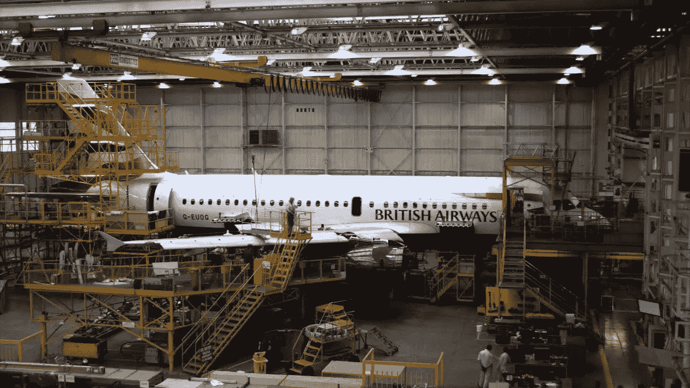

# 不定期航班跟踪系统

> 原文：<https://medium.com/nerd-for-tech/irregular-flights-tracker-system-3d81f1a0e04d?source=collection_archive---------6----------------------->

## 面向航空公司、客户和航空监管机构的技术平台。

英国航空公司维持其机队中的一架飞机

我在[这篇文章](https://mkrdiop.medium.com/airline-irrops-management-platform-40e358b06026)中写的不规则运营管理平台是为航空公司设计的，但你可以是这个[中型客机](/predict/the-middle-airliner-51febe8dc6fc)，它为自己设定的目标是检测航空公司使用进入其检查维护时间范围的飞机。

每个飞机型号都有一个规定的维护程序，该程序规定了在给定天数、飞行小时数或循环数的情况下应检查的零件、系统和部件。飞机的一个循环是起飞和着陆。这些维护检查按其重要程度进行分类。每架飞机都应该定期进行五种检查。你可以在这里找到关于这些支票[的更多信息。](https://en.wikipedia.org/wiki/Aircraft_maintenance_checks#A_check)

对于一架客机来说，这些检查是扰乱其航班调度的事件，对于数百架飞机来说，如果没有利用动态编程和机器学习的能力来最小化这些维护要求的破坏性影响的自动化规划系统，管理这些检查可能是一场噩梦。可以说，客机需要一个平台，能够自动通知飞机应该进行维护，并告诉维修团队应该检查的零件、组件和系统，以及正确完成工作所需的所有技术文件。主要的航空公司当然已经建立了这样的平台，但是你可以为新进入的航空公司建立一个，并与他们一起改进，直到你把它介绍给航空运输的领导者，如西南航空公司、美国航空公司、英国航空公司、法国航空公司、印度航空公司和中国航空公司。

但是，您最好利用当前的飞行数据，并尝试检测这些定期维护任务，因为飞行数据在这里可以通过飞行雷达等平台获得。手头有了这些数据，你就可以知道你要乘坐的飞机是在 1 天内进行维护检查，还是超出了定期维护的限制。像航班跟踪器一样，这可以是一个有用的平台，为客户提供有关他们自己登机的航班的规律性的信息，并且确实是一个可能引起美国联邦航空局等航空运输监管机构兴趣的工具。

这又是另一个[技术支持的平台](https://mkrdiop.medium.com/list/startup-ideas-c52ad2d38c54)，你可以为商业或提升你的软件工程技能而构建。