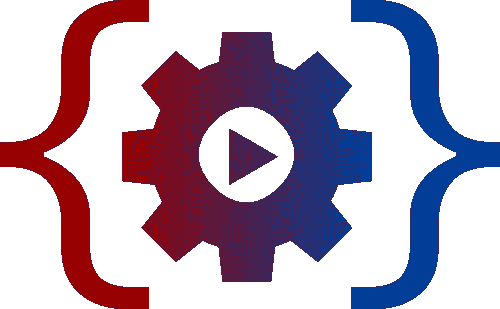
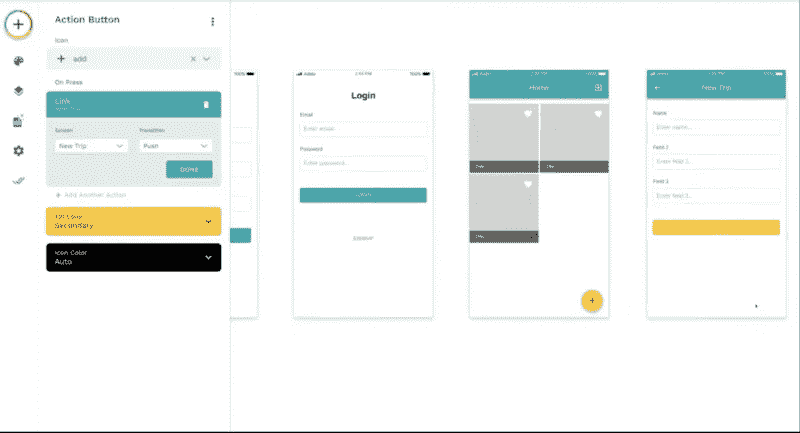

# AutoML 是“无编码”的一种形式吗？

> 原文：<https://medium.com/nerd-for-tech/is-automl-a-form-of-no-coding-d73cd4b48fc9?source=collection_archive---------7----------------------->

## 自动化机器学习(AutoML)和无代码趋势在过去几年里稳步增长，现在都是编程和人工智能领域的大事。

今天，让我们来谈谈这些运动以及它们之间可能的联系。

不久前，我写了[一篇文章](https://minapecheux.com/wp/no-code-movement/)并且[参加了一个关于无代码的播客](https://minapecheux.com/wp/i-participated-in-a-podcast/)，在那里我给出了我对这个哲学的问题和优点的观点。直到最近，我还在一家名为 [Prevision.io](https://prevision.io/) 的初创公司工作，该公司的目标是提供一个自动化平台。对这两者的一个小小的交叉检验让我思考这些运动之间可能存在的关系、它们的目标以及它们可能共有的缺陷。

# 首先:什么是 AutoML 和 no-code？

正如微软文档中的[所解释的那样，“自动化 ML”是关于减少数据科学家设计和投入生产他们的人工智能模型的时间。这一概念也与机器学习的民主化有关:大多数 AutoML 工具传达了一种用户友好、开放的信息，总体而言，它们欢迎所有人加入，甚至是所谓的“公民数据科学家”。这个想法基本上是通过让计算机处理你的机器学习管道中的迭代、重复和枯燥的任务(如数据清理、数据打包、模型调整、应用部署等)。)，你可以专注于更有意义的步骤，真正开发你的潜力——此外，由于系统抽象出了许多复杂的特定领域的概念，你不需要成为人工智能专家才能使用它。](https://docs.microsoft.com/en-us/azure/machine-learning/concept-automated-ml)

值得注意的是，目前有大量的 AutoML 工具正在兴起，每个工具都可以专注于机器学习过程的不同步骤，以实现自动化(有些涵盖整个链，但有些主要用于功能工程，有些用于开箱即用的模型培训，有些用于模型生产部署……)。当然，计算机科学领域通常的大玩家正在加入进来:微软推出了 Azure ML 云服务，IBM 推出了 AutoAI 解决方案，谷歌推出了 Cloud AutoML 解决方案。

类似地，无代码哲学宣扬直观的用户界面和现成的模块化工具箱，因为它想让编程成为一种主流爱好，可以被尽可能广泛的受众所探索。在这个时代，我们周围的一切都在某种程度上由计算机和代码控制，在我看来，让每个人都必须掌握编码技能是一个伟大而关键的想法。(如果想更深入地了解无代码，可以看看我以前写的关于这个主题的文章。)

这就是为什么当我去年发现无代码运动时，我立即看到了一些与 AutoML 趋势的联系。我将试着指出我认为这两种哲学的共同目标和缺陷。

# 共同目标

## #1:每个人都被邀请了！

尽管每个项目都有自己指定的最终用户，并针对特定的人群(遵循[市场细分](https://en.wikipedia.org/wiki/Market_segmentation)的规则)，正如我之前所说的，无代码和 AutoML 工具通常对任何人都是可访问的。

这是因为这两种趋势大多依赖于隐藏与程序员或数据科学家的工作相关的复杂性。他们通过提供用户友好的界面、拖放或一键操作来实现这一点，而不是代码行和现成的预设，这些都是为了尽可能提高效率而精心准备的。这创造了一种身临其境的(希望如此)直观的体验，即使非专业人士也可以投入其中，而不用担心会丢失巨大的概念。

像 Adalo(https://www.adalo.com/)这样的无代码解决方案依赖于轻量级和直观的用户界面，其中组件和行为可通过拖放或单动作按钮和下拉菜单进行配置。

此外，每个人都可以使用这些工具，因为它们通常是免费的(或便宜的)。这主要得益于云服务的发展。现在，公司可以为您提供功能强大的产品，而无需为它们安装和配置您的计算机。取而代之的是，你只需拥有一个账户(可能需要订阅，或者有免费试用期，或者如果你不是高级用户，还有其他一些限制),并作为直接消费者从他们的服务、数据存储、计算能力和硬件中受益。这种“[平台即服务](https://www.ibm.com/cloud/learn/paas)”(PaaS)(甚至“软件即服务”【SaaS】)的模式如今越来越成为一种规范:人们厌倦了在自己的电脑上塞满数百个应用程序——相反，他们更喜欢将一切都集中到云上，能够从任何地方访问它，最重要的是不必担心自己维护系统。对于公司来说，这通常有助于降低成本，因为你可以将成百上千的用户“组合在一起”，你只需要专注于同时发布并分发给每个人的一个产品，并且你可以为所有客户建立一个共享的架构。

*注意:我在这里把事情简化了一点——如果你曾经测试或检查过云解决方案，特别是它们的各种订阅服务，你可能会注意到这并不是真正的“所有人都有相同的体验”。所有这些公司都学会了为你提供一些定制服务，这要求他们有一定的灵活性，并阻止他们为每个用户提供完全相同的系统。然而，在大范围内，大多数客户选择基本服务，因此进入了可以满足相同需求的大用户池。*

PaaS 和 SaaS 模式，因为他们让公司为每个人使用相同的软件，也是“随用随付”系统的良好开端:从用户的角度来看，这意味着你将只为你实际使用的软件部分和你在软件上花费的时间付费。与为一个您永远无法用项目完全覆盖的成熟解决方案付费相比，这对用户来说通常是非常有益的。

## #2:减轻专家的负担

另一个我认为适用于 AutoML 和无代码解决方案的重要概念是原型。我在以前的文章中提到了无代码的这个方面，但是我想强调的是，作为一名程序员和数据科学家，我并没有感到这些工具的威胁。

相反，我看到了一个机会，可以自动化繁琐的任务，避免在每个新项目中重复相同的无意义的步骤。同样，我们现在有 CLI(命令行界面)来快速建立 web 项目( [Vue CLI](https://cli.vuejs.org/) ，[create-react-app](https://github.com/facebook/create-react-app)……)，我喜欢即时“实例化”一个新 ML 项目的想法。对我来说，这些哲学的优势在于，对于该领域的专家来说，它可以帮助快速绘制草图和粗略的原型，以便你可以实际上专注于你的软件或人工智能过程的底层架构——这是你真正的技能和你对项目的真正价值，最好你花时间做这些，而不是清理你的数据或重新设计另一个按钮，对吗？

# 常见缺陷

## #1:每个人都被邀请了！

不，我没有结巴——我确实把这列为优点*和缺点*！因为，尽管听起来很诱人，但说实话，提供能让每个人都满意的服务几乎是不可能的。我对一些好莱坞大片也有类似的感觉，它们想通过吸引尽可能多的观众来赚取尽可能多的钱，因此尽可能想出最传统、最标准化的场景:它们不想震惊或伤害任何人，所以它们实际上也不接触任何人。

对于 AutoML 和无代码，这也是一个问题。就像它可以降低电影的个性，使其更加沉闷，甚至无趣，这种用技术工具来满足任何类型观众的愿望通常会导致:

*   越来越多的功能很少被使用(并且很难维护),并且只对地球上的一两个人感兴趣
*   “介于两者之间”的用户界面:我个人的经验是，在这些工具中，用户界面同时太标准和太复杂了！我的意思是，为了吸引尽可能多的人，设计师依赖于众所周知的机制和直观的布局——这是一种很好的做法，但这使得很难区分一个平台与另一个平台，因为它们本质上是以相同的方式布局的。另一方面，随着功能的不断增加，你需要定期添加新的按钮、下拉菜单和菜单，这导致了一个厚厚的用户界面，导航起来令人头疼。
*   对文档的持续需求:这是前面几项的结果——因为产品积累了太多东西，必须把它们都打包到它的界面中，而且因为这些工具的核心思想是每个人都可以使用，所以创建者需要投入大量的时间来编写文档、制作教程…

## #2:抽象太多？

降低复杂性当然是个好主意！我完全赞成让专家来部署我的应用程序，并对服务进行一流的负载平衡，这样网络就不会挤满用户。但一如既往，问题是:你在哪里停下来？

有趣的是，我觉得在过去的这些年里，许多工作已经不仅仅是最初的交易:每个人都做自己的账单，每个人都需要知道如何管理一个项目，每个人都必须能够营销他们的产品……假设你作为一名 Python 开发人员加入了一家公司；你可以兼职做一些 R&D，写一些文章，寻求软件架构的建议，或者处理你自己代码的文档化。虽然这本身并不坏*(我个人完全没有能力坚持完全相同的任务超过几个月)，但它确实提出了一个问题:你应该如何知道所有这些技能？你很可能已经成为了一名 Python 开发人员，因此一开始你觉得有资格申请这份工作；但是所有这些额外的工作都是没有预料到的。*

*如果我告诉你，计算机可以帮你处理这些事情，你可能会松一口气——因为它可能比你更了解这些事情，你也不必去探索未知的领域。*

*现在，让我们把事情调换一下:如果我告诉你一台计算机可以完全自动化 Python 编码部分，你只需要负责剩下的部分，你会说什么？*

*我认为这是无代码和 AutoML 解决方案的一个陷阱:它们倾向于过度简化工作的核心技能。有时做得很好，有时做得不太好——然而，领域专家可能会觉得他们被剥夺了主要目的。此外，作为该领域的新人，如果一切都对你隐藏，你可能很难理解这项工作的重要概念，所以你永远不会真正了解你每天使用这个伟大的自动化工具所做的过程的来龙去脉——你只会对该领域有一个表面(因此可能有偏见)的了解。*

*这种抽象甚至会引发安全问题:因为您需要在服务上上传和存储您的数据，您可能会担心它被服务的所有者滥用；而且你会遇到“供应商锁定”的问题:一旦你选择了无代码或 AutoML 平台，你通常会一直坚持到最后。你依赖于他们的解决方案，被迫遵守他们的规则，跟随他们的选择…并希望他们不会崩溃！*

**

*xkcd(https://xkcd.com/1319/)的“自动化”*

## *#3:一切标准化*

> **因为【无代码】是一个更高层次的抽象，它在某些方面会有限制。你不会有和代码一样的灵活性。**

*这是[伊曼纽尔·斯特拉施诺夫所说的](https://codecoda.com/en/blog/entry/will-no-code-development-platforms-kill-coding)——他是无代码解决方案 [Bubble](https://bubble.io/) 的联合创始人。是的，我对 no-code 和 AutoML 的最后怨恨是关于标准化的。*

*再一次，取悦每个人限制了你的选择，迫使你关注一组常用的元素或特性。你不需要在原创的想法或组件上花费额外的时间，你首先(并且最终只)生产你确信每个人都会喜欢和使用的主流工具。你还以标准的方式包装你的产品，这样每个人都有宾至如归的感觉，可以轻松浏览你的网站。您为常见情况提供了高效的解决方案……但缺乏边缘情况所需的定制(如特定的数据库扩展、特定领域的安全法规等)。).*

*事实上，我之前称赞的那些平台的“免费和便宜”方面只在一定程度上是真实的——通常情况下，任何个性化都需要你付费；有时，这甚至会超过“传统”手动开发的解决方案的成本。*

*也许这种标准化也会抑制一些人的创造力，阻碍原创想法的产生。如果每个人都使用相同的无代码解决方案和相同的可视化组件，那么在最终的应用程序中很难获得有创造性的用户界面；如果每个人都利用相同的自动特征工程模块和预先训练的模型，也许机器学习将开始兜圈子，只提供正确但平均的预测，而没有新的突破性处理方法。*

# *结论*

*AutoML 和无代码都是迷人的趋势，可能会对开发人员和数据科学家社区产生巨大影响。虽然这可能对一些人来说很可怕，并且延续了众所周知的对“计算机偷走我们的工作”的恐惧，但我认为我们不应该反对这些新的哲学。相反，如果这些工具被用作一个中间地带，一种让非专业人士与专家交流的新媒介，那么对程序员和非编码人员来说都会更有趣。*

*我深信，让更多的人参与进来会令人惊奇:在开发的世界中拥有新的观点、新的思维方式、新的文化背景会帮助意想不到的想法开花结果；与他人分享我们的代码知识有助于提高人们对现代社会中技术使用的全球意识，这在今天是至关重要的。也许是时候让我们程序员和人工智能专家加入无代码/自动语言的潮流了，哪怕只是为了和意想不到的同行讨论？*

**如果你喜欢这篇文章，你可以在* [*我的网站*](https://minapecheux.com/wp/) *:)* 上找到更多关于科技、人工智能和编程的博文*

> *参考*

1.  *Prevision.io 的网址:[https://prevision.io/](https://prevision.io/)*
2.  *微软 Azure ML 的网址:[https://Azure . Microsoft . com/en-GB/services/machine-learning/](https://azure.microsoft.com/en-gb/services/machine-learning/)*
3.  *IBM AutoAI 的网站:[https://www.ibm.com/cloud/watson-studio/autoai](https://www.ibm.com/cloud/watson-studio/autoai)*
4.  *Google Cloud AutoML 的网址:【https://cloud.google.com/automl T3*
5.  *泡泡的网址:【https://bubble.io/ *
6.  *Vue CLI 的网站:[https://cli.vuejs.org/](https://cli.vuejs.org/)*
7.  *创建-反应-应用程序的 Github:[https://github.com/facebook/create-react-app](https://github.com/facebook/create-react-app)*
8.  *微软文档，“什么是自动机器学习(AutoML)？”([https://docs . Microsoft . com/en-us/azure/machine-learning/concept-automated-ml](https://docs.microsoft.com/en-us/azure/machine-learning/concept-automated-ml))，2020 年 10 月。【在线；最后访问日期:2021 年 2 月 22 日]*
9.  *IBM 云教育，“PaaS(平台即服务)”([https://www.ibm.com/cloud/learn/paas](https://www.ibm.com/cloud/learn/paas))，2019 年 10 月。【在线；最后访问日期:2021 年 2 月 22 日]*
10.  *K.Terziev，“无代码开发平台会扼杀编码吗？”([https://code coda . com/en/blog/entry/will-no-code-development-platforms-kill-coding](https://codecoda.com/en/blog/entry/will-no-code-development-platforms-kill-coding))，2020 年 10 月。【在线；最后访问日期:2021 年 2 月 22 日]*
11.  *I .维基媒体基金会，“市场细分”([https://en.wikipedia.org/wiki/Market_segmentation](https://en.wikipedia.org/wiki/Market_segmentation))，2021 年 1 月。【在线；最后访问日期:2021 年 2 月 22 日]*