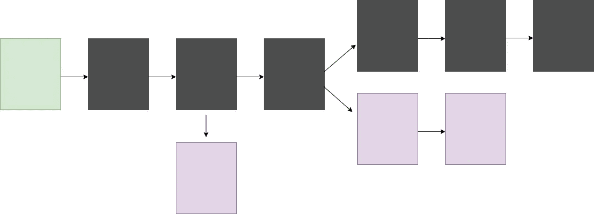
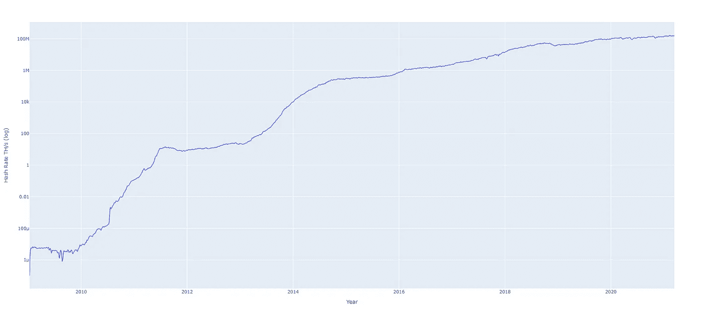
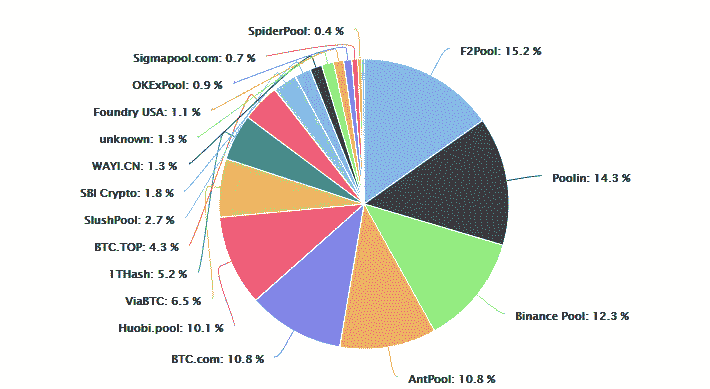
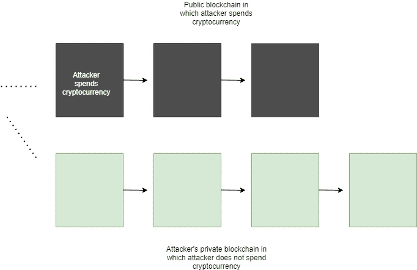
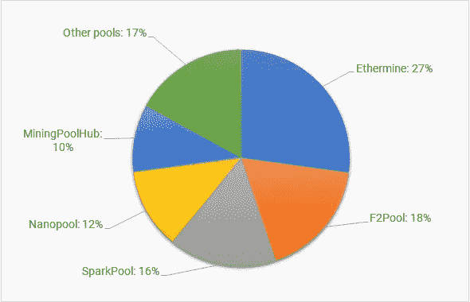

# 比特币真的去中心化了吗？

> 原文：<https://medium.com/nerd-for-tech/is-bitcoin-really-decentralized-e8932d9c1355?source=collection_archive---------6----------------------->

> 我一直在开发一个新的电子现金系统，它完全是点对点的，没有可信的第三方。—中本聪

这就是比特币的承诺:一个去中心化的现金系统，它的工作不需要任何第三方。

> 只要诚实的节点控制着网络上的大部分 CPU 能力，它们就能生成最长的链并超过任何攻击者。—中本聪

只要诚实的节点控制着网络上的大部分计算能力，网络就不可能被攻破。在这篇文章中，我讨论了比特币为什么不像大多数人认为的那样分散，以及为什么会出现这种情况。

# 工作证明

我们退一步讲比特币挖矿。比特币的工作原理是一种工作共识模型。这意味着，为了批准比特币交易，需要执行一些计算工作。比特币的计算工作是用不同的输入计算一个散列函数。计算能力是以哈希速率或每秒可以执行的哈希数来衡量的。

计算工作由矿工网络完成，他们通过服务获得报酬，要么是交易费，要么是新生成的比特币。每个区块产生的比特币数量是固定的，每年减半。

一旦一个矿工完成了添加一个块所需的工作，其他矿工就开始在这个块的基础上处理下一个块。最长的链被认为是真理的点。在两个区块链长度相同的情况下，只需等待其中一个变长。

一个区块链样品。紫色块是陈旧的块。

例如，在上图中，黑色块代表真实版本的区块链。紫色区块是采矿者执行工作证明并试图将其添加到区块链的区块。然而，这并不包括在主链中，因为矿工们挑选了一些其他区块来包括在主链中。

# 比特币挖矿简史

一段时间内比特币矿工的聚合哈希速率(万亿哈希/秒)

比特币挖矿的计算能力随着时间的推移而增长。下图的 y 轴是对数刻度。可以看出，这些年来，采矿能力增长相当快。这是由于比特币挖矿所用硬件的快速改进。

比特币挖矿硬件时间表

比特币推出时，人们开始在个人电脑上挖掘比特币。使用 CPU，人们能够实现每秒 2000 万到 2000 万次的哈希速率，也就是说，他们可以在一秒钟内执行 200 万到 2000 万次哈希运算。

很快，人们发现 GPU 计算散列函数的速度比 CPU 快得多。GPU 在几年内仍然对挖掘比特币有用。

然而，随着比特币开采开始成为一项有利可图的风险投资，公司开始制造专门用于开采比特币的硬件。这些 ASICs(专用集成电路)比 GPU 消耗更少的功率，并且具有比 GPU 高得多的散列率。

如今，大多数比特币开采都是在采矿工厂进行的，数百或数千个 ASICs 在一起运行。这使得比特币挖矿的准入门槛极高。

顺便说一下，大多数用于开采比特币的专用集成电路都是由一家名为[比特大陆](https://www.bitmain.com/)的中国公司制造的。据估计[大约 70%的采矿硬件都是由他们制造的。](https://spectrum.ieee.org/computing/networks/why-the-biggest-bitcoin-mines-are-in-china)

# 采矿池

作为个人用户，人们很难自己挖掘比特币，因为大多数人没有所需的硬件。一些人决定把他们的资源集中起来，把计算工作和报酬分开。第一个采矿池开始于 2010 年，名为 [slushpool](https://slushpool.com/home/) 。

比特币挖矿池的哈希费率份额

今天有相当多的矿坑可供选择，尽管由于廉价的电力供应，这些矿坑大部分位于中国。

因此，如果你今天想开始挖掘比特币，你必须投资一个 ASIC，并加入一个挖掘池，它将根据你所做的计算量来奖励你。

需要注意的是，前 5 大矿池控制了 63.4%的计算能力。然而，个体矿工可以很容易地加入和离开矿池。如果一个矿池的行为不道德，人们就有希望离开那个矿池，加入另一个矿池。比特币至少发生过一次这种情况，GHash 获得了超过 51%的开采权。在这种情况下，GHash 提高了他们的池费，鼓励矿工加入另一个池。

但也有过对较小的加密货币恶意攻击 51%的实例，比如比特币黄金和以太坊经典。这违背了区块链不受攻击和分散管理的承诺。

# 量化比特币去中心化

[Balaji Srinivasan](https://en.wikipedia.org/wiki/Balaji_Srinivasan) 在[这篇文章](https://news.earn.com/quantifying-decentralization-e39db233c28e)中做了大量量化分权的工作。基本思想是确定需要被折衷以折衷区块链的最小数目的参与方。

在比特币挖矿的情况下，如果前 4 个挖矿池受到威胁，可能会导致问题，至少在该池的参与者意识到有问题之前是如此。在某些时候，当只有一个池控制了大部分计算能力时，这一方可能会做出不道德的行为，导致短期内的价格波动，并允许非法收益。

# 51%的攻击

如果一个池或一组池串通起来，控制了超过 51%的计算能力，会发生什么？中本聪在他的[比特币白皮书](https://bitcoin.org/bitcoin.pdf)中警告说，在这种情况下，比特币将不再是去中心化的。

有两种方法可以利用 51%的攻击。攻击者可以选择双倍花费他的加密货币。攻击者还可以选择阻止特定的交易，例如，以特定的地址为目标。让我们来谈谈这些是如何发生的。

注意，前提条件是攻击者控制 51%的矿权。因此，他能够比任何人更快地开采石块。为了双倍花费他的加密货币，攻击者可以开始挖掘链的一个私有分支，并且不向全世界公布。他可以选择花掉他所有的加密货币，并用它来买房子或汽车。

一旦攻击者控制了 51%的采矿能力，就会发生双重支出攻击

攻击者向公众区块链宣布这些交易。他还拥有一个私人区块链，不从事这些交易。经过一段时间后，他宣布了他的私人区块链，社区接受了这一点，因为它投入了最多的工作。因此，攻击者将拥有加密货币以及他购买的资产。

请注意，在这个阶段，每个人都意识到了欺诈。这将压低加密货币的价格。社区可以选择集体解决欺诈问题。或者他们可以完全放弃加密货币。他们也可能选择不接受攻击者的区块链造成区块链硬叉。从技术上来说这违反了协议。

攻击者可以做的另一件事是长时间阻止某些交易。这也将压低加密货币的价格，并降低对整个系统的信任。最终，攻击者将失去他的多数份额的采矿权力，让事情顺利进行。话虽如此，但如果这种情况发生几次，人们就会对该系统失去信任。

对比特币这样的大型加密货币实施 51%的攻击相当困难。用于比特币的计算能力数量很大，获得这么大的计算能力很困难。此外，运行这样一个系统的电力成本也会增加问题。一些消息来源估计，这将花费约 150 亿美元。这使得以盈利的方式对比特币发起 51%的攻击变得相当困难。

一个恶意的政府可能想要这样做，以便控制比特币网络。然而，如果这种情况发生，一旦用户意识到发生了什么，就会导致比特币链上的分叉。没有人会想留在被攻陷的区块链。

这个视频很好地总结了这一点。请注意，对于较小的加密货币，51%的攻击可能仍然有利可图。

虽然 51%攻击的长期影响可能不是有害的，但它肯定会产生一些不良的短期后果。[这些包括加密货币中的硬分叉、价格波动、对算法的信任丧失、攻击者通过双重消费获得的非法收益以及被盗的加密货币](https://www.technologyreview.com/2019/02/19/239592/once-hailed-as-unhackable-blockchains-are-now-getting-hacked/)。

此外，受这种攻击打击最大的人将是那些不完全理解加密货币工作原理的人，因为他们会在恐慌中亏本出售。这很可能是社会中的贫困阶层。

# 分权和资本主义能共存吗？

任何人都可以挖掘比特币。然而，某些方面在挖掘比特币的计算资源上投入了如此多的资金，以至于普通人几乎不可能从挖掘比特币中获得任何东西。

这就把我们带到了问题的核心。比特币使得拥有计算资源变得有利可图。计算资源是可以花钱买到的。因此，假设每个人都拥有相同数量的信息，计算资源的分布最终将与我们社会的财富结构相匹配。这将加剧收入不平等，因为富人能够成功开采比特币，而拥有少量资源的穷人永远无法成功开采一个区块。

人们可以强制执行一条规则，限制一名矿工一天内可以添加到区块链的块数。然而，这就像一个共产主义政权限制其公民的收入。我很难想象在一套资本主义规则中，加密货币可以在一段持续的时间内真正去中心化。

**社会塑造金融体系，金融体系塑造社会。但是，比特币太小，对社会没有任何影响。因此，社会固有的不平等以多种方式渗透到比特币中。**

# 一些可能的解决方案？

许多区块链人正试图民主化和权力下放。最好的例子就是以太坊，抗 ASICs，可以挖矿到 GPU。这部分是有帮助的，因为它允许更多的人开采以太坊。但是，以太坊矿权集中到池子里，远非民主。

以太坊矿池股份

矿工们可以很容易地切换开采池，所以也许开采池的权力集中并不是什么坏事。仍然有可能有一部分人买下 GPU，从而让以太坊的开采变得更难，利润也更低。

以太坊正在尝试的一种解决方案是碎片化。通过这种方法，挖掘费用将得到降低，而且可以将以太坊链拆分成碎片，从而让更多的人能够挖掘以太坊。然而，这确实损害了整个以太坊链的安全性，使其容易受到单个碎片的接管攻击。例如，如果 10%的以太坊挖矿者总是以欺骗的方式行事(例如，拒绝交易以推高成本)，最终他们将能够减慢特定碎片的速度。

Sharding 作为一种协议是否会成功还有待观察。

# 最后的想法

数字加密货币本应成为央行管理不当的货币的替代品。为了成功地做到这一点，它们需要权力下放。虽然比特币和以太坊的规模相当大，攻击难度也相当大，但较小的加密货币仍然极易受到攻击。因此，需要一种能够允许较小的加密货币成功操作的协议。

此外，比特币和以太坊仍然容易受到 51%的攻击，尽管这样的攻击需要大量资源，而且很可能无法盈利。也许一个不同的共识协议可以更好地服务于建立一个真正的分散化的加密货币。