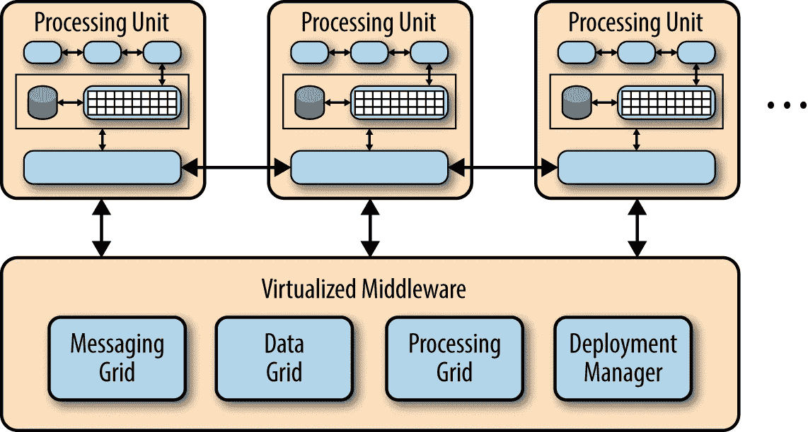
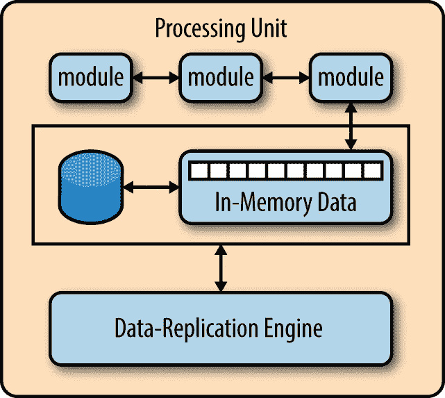

# 基于空间的模式只适用于基于云的服务吗？！

> 原文：<https://medium.com/nerd-for-tech/is-space-based-pattern-only-for-cloud-based-hosted-5a633eb74c2?source=collection_archive---------2----------------------->

几天前，当我第三次阅读一本书(Mark Richards 的《软件架构师模式》)时，我遇到了一个关于基于空间的模式的提示，我已经错过了一段时间。在这篇文章中，我们将看一下这本书的第 5 部分，但是我强烈推荐阅读这本书，因为这本书试图学习软件架构师模式的基本概念，这可能需要你一天的时间来刷新你的思维。

# 第一个问题是基于空间的架构模式的主要概念是什么？

该模式是专门为解决可伸缩性和并发性问题而设计的。对于具有可变且不可预测的并发用户量的应用程序，这也是一种有用的架构模式。考虑到大多数基于 web 的业务应用程序遵循相同的一般请求流，例如，来自浏览器的请求到达 web 服务器，然后是应用程序服务器，最后是数据库服务器。虽然这种模式对于一小部分用户非常有效，但是随着用户负载的增加，瓶颈开始出现，首先出现在 web 服务器层，然后是应用服务器层，最后是数据库服务器层。对基于用户负载增加的瓶颈的通常反应是向外扩展 web 服务器。这相对容易且便宜，有时还能解决瓶颈问题。**然而**，在大多数**高用户负载的情况下，**向外扩展 web 服务器层只是将瓶颈转移到应用服务器。扩展应用服务器可能比 web 服务器更复杂、更昂贵，并且通常只是将瓶颈转移到数据库服务器，而数据库服务器的扩展更加困难、更加昂贵。即使您可以扩展数据库，您最终得到的是一个三角形的拓扑，三角形中最宽的部分是 web 服务器(最容易扩展)，最小的部分是数据库(最难扩展)。
**因此，在*基于空间的模式*中，一个主要的想法是推广一个解决方案来减少和处理数据库上的流量。**

[基于空间的架构模式](https://learning.oreilly.com/api/v2/epubs/urn:orm:book:9781491971437/files/assets/sapr_0501.png)

# 它是如何工作的？

简而言之，基于空间的模式最大限度地减少了限制应用程序伸缩的因素。

高可伸缩性是通过消除中央数据库限制并使用复制的内存数据网格来实现的。应用程序数据保存在内存中，并在所有活动的处理单元之间复制。处理单元可以随着用户负载的增加和减少而动态地启动和关闭，从而解决可变的可伸缩性。因为没有中央数据库，所以消除了数据库瓶颈，在应用程序中提供了近乎无限的可伸缩性。

该架构模式中有两个主要组件:

*   **处理单元组件**包含应用组件(或部分应用组件)。这包括基于 web 的组件以及后端业务逻辑。处理单元的内容根据应用程序的类型而变化，较小的基于 web 的应用程序可能被部署到单个处理单元中，而较大的应用程序可能根据应用程序的功能区域将应用程序功能划分到多个处理单元中。处理单元通常包含应用程序模块，以及内存中的数据网格和用于故障转移的可选异步持久性存储。它还包含一个复制引擎，虚拟化中间件使用该引擎将一个处理单元所做的数据更改复制到其他活动处理单元。
*   **虚拟化中间件组件** t 处理内务和通信。它包含控制数据同步和请求处理的各个方面的组件。虚拟化中间件包括消息传递网格、数据网格、处理网格和部署管理器。这些组件将在下一节中详细介绍，它们可以是自定义编写的，也可以作为第三方产品购买。

下图显示了典型的处理单元架构，其中包含应用程序模块、内存中的数据网格、用于故障转移的可选异步持久性存储以及数据复制引擎。

[处理单元组件](https://learning.oreilly.com/api/v2/epubs/urn:orm:book:9781491971437/files/assets/sapr_0502.png)

虚拟化中间件本质上是架构的控制器，管理请求、会话、数据复制、分布式请求处理和流程单元部署。

虚拟化中间件

虚拟化中间件中有四个主要的架构组件:

1.  **消息传递网格**管理输入请求和会话信息。当请求进入虚拟化中间件组件时，消息传递网格组件确定哪些活动处理组件可用于接收该请求，并将该请求转发给这些处理单元之一。消息传递网格的复杂性从简单的循环算法到更复杂的下一个可用算法不等，后者跟踪哪个处理单元正在处理哪个请求。
2.  **数据网格**与每个处理单元中的数据复制引擎交互，以便在发生数据更新时管理处理单元之间的数据复制。因为消息传递网格可以将请求转发给任何可用的处理单元，所以每个处理单元在其内存数据网格中包含*完全*相同的数据是非常重要的。
3.  **处理网格**是虚拟化中间件中的一个可选组件，当有多个处理单元时，它管理分布式请求处理，每个处理单元处理应用程序的一部分。如果请求要求处理单元类型之间的协调(例如，一个订单处理单元和一个客户处理单元)，那么处理网格将在这两个处理单元之间协调和编排请求。
4.  **部署管理器**根据负载情况管理处理单元的动态启动和关闭。该组件持续监视响应时间和用户负载，并在负载增加时启动新的处理单元，在负载减少时关闭处理单元。它是在应用程序中实现可变可伸缩性需求的关键组件。

# 回到第一个问题，基于空间的模式只适用于基于云的服务吗？！

值得注意的是，虽然这种模式的另一个名称是基于云的架构，但是处理单元(以及虚拟化中间件)**不必驻留在基于云的托管服务或 PaaS 上。它可以很容易地驻留在本地服务器上，这也是我们称之为“基于空间的架构”的原因之一。**

资源:
[Mark Richards 的软件架构模式](https://learning.oreilly.com/library/view/software-architecture-patterns/9781491971437/)