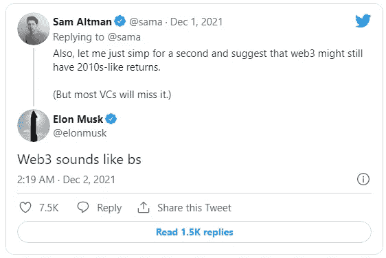

# Web 3 BS 吗？

> 原文：<https://medium.com/nerd-for-tech/is-web-3-bs-3356ce30284d?source=collection_archive---------2----------------------->

这会永远改变互联网吗？

一开始，有 Web 1…有一段时间，它很好。web 很快被提升到 Web 2，现在，嗯…事情真的开始变得有趣了。每个人都喜欢把网络放回到人们手中的想法，但许多人担心这个承诺可能好得不真实。

如果你像我一样老，你会记得你的 AOL 帐户。AOL 是一家美国门户网站和在线服务提供商，成立于 1985 年，总部位于纽约市。它本质上是一个有围墙的策划内容的花园。这是 Web 1 的一个例子，它很吸引人，但当时很少有人能想象今天普通人的在线活动。Web 2 时代是社交网络的时代，比如脸书、Twitter、Instagram 等等。用户不仅可以浏览内容，还可以创建内容。目前，全球大约有 50 亿人使用着 17 亿个网站。这种规模在 20 年前想都不敢想。除了发布内容之外，Web 3 还允许用户持有内容的所有权，并在虚拟节点的分散网络上管理组织和社区，例如以太坊虚拟机。

我们会看到 Web 3 如此快速的增长和普及吗？或者埃隆·马斯克是对的？

值得注意的是，Web 3 绝不会对目前在线蓬勃发展的 Web 的任何早期版本构成威胁。许多加密专家会说，加密货币比 90 年代的互联网发展得更快，但 crypto 和 Web 3 是建立在互联网之上的。我们的目标是将“价值互联网”整合到我们的工作方式中。我们如何做到这一点？每天都有越来越多的例子。就在我发表这篇博客的那一周，Kickstarter 宣布了一个项目，将区块链融入一个非常熟悉的想法。它正在孵化一家独立的公司，以建立一个类似 Kickstarter 的众筹系统，但基于[区块链技术](https://www.bloomberg.com/news/articles/2021-11-16/what-is-blockchain-how-the-technology-transforms-daily-life)。当它准备好了，Kickstarter 将把自己的服务切换到新的服务上，新公司将让任何人都可以使用这些工具来进行众筹。

那么像埃隆这样的人看到了 Web3 的哪些问题呢？这里有几个。

1.  **可扩展性**
2.  **领养**
3.  **审查制度**

**可扩展性:**第 2 层以太坊交易、ETH2 和 Solana 都是正在进行中的项目的例子，它们降低了维持网络所需的交易费用、交易时间和计算能量。

> 在*计算的基础上*，区块链网络[无法扩展](https://www.metzdowd.com/pipermail/cryptography/2020-December/036510.html)，除非变成完全相同的[财阀](https://en.wikipedia.org/wiki/Proof_of_stake)和中央集权系统，据称它们被设计来取代。试图进行抵制审查的计算有一个荒谬的成本——斯蒂芬·迪尔—[“Web 3 是狗屎”](http://stephendiehl.com/blog/web3-bullshit.html)

我认为 Stephen Diehl 在这里想说的有一部分是对的，但是，他可能遗漏了我之前说过的 Web 3 寻求与现有系统集成的内容。事实上，Web 3 只能与我们已经拥有的大量网络和服务器共存。大多数数据创建和数据共享总是发生在我们当前使用的网络、数据中心和基础设施上，但 Web 3 寻求添加我认为大多数人想要的功能和特性，如所有权、隐私和安全性。这对于使用“链上”和“链下”网络的混合系统来说是可能的，以便能够在需要时使用区块链来管理数据。

**采用:**目前 Web 3 使用的主要驱动力是“Defi”或分散融资。世界上有数十亿没有银行账户的成年人，这项技术让这些人能够获得点对点的现金支付和金融产品。当然，Defi 不足以达到一些人预期的大规模采用。元宇宙、社交媒体和游戏应用都是未来的可能。

审查制度:显而易见的事实是没有审查制度的计划。我们今天面临的一个主要问题是，科技巨头可以在没有公平审判的情况下，决定禁止一个人或组织，而我们对此无能为力。这其实是 Web 3 的一个强项。这是一个真正自由开放的互联网。我们都希望我们的在线活动有更多的隐私、安全和所有权。我第一次登录 Web 3 应用程序时，就有了 Web 3 的“啊哈时刻”，Web 3 应用程序也被称为 dapp 或分散式应用程序。Web 2 应用程序总是要求一个电子邮件，密码，用户名，安全问题，电话号码，恢复电子邮件…它变得侵扰。在 Web 3 上，你只需将你的钱包连接到网站上，就可以登录了。就是这样。你是你的钱包地址。这对于用户来说很方便，而且由于加密技术，更加安全。

不管 Web 3 的鼓吹者喜欢与否，我们暂时还是被 M.A.A.M.A .的集中网络和科技巨头所困。不管你喜不喜欢，人们想要一种更私密、更安全、更自由、更开放的在线参与方式，就像 Web 3 提供的网络一样。