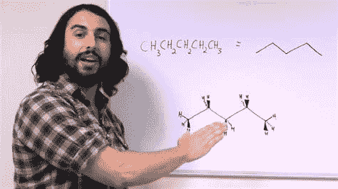

# IUPAC 命名法应该教给小学生。

> 原文：<https://medium.com/nerd-for-tech/iupac-nomenclature-should-be-taught-to-elementary-school-kids-20e6580eed5d?source=collection_archive---------7----------------------->

这是我新喜欢的老师解释“戊烷”这个词。

为什么我们先教化学中枯燥难懂的部分？不如从教学生理解有机化学中那些令人印象深刻的化学名称和图解开始。换句话说，在开始的时候，像教英语课一样教，或者像教艺术/涂鸦课一样。

当学生们注意到只有他们能够解码“甲烷”并知道“甲基”部分意味着“一个”(碳原子)和氢原子的最大可能数量(在这种情况下是四个)时，他们会立即开始认为自己是化学通，甚至可能是未来的化学家，而所有其他新闻观察者只知道它来自奶牛的两端。

化学很难，而有机化学是出了名的难，但是有机化学的术语和图解却出奇的简单，而到底有多简单却是一个秘密。非化学家被科学蒙蔽了双眼，但是基础知识可以被一个八岁的孩子掌握。一旦学生知道他们能用一个单词或一个容易画出的图表给人留下深刻印象，他们的信心和动力就会大大增加。想象一下，新闻中提到了甲烷，而你八岁的孩子画出了它的示意图。然后“高辛烷值燃料”被提到，他或她画了一个图表。

想象一下，一个八岁的孩子能够理解、阅读、书写和绘制 5-溴-2，4-二氯-1，3，8-三甲基-辛烷和数千种其他同样复杂的有机分子的分子图。这听起来很荒谬，除非这个孩子是个天才。但实际上，这很容易。一个八岁的孩子可以在几个小时内学会做这个。一个成年人可以在几分钟内学会它。

一旦对化学充满热情(炫耀)，学生们就更容易被哄着去关注那些困难、无聊的部分，以及化学反应实际上是如何进行的，这真的非常非常难——它涉及到量子力学。即使这并不是在所有情况下都有效，至少学生们会获得所谓的化学素养。

化学素养的一大好处是，它可能会持续一生，原因和普通素养完全一样。你永远不会忘记如何阅读，因为单词无处不在，同样你可能永远不会忘记如何解码后缀“-ane”，因为以它结尾的单词无处不在，而且许多都是熟悉的家庭术语。甲烷、乙烷、丙烷、丁烷、戊烷、己烷、庚烷、辛烷、壬烷和癸烷(仅提及其中十种)在维基百科和报纸文章中经常被提及，甲烷、丙烷、丁烷和辛烷(如“高辛烷”)是家喻户晓的术语。

掌握这个系统的一个不明显的原因是它是如此的理性和巧妙。对于你所熟悉的问题，越巧妙的解决方案越好。这真的很聪明。

这些单词之所以如此容易学习，是因为它们是由简单的算法生成的。例如在刚才提到的十种易燃化学品中，后缀-ane 表示完全相同的意思，前缀告诉你分子中有多少个碳原子。

1.  甲
2.  eth-
3.  道具-
4.  但是
5.  pent-
6.  十六进制-
7.  七-
8.  表示“八”
9.  表示“不”
10.  十二月-

还有其他后缀，表示其他简单的东西。如果你知道四个后缀和十个前缀，你可以读和写四乘以十个新单词。那是四十个新单词。这仅仅是开始。前缀可以以各种方式组合，这样你就可以在短时间内读写成千上万的新单词。拼写和发音也很容易，因为每个单词都遵循相同的规则。

相当多的学生，包括学艺术的学生，为自己认识很多单词，或为自己能阅读各种文本，理解各种语言而自豪。通过引入化学符号作为一种令人难以置信的快速积累词汇的方法，并明确记录掌握了多少新单词，也许英国学生可以被激励去学习一些化学，并且永远不会忘记。是电子游戏(以及之前的弹球游戏)中那些巨大分数的心理。

很多学生喜欢画画或涂鸦。化学图像涂鸦一样简单，但却像一幅好画一样令人印象深刻，特别是对非化学家来说，而且它的优点是你可以通过使用它们来炫耀，而不会让人觉得你在炫耀。你只要画一张，如果有人从你的肩膀上看过去，你就谦虚地说你在涂鸦，或者为化学考试复习。但是不管是谁，只要越过你的肩膀看，他要么会认为你是一个化学家同事，要么会被科学彻底蒙蔽。

有些人会成为父母，他们无疑会对这位科学老师感到满意。学生几乎马上就能命名和画出大量的分子。

特里·维里斯迪斯在 [Unsplash](https://unsplash.com?utm_source=medium&utm_medium=referral) 上的照片

给定分子的图解，学生将能猜出其名称，反之亦然。因此，学生可以用抽认卡进行测试。这也使得一种“魔术”成为可能。这位学生声称已经记住了大量有机分子的所有名称和图解，为了证明这一点，他提出在抽认卡的反面写下或画出任何东西。

这一堆抽认卡可能很大，数以千计。学生当然没有记住它们，而是使用 IUPAC 规则从图表中推导出名称，反之亦然。孩子们喜欢恶作剧，所以这可能会工作得很好。洗牌后的牌越多，包含的分子类型越多，观众就越难注意到图表和名称之间有联系，这个把戏就越有效。因此，学生有动力去学习各种有机分子的 IUPAC 规则。

同样，学生写、说或画得越快越流畅，看起来就越像是记忆而不是演绎，所以学生有动力去快速学习。

为了让这一切尽可能令人印象深刻，也为了让它更难看出是演绎，学生可能会使用更大的、多余的图表，包括氢原子和楔键和破折号键。

这是 Dave 教授的一个非常好看的视频，介绍了有机化学中一些简单分子的标准(IUPAC)化学名称和图表。你可以看到它是多么容易，即使它显然是针对化学的高级学生，包括大学生。即使是一个完全的初学者也能掌握全部。

我认为科学老师和/或家长应该把这个视频给初学化学的学生看，包括小学生，并回答他们的问题，像化学家一样教他们读书说话画画，用科学蒙蔽所有人。

除了化学和普通科学之外，有机分子及其名称和图解也与生物学相关，所以生物老师可能想教这个。或者，如果一个学生对生物学充满热情，父母或私人教师可能会教他或她。

我想进一步说，这个视频(以及戴夫教授的其他一些视频)在英语课堂上不会不合适。英语词典中的大多数单词都是化学物质的名称——我相信词典中大约有 80 万个这样的单词，而普通单词的数量只有 20 万个。能够理解“丙烷”或“辛烷”的含义，或者至少理解它们之间的区别(前者有五个碳原子，后者有八个碳原子)，无疑是受过教育的英语使用者的一部分。

准备好迎接许多乐趣和有史以来最伟大的科学揭秘吧(记住，你可以通过点击 cog 图标时弹出的设置菜单来调整 YouTube 中的播放速度):