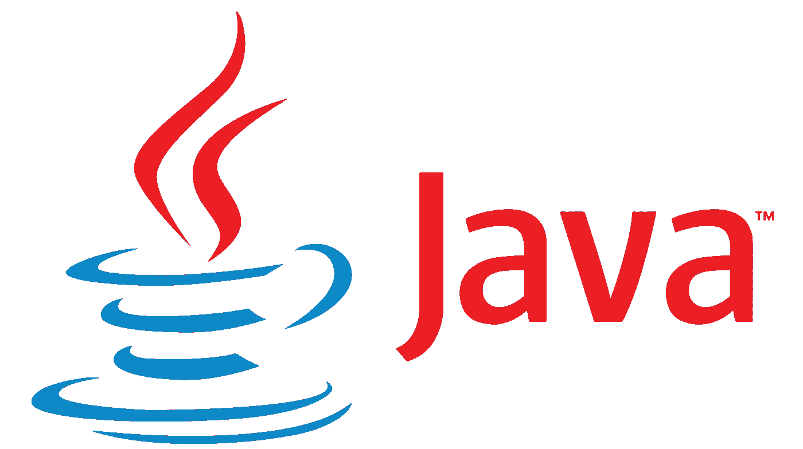

# Java 接口和 Lambda 表达式

> 原文：<https://medium.com/nerd-for-tech/java-interface-and-lambda-expressions-66bf81eb529b?source=collection_archive---------15----------------------->

在我职业生涯的大部分时间里，我一直是一名 Java 开发人员，没有什么比界面更让我吃惊了！简单却如此强大。在这篇文章中，我将写一些使用接口的方法。

请随时在 LinkedIn 上联系我，和我谈谈！我喜欢听新的想法，当然，还有批评！

# 连接

让我直接跳到代码。一个简单的界面，只有一个功能。下面是一些实现的方法。

**创建一个单独的类来实现接口**

```
public class A implements SimpleInterface {

    @Override
    public void simpleFunction() {
        //some code...
    }}
```

**实例化实现接口**的匿名类

```
public class A { SimpleInterface object = new SimpleInterface() {

        @Override
        public void simpleFunction() {
            //some code...
        } 
    } // object can now be used anywhere in code like any variable}
```

**使用λ表达式**

```
public class A { SimpleInterface object = () -> {
        //some code...
    }}
```

在上面的场景中，我们使用了一个具有单一抽象方法的接口。一般称为**【功能接口】**。

> 具有单一抽象方法的接口是**功能接口**

# 我们为什么需要它？

为了简化代码！将代码分解成不同的独立组件。为了减少杂乱！我来分享一个场景。

假设您有一个线程，它可能会运行不可预知的时间。当它完成执行时，您需要返回一些数据。但是主执行不应该需要等待线程完成。对于这种情况来说，一个界面是很好的选择！

这里，SimpleInterface 是一个*功能接口*。当 main()执行时，一个新的对象被实例化并传递给 SomeThread。当线程结束时，它调用 *simpleFunction(int)* ，从而将数据传递给实现的函数！

注意，SimpleThread 不需要关心 Main 的行为。Main 不需要关心 SimpleThread 的行为。

我们在 main()方法中“神奇地”获得了数据，从第 26 行开始就可以使用它了！

这在联网、系统调用、等待用户交互以及几乎任何我们不希望正常执行流“等待”的地方经常会派上用场。

# 机器人

如果你是 Android 开发者，你一定用过 View.setOnClickListener(View。OnClickListener)！

借助 Lambda 表达式的强大功能，它可以简单地写成

```
view.setOnClickListener( v -> {
    // code when this view is clicked});
```

上面所有的例子都展示了一个具有单一抽象方法的接口。但是如果你需要**更抽象的方法**呢？—你就不能再使用 lambda 表达式了。您可以创建一个单独的类来实现接口；或者实例化一个实现接口的匿名类——这两种方法我都在上面提到过。您可以在这里实现任意数量的抽象方法！

我会让这篇文章简明扼要。但是在结束之前，让我提一下 [3 层架构](https://searchsoftwarequality.techtarget.com/definition/3-tier-application)。接口在以这种方式组织代码中扮演着**的重要角色**！

请不要犹豫[与我联系](https://www.linkedin.com/in/sayantapadar/)，进行交谈！作为一名企业家，我怎么吹嘘我通过交谈获得的帮助都不为过！

