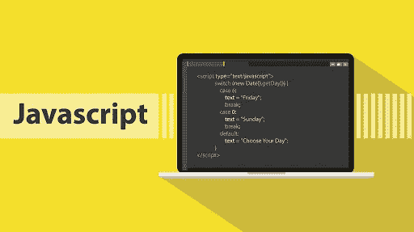
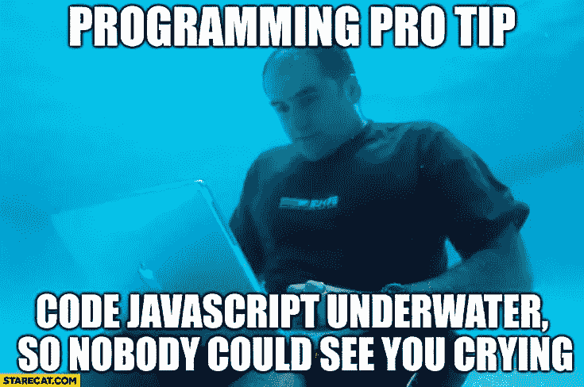
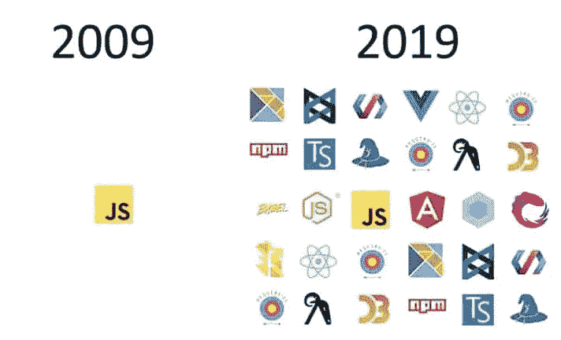
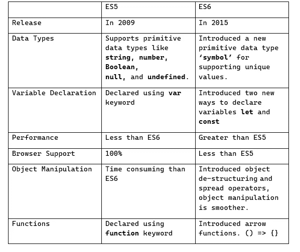
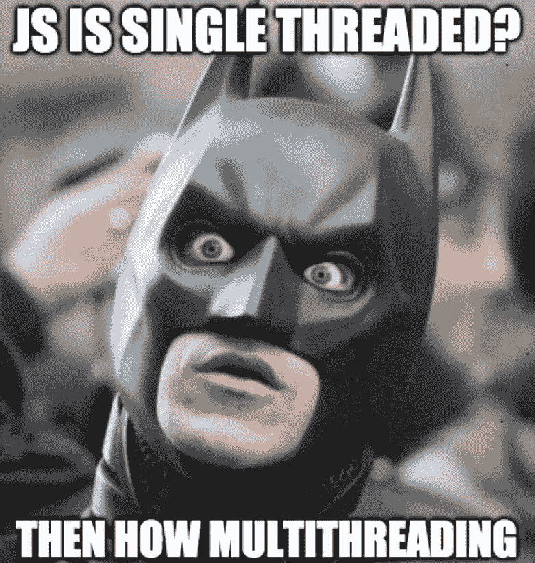
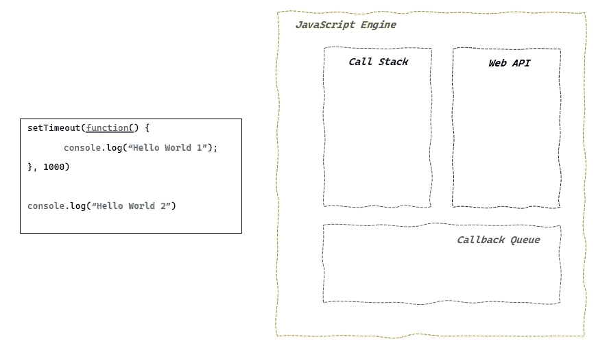

# JavaScript——恶魔语言

> 原文：<https://medium.com/nerd-for-tech/javascript-the-demonic-language-part-01-618c53e8b1a0?source=collection_archive---------14----------------------->

## 让我们开始学习恶魔语言的旅程。



JavaScript——它是一种恶魔语言吗🤔(来源:[谷歌图片](https://lh3.googleusercontent.com/proxy/5lIAq-ajjxXWD70wVpCwOJTGS8TdEYepqfAuyRtl9qKlIu9iwEH8ZwfThr7yO_9LEPdidNSjrOOt6IROxwbA0YARm7Mv0SYSX8vNcykdMvkcGrxOeLL3sc1Ufoin7oIa5Md5O-IPO3VOtg))

你已经听说过 JavaScript 以及我们为什么使用它。但令人惊讶的是，JavaScript(或 JS)是一种“脚本”语言，由于其活跃的社区交互，它每天都在发展。新的**模块和库**已经形成，可以在 JS 内部使用，使编码更容易、更快。所以有时候，初学者学习 JS 可能会变得有点棘手，很难立即掌握，因为这些定期更新的新技术和旧技术的过时。我们在 2000 年代早期看到的 JS 和现在的版本有很大的不同。现在大多数时候，开发人员使用各种各样的 JS 框架，而不是直接使用普通的 JS 进行 web 开发，因为框架简化了他们的工作。但是要进入任何 JS 框架，我们必须了解普通 JS 中从基础到深层的概念，因为这些概念也应用在那些框架中。所以，这篇文章我会给你一个关于 JavaScript 的基本介绍，一些核心概念，如单线程特性和异步行为也会解释。在进入任何 JS 框架之前，这些术语都非常重要。其他一些概念如 [***闭包***](https://developer.mozilla.org/en-US/docs/Web/JavaScript/Closures) ***，*** [***回调***](https://developer.mozilla.org/en-US/docs/Glossary/Callback_function) ***，*** [***承诺***](https://developer.mozilla.org/en-US/docs/Web/JavaScript/Guide/Using_promises) 将在以后的文章中详细解释这些概念。首先，让我们看一点 JavaScript，以及它是如何诞生的。



如果你知道这些概念，就不用哭了。😏(来源:[谷歌图片](https://starecat.com/content/wp-content/uploads/programming-pro-tip-code-javascript-underwater-so-nobody-could-see-you-crying.jpg))

## JavaScript 是什么？


事情就是这样…...(来源:[谷歌图片](https://encrypted-tbn0.gstatic.com/images?q=tbn:ANd9GcRlrYECMML4yzAEp1f02dDSIrQJeHQ9RAL6cQ&usqp=CAU))

*“JavaScript，我们也称之为 JS，是一种* ***轻量级、解释型、松散类型的*** *(您不必指定变量中将存储什么类型的信息)* ***脚本语言*** *，用于基于浏览器的 web 应用程序，开发基于物联网的应用程序，构建 web 服务器，以及开发服务器应用程序和游戏开发。”*

但是现在我们可以在浏览器之外使用 JavaScript，使用一个叫做 ***NodeJS 的 JavaScript 运行环境。*** JavaScript 是一种基于原型的、多范例的、**单线程的**动态语言，也具有**异步行为**。它还支持面向对象和函数式编程。JavaScript 源于 ECMAScript，ECMAScript 定义了 JavaScript 语言的所有标准。ECMAScript 是一种通用编程语言，它描述了 JavaScript 为确保不同浏览器之间的网页互操作性所需的所有标准。ECMAScript 标准每年发布一次，目前 ECMAScript 的最新版本是 ECMAScript 2020–第 11 版(ES11)。

JavaScript 是一种**区分大小写的语言(**意味着名为‘Example’的变量名与‘Example’不同)。JavaScript 使用 **DOM(文档对象模型)**，它是由各自的 web 浏览器指定的，包含 JavaScript 可以使用和交互的 HTML 元素。JS 使用这些 DOM 来添加、更改和删除 HTML 元素，更改 HTML 元素的属性，更改 CSS，以及对页面事件做出反应。



2009 年的普通(纯)JavaScript，现在我们有了 JavaScript 框架。

## JavaScript 的历史


先研究一下😐

早在 JS 诞生之前，开发人员在 1995 年 9 月左右使用 Netscape 开发人员推出的 LiveScript 使静态网站更具交互性，并提供一些动态行为。后来改名为 JavaScript。JavaScript 这个名字来源于 Java，它是一种流行的编程语言。网景公司用它作为营销策略，使 JS 流行起来。你可以在这里阅读更多关于 JS [的历史。](https://en.wikipedia.org/wiki/JavaScript#The_rise_of_JScript)

## ES5 vs ES6


ECMAScript 演变

ES 是一种由 ECMA 国际组织定义的脚本语言。ES 代表 ECMAScript，因此 ES5(ECMAScript 第五版)代表 ECMAScript 5(也称为 ECMAScript 2009)，ES6(ECMAScript 第六版)代表 ECMAScript 2015。ES5 发布于 2009 年，ES6 发布于 2015 年。创建 ES 是为了维护 JavaScript 的标准，这有助于它进一步发展，而不会让开发人员对概念感到困惑。除了 JS，ES 还有许多其他的实现。与 ES5 相比，2016 年发布的 ES6 在 JS 方面有一些重大改进，允许开发人员编写复杂的程序。下表描述了 ES5 和 ES6 之间的一些主要差异。



ES5 vs ES6

## 为什么 JS 被认为是单线程？

在上一节中，您可能会遇到一个叫做“单线程”的词。那么,“单线程”到底是什么意思。通常，像 Java 这样的高级语言使用多线程方法，通过赋予代码一些异步(一个代码不会等到前一个代码完成它的执行)性质，使用多个线程来运行程序。像 JavaScript 这样的编程语言是单线程的，这意味着 JS 只有一个线程(一个调用堆栈和一个内存堆)，因此它必须具有同步行为(一个线程应该等待上一个线程完成执行)。但是我们知道 JS 有一个异步行为。像 JS 这样的单线程语言怎么可能有异步行为？感谢像 V8 (Chrome)和 SpiderMonkey (Firefox)这样的 JavaScript 引擎，我们可以实现异步行为，即使它是单线程的。让我们看看它是如何发生的。



如果 JS 是单线程的，它是如何表现异步行为(多线程行为)的？🤔

## JavaScript 异步行为

正如我们之前所知，尽管 JS 是单线程的，但它表现出异步行为。是这样的。

让我们看一个简单的代码段示例。

上面的函数是“setTimeout ”,这是浏览器提供的一个内置函数。该函数接受两个参数，第一个参数是包含要执行的代码的函数，第二个参数是以毫秒为单位的时间。因此，在上面的示例中，setTimeout 函数中的“console.log”语句在 1000 毫秒(1 秒)后执行。因此，在 setTimeout 函数完成执行之前，您会注意到显示为“Hello World 2”的第二个“console.log”语句被执行。因此，输出如下所示。

```
Hello World 2Hello World 1 <- this display after 1 second
```

因此，这描述了 JavaScript 中的异步行为，这仅仅意味着 console.log("Hello World 2 ")不会等到 *setTimeout* 方法完成其执行。因此，程序首先显示第二条 console.log 语句，然后在 1 秒钟后(因为 1000 毫秒)执行第一条 console.log 语句。所以，由于 JS 是单线程的，根据理论，第二个 console.log 语句应该等到 *setTimeout* 方法作为同步行为完成它的执行。但这不会发生。这是怎么发生的。这些都是由 JavaScript 引擎本身管理的。让我们深入 JavaScript 引擎背后的科学。



代码片段(左)和 web 浏览器内部(右)

因此，在上图中，你可以看到 JavaScript 引擎内部的三个模块或部分，分别命名为 ***调用栈、Web API 和回调队列。*** 这是 JS 引擎中主要的三个部分(可能是 Chrome 的 V8 引擎或者 Forefox 的 SpiderMonkey 引擎等等。).因此，**调用堆栈**所做的是，它是一个堆栈(使用*后进先出*方法),其中**临时保存数据，直到它被执行**(在这种情况下，直到它在控制台中被打印)。 **Web API** 所做的是，它**持有所有像 setTimeout 这样的内置方法，并在 Web API 内部执行它们，而不是将它们发送到调用栈。****回调队列** **保存从 Web API 返回的数据，然后将它们推送到调用栈**以在控制台中打印出来。下面的视频展示了这是如何发生的。

为简单起见，我将 *setTimeout* 函数命名为#1，将第二个 *console.log* 语句命名为#2 ( **#表示“数字”**)。首先，setTimeout 开始执行。因为 setTimeout 是 Web API 中的一个方法，所以它的执行发生在 Web API 内部。不在调用堆栈中。因此，当它在 Web API 中执行时，第二个 *console.log* 语句#2 被推到调用堆栈中执行。在它被执行并在控制台中打印为“Hello World 2”之后，它在调用栈中被删除。**(一旦调用堆栈中的代码段执行完毕，它将自动从调用堆栈中删除)**。与此同时，setTimeout 方法完成其执行，并在回调队列中等待。然后，它被推入调用堆栈，并显示在控制台中。这就是为什么我们首先看到 Hello World 2，然后在 1 秒钟后(方法中规定的 setTimeout 执行时间为 1000 毫秒)我们看到“Hello World 1”。

这就是 JavaScript 如何获得异步行为的，尽管它是一种单线程语言。

所以现在你可能对 JavaScript 有了一个简单的了解。所以，在以后的文章中，我会详细阐述更多的概念，比如 ***回调、承诺、异步等待、闭包*** 等等。所以，敬请期待下一部，注意安全。

和平。😉✌


看看 JavaScript 的发展有多快🙄