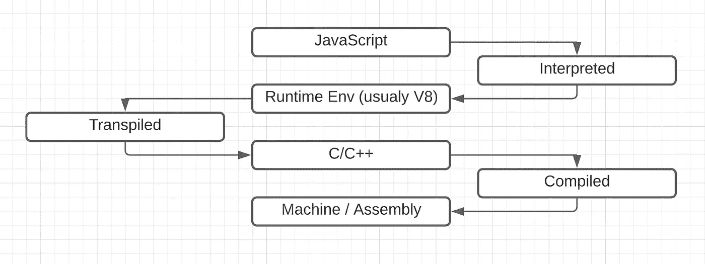
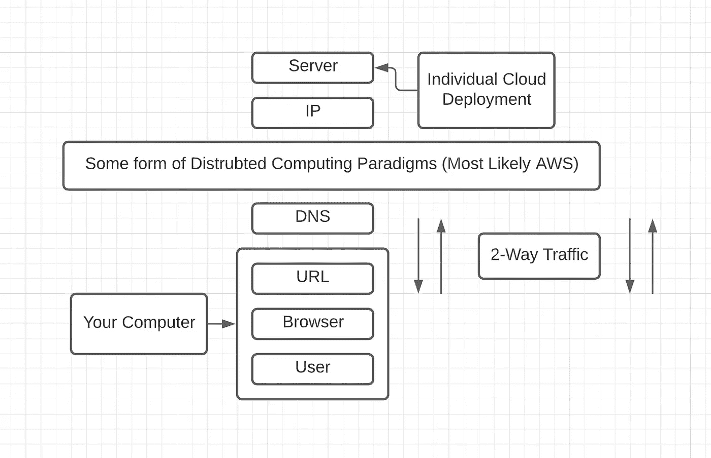
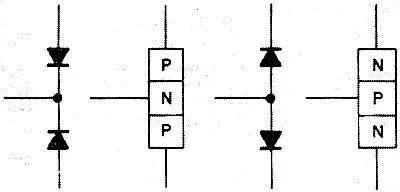
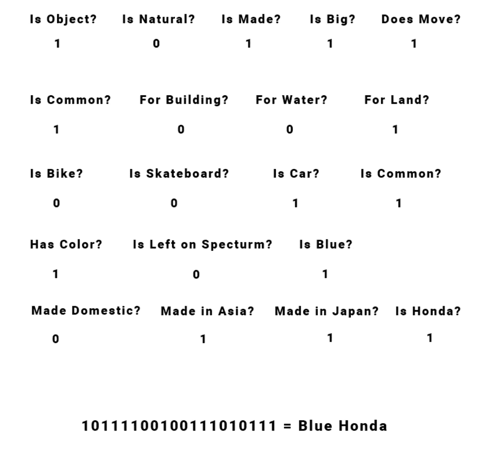
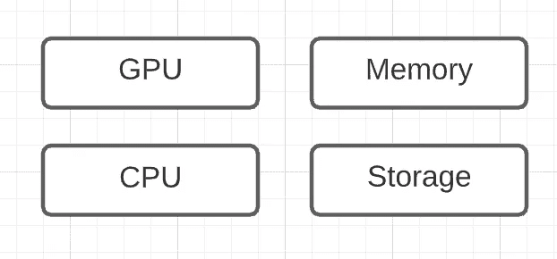
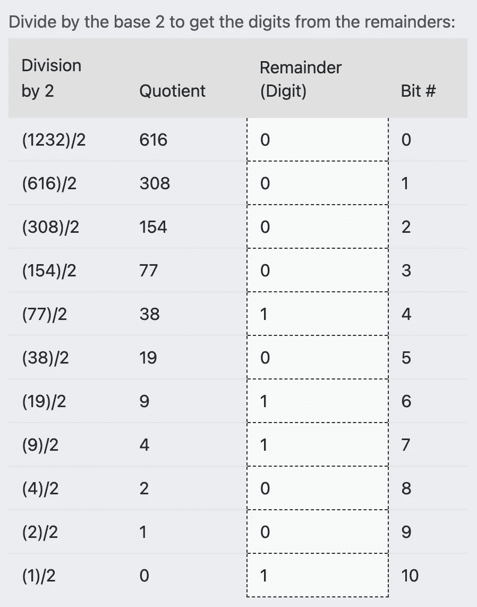

# JavaScript 到机器语言

> 原文：<https://medium.com/nerd-for-tech/javascript-to-machine-language-54543c3d4f66?source=collection_archive---------17----------------------->

首先，我最近读了杰克·塔珀的《地狱火俱乐部》的一部分，开始理解未署名作品的禁忌。虽然我会尽力引用，但我相信你(读者)在阅读以下内容时会做出成熟而明智的决定。如果你有任何困惑，我希望你做你自己的研究，如果你有任何抱怨，我希望你做前者，然后留下你的改进观点的评论。

事不宜迟，我介绍了一个可能被许多现代工程师视为无声的主题，尽管它对我们所有人的操作都很重要。



大致了解一下你的电脑处理 JavaScript 的能力(比如你正在看的这篇文章)

所以，这需要处理很多事情，我想每个人都会喜欢一些定义。

```
**Interpeted Language** - Real Time Transfers from one language to another, but not the base language (think a Translator translating to Foreign Dignitary at the G2 Conference)**Transpiled** - Batch Transfers from one language to another (think translating one language to another in Google Translate... before it reaches the base language [please reference: [here](https://www.youtube.com/watch?v=ofcdMJ3eGm4)])**Compiled** - Batch Transfers from one language to another (same as transpiled, except the batch transfer reaches the base language without detouring)
```

有了这些定义和图表，你就可以知道 JavaScript 要被计算机理解，需要几个步骤才能到达计算机执行必要代码的部分。然而，这是你如何运行网页的基本思想，并且只考虑了下图中的“你的电脑”框。



如何访问网页的想法(注意:“访问”而不是“运行”)

虽然重点是 JavaScript 如何运行，但理解如何接收包含代码、资产和文件的数字包以在浏览器中实际呈现页面仍然很重要(上图是该特定部分如何工作的 10，000 英尺视图)。

因为你对以太网的访问只是给你的个人计算机提供材料，性能确实比服务器更重要，因为现代个人计算机本身做了很多工作。幸运的是，JavaScript 通过本文中第一张图的所有环节现在已经不是什么大问题了。老实说，对于今天的硬件来说，你访问脸书、维基百科等等都是简单的任务。更多的网络密集型任务，如 YouTube、网飞和其他邪恶的冒险，更多的是与你的有线电视提供商而不是你的 CPU 有关。目前唯一担心微观效率的软件，为自动驾驶汽车、火箭、Nvidia 光线跟踪(通过硬件级模块)和其他一些例外情况提供动力。其中前者的整体首先依赖于[低级语言](https://en.wikipedia.org/wiki/Low-level_programming_language)。

在我们真正开始将低级/汇编语言转换成机器语言之前，下一个最重要的事情是更好地理解计算机。

可以说计算器是第一台“计算机”其他人会争辩说，第一台计算机是 [Engima](https://www.iwm.org.uk/history/how-alan-turing-cracked-the-enigma-code) (或 Engima 本身)的解码器。另一批人会争辩说这是原创的[纺织机器](https://www.imdb.com/title/tt11167964/)。然而，虽然我拒绝否认这些有趣的附加功能的影响，但我确实相信[逻辑门](https://en.wikipedia.org/wiki/Logic_gate)一种晶体管或二极管是现代计算机的起源(下图；也是早期计算器必不可少的)。



想象一下。1948 年(点击[此处](https://www.youtube.com/watch?v=IxXaizglscw&t=877s)查看不会让你头疼的解释)

不管怎么说，如果你点击了前面的四个链接，并且足够强大到谷歌原始计算器，我觉得可以肯定你现在已经获得了一些现代计算机如何工作的基本知识。

除了量子计算机——老实说，它还处于早期发展阶段——现代计算机是制造工艺改进的顶峰。“微处理器”只是一个微观工程的壮举。例如，一个微处理器可能包含 [1 亿个逻辑门](https://en.wikipedia.org/wiki/Logic_gate)(我确信这是一个过时的粗略估计，因为[微处理器以指数速度每两年改进一次](https://en.wikipedia.org/wiki/Moore%27s_law))。

有了新的理解，计算机是用简单的组件令人印象深刻地编排的，现在是时候继续研究如何将低级/汇编语言转换成机器语言了。

以前我写过我对二进制( [Link A](https://bowenbrinegar.medium.com/what-is-the-flight-velocity-of-an-african-swallow-e63b4ef05eed) ， [Link B](https://bowenbrinegar.medium.com/apple-man-e7c61d28c3f4) )的抽象看法，它是机器语言的核心。虽然我写的东西可能很深奥，但它确实有助于不熟悉计算机科学的人理解基本原理。下面是我为 [Link A](https://bowenbrinegar.medium.com/what-is-the-flight-velocity-of-an-african-swallow-e63b4ef05eed) 创建的一张图片——描述了一个人(不是机器)可能如何解释(参考前面的实时“解释”)二进制文件。



人类可读的二进制

不幸的是，二进制实际上并不是这样工作的。二进制要“蠢”得多(用 [Link B](https://bowenbrinegar.medium.com/apple-man-e7c61d28c3f4) 暗指的一种非冒犯的方式)。然而，在我深入了解二进制文件如何呈现这个网页或者相反地，这个网页的代码如何使你的计算机显示这个页面之前，我希望在下面的图表中剖析一下计算机。



主要计算机部件图

```
CPU - Centeral Processing Unit
GPU - Graphical Processing Unit
Memory - Quick access storage
Storage - Think of like an old school CD-ROM or Floppy Disc
```

代码可以存储在存储器中，但它通过内存编译成机器指令。编译过程使用一种[汇编语言](http://assembly language)将[的高层](https://computersciencewiki.org/index.php/Higher_level_and_lower_level_languages)代码翻译成[机器语言](https://en.wikipedia.org/wiki/Machine_code)。

酷的部分，我想是一个巧妙的小摆设，是 70 年代的开发人员实际上不需要编写原始的二进制代码。事实上，有几种方法可以减少简单的“对与错”的复杂性。这些快捷方式主要归因于汇编语言中的十进制(基数 2)、八进制(基数 8)和十六进制(基数 16)转换。

例如，在十进制中，数字 1232 就是这样翻译成二进制的。



八进制和十六进制的过程相同，只是基数从 2 变为 8，然后是 16，十六进制支持字符 A-F 映射到非一位数的升序整数(A-> 10；F -> 15)。

组合基于整数的指令、内存位置和整数本身——唯一缺少的是文本。嗯，幸运的是，对于基本的英语字母表(如 [UTF-8](https://en.wikipedia.org/wiki/UTF-8) 、UTF-16、UTF-32、UTF-MB4、UCS-2、UCS-4、ASCII 等)有文本编码。)&甚至[表情符号编码](https://www.smashingmagazine.com/2016/11/character-sets-encoding-emoji/)。

编码没有从它们的其他三个对应物(内存位置、整数指令和整数)中重新发明这个过程，例如，UTF-8 中的“8”代表位数。UTF-8 实际上使用十六进制来翻译字符为二进制。

```
**UTF-8**
abcd = 01100001 01100010 01100011 01100100
where each character contains 8 bits;
a = 01100001
b = 01100010**UTF-8 working with hexidecimal** alphabet (english) = abcdefghijklmnopqrstuvwxyz
alphabet (hexidecimal) = 0x61 0x62 0x63 0x64 0x65 0x66 0x67 0x68 0x69 0x6a 0x6b 0x6c 0x6d 0x6e 0x6f 0x70 0x71 0x72 0x73 0x74 0x75 0x76 0x77 0x78 0x79 0x7a**Neat Trick (8, 4, 2, 1)**a = 0x61 (6 = 0 1 1 0, 1 = 0 0 0 1) = (8-bit binary 011000001)
b = 0x62 (6 = 0 1 1 0, 2 = 0 0 1 0) = (8-bit binary 011000010)
...
z = 0x7a (7 = 0 1 1 1, a (or 10) = 0 1 0 1) = (8-bit binary 01110101)
```

最后，所有这些如何变成我现在正在看的这篇文章？

嗯，它是无数个简单的步骤，以量子速度编排复杂的技艺。你应该想知道的是:“如果我的父母不得不去图书馆查阅百科全书，我的孩子会查阅什么？”

有趣的是，不管它有多高级，我写的一篇关于视频游戏中的微优化的文章与此相关。虽然这是一个完全不同的主题，但它确实说明了当一大群贡献者建立在彼此之前的迭代之上时，可以实现非凡的壮举。电脑和电子游戏都有成倍提高的罪过。

*享受阅读？*

*留下掌声或评论*

*与朋友分享或在你最喜欢的社交平台上分享*