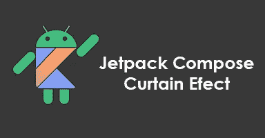

# 喷气背包组合—窗帘效果

> 原文：<https://medium.com/nerd-for-tech/jetpack-compose-curtain-effect-43323d537cc1?source=collection_archive---------7----------------------->



在这篇文章中，我将向你展示如何用你想要的任何组件创建一个**窗帘效果**。

# **重要方面**

*   默认状态下出现的主单元格
*   您想用折叠效果动画显示多少单元格就显示多少单元格
*   满容器总是根据你给它的内容包装它的大小。

# **应该给用户提供多少定制？**

首先我做了一个简单的需求分析。

1.  作为一个用户，我希望能够以手动方式**打开*窗帘*，从可组合的外部，或者通过点击它**。
2.  作为用户，我希望能够自定义**折叠动画的** **持续时间的单元格**；
3.  作为用户，我想自由地定制主单元格和所有的折叠单元格。

因此，通过了解这些需求，我决定了窗帘上的参数应该是可组合的。

```
isOpenedFromOutside: Boolean? = null
```

如果该参数具有除 null 之外的任何值，则意味着用户正在从可组合组件之外控制窗帘。

```
foldingDuration: Int = 250
```

我想我真的不需要描述这个。

```
mainCell: @Composable () -> Unit
```

主单元格可组合内容，可由用户自定义。

```
foldCells: List<@Composable () -> Unit>
```

所有的单元格，将出现在当窗帘打开，完全由用户定制。

# 窗帘状态

为了通过打开和关闭窗帘来激活单元，我必须跟踪状态(**打开||关闭**)。为了实现这一点，使用了 ***记住*** 函数，该函数在重新编译期间跟踪一个值。

主单元，应该在幕布“关闭”时显示。

这意味着我需要让细胞知道窗帘的状态，窗帘可以打开或关闭。

# 窗帘切换-非手动方式

切换窗帘，就像**将** **【等宽】** **变量改为** **假或真**一样简单。

现在，我需要考虑一些事情。

为了避免打开/关闭窗帘时出现任何错误，我需要**跟踪动画状态**。因此，窗帘只能在**完全打开或完全关闭时打开。**

*   只有当转换**没有运行**时，窗帘才能打开。
*   如果过渡没有运行，我们通过切换**幕帘状态‘等开’**来启动它。
*   为了将**过渡状态‘is transition running’**变回 false，我们使用了一个**协程作用域‘fold scope’**来延迟这个变化，延迟量为**每个单元的折叠持续时间*单元数量(窗帘效果的总持续时间)**。

# 窗帘开关—手动方式

如果用户想从外面完全控制窗帘状态，我们只需要检查参数**‘isOpenedFromOutside’**，如果它有值，我们就更新窗帘状态。

# 布局

作为布局，我使用了一个带有自定义修改器功能的框。

这用于决定窗帘是否可点击。

如果参数 **'isOpenedFromOutside'** 为 **not null** ，则意味着窗帘是外部控制的，所以窗帘是不可点击的。

# 主电池

我决定每当窗帘状态改变时，用一个**‘update transition’**来改变它的 alpha。

> **更新过渡:**
> 
> 这将建立一个转换，并用 targetState 提供的目标更新它。当 targetState 更改时，Transition 将朝着为新 targetState 指定的目标值运行其所有子动画。

**阿尔法动画:**

*   **0f (0%) Alpha 如果关闭；**
*   **1f (100%) Alpha 如果打开；**
*   持续时间为 100 毫秒；
*   如果正在拉开窗帘，则不会应用延迟；
*   如果窗帘正在关闭，它将被延迟每个单元格*单元格数量的**折叠持续时间(窗帘效果的总持续时间)。**这意味着只有当所有的单元格都被隐藏时才会出现；
*   应用于主单元格周围的框修饰符。

# 折叠单元格

折叠的单元格位于可组合的列内(垂直方向)

现在，最复杂的部分，每个**折叠细胞。**

要显示每个折叠的单元格:

*   我们需要计算每个单元格的最大高度来控制它的大小；
*   我们再次使用**‘update transition’**，根据窗帘是打开还是关闭来控制单元格的旋转、alpha 和大小值。

我决定使用布局 Composable，以便更好地控制每个单元格的最大高度。

测量内容后， **'cellMaxHeight'** 变量根据内容最大高度进行更新，这将影响最大尺寸动画。

# 使用

# 决赛成绩


**储存库:**

[https://github . com/pauloaapereira/Medium _ JetpackCompose _ current effect](https://github.com/pauloaapereira/Medium_JetpackCompose_CurtainEffect)

**领英:**
[https://www.linkedin.com/in/paulo-pereira-001615153/](https://www.linkedin.com/in/paulo-pereira-001615153/)

**推特:**
[https://twitter.com/pauloppereiraa](https://twitter.com/pauloppereiraa)

如果你喜欢，如果这对你有帮助，你也可以考虑请我喝杯咖啡。:]

谢谢大家！