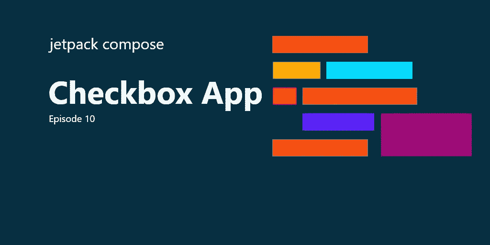
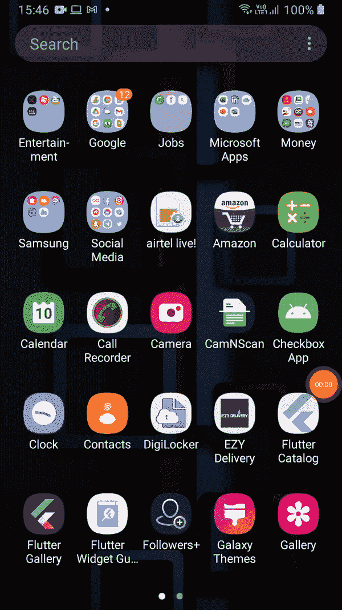

# Jetpack 撰写 Ep:10 —复选框

> 原文：<https://medium.com/nerd-for-tech/jetpack-compose-ep-10-checkbox-c79142e87268?source=collection_archive---------1----------------------->

这里，我们将通过将复选框分成多个部分来详细讨论它的属性，这将使我们更容易理解它。



Jetpack 撰写 Ep:10 —复选框应用程序

为了完成你的基本工作，请访问我以前的文章，它们在下面给出:

*   [Jetpack 撰写剧集:1-只是文本应用](/kotlin-mumbai/jetpack-compose-series-1-basics-ep-1-just-text-app-4acb42f5d865)
*   [Jetpack 作曲第二集——卷轴 App](/kotlin-mumbai/jetpack-compose-series-1-basics-ep2-the-scroll-app-d1816a2eb3b3)
*   [Jetpack 作曲集:3 —按钮 App](/kotlin-mumbai/jetpack-compose-ep-3-button-app-1de33ffb885f)
*   [Jetpack 撰写剧集:4 —图标&图标切换按钮应用](/kotlin-mumbai/compose-studio-ep-4-icon-icon-toggle-button-app-9e3589d0bdb5)
*   [Jetpack 撰写剧集:5 —分割器应用](/@akshaysawant003/jetpack-compose-ep-5-divider-app-9b8131bc7cc4)
*   [Jetpack 作曲插曲:6 —悬浮动作按钮 App](/@akshaysawant003/jetpack-compose-ep-6-floating-action-button-app-fa14920ec638)
*   [Jetpack 撰写剧集:7 —扩展浮动动作按钮 App](/kotlin-mumbai/jetpack-compose-ep-7-extended-floating-action-button-app-b485681edc40)
*   [Jetpack 撰写剧集:8 —单选按钮应用](https://akshay-sawant.medium.com/jetpack-compose-ep-8-radio-button-app-c3188d2fed5a)
*   [Jetpack 撰写剧集:9 —进度指示器 App](https://akshay-sawant.medium.com/jetpack-compose-ep-9-progress-indicator-app-14b68fd87a1f)

> 注意:在 **build.gradle(项目级)**文件中， **compose_version** 升级为**‘1 . 0 . 0-beta 01’**， **maven()** 替换为 **mavenCentral()** 。依赖项也升级到类路径" com . Android . tools . build:gradle:7 . 0 . 0-alpha 08 "
> class path " org . jetbrains . kot Lin:kot Lin-gradle-plugin:1 . 4 . 30 "
> 
> *在* ***build.gradle(模块级)*** *文件中，以下依赖项被升级:*
> 
> 实现' com . Google . Android . material:material:1 . 3 . 0 '
> 实现' androidx . activity:activity-compose:1 . 3 . 0-alpha 03 '

## 检验盒

它是一个组件，用于表示两种状态，即选中或未选中

## 复选框的属性

*   选中-是布尔状态，可以选择也可以不选择
*   onCheckedChange—它在复选框被单击时被调用，因此请求状态更改。如果是动态的，它还可以依赖于更高级别的组件来控制“已选中”或“未选中”状态。
*   修饰符—应用于复选框的修饰符
*   启用—控制复选框的启用状态。如果为 false，此组件将不可选择，并显示在禁用的 ui 状态中
*   interactionSource —它用于表示交互流。MutableInteractionSource 可以根据我们的需要进行修改，并通过在不同的交互中定制该组件的外观或行为来传递给复选框
*   colors-checboxdefaults . colors 将用于解析不同状态下用于此复选框的颜色。

## 记住()

记住计算产生的价值。仅在合成期间评估计算。重新合成总是会返回合成产生的值。

## 可变状态 Of()

返回一个新的 MutableState，用传入的值
初始化。MutableState 类是一个单值容器，它的读写由 Compose 观察。此外，对它的写入作为快照系统的一部分进行处理。

## MutableStateOf()的属性

*   值—可变状态的初始值
*   策略—控制如何在可变快照中处理更改的策略。

## CheckboxDefaults.colors()

该函数用于根据材料规格制作颜色动画。

## CheckboxDefaults.colors()的属性

*   checkedColor —选中时用于边框和框
*   uncheckedColor 未选中时用于边框
*   复选标记颜色—选中时用于复选标记
*   disabledColor —用于在禁用时为框和边框提供颜色
*   disabledIndeterminateColor —用于在 TriStateCheckbox 被禁用时(处于 ToggleableState 状态)为其框和边框提供颜色。不确定状态

## 简单复选框

```
@Composable
fun SimpleCheckbox() {
    val isChecked = *remember* **{** *mutableStateOf*(false) **}** *Checkbox*(checked = isChecked.value, onCheckedChange = **{** isChecked.value = **it }**)
}
```

## 启用复选框

```
@Composable
fun DisabledCheckbox() {
    val isChecked = *remember* **{** *mutableStateOf*(false) **}** *Checkbox*(checked = isChecked.value, onCheckedChange = **{** isChecked.value = **it }**, enabled = false)
}
```

## 禁用复选框

```
@Composable
fun EnabledCheckbox() {
    val isChecked = *remember* **{** *mutableStateOf*(false) **}** Checkbox(checked = isChecked.value, onCheckedChange = **{** isChecked.value = **it }**, enabled = true)
}
```

## 彩色复选框

```
@Composable
fun ColouredCheckbox() {
    val isChecked = *remember* **{** *mutableStateOf*(false) **}** *Checkbox*(
        checked = isChecked.value,
        onCheckedChange = **{** isChecked.value = **it }**,
        enabled = true,
        colors = CheckboxDefaults.colors(Color.Blue)
    )
}
```

## 选中的复选框

```
@Composable
fun CheckedCheckbox() {
    val isChecked = *remember* **{** *mutableStateOf*(true) **}** *Checkbox*(
        checked = isChecked.value,
        onCheckedChange = **{** isChecked.value = **it }**,
        enabled = true,
        colors = CheckboxDefaults.colors(Color.Blue)
    )
}
```

## 标签复选框

```
@Composable
fun LabelledCheckbox() {
    *Row*(modifier = Modifier.*padding*(8.*dp*)) **{** val isChecked = *remember* **{** *mutableStateOf*(false) **}** *Checkbox*(
            checked = isChecked.value,
            onCheckedChange = **{** isChecked.value = **it }**,
            enabled = true,
            colors = CheckboxDefaults.colors(Color.Green)
        )
        Text(text = "Labelled Check Box")
    **}** }
```

## 分组复选框

```
@Composable
fun GroupedCheckbox(mItemsList: List<String>) {

    mItemsList.*forEach* **{** items **->** *Row*(modifier = Modifier.*padding*(8.*dp*)) **{** val isChecked = *remember* **{** *mutableStateOf*(false) **}** *Checkbox*(
                checked = isChecked.value,
                onCheckedChange = **{** isChecked.value = **it }**,
                enabled = true,
                colors = CheckboxDefaults.colors(
                    checkedColor = Color.Magenta,
                    uncheckedColor = Color.DarkGray,
                    checkmarkColor = Color.Cyan
                )
            )
            *Text*(text = items)
        **}
    }** }
```

## 完全码

```
package com.akshay.checkboxapp

import android.os.Bundle
import androidx.activity.compose.setContent
import androidx.appcompat.app.AppCompatActivity
import androidx.compose.foundation.layout.*
import androidx.compose.material.Checkbox
import androidx.compose.material.CheckboxDefaults
import androidx.compose.material.Text
import androidx.compose.runtime.Composable
import androidx.compose.runtime.mutableStateOf
import androidx.compose.runtime.remember
import androidx.compose.ui.Alignment
import androidx.compose.ui.Modifier
import androidx.compose.ui.graphics.Color
import androidx.compose.ui.unit.dp
import com.akshay.checkboxapp.ui.theme.CheckboxAppTheme

class MainActivity : AppCompatActivity() {
    override fun onCreate(savedInstanceState: Bundle?) {
        super.onCreate(savedInstanceState)
        *setContent* **{** *CheckboxAppTheme* **{** *Column*(
                    verticalArrangement = Arrangement.SpaceEvenly,
                    horizontalAlignment = Alignment.CenterHorizontally,
                    modifier = Modifier.*fillMaxSize*()
                ) **{** *SimpleCheckbox*()
                    *EnabledCheckbox*()
                    *DisabledCheckbox*()
                    *ColouredCheckbox*()
                    *CheckedCheckbox*()
                    *LabelledCheckbox*()
                    *GroupedCheckbox*(
                        mItemsList = *listOf*(
                            "Grouped Checkbox One",
                            "Grouped Checkbox Two",
                            "Grouped Checkbox Three"
                        )
                    )
                **}
            }
        }** }
}

@Composable
fun SimpleCheckbox() {
    val isChecked = *remember* **{** *mutableStateOf*(false) **}** *Checkbox*(checked = isChecked.value, onCheckedChange = **{** isChecked.value = **it }**)
}

@Composable
fun DisabledCheckbox() {
    val isChecked = *remember* **{** *mutableStateOf*(false) **}** *Checkbox*(checked = isChecked.value, onCheckedChange = **{** isChecked.value = **it }**, enabled = false)
}

@Composable
fun EnabledCheckbox() {
    val isChecked = *remember* **{** *mutableStateOf*(false) **}** Checkbox(checked = isChecked.value, onCheckedChange = **{** isChecked.value = **it }**, enabled = true)
}

@Composable
fun ColouredCheckbox() {
    val isChecked = *remember* **{** *mutableStateOf*(false) **}** *Checkbox*(
        checked = isChecked.value,
        onCheckedChange = **{** isChecked.value = **it }**,
        enabled = true,
        colors = CheckboxDefaults.colors(Color.Blue)
    )
}

@Composable
fun CheckedCheckbox() {
    val isChecked = *remember* **{** *mutableStateOf*(true) **}** *Checkbox*(
        checked = isChecked.value,
        onCheckedChange = **{** isChecked.value = **it }**,
        enabled = true,
        colors = CheckboxDefaults.colors(Color.Blue)
    )
}

@Composable
fun LabelledCheckbox() {
    *Row*(modifier = Modifier.*padding*(8.*dp*)) **{** val isChecked = *remember* **{** *mutableStateOf*(false) **}** *Checkbox*(
            checked = isChecked.value,
            onCheckedChange = **{** isChecked.value = **it }**,
            enabled = true,
            colors = CheckboxDefaults.colors(Color.Green)
        )
        Text(text = "Labelled Check Box")
    **}** }

@Composable
fun GroupedCheckbox(mItemsList: List<String>) {

    mItemsList.*forEach* **{** items **->** *Row*(modifier = Modifier.*padding*(8.*dp*)) **{** val isChecked = *remember* **{** *mutableStateOf*(false) **}** *Checkbox*(
                checked = isChecked.value,
                onCheckedChange = **{** isChecked.value = **it }**,
                enabled = true,
                colors = CheckboxDefaults.colors(
                    checkedColor = Color.Magenta,
                    uncheckedColor = Color.DarkGray,
                    checkmarkColor = Color.Cyan
                )
            )
            *Text*(text = items)
        **}
    }** }
```

## 输出



Jetpack 撰写 Ep:10 —复选框应用程序

如果有任何问题，请在评论区告诉我。

通过以下方式与我联系:

*   [推特](https://twitter.com/imAkshaySawant)
*   [领英](https://www.linkedin.com/in/akshay-sawant-a50a20137/)
*   [Github](https://github.com/Akshay-Sawant)

谢谢&快乐编码！