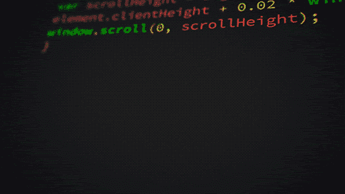
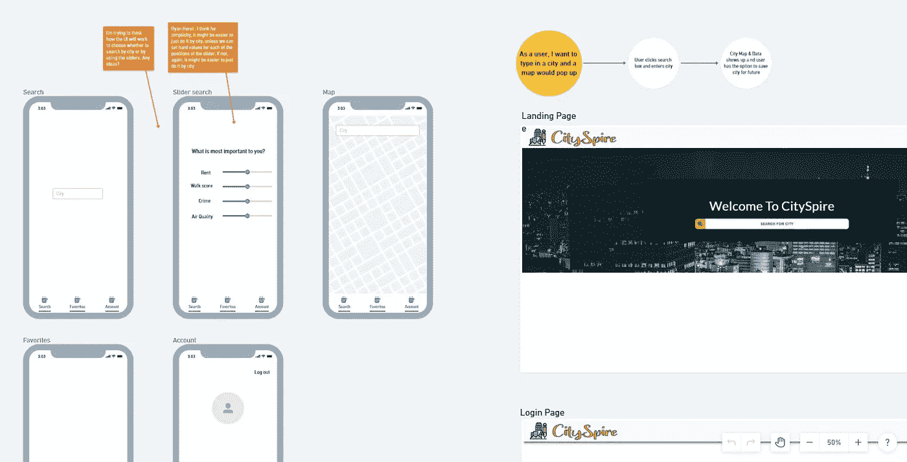
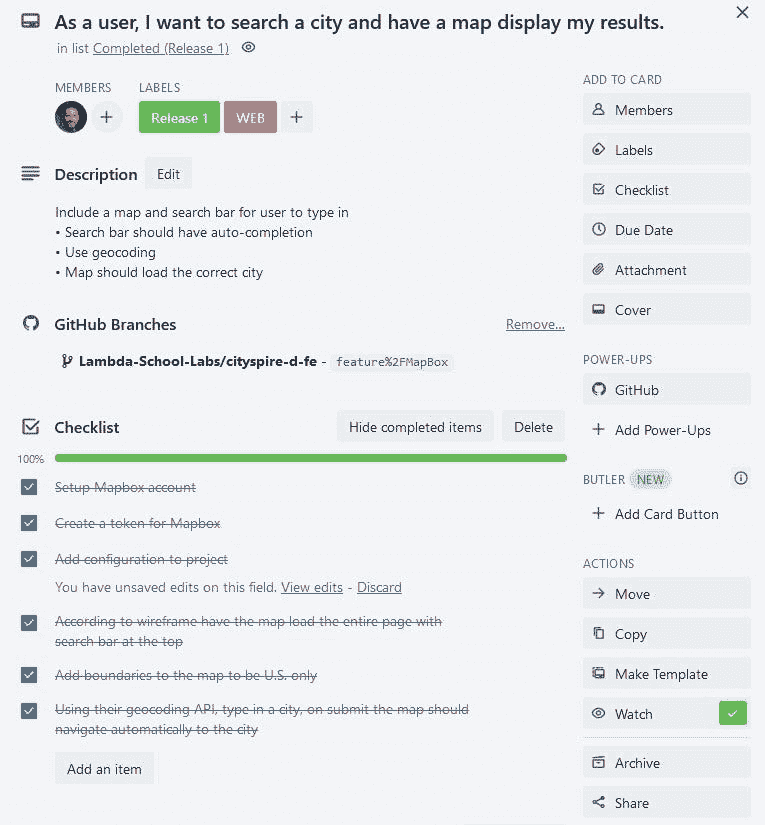
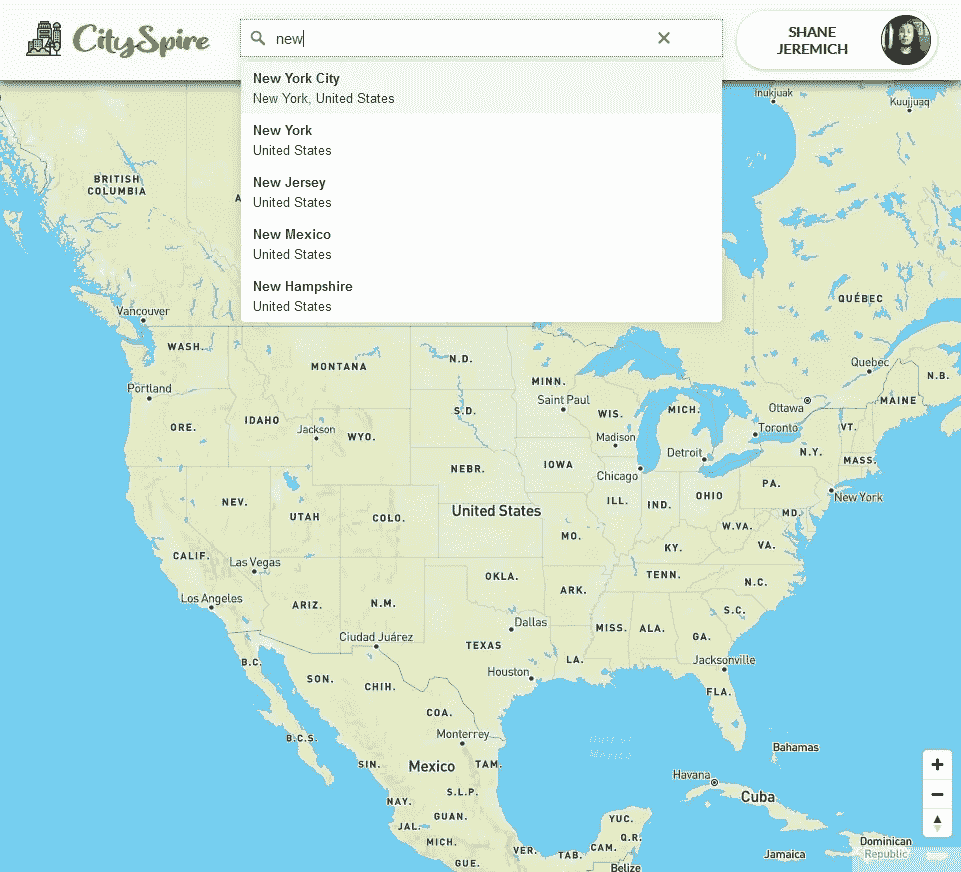
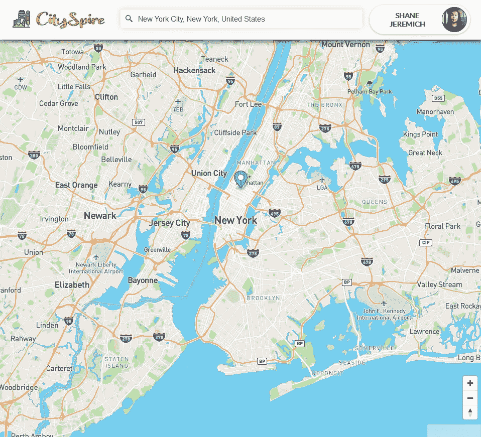
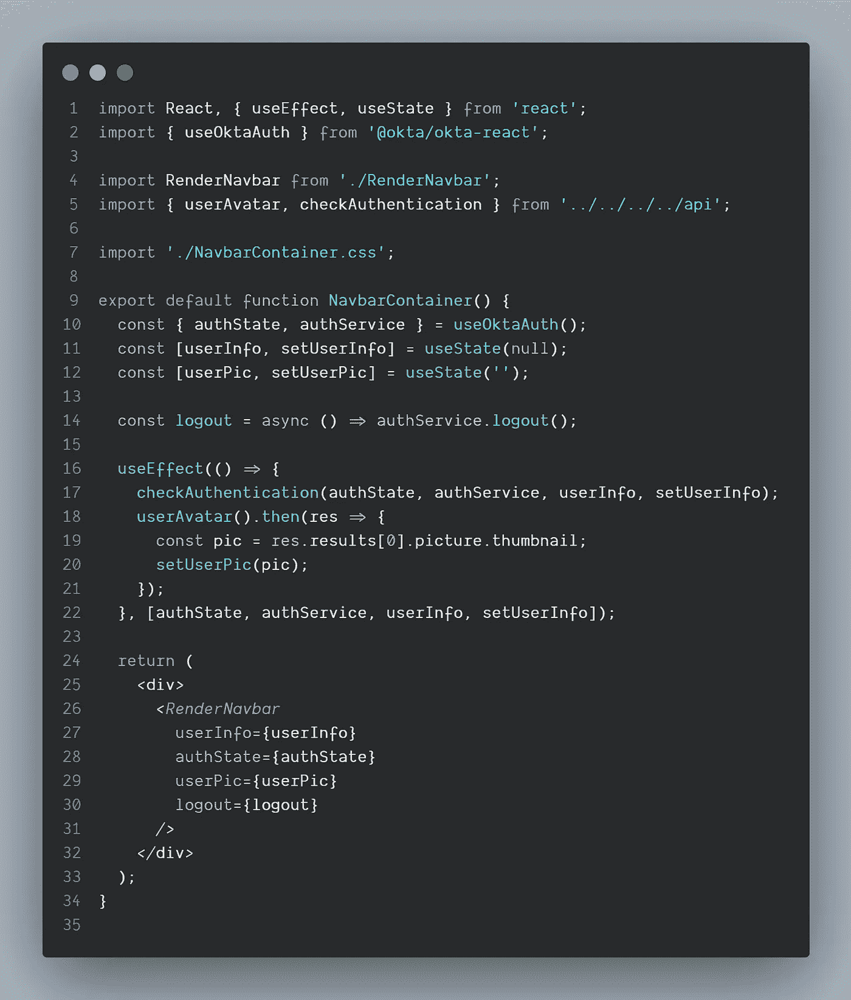
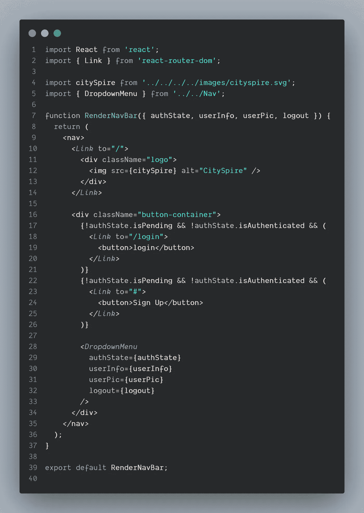
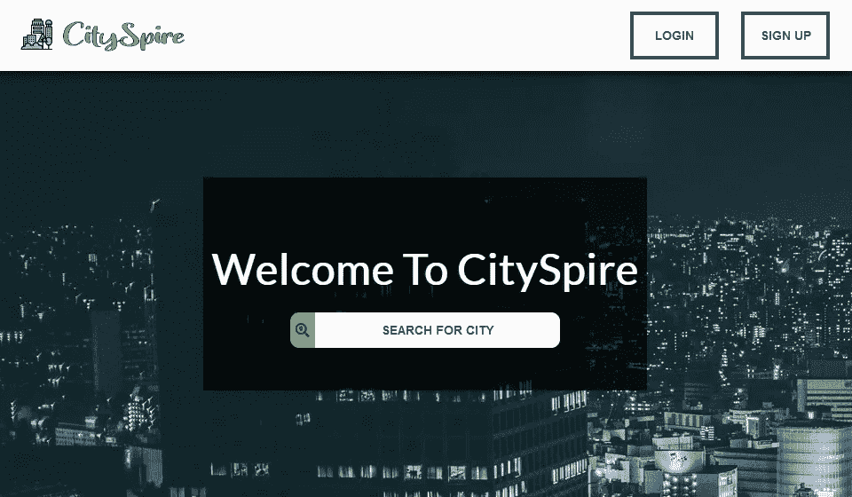
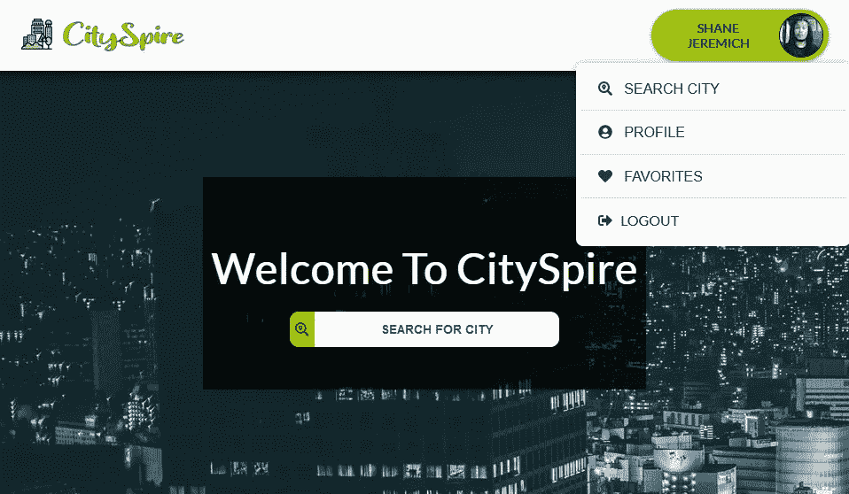

# 日志:我创建 CitySpire 应用程序的旅程

> 原文：<https://medium.com/nerd-for-tech/journal-my-journey-creating-cityspire-app-733eca17ba65?source=collection_archive---------14----------------------->



# 关于项目

在过去的八周里，我是一个跨职能团队的一员，该团队包括 iOS、前端和后端以及数据科学，负责构建一个名为 CitySpire 的应用程序。这是我们在 Lambda 进行的所有培训的高潮，将我们所学的知识整合在一起，这样我们就可以设计、建造和部署 [CitySpire](https://github.com/sjeremich23/cityspire-d-fe) 。

CitySpire 的目的是让用户搜索美国的各个城市，并获取天气、犯罪率、人口、经济、文化等统计数据。我们必须紧密合作，计划出我们想要实现的功能，我们可以在特定的期限内完成哪些版本，我们将使用哪些技术，以及哪些统计数据对用户来说是重要的。

# 规划阶段

第一天，我得以与我将要共事的开发团队见面。一开始我有点胆怯，让别人互相交谈，而我只是观察。然而，没过多久，我就马上投入工作，提供我的经验和见解，为这个项目提出一些想法。我们从 whimsical.com 的一些线框图开始。这有助于我们的团队想象应用程序可能是什么样子，并在我们开始塑造 CitySpire 时激发我们的想法。



我们异想天开的董事会的小视图

我在城市尖塔的前端工作。在我的计划阶段，我决定使用一些我以前从未使用过的技术。这是开发过程中我喜欢的有趣和具有挑战性的部分。我决定我们要实现 Mapbox GL 库。这对我来说很有意义，因为它提供了我们需要的完美工具，使用他们的搜索和地理编码，这些工具与他们所有的地图相关联。它类似于谷歌地图，具有大量的功能和选项。

对于我们的应用程序，我们还需要一种用户登录的方式，这样他们就可以到达我们应用程序的后端，获得保存搜索配置文件或标记他们喜欢的城市等功能。利益相关者的要求之一是我们使用 Okta。我们使用 Okta 创建一个登录体验，包括 OAuth 2.0、OIDC 实现、身份验证 API 和登录小部件。

这个应用程序的项目设置将是一个 React 应用程序。我们得到了一个项目，其中有一些来自利益相关者的初始文件，关于他希望文件夹架构看起来是什么样子，包括一些助手功能、Ant 样式设计和 Jest 测试。

下一步是利用 Trello 每天与我们的团队交流。我会为我们想要实现的每个功能创建一个 Trello 卡，并附上一个用户故事作为标题，解释我们旨在实现的体验。我会将这些卡片按团队、前台、后台、数据科学、iOS 进行分类，并附上 Trello 卡片所在的 Github 分支。这使得更新我们当前正在做的事情、我们的状态以及团队正在做的其他事情变得更加容易。我们会每天站起来向团队更新我们在每个特性上取得的进展，以及我们可能遇到的障碍。



# 地图框 GL

起初我对使用 Mapbox 感到紧张，但事实证明它很容易添加到项目中。他们有非常详细的文档和培训视频，介绍他们拥有的许多功能。map 基本上开箱即用，不需要太多的配置设置就能运行。然而，有大量的自定义选项和不同的配置设置，我没有时间去探究。他们的大多数文档设置示例都是普通的 JavaScript，所以我不得不做一些小的调整，让它与我们的 React 应用程序一起工作。

```
function **MapboxContainer**() {
  const [**input**, **setInput**] = useState(**''**);
  const { **locations** } = useContext(**LocationContext**)
  const **mapContainerRef** = useRef(**null**); **useEffect**(() => {
    const **map** = new mapboxgl.Map({
    container: **mapContainerRef**.current
    style: 'mapbox://styles/mapbox/streets-v11',
    center: [-99, 40],
    zoom: 3.3,
    });
```

这里我为 Mapbox 创建了一个 useEffect。我声明一个分配给地图的 const 变量，它生成一个新的 Mapbox 地图，使用基本样式 streets-v11，地图缩小到 3.3，居中-99，40，默认情况下只显示美国国家视图。使用 mapContainerRef，我将它附加到一个 div，将地图呈现到屏幕上。

```
 **geocoder**.on('result', function(result) {
      setInput(result.result.text);
    });        

       **document**.getElementById('geocoder')
         .appendChild(geocoder.onAdd(map));
       **map**.resize();
       return () => **map**.remove();
  }, []); return (
    *<>
      <****RenderMapbox*** mapContainerRef={**mapContainerRef**} */>
      <****CityScr*** input={**input**} locations={**locations**} */>
    </>* );
```



寻找一座城市



缩放至纽约市

# 天空的八分之一

对于 Okta，我在应用程序的顶部创建了一个导航条。这个想法是让城市塔的标志链接回登陆页面的左上角，在右边，登录和注册按钮。这个概念就是你所期望的。如果用户未登录，请单击按钮登录。如果用户没有帐户，则点击注册。如果用户确实有帐户，并且 Okta 对用户进行了身份验证，那么他们就可以访问像收藏夹页面和仪表板这样的安全路由。



导航栏容器组件

这里我有一个导航栏组件容器。在这个容器中，我将传递我创建的 checkAuthentication 辅助函数来检查用户是否登录。helper 函数内部是我的 if/else 逻辑。如果用户通过了身份验证，则返回 setUserInfo(info ),如果用户没有通过身份验证，则返回 setUserInfo(Null)。我也在抓取他们的头像，因为图片让一切变得更好。我将容器/渲染模式用于我的组件。我的容器包含了传递给呈现组件的所有逻辑。所以我的渲染组件是纯粹的 JSX。



呈现导航栏组件的 JSX



用户尚未登录



用户现在已登录，并有更多选项

# **我面临的挑战**

在整个项目中，障碍给我带来了挑战，我需要去克服。不仅学习新的技术，还整理了我在学习时遇到的一些障碍。一个是学习蚂蚁设计。我尽最大努力查找文档，并在 YouTube 视频中搜索教程。出于这样或那样的原因，我仍然在挣扎。看着我桌子上的钟，我看着时间从我身边流逝。我会承认学习 Ant 设计，并决定只使用 CSS 样式表。对我来说，这是一个在我没有赶上最后期限的另一天探索和学习 Ant 设计的机会。

我遇到的另一个挑战是测试 Okta。我在测试 Okta 是否能成功呈现登录窗口小部件时有点纠结，因为在测试完成之前，我对 useEffect 的清理会返回 null。我稍后会重写我的测试，以确保登录小部件所附加到的 div 元素被呈现，然后是 container . query selector(' # sign-in-widget '))。toBeTruthy()。

该市的统计数据和分数仍需充实。现在有一个卡片，在你搜索一个城市后会显示出来，但是，在这个时候，它仍然在开发过程中，还没有完全发挥作用。当产品完成后，它会显示像犯罪率，平均租金，租金，步行得分，犯罪得分，空气质量等统计数据。该数据将支持美国的大多数城市。

我希望看到的功能在未来的工作是一个完整的登录页面设计和建立看起来很专业。我还想纳入当用户正在寻找城市，他们能够比较一个城市与另一个城市。个人资料仪表板需要功能齐全，以及收藏夹页面。我们的团队已经取得了很大的进步，但是还有很多工作要做！

# **未来…**

这个应用程序仍然处于早期阶段，只有几个版本。仍然有很多我们想添加的功能，需要解决的问题，以及需要改进的功能。现在，我们提供的功能只是一个登录页面的基本框架，我们有一个功能齐全的导航条和 Okta 认证。我们有一个呈现城市统计数据和分数的设计。这只是开始。这是我的日记，记录了我的旅程和我迄今为止所做的贡献。有这么多的事情要做，有这么多的特雷罗卡的功能未触及。

我从这个应用程序中学到了很多。我每天都面临挑战，从学习像 Okta 和 Mapbox 这样的新事物，到优化我的代码以提高效率，再到与我的团队合作。作为一名开发人员，在这样的项目中工作的最好的事情之一就是与不同的人一起工作，并结识新的人。

这个项目如何推进我的职业目标？这个项目激励我学习新的东西。计划和执行并满足交付特性的截止日期的能力。克服障碍并完成我的任务。在我前进的过程中，我会继续鞭策自己，去学习，去成长，去迎接新的挑战，去战胜它们。我期待着未来，因为我的旅程才刚刚开始。