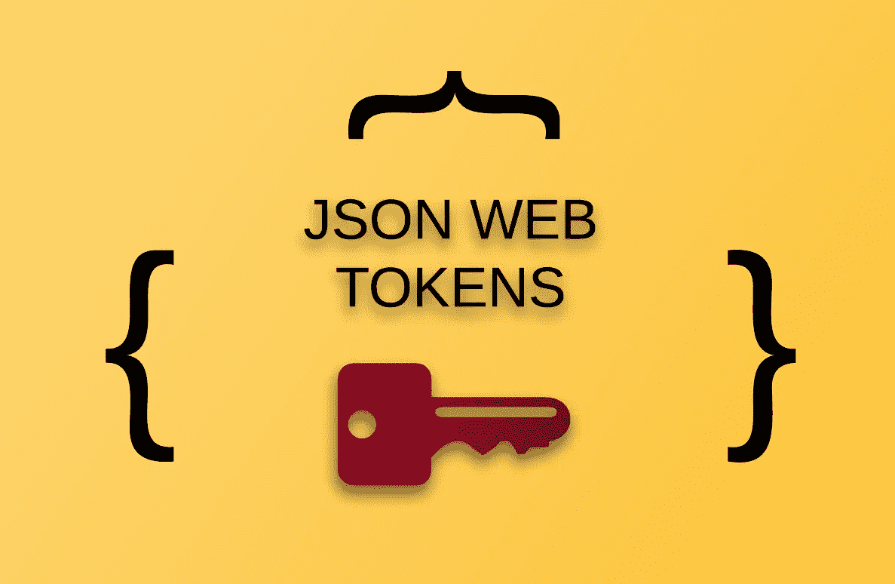

# JWT 授权

> 原文：<https://medium.com/nerd-for-tech/jwt-authorization-bb98b996d047?source=collection_archive---------5----------------------->

这篇文章是关于什么是 JWT 授权，为什么以及如何使用它的简单指南。

JWT 是 **JSON Web Token** 的缩写，是一种用于在客户端和服务器之间共享安全信息的标准。想象一下，你正在使用你的用户名和密码登录你的 twitter 账户。在这个场景中，您作为客户端，使用您的数据进行**认证**。现在，假设登录后，您正在进入您的朋友 Mike 的个人资料以查看他的推文，这些推文受到保护，只有他的朋友才能看到。因此，当你通过按钮或链接或其他方式重定向到他的个人资料的 URL 时，Twitter 会识别出是你，而不会要求你再次登录，并实际上让你看到他的推文。服务器确保发送第二个请求的用户与已经登录的用户是同一个用户的行为被称为**授权**。

我们需要授权方法，因为 HTTP 实际上是一个**无状态**协议，这意味着它不记录请求和/或响应，因此不记得之前的登录操作。通过 HTTP 发送到服务器的每个请求，就像点击一个标签或喜欢一样，都被视为全新的东西，与之前的请求没有任何关系。这就是为什么我们需要**令牌**。

现在通常，我们使用**会话**来确保授权。每次登录后，您都会得到一个**会话 ID** 。然后，对于发送到服务器的每个请求，会话 id 都包含在**请求头**中，并在服务器内存中进行搜索。然后服务器将 id 与正确的用户匹配，瞧，Twitter 记住你了！

因为在每个请求中传递登录信息是不安全的，所以我们使用一个会话 ID。但有时即使这样也不安全。一些恶意的第三方可能会生成一个假的会话 id 或更改一个以获取敏感信息。更重要的是，为了确保更安全的方法，我们必须让会话 id 在某个时间段过期，并要求用户再次登录。这意味着，将会创建许多会话，服务器必须将所有会话信息保存在内存中，这将消耗大量空间。如果你在使用 Twitter，你将不得不拥有多台服务器。用户可能连接到系统中的任何服务器，因此您必须在您拥有的所有服务器中保留相同会话 id 和信息的副本。太麻烦了，对吧？这就是我们使用 **JSON Web Token** 的原因。

与会话 id 不同，JSON Web Token 不存储在服务器中。令牌包含您的用户名和密码信息，因此，它可以访问您系统中的任何服务器，并且在只创建一个用户 id 和密码数据库后仍然可以得到验证。但是这意味着您在每个请求中传递登录细节，所以它不容易受到攻击吗？不，因为每个令牌实际上都是你登录信息的加密版本。它的编码方式是，只有通过服务器生成的**密钥**才能解决和理解它包含的登录信息。这样，您的服务器就不必保存包含所有会话历史的会话 id，也不必在连接到系统的所有服务器中复制它。相反，它只会共享密钥，当您试图访问系统时，它会简单地解析您的令牌来验证您的身份。

让我们去一个[在线 JWT 解算器](http://jwt.io)。通过该网站，您可以输入一个 JWT 并查看其中包含的信息。

每个 JWT 都有三个部分，用点分隔:报头、有效载荷和签名。让我们来研究下面的例子；

> eyjhbgcioijuzi 1 NII SINR 5 CCI 6 ikpxvcj 9 . eyjzdwiiixmjm 0 nty 3 odkwiiwibmftzsi 6 ikp vag 4g rg 9 liiwiawf 0 ijo xnte 2 JM 5 mdiyfq . sflkxwrjsmekkf 2 Qt 4 fwp mejf 36 pok 6 yjv _ adqssw 5c

在上面的标记中，第一部分生成了**头**。它包含一些关于令牌是如何创建的以及它是什么类型的基本信息。第二部分是**有效载荷**，它是你的编码登录信息所在的地方。最后一段是**签名**。这个代码保留了另外两个部分的 base64 副本，只是为了确保您在使用令牌之前不会出于恶意而弄乱它。只需输入上面的令牌到上面提到的网站，并显示进一步研究的信息。

如果您已经解析了上面的令牌，您将在有效负载中看到一个标记为“ **iat** ”的数据。代表“**发布于**”，该密钥保存令牌创建的日期和时间。我们需要这些信息，因为作为额外的安全层，我们仍然需要使这些令牌过期，就像我们对会话 id 所做的那样。为了跟踪令牌何时“**过期”**，您可能还会遇到令牌中包含的“ **exp** 标记。持有 exp 值的令牌不再有效。不用将所有这些信息都保存在服务器中，这是一种解脱，对吗？

签名部分将使用您在带有“ **alg** 标记的报头中指定的算法对报头和有效载荷信息进行编码。签名部分还包含一个**密钥**，只有服务器和您拥有，不公开。由于这个密钥，客户端或服务器可以验证签名。

多亏了 JWT，我们节省了服务器上的空间，每次连接到另一台服务器时，我们都不必再次登录，而且我们以一种更安全的方式进行通信。