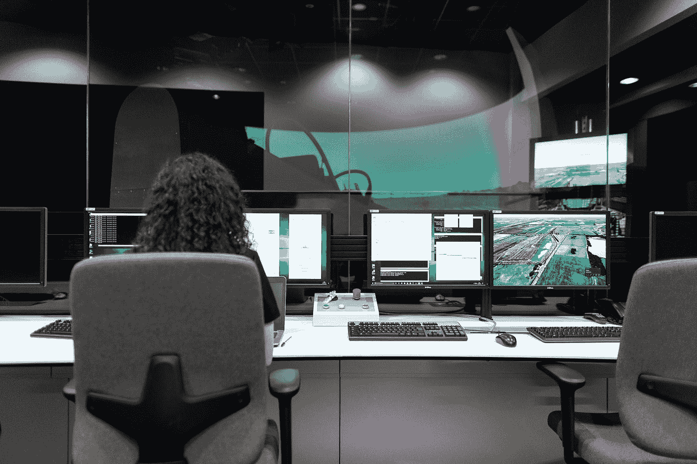

# 保持软件更新至关重要，但也很复杂

> 原文：<https://medium.com/nerd-for-tech/keeping-software-up-to-date-is-crucial-but-complicated-c05ce0262a41?source=collection_archive---------14----------------------->

在 [Unsplash](https://unsplash.com?utm_source=medium&utm_medium=referral) 上拍摄的 [ThisisEngineering RAEng](https://unsplash.com/@thisisengineering?utm_source=medium&utm_medium=referral)

“让你的东西保持最新”是网络安全中最接近宗教咒语的事情之一。这意味着一切—您的网络、系统和应用。

有充分的理由。如果您在补丁可用时不应用它们，您就是在自找麻烦，因为恶意黑客知道，就像其他所有人一样，当漏洞公开时，他们会立即开始寻找那些过于分心或不知如何应用这些补丁的组织。

未能更新，你实际上是在要求成为下一个 Equifax，信用机构巨头[在 2017 年](https://www.forbes.com/sites/taylorarmerding/2018/09/11/equifax-breach-catastrophic-but-no-game-changer-yet/?sh=32d7fc7c51d7)被攻破，此前它未能为 Apache Struts 开源 web 应用框架中的一个漏洞安装补丁——该补丁在被攻破前两个月已经可用。

所以你会认为这个信息会被传递出去。看起来是这样的——某种程度上。总部位于莫斯科的安全公司 Positive Technologies 在 2020 年 10 月[报告称，该公司测试的 74%的公司已经针对臭名昭著的 WannaCry 勒索软件修补了他们的系统。](https://www.ptsecurity.com/ww-en/analytics/vulnerabilities-corporate-networks-2020/#id3)

这是一个健康的多数。但这也意味着仍有许多组织——四分之一——需要更新宗教信仰。

Inrupt 安全架构负责人、自称公共利益技术专家的 Bruce Schneier 本月早些时候在他的博客上链接了该报告[，并称该统计数据是一场“灾难”，即使人们假设该报告是“为撰写该报告的公司服务的，并且该统计数据不具有普遍代表性。”](https://www.schneier.com/blog/archives/2021/03/on-not-fixing-old-vulnerabilities.html)

“这个数字应该是 0%，”他写道，并指出 WannaCry 已有四年历史，主要影响 Windows 7 操作系统等旧产品，微软不再支持该操作系统。“如果我们不能保护我们的系统免受这些漏洞的攻击，我们又如何保护它们免受新的威胁呢？”他写道。

**更新反吹**

但这在 Schneier 自己的评论部分遭到了很多回答者的反对，他们说更新和打补丁通常既不简单也不便宜。他们说，很多时候，这需要以很高的成本升级系统的其他部分。

正如一位未透露姓名的评论者所说，“很久以前，他们购买了非常昂贵的应用程序，这些应用程序不能在更高版本上运行，它们的制造商懒得更新它们，或者为此收取高昂的费用，甚至已经倒闭。”

“因此，这些公司面临着一个选择:要么完全替换一些极其昂贵但仍然运行良好的设备，仅仅因为没有驱动程序；要么继续使用 Windows 7 或 XP。对于高层管理人员来说，这个选择是显而易见的，首席信息官没有机会说服他们。”

黑客因素解决方案的创始人尼尔·克拉维兹也有类似的观点。“对于 Windows，通常没有简单的升级途径，”他写道。“复制所有文件，记下所有应用，然后重新安装。希望你能把它放回去。(你应该为这项工作分配几天时间。升级需要数天的停机时间和资源。)"

“对于 Mac，操作系统升级通常持续 1-4 年，然后您需要新的硬件，即使当前的硬件在当前的操作系统上运行良好。Android 智能手机也有同样的问题，但设备要贵得多，”他写道，并补充道，“你想要 0%？这是永远不会发生的。”

然后是迈克·安提斯，他并不反对施奈尔的灾难声明，但他观察到“全世界都不擅长预防性维护。”

Synopsys 软件完整性小组的高级安全策略师 Jonathan Knudsen 对此表示赞同。“安全人员说‘让你的东西保持最新’很容易，但对那些实际负责保持正常运转的人来说就难多了，”他说。

“对于现实世界中的人们来说，安全地修补生产系统是一件复杂的事情。您永远不知道一个补丁是否会破坏您环境中的某些东西。因此，您创建了一个非常接近生产的试运行(测试)环境，并且首先将补丁部署到试运行环境中。然后你做一些测试，如果一切正常，你就祈祷补丁投入生产。”

新思软件完整性小组的高级安全顾问伊恩·阿什沃斯说，这是一种规模很重要的情况。虽然大公司“应该牢牢控制任何网络威胁”，但对于较小的组织来说，跟上修补程序的复杂性要困难得多，因为“技术可能只是他们更有效地运营业务或保持竞争力的一个使能因素。”

阿什沃斯说，对于没有预算来彻底检查系统以安装更新的组织来说，“几乎被迫做出改变仅仅是为了让他们的业务继续下去，这通常被视为不必要和不必要的干扰和费用”。

另一个问题是，运营小型组织的人通常没有时间或员工来跟上关于网络威胁的每一个通知，甚至是头条新闻，并且可能不知道最新的信息。

阿什沃斯说，虽然当 WannaCry 在 2017 年出现时，几乎每个人都听说过它，但有些人可能也听说过阻止 WannaCry 传播的[“死亡开关”的发布，并认为“这消除了他们对它的担心”。但显然存在数千种 WannaCry 变体，因此风险仍然非常真实，”他说。](https://techcrunch.com/2019/07/08/the-wannacry-sinkhole/)

Schneier，通过电子邮件，没有回应他的博客评论，但同意“这是一个困难的问题。”

**有哪些选择**

那么这 26%的人应该做些什么呢？

Synopsys 软件完整性小组的安全工程师 Amit Sharma 说，一种策略是平衡打补丁的风险和不打补丁的风险。“补丁管理过程并不简单——它需要努力和资源，”他说，并指出可能需要在应用补丁之前测试它，以查看它是否影响系统的功能。

所以这需要与补丁要保护的东西相平衡。“被感染的系统中是否有需要保护的关键数据，或者我们能否忍受感染？”他说。

当然，了解什么是高风险，什么不是高风险，需要组织跟踪他们的资产。“您是否有正在制造或运输的软件的材料清单？如果没有，这是走向成功的第一步，”夏尔马说。

Knudsen 说，进行高风险、高成本的更新的一个可能的解决办法是将旧的、易受攻击的软件版本保存在一个带有限制性防火墙的隔离网段中。“当你有一些有风险的东西时，把它放在一个盒子里，也许把那个盒子放在另一个盒子里，”他说。

但这也不简单。Knudsen 承认他对小企业没有一个好的答案。

这是不是意味着小玩家基本上只能抱有“默默无闻的安全感”的错误希望，也就是说祈祷坏人不会对那么小的人感兴趣？

在某种程度上，这是现实，尽管大多数专家认为整个行业需要做得更好，“让安全的方式变得简单”——这是安全会议上的另一个口号。现代汽车不需要普通司机成为机械师就能拥有相对安全的车辆。安全带、安全气囊、防抱死刹车、车道辅助、侧视和倒车摄像头等安全系统都是内置的。

**把它建得更好**

数字世界也应该如此，网络、系统和应用程序都应该内置安全性。但要做到这一点，需要使用多种自动化工具，在构建软件时对其进行测试，并在软件所服务的产品的预期寿命内内置更新软件的能力。

目前，这还没有实现——甚至还远没有实现。Croma Security Solutions Group 的安全顾问 Clive Robinson 在 Schneier 的博客上发表评论时指出，工业系统、电表、铁路机车和电话系统等设备的平均寿命为几十年，而智能设备、操作系统和应用程序的使用寿命为几个月到几年。

“记住第一批是依赖于第二批的，你可以看到有一个近似‘几个月几年’的问题，”他写道。"应用程序和操作系统持续的时间大约是物理机器和系统的 1/12 . "

因此，特别是对于小型组织，即使是大型组织，也需要进行一些系统性的改变，以使安全的方式变得简单。

阿什沃斯建议，“小额、有目的的商业赠款或利率非常有吸引力的贷款可能真的有助于更快地应对风险。”

或者如 Knudsen 所说，“在一个每个人都用安全的开发生命周期来构建软件的世界里，一切都会安全得多，需要的补丁也少得多。”

尽管如此，“修补将永远是生活的事实，”他说。甚至自动更新也可能造成复杂情况。“一些软件可以自我更新，或者通过配置来更新，”Knudsen 说。“对于大多数消费者和小企业来说，这是一个很好的解决方案，他们永远不会真正理解网络安全。”

“但它仍然留下了核心问题:如果我经营一家披萨店，而我的收银机自动更新，并且不管什么原因不再工作，我就完蛋了。”

他说，一些更新很笨拙，有时一个关键应用程序无法与更新的系统一起工作，或者“有时你必须重新登录，或者它不能像以前那样工作”。

所以唯一真正的答案是“更好地构建软件”，Knudsen 说。