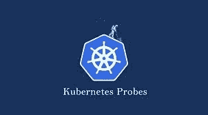

# Kubernetes 就绪探测器

> 原文：<https://medium.com/nerd-for-tech/kubernetes-readiness-probes-722278ca9a0b?source=collection_archive---------7----------------------->



# 描述

*   我们了解活性探测器以及它们通过确保不健康的容器自动重启来帮助我们的应用保持健康的方式。与活性探针一样， [Kubernetes](https://www.technologiesinindustry4.com/) 允许我们定义 pod 的就绪状态。
*   准备就绪探测器被周期性地部署，并且检查精确的 pod 是否应该接收客户端请求。
*   每当容器的准备就绪探测返回成功时，就表示容器已经准备好接受请求。
*   这种做好准备的概念显然是每个容器特有的。
*   几乎在活性探测器 [Kubernetes](https://www.technologiesinindustry4.com/) 向容器发送请求并支持成功或不成功响应的结果时，它决定容器准备请求流量或仍在为此做准备。
*   活性探测器不像，如果一个容器没有通过就绪检查，它不会被终止或重新启动。
*   这是一个非常好的做法，总是添加一个就绪探测器，即使它是容器中最简单的应用程序。

# 就绪探测器类型

有三种就绪性探测。

**1。HTTP GET**

*   这种类型的探测器在我们指定的[容器的 IP 地址](https://www.technologiesinindustry4.com/)、端口和路径上传送请求。
*   探测总是考虑到故障，并且容器将被视为未准备好，并且没有流量将被转移到那里。

**2。TCP 套接字**

*   TCP 套接字探针努力打开到容器所需端口的 TCP 连接。
*   如果连接建立成功，[容器](https://www.technologiesinindustry4.com/)将被标记为就绪，它将接收流量。
*   Kubernetes 是另一个案例，它将等待并运行探测器以再次查看状态。

**3。执行探针**

*   EXEC 探测器执行您在[容器](https://www.technologiesinindustry4.com/)中提供的一些命令，并检查命令的退出状态代码。
*   如果状态代码为 0，则探测成功。
*   所有其他代码都被视为失败。

# 就绪探测示例

**my-rn-exec.yaml**

```
Kind: Podapiversion: v1metadata:name: myapp-rn-excSpec:Containers:-name: my appimage: ahmedmansoor/hiPorts:-containerPort: 80Readiness Probe:exec:command:-ls-/tmp/ready
```

**my-rn-tcp.yaml**

```
Kind: Podapiversion: v1metadata:name: myapp-rn-tcpSpec:Containers:-name: my appimage: ahmedmansoor/hiPorts:-containerPort: 80Readiness Probe:tcpSocketPort : 8080
```

**my-rn-http.yaml**

```
Kind: Podapiversion: v1metadata:name:myapp-rn-httpSpec:Containers:-name: my appimage: ahmedmansoor/hiPorts:-containerPort:80Readiness Probe:http Get:Port: 80 path:/
```

更多详情请访问:[https://www . technologiesinindustry 4 . com/2020/10/kubernetes-readiness-probes . html](https://www.technologiesinindustry4.com/2020/10/kubernetes-readiness-probes.html)