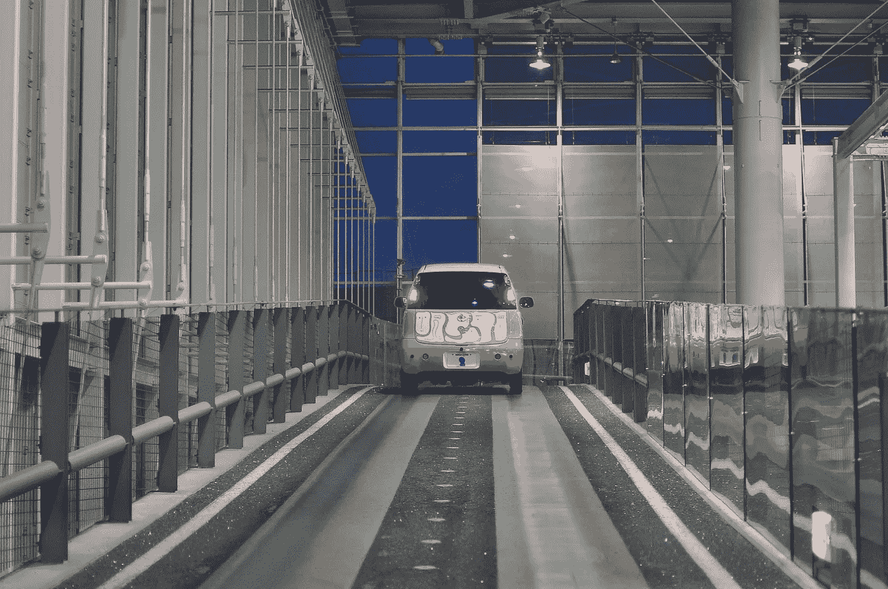
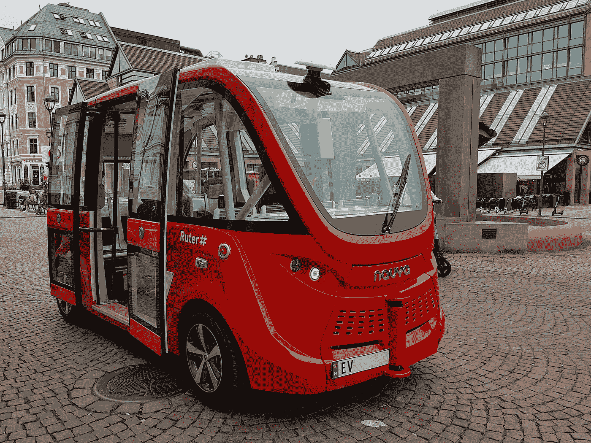
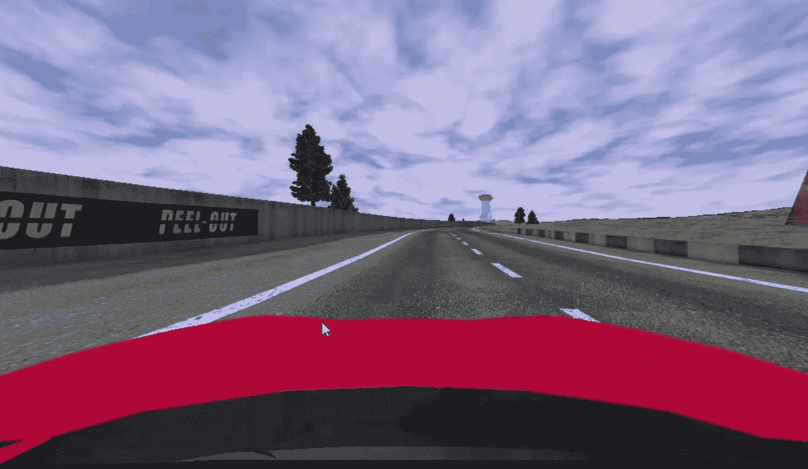
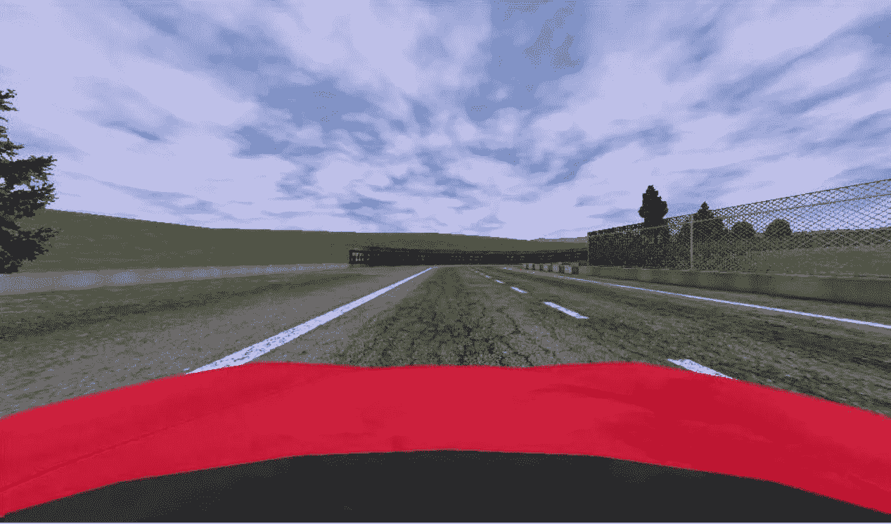

# 使用 OpenCV 进行车道检测—第 1 部分

> 原文：<https://medium.com/nerd-for-tech/lane-detection-with-opencv-part-1-ad9ea5758c07?source=collection_archive---------5----------------------->

让我们承认:有些技术只是比其他技术更有趣、更时尚。一个同时在技术上非常有趣并有可能从根本上改变我们生活的领域是与自动驾驶汽车相关的领域。他们来了。在某种程度上，他们已经在这里了。他们正在吸引大量投资。甚至苹果似乎也在考虑制造 iCar。简单地说，他们在我们的未来。

我第一次看到自动驾驶汽车是在 2010 年。)，在东京，在丰田展厅。你可以作为一名乘客尝试一下，大约 1 欧元，所以我就这么做了。这辆车开得非常慢，显然它依赖于嵌入道路中的传感器，这辆车似乎能够检测到我前面的车停下来了。



一辆丰田自动驾驶汽车在我的自动驾驶汽车前面，(2010 年，东京)

显然，技术已经进步了很多，我们现在可以更多地依赖计算机视觉和先进的传感器，如激光雷达和雷达。实际上，在我居住的挪威奥斯陆，有一辆无人驾驶巴士在行驶，这是试验的一部分；它带着几个人慢慢前进，为了安全，有一个人一直在上面，他们不得不在路上放一些面板来帮助激光雷达探测道路，但这仍然是一个起点。



挪威奥斯陆的自动驾驶巴士

自动驾驶汽车的一个经典任务是车道检测，这是本帖的论点。

以下内容主要摘自《自动驾驶汽车的实践愿景和行为》一书，这本书是我在 Krishtof Korda 的帮助下为 Packt 出版社写的。

# 阈值处理

*代码需要 Python 3.7，OpenCV 和 NumPy。*

对于人类来说，沿着一条车道走是很容易的，但是对于计算机来说，这就不那么简单了。一个问题是道路的图像有太多的信息。我们需要简化它，只选择图像中我们感兴趣的部分。我们将只分析图像中带有车道的部分，但是我们还需要将车道从图像的其余部分中分离出来，例如，使用颜色选择。毕竟，道路通常是黑色或深色的，车道通常是白色或黄色的。



参考图片，来自极速之梦

当然，图像可以分解成三个通道:红色、绿色和蓝色。我们知道，OpenCV 将图像存储为 BGR(意思是，第一个字节是蓝色通道，而不是红色通道)，但从概念上来说，没有区别。
这是曾经分开的三个频道:


BGR 通道:蓝色、绿色和红色通道

他们看起来都很好。我们可以尝试通过选择白色像素来分离车道。由于白色是(255，255，255)，我们可以留出一些空白，并选择 180 度以上的颜色。要执行此操作，我们需要创建一个与所选通道大小相同的黑色图像，然后将原始通道中 180°以上的所有像素涂成白色:

```
img_threshold = np.zeros_like(channel)
img_threshold [(channel >= 180)] = 255
```

输出如下所示:


BGR 通道:蓝色、绿色和红色通道，阈值高于 180

还有其他颜色空间(在书中解释)你可以尝试，如 HLS，HSV，实验室和 YCbCr。
经过一些实验，绿色通道似乎可以用于边缘检测，而来自 HLS 空间的 L 通道可以用作额外的阈值处理，因此我们将坚持使用这些通道。这些设置对于黄线来说应该也是可以的，而不同的颜色可能需要不同的阈值。

# 透视校正

让我们退一步，从简单的开始。最简单的例子就是直道。让我们看看它是什么样子的:



直道，来自速度之梦

如果我们在公路上空飞行，从鸟瞰的角度来看，车道应该是平行的，但在图片中，由于视角的原因，它们不是平行的。
透视取决于镜头的焦距(焦距越短的镜头显示的透视感越强)和相机的位置。一旦相机安装在汽车上，视角是固定的，因此我们可以考虑并校正图像。
OpenCV 有一个计算透视变换的方法:
*getperspective transform()*。
它需要两个参数，都是四个点的数组，标识透视的梯形。一个数组是源，一个数组是目的。这意味着可以使用相同的方法来计算逆变换，只需交换参数:

```
perspective_correction = cv2.getPerspectiveTransform(src, dst)
perspective_correction_inv = cv2.getPerspectiveTransform(dst,
src)
```

我们需要选择车道周围的区域，加上一个小的余量:


车道周围有感兴趣区域的梯形

在我们的例子中，目的地是一个矩形(因为我们想把它弄直)。图 3.14 显示了带有原始透视图的绿色梯形(前面代码中的 src 变量)和白色矩形(前面代码中的 dst 变量)，这是所需的透视图。请注意，为了清楚起见，它们被绘制为重叠的，但是作为参数传递的矩形的坐标被移动，就好像它从 X 坐标 0 开始。
我们现在可以应用透视校正，并获得我们的鸟瞰图:

```
cv2.warpPerspective(img, perspective_correction, warp_size,
flags=cv2.INTER_LANCZOS4)
```

*warpPerspective()* 方法接受四个参数:
源图像。
转换矩阵，从 *getPerspectiveTransform()获得。*
输出图像的大小。在我们的例子中，宽度与原始图像相同，但是高度只是梯形/矩形的高度。
一些标志，用于指定插值。 **INTER_LINEAR** 是一个常见的选择，但我建议尝试一下，并尝试一下 **INTER_LANCZOS4** 。
这是使用 **INTER_LINEAR** 扭曲的结果:


这是使用 **INTER_LANCZOS4** 的结果:


它们非常相似，但仔细观察会发现，使用 LANCZOS4 重采样执行的插值更清晰。我们将在后面看到，在管道的末端，差异是显著的。
在两幅图像中可以清楚地看到，我们的线条现在是垂直的，这可以直观地帮助我们。

在下一部分，我们将看到如何利用这个图像。