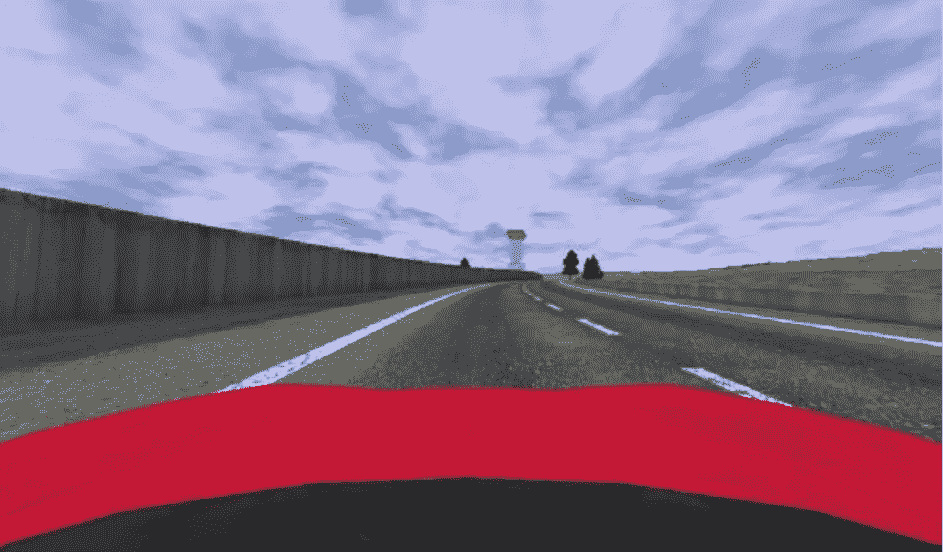
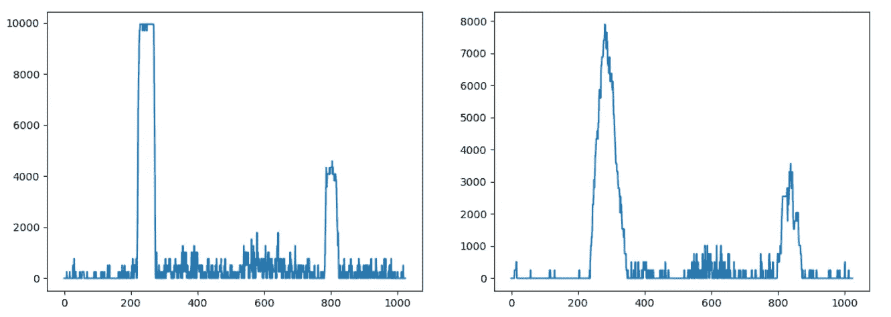

# 利用 OpenCV 进行车道检测—第二部分

> 原文：<https://medium.com/nerd-for-tech/lane-detection-with-opencv-part-2-efdad71e8819?source=collection_archive---------4----------------------->

在第一部分的[中，我们看到了如何使用阈值处理来选择车道的颜色，以及如何使用透视校正来获得道路的鸟瞰图。我们现在来看看如何定位车道。](https://lucav76.medium.com/lane-detection-with-opencv-part-1-ad9ea5758c07)

以下内容主要摘自《自动驾驶汽车的[实践愿景和行为》一书，这本书是我在 Krishtof Korda 的帮助下为 Packt Publishing 撰写的。](http://packt.live/3jimRoS)

# 边缘检测

*代码需要 Python 3.7，OpenCV 和 NumPy。*

下一步是检测边缘，我们将使用绿色通道，因为在我们的实验中，它给出了良好的结果。请注意，您需要对从您计划运行该软件的国家拍摄的图像和视频以及许多不同的光线条件进行实验。最有可能的是，根据线条的颜色和图像中的颜色，您可能想要选择不同的通道，可能来自另一个颜色空间；您可以使用 *cvtColor()* 将图像转换成不同的色彩空间，例如:

```
img_hls = cv2.cvtColor(img_bgr, cv2.COLOR_BGR2HLS).astype(np.
float)
```

我们将坚持绿色。

OpenCV 有几种方法来计算边缘检测，我们将使用 Scharr，因为它执行得相当好。Scharr 计算导数，因此它可以检测图像中的颜色差异。我们对 X 轴感兴趣，我们希望结果是一个 64 位浮点数，所以我们的调用如下:

```
edge_x = cv2.Scharr(channel, cv2.CV_64F, 1, 0)
```

在 Scharr 计算导数时，值可以是正的，也可以是负的。我们对符号不感兴趣，而只对存在边缘的事实感兴趣。所以，我们将取绝对值:

```
edge_x = np.absolute(edge_x)
```

另一个问题是，这些值不在我们期望的单通道图像的 0–255 值范围内，并且这些值是浮点，而我们需要一个 8 位整数。我们可以用下面的代码行解决这两个问题:

```
edge_x = np.uint8(255 * edge_x / np.max(edge_x))
```

这是结果:


使用 Scharr、缩放和绝对值进行边缘检测

此时，我们可以应用阈值处理将图像转换为黑白，以更好地隔离车道的像素。我们需要选择像素的强度，在这种情况下，我们可以选择 20–120；我们将只选择亮度值至少为 20 且不超过 120 的像素:

```
binary = np.zeros_like(img_edge)
binary[img_edge >= 20] = 255
```

*zeros_like()* 方法创建一个充满零的数组，与图像的形状相同，第二行将所有像素的亮度设置为 20 到 120 到 255 之间。这是结果:


应用阈值 20 后的结果

车道现在非常明显，但有一些噪音。我们可以通过提高阈值来减少这种情况:

```
binary[img_edge >= 50] = 255
```

输出如下所示:


应用阈值 50 后的结果

现在，噪音减少了，但是我们失去了顶部的线条。我们现在将描述一种技术，它可以帮助我们保留完整的线条，而不会有过多的噪声。

# 插值阈值

在实践中，我们不必在选择具有大量噪声的整条线和降低噪声同时只检测部分线之间进行选择。我们可以在底部应用较高的阈值(这里我们有更高的分辨率、更清晰的图像和更多的噪声)，在顶部应用较低的阈值(这里，我们得到更低的对比度、更弱的检测和更少的噪声，因为像素被透视校正拉伸，自然地使它们模糊)。我们可以在阈值之间进行插值:

```
threshold_up = 15
threshold_down = 60
threshold_delta = threshold_down-threshold_up
for y in range(height):
binary_line = binary[y,:]
edge_line = channel_edge[y,:]
threshold_line = threshold_up + threshold_delta * y/height
binary_line[edge_line >= threshold_line] = 255
```

让我们看看结果:


应用插值阈值(从 15 到 60)后的结果

现在，我们可以在底部有更少的噪声，在顶部检测更弱的信号。然而，虽然人类可以在视觉上识别车道，但对于计算机来说，它们仍然只是图像中的像素，所以仍然有工作要做。但是我们非常简化了图像，我们正在取得良好的进展。

# 组合阈值

如前所述，我们还想在另一个通道上使用阈值，而不进行边缘检测。我们选择了 HLS 的 L 通道。
这是阈值高于 140 的结果:


阈值高于 140 的 l 通道

还不错。现在，我们可以将它与边缘结合起来:


两个阈值的组合

结果是噪音更大，但也更健壮。
在继续之前，我们先来介绍一个有转折的画面:



一个转弯的车道，来自速度梦

这是门槛:


巷子拐了个弯，过了门槛

它看起来仍然很好，但我们可以看到，因为转弯，我们不再有一条垂直线。事实上，在图像的顶部，线条基本上是水平的

# 使用直方图查找车道

我们怎样才能或多或少地理解车道在哪里？从视觉上看，对于人类来说，答案很简单:车道是一条长线。但是电脑呢？
如果我们谈论垂直线，一种方法是计算某一列上白色的像素。但是如果我们用一个转弯来检查图像，那可能就不行了。然而，如果我们减少对图像底部的关注，线条会更垂直一些:


车道拐了一个弯，过了门槛，到了标准杆底

我们现在可以按列计算像素:

```
partial_img = img[img.shape[0] // 2:, :] # Select the bottom
part
hist = np.sum(partial_img, axis=0) # axis 0: columns direction
```

要将直方图保存为文件中的图形，我们可以使用 Matplotlib:

```
import matplotlib.pyplot as pltplt.plot(hist)
plt.savefig(filename)
plt.clf()
```

我们得到以下结果:



左:直行车道直方图，右:转弯车道直方图

直方图上的 X 坐标代表像素；由于我们的图像分辨率为 1024x600，直方图显示了 1，024 个数据点，峰值位于车道所在像素的中心。
正如我们所看到的，在直线车道的情况下，直方图非常清楚地标识了两条线；转弯时，直方图不太清晰(因为线转弯，因此白色像素分散了一点)，但仍然可用。我们还可以看到，在虚线的情况下，直方图中的峰值不太明显，但仍然存在。
这个看起来很有前景！
现在，我们需要一种方法来探测这两座山峰。我们可以使用 NumPy 中的 argmax()，它返回数组中最大元素的索引，这是我们的峰值之一。
然而，我们需要两个。为此，我们可以将阵列分成两半，并在每一半上选择一个峰:

```
size = len(histogram)
max_index_left = np.argmax(histogram[0:size//2])
max_index_right = np.argmax(histogram[size//2:]) + size//2
```

现在我们有了索引，它代表了峰值的 X 坐标。该值本身(例如，直方图[索引])可以被认为是识别车道的置信度，因为更多的像素意味着更多的置信度。

# 临终遗言

现在你知道了车道的初始位置。本书的剩余章节解释了如何增强这种方法来识别转弯，如何在已识别的车道上画线，以及如何利用来自先前帧的信息来使检测更加鲁棒。

如果你喜欢这两篇文章，如果你对自动驾驶汽车使用的一些技术感到好奇，请考虑一下[的《自动驾驶汽车的实践愿景和行为](http://packt.live/3jimRoS)》一书。它还谈到了神经网络，物体检测，语义分割，传感器，激光雷达，地图，控制等等。